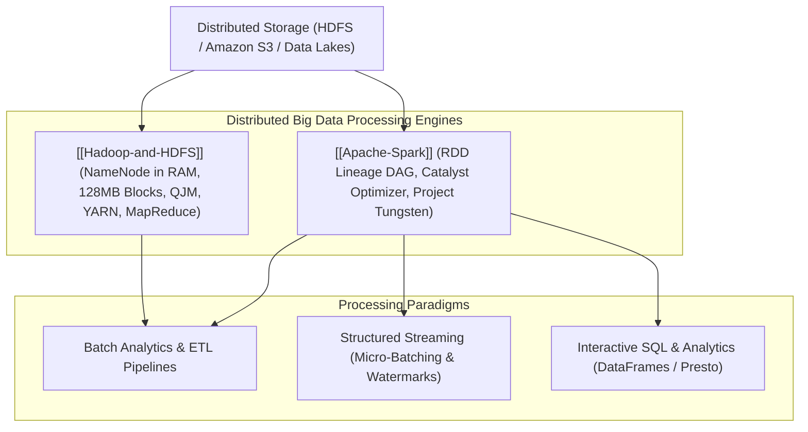

# Big Data and Distributed Analytics Infrastructure

## Map of Content

Large-scale distributed analytics engines process petabytes and exabytes of structured and unstructured data, transitioning from early disk-bound batch MapReduce paradigms to high-speed in-memory DAG pipelines.
This module covers distributed storage filesystems, resource negotiators, in-memory execution engines, query optimizers, and hardware-accelerated code generation.

## Core Knowledge Areas

### 1. Distributed Storage and Legacy Batch
- [[Hadoop-and-HDFS]]: HDFS architecture, in-memory NameNode namespace, `fsimage` and `edits` log checkpointing via Quorum Journal Manager (QJM), 128MB block sizing, rack-aware replica placement, short-circuit local reads, YARN resource arbitration (ResourceManager, NodeManager, ApplicationMaster), and MapReduce execution pipelines.

### 2. In-Memory Distributed Computing
- [[Apache-Spark]]: Driver program, cluster managers, and executor processes; Resilient Distributed Datasets (RDD) and lineage DAG fault tolerance; narrow versus wide dependencies (shuffle boundaries); Catalyst query optimization (predicate pushdown, projection pruning); Project Tungsten hardware optimization (off-heap memory, cache-aware layout, whole-stage code generation); and Structured Streaming.

## Comparative Architecture Matrix

| Dimension | Apache Hadoop (MapReduce + HDFS) | Apache Spark |
| :--- | :--- | :--- |
| **Primary Abstraction** | File blocks on disk + Map/Reduce key-value tasks | In-Memory Resilient Distributed Datasets (RDDs) / DataFrames |
| **Intermediate State Storage**| Spilled to local disk after map and reduce phases | Retained in RAM across stages via BlockManager |
| **Execution Engine** | Coarse-grained two-stage processing (Map -> Reduce) | Arbitrary Directed Acyclic Graph (DAG) pipelining |
| **Fault Tolerance Mechanism** | Re-executing failed task splits from disk blocks | Recomputing lost partitions via in-memory RDD Lineage DAG |
| **Query Optimization** | None (Raw user code / Hive AST translation) | Catalyst rule-based and cost-based optimizer |
| **Memory Management** | Standard JVM heap memory | Project Tungsten off-heap memory via `sun.misc.Unsafe` |
| **Processing Latency** | Minutes to Hours (Disk I/O and shuffle bound) | Seconds to Minutes (10x-100x faster than MapReduce) |
| **Streaming Capabilities** | None (Batch processing exclusively) | Structured Streaming (Micro-batching and low-latency continuous) |

## Study and Interview Roadmap

1. Understand why HDFS uses massive default blocks (128MB/256MB) and how storing millions of small files degrades NameNode memory.
2. Master the rack-aware replica placement policy and pipelined streaming data write mechanics in HDFS.
3. Be prepared to explain how Spark achieves fault tolerance through RDD lineage graphs without physical disk replication.
4. Know how Catalyst optimizer and Project Tungsten eliminate JVM object headers and garbage collection pauses during large data queries.
