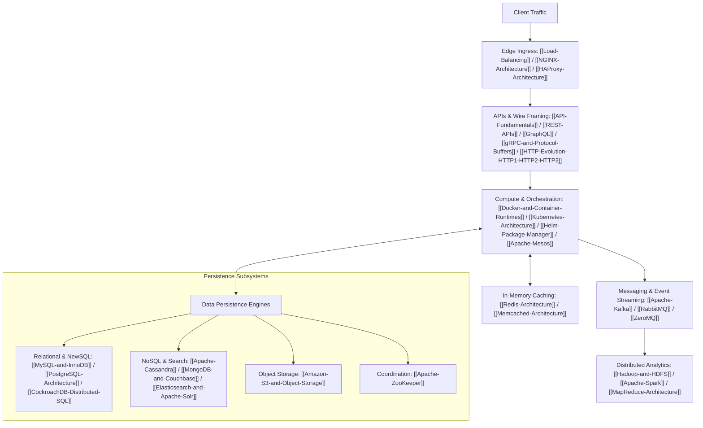

# System Design and Distributed Systems Knowledge Base

## Overview

Designing large-scale, fault-tolerant distributed systems requires balancing multi-dimensional trade-offs across consistency, latency, availability, data partitioning, and hardware failure modes.
This comprehensive knowledge base covers the complete theoretical, architectural, and operational spectrum required for Staff-level and Distinguished-level distributed systems engineering.

## Curriculum Modules and Maps of Content

### 1. Foundational Concepts
Comprehensive theoretical foundations of distributed computing, concurrency, scaling, and consistency models.
- [[04-System-Design/00-Concepts/README|00-Concepts MOC]]
- [[Distinguished-Design-Path]] - The reading order, from the invariant down to the product diagram.
- [[System-Design-Concept-Map]] - Interactive Mermaid relationship map connecting concepts to concrete technologies.
- [[Technology-Comparison-Matrix]] - Master reference matrix comparing 20 primary technologies across consistency, partitioning, and storage models.
- [[system_design_basics]] - Executive summary and rapid-reference cheatsheet.
- Staff foundations: [[Capacity-Estimation]], [[Replication-and-Quorums]], [[Time-Clocks-and-Ordering]], [[Consensus-and-Failure-Detection]], [[Indexing-and-Access-Paths]], [[Caching-and-Invalidation]], [[DNS-and-CDN]], [[Probabilistic-Structures]], [[Idempotency-and-Delivery]], [[Outbox-CDC-and-Event-Sourcing]], [[Backpressure-and-Tail-Latency]], [[Multi-Region-Active-Active]], [[Schema-Evolution-and-Migration]], [[SLOs-and-Observability]].

### 2. APIs and Communication Protocols
Network framing protocols, serialization formats, API styles, security boundaries, and pagination patterns.
- [[04-System-Design/04-APIs-and-Protocols/README|04-APIs-and-Protocols MOC]]
- Deep Dives: [[API-Fundamentals]], [[REST-APIs]], [[GraphQL]], [[gRPC-and-Protocol-Buffers]], [[HTTP-Evolution-HTTP1-HTTP2-HTTP3]], [[Pagination-Strategies]], [[API-Authentication-and-Authorization]].

### 3. Distributed Data Stores and Storage Engines
Relational engines, distributed NewSQL, wide-column NoSQL, document stores, in-memory caches, search indexes, object stores, and consensus coordination engines.
- [[04-System-Design/05-Data-Stores/README|05-Data-Stores MOC]]
- Deep Dives: [[MySQL-and-InnoDB]], [[PostgreSQL-Architecture]], [[CockroachDB-Distributed-SQL]], [[Apache-Cassandra]], [[MongoDB-and-Couchbase]], [[Redis-Architecture]], [[Memcached-Architecture]], [[Elasticsearch-and-Apache-Solr]], [[Amazon-S3-and-Object-Storage]], [[Apache-ZooKeeper]].

### 4. Messaging and Event Streaming Infrastructure
Distributed append-only commit logs, enterprise AMQP message queues, and brokerless socket topologies.
- [[04-System-Design/06-Messaging-and-Streaming/README|06-Messaging-and-Streaming MOC]]
- Deep Dives: [[Apache-Kafka]], [[RabbitMQ]], [[ZeroMQ]].

### 5. Infrastructure and Container Orchestration
Edge routing proxies, container isolation primitives, declarative control planes, package management, and multi-tenant resource schedulers.
- [[04-System-Design/07-Infrastructure-and-Orchestration/README|07-Infrastructure-and-Orchestration MOC]]
- Deep Dives: [[NGINX-Architecture]], [[HAProxy-Architecture]], [[Docker-and-Container-Runtimes]], [[Kubernetes-Architecture]], [[Helm-Package-Manager]], [[Apache-Mesos]].

### 6. Big Data and Distributed Analytics
Distributed filesystems, resource negotiators, in-memory execution DAGs, query optimizers, and hardware-accelerated code generation.
- [[04-System-Design/08-Big-Data/README|08-Big-Data MOC]]
- Deep Dives: [[Hadoop-and-HDFS]], [[Apache-Spark]].

### 7. Low-Level Design (LLD)
Single-process software architecture: type safety, memory layout, invariants, GoF design patterns, thread-safe concurrency models, domain-driven design, and canonical enterprise interview problems.
- [[04-System-Design/01-LLD/README|01-LLD Master Curriculum MOC]]
- Foundations: [[SOLID-Principles-Staff-Deep-Dive]], [[Object-Oriented-Analysis-and-Design]], [[Design-Patterns-Catalog-Staff-Reference]].
- Patterns & Architecture: [[01-Creational-Patterns/README|Creational]], [[02-Structural-Patterns/README|Structural]], [[03-Behavioral-Patterns/README|Behavioral]], [[Concurrency-Patterns-and-Thread-Safety]], [[Clean-Architecture-and-Domain-Driven-Design]].
- Canonical Problems: [[Design-In-Memory-Cache]], [[Design-Rate-Limiter]], [[Design-Event-Bus-Pub-Sub]], [[Design-Logging-Framework]], [[Design-Task-Scheduler]], [[Design-Elevator-System]], [[Design-Smart-Parking-Lot]], [[Design-Movie-Ticket-Booking-System]], [[Design-Ride-Sharing-Dispatch-Engine]], [[Design-Splitwise-Expense-Sharing]].

### 8. End-to-End Case Studies (Staff+ Blueprint)
Comprehensive architectural breakdowns combining storage, messaging, networking, compute, and failure recovery.
- [[04-System-Design/02-Case-Studies/README|02-Case-Studies MOC]]
- Deep Dives:
  - [[01-URL-Shortener/design|01. URL Shortener (TinyURL / Bitly)]]
  - [[02-Rate-Limiter/design|02. Distributed Rate Limiter]]
  - [[03-Real-Time-Chat/design|03. Real-Time Chat (WhatsApp / Discord / Slack)]]
  - [[04-Distributed-ID-Generator/design|04. Distributed Unique ID Generator (Twitter Snowflake)]]
  - [[05-Social-Media-Feed/design|05. Social Media Feed (Twitter / Instagram)]]
  - [[06-Ride-Sharing-Service/design|06. Ride-Sharing Service (Uber / Lyft)]]
  - [[07-Distributed-Web-Crawler/design|07. Distributed Web Crawler (Googlebot)]]
  - [[08-Video-Streaming-Platform/design|08. Video Streaming Platform (YouTube / Netflix)]]
  - [[09-Ticket-Booking-System/design|09. Ticket Booking System (Ticketmaster / BookMyShow)]]
  - [[10-E-Commerce-Flash-Sale/design|10. E-Commerce Flash Sale (Amazon Prime Day / Alibaba 11.11)]]
  - [[11-Distributed-Key-Value-Store/design|11. Distributed Key-Value Store (Dynamo)]]
  - [[12-Typeahead-Search/design|12. Typeahead and Search Suggestions]]
  - [[13-Notification-System/design|13. Notification System]]
  - [[14-Collaborative-Editor/design|14. Collaborative Document]]
  - [[15-Payment-Ledger/design|15. Payment Ledger]]
  - [[16-Metrics-Platform/design|16. Metrics Platform]]
  - [[17-File-Sync/design|17. File Sync]]
  - [[18-Distributed-Lock/design|18. Distributed Lock and Leader Election]]

---

## System Design Interview Framework

### 4-Phase System Design Process
1. **Clarify Requirements and Scope (5 minutes)**:
   - Functional requirements: user actions, core APIs.
   - Non-functional requirements: throughput QPS, read-to-write ratio, latency SLA, durability, data retention.
   - Capacity math: Daily Active Users (DAU), storage volume, network bandwidth.
2. **High-Level Architectural Design (10-15 minutes)**:
   - End-to-end data flow: Client -> Load Balancer -> API Gateway -> Stateless Microservices -> Cache -> Database.
   - Define data model and schema contracts early.
3. **Deep Dive on Core Components and Bottlenecks (15-20 minutes)**:
   - Identify critical path bottlenecks: sharding keys, replication lag, caching invalidation strategies, network protocol trade-offs.
   - Walk through failure modes: split-brain scenarios, thundering herds, and circuit breakers.
4. **Operational Rigor and Review (5 minutes)**:
   - Observability: distributed tracing, metrics, structured logging.
   - Security: TLS termination, mTLS, OAuth2/OIDC, rate limiting.
   - Future scaling inflection points.

## Additional Resources and Question Indices

- [[02-Case-Studies/README|Case Studies Master Hub]] - Full catalog of 18 end-to-end distributed system blueprints.
- [[03-Design-Patterns/README|Design Patterns]] - Architectural and structural design patterns.
- [[04-System-Design/design-patterns-cpp/README|C++ Design Patterns Catalog]] - Complete GoF and modern C++ design patterns reference.
- [[04-System-Design/design-patterns-python/Ultimate-Python-Design-Patterns|Python Design Patterns Guide]] - Complete Python design patterns and idioms guide.
- [[top-20-questions]] - Master index mapping top 20 interview problems to vault deep-dives.

<!-- moc:start (generated by tools/build_mocs.py; edits inside are overwritten) -->
## Also in this folder

**Sections**

- [Low Level Design](Low%20Level%20Design/README.md)
- [design patterns java](design-patterns-java/README.md)
- [design patterns python](design-patterns-python/README.md)
- [design questions](design-questions/README.md)
- [notes](notes/README.md)

<!-- moc:end -->
