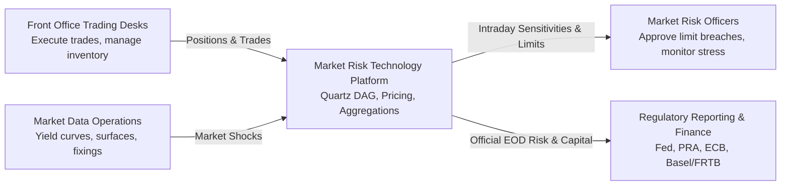
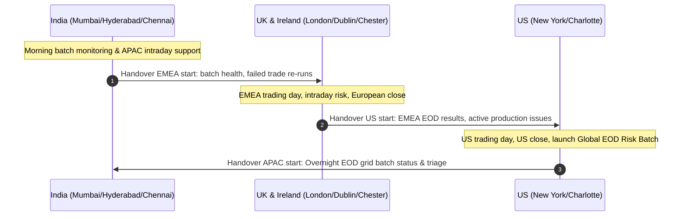

# Market Risk Technology: Role Profile, Global Markets Structure, and Pitch

Strategic positioning, organizational context, and behavioral interview narrative for senior Python developers interviewing for Market Risk Technology in Global Markets.

> [!NOTE]
> **Context**: This role sits within Global Markets Technology, supporting Market Risk Officers, Quantitative Research, and Front Office Trading desks.
> Candidates must articulate both high-performance Python software craftsmanship and deep operational empathy for market risk cutoffs and regulatory accountability.

---

## 1. What Market Risk Technology Actually Does

In a Tier 1 investment bank, Market Risk Technology is the computational backbone that measures, monitors, and controls financial exposure across all asset classes (FICC: Fixed Income, Currencies, Commodities; and Equities).

### Key Differences: Front Office Tech vs Market Risk Tech

| Dimension | Front Office Technology (Trading Systems) | Market Risk Technology |
| :--- | :--- | :--- |
| **Primary Customer** | Desk Traders, Sales, Structurers | Market Risk Officers, Chief Risk Officer, Regulators (Fed, PRA, ECB) |
| **Latency Mandate** | Microsecond to sub-millisecond (order routing, matching) | Second-level (intraday risk) to multi-hour batch scale (EOD portfolio simulation) |
| **Compute Pattern** | Event-driven, low allocation, streaming order-by-order | Massive compute grid (10,000+ CPU cores), Monte Carlo simulations, full portfolio DAG revaluations |
| **Data Scope** | Single desk, single exchange or book | Global firm-wide aggregation across millions of positions across all books |
| **Regulatory Impact** | Trade reporting (CAT, MiFID II) | Capital requirements, Stress testing (CCAR, DFAST), Basel III/IV, FRTB |

### The Two Computational Cycles

1. **Intraday Real-Time Risk**:
   - Computes first-order sensitivities (Delta, Vega, DV01) as trades execute and market data updates.
   - Alerts traders and risk managers immediately if desk position limits or stop-loss limits are breached.
   - Requires incremental DAG re-evaluation (only evaluating nodes invalidated by market ticks).

2. **End-of-Day (EOD) Batch Risk**:
   - The official regulatory and accounting run executed after global market close (US, London, Tokyo).
   - Re-evaluates all firm positions against historical scenarios (typically 250 to 500 historical days).
   - Calculates 99% 10-day Value at Risk (VaR), Expected Shortfall (ES), Stress Testing, and PnL Attribution.
   - Hard SLA: Must finish by early morning (e.g., 04:00 AM local time) for risk sign-off and regulatory submission.

---

## 2. The Global Operating Model

Market Risk teams operate on a "follow-the-sun" collaborative framework across four primary geographic hubs:

- **Ireland (Dublin/Chester)**: European regulatory reporting (ECB, Central Bank of Ireland), FICC trade persistence and risk engines.
- **UK (London)**: Primary EMEA Global Markets hub, front-office trading desk alignment, quantitative risk methodology.
- **India (Mumbai, Hyderabad, Chennai)**: Major core engineering development, platform infrastructure, grid scaling, 24/7 operational reliability.
- **US (New York, Charlotte)**: Global headquarters, Federal Reserve compliance, US desk risk, central risk architecture leadership.

---

## 3. The 2-Minute Elevator Pitch

When the interviewer asks: *"Tell me about yourself and your background."*

> "I am a Senior Software Engineer with over five years of experience building mission-critical Python systems, object-oriented services, and high-volume data pipelines in financial services.
> 
> A major cornerstone of my background was working on Bank of America's Quartz platform within the FICC business.
> In that role, I engineered Python trading and risk services responsible for trade storage, validation, execution matching, and downstream risk aggregation.
> I worked deeply with the reactive dependency graph ecosystem, utilizing object-store persistence and interfacing with enterprise databases such as Sybase, DB2, and Oracle for official risk reporting.
> I also led a multi-quarter initiative migrating over one million lines of production Python code to Python 3.8, ensuring strict backward compatibility, zero regression in risk calculations, and significant runtime performance gains.
> 
> Having worked in highly agile global teams spanning the US, UK, and India, I understand the realities of high-pressure trading environments, particularly the non-negotiable SLAs of End-of-Day risk runs and regulatory filings.
> I am excited about this role because it sits right at the intersection of high-performance Python craftsmanship, reactive architecture, and enterprise risk analytics."

---

## 4. 5 High-Impact Behavioral STAR Stories

### Story 1: Production Emergency During EOD Batch Risk Run
- **Situation**: During a quarter-end regulatory reporting run, the global market risk batch stalled at 02:00 AM with an SLA deadline of 04:30 AM for Federal Reserve risk submission. Over 40,000 credit derivative trades were hanging on valuation.
- **Task**: As the on-call senior engineer, I needed to identify the root cause, restore the batch, and ensure calculation accuracy without compromising the audit trail.
- **Action**: I inspected the grid worker logs and thread dump, identifying a deadlock in the database connection pool caused by an unindexed query on Sybase ASE locking an entire page of historical trade attributes.
I killed the blocking session, dynamically injected an explicit index hint into the Python data-access query wrapper to force index-seek execution, and resumed the grid job across 500 worker nodes.
- **Result**: The batch recovered within 25 minutes, completing at 03:45 AM, 45 minutes ahead of the regulatory cutoff. I followed up the next sprint with a permanent database index migration and added connection pool timeout telemetry.

### Story 2: Performance Optimization of Bottlenecked Risk Calculation
- **Situation**: An intraday risk calculation job for an interest rate derivatives desk was taking over 12 seconds per shock, causing UI lag for risk managers monitoring market volatility.
- **Task**: Reduce calculation latency to under 2 seconds to meet real-time risk monitoring requirements.
- **Action**: Profiling with `cProfile` and memory analysis revealed two major flaws: excessive Python object instantiations within the inner loop and unmemoized DAG node evaluations where identical discount factors were recomputed thousands of times.
I refactored the pricing node using Python descriptors and `__slots__` to cut object memory footprint, and implemented intelligent dependency caching using Quartz's reactive graph mechanics, ensuring yield curve interpolation happened once per shock rather than once per trade.
- **Result**: Reduced execution time from 12.4 seconds to 1.1 seconds (over 90% reduction), while cutting peak worker memory usage by 45%.

### Story 3: Global Cross-Region Collaboration & Agile Release
- **Situation**: A major regulatory update for the Fundamental Review of the Trading Book (FRTB) required coordinated code deployment across US, London, Dublin, and India teams with zero disruption to daily trading.
- **Task**: Coordinate the sprint deliverables and release management between the US development team and the India batch operations team.
- **Action**: I established a standardized daily handover bridge, created automated integration regression test suites comparing daily Greeks down to 0.001% tolerance, and designed feature flags in Python to allow dark-launching the new FRTB aggregation engine in shadow mode alongside the legacy Basel II.5 engine.
- **Result**: The platform cut over smoothly on release night with zero rollbacks, and the dual-run verification showed exact parity across 1.2 million simulated risk factors.

### Story 4: Refactoring Legacy Code to Modern Design Patterns
- **Situation**: A legacy risk engine module had grown into a monolithic 4,000-line Python file with nested `if-elif` blocks determining pricing models and database connections based on instrument type codes.
- **Task**: Redesign the module to adhere to SOLID principles, improve testability, and allow new derivative products to be added without touching core engine logic.
- **Action**: I refactored the monolith using the **Abstract Factory** pattern for instrument instantiation and the **Strategy** pattern for swappable pricing models (e.g., Black-Scholes, Binomial Tree, Monte Carlo).
I separated data access behind a clean **Repository** interface, enabling mock database testing without hitting Sybase or DB2 directly.
- **Result**: Unit test coverage increased from 28% to 94%, and subsequent onboarding of new exotic swap products was reduced from 3 weeks of risky edits to writing a single isolated strategy class in under 3 days.

### Story 5: Managing Competing Priorities Under Pressure
- **Situation**: On the day of a scheduled platform release, the head of Market Risk requested an urgent ad-hoc stress scenario for an unexpected central bank interest rate hike, while the trading desk requested a bug fix for an intraday PnL display glitch.
- **Task**: Balance stakeholder expectations without burning out the team or destabilizing the production release.
- **Action**: I immediately convened a 15-minute triage with the Product Owner, Desk Head, and Risk Lead.
I demonstrated that the stress scenario could be executed by leveraging existing parameter files in the Quartz DAG engine without deploying new code, while the PnL display glitch was isolated to a frontend cache invalidation issue that could be safely hotfixed.
- **Result**: Delivered the stress testing numbers to senior management within 2 hours, deployed the hotfix during the scheduled maintenance window, and maintained trust across both business units.

---

## 5. Strategic Questions to Ask the Interview Panel

At the conclusion of the interview, asking insightful questions signals seniority and domain engagement:

1. *"How is the Market Risk team managing the transition from legacy internal models to FRTB (Internal Model Approach vs Standardized Approach), and what architectural demands is that placing on the Quartz calculation grid?"*
2. *"Given the global spread between Ireland, the UK, India, and the US, how are you balancing centralized core platform enhancements with localized desk-specific risk requirements in your sprint cycles?"*
3. *"On the database layer, what proportion of your analytical risk queries currently run against columnar storage like Sybase IQ versus relational stores like Sybase ASE, DB2, or Oracle?"*
4. *"What is currently the single largest bottleneck during the End-of-Day risk batch: trade ingestion, grid calculation capacity, or downstream database persistence?"*
