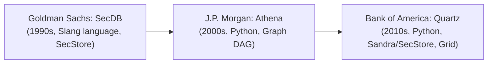
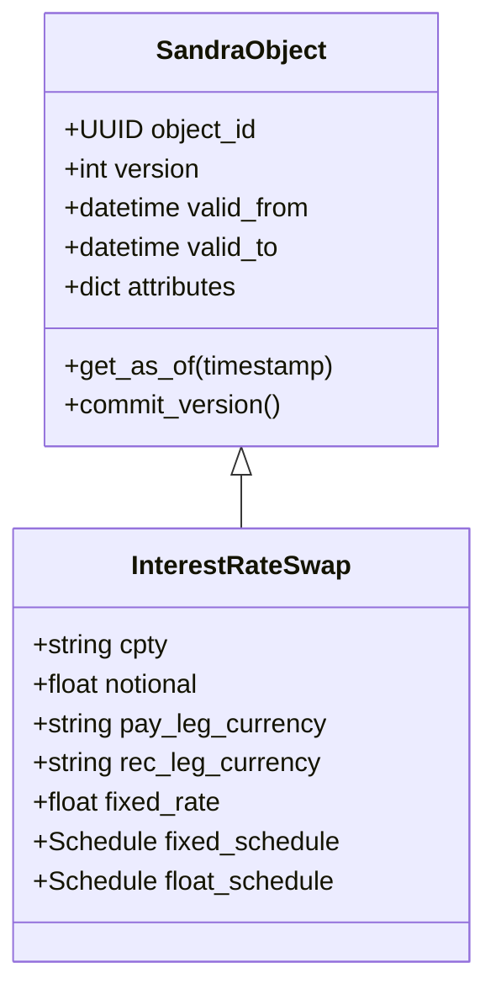

# Quartz Architecture, Reactive Graph Engine, and Object Storage

Technical analysis of Bank of America's Quartz platform, its SecDB and Athena lineage, the reactive Dependency Graph (DAG), memoization mechanics, and pure Python implementation.

> [!NOTE]
> **Context**: Quartz is Bank of America's enterprise pricing, trade capture, and risk management platform.
> It belongs to the elite family of financial reactive computing platforms alongside Goldman Sachs' **SecDB** and J.P. Morgan's **Athena**.
> Understanding how DAG-based reactive computation operates is the single most distinctive skill in this interview.

---

## 1. The Heritage of Reactive Banking Platforms

Tier 1 investment banks faced a fundamental problem in the 1990s and 2000s: how to calculate real-time risk, Greeks, and PnL across millions of complex derivatives without recalculating the universe on every market tick.



### Core Architecture Pillars of Quartz

1. **A Single Unified Monorepo**:
   - Millions of lines of Python code shared globally across front office, quantitative research, and risk technology.
   - Eliminates the classic divide between quant prototype code and production risk code.

2. **Reactive Dependency Graph (The DAG)**:
   - Everything in Quartz (from a simple bond price to an entire firm-wide VaR matrix) is represented as a node in a Directed Acyclic Graph.
   - When an input node changes (e.g., USD SOFR interest rate curve), changes propagate downstream.
   - Nodes are evaluated lazily on demand and automatically memoized (cached).

3. **Object-Oriented Database (Sandra / SecStore)**:
   - Trades, contracts, market conventions, and risk configurations are stored as versioned Python objects.
   - Complete bitemporal auditability: any query can be executed "as-of" an exact timestamp in the past.

4. **Distributed Compute Grid**:
   - Thousands of distributed grid nodes running Python interpreter instances.
   - Transparent dispatch of calculation subgraphs across grid engines with minimal developer boilerplate.

---

## 2. Deep Dive: The Reactive Dependency Graph

The fundamental data structure in Quartz is the **Dependency Graph (DAG)**.

```mermaid
graph TD
    classDef input fill:#0f172a,stroke:#34d399,stroke-width:2px,color:#f8fafc;
    classDef intermediate fill:#1e1b4b,stroke:#818cf8,stroke-width:2px,color:#f8fafc;
    classDef output fill:#312e81,stroke:#f472b6,stroke-width:2px,color:#f8fafc;

    S[Spot Price: S=100]:::input --> BS[Black-Scholes Formula]:::intermediate
    K[Strike Price: K=105]:::input --> BS
    R[Zero Curve: r=0.045]:::input --> DF[Discount Factor]:::intermediate
    DF --> BS
    VOL[Vol Surface: sigma=0.20]:::input --> BS
    T[Maturity: T=1.0]:::input --> BS
    
    BS --> PV[Option Present Value]:::output
    BS --> DELTA[Delta Sensitivity]:::output
    BS --> VEGA[Vega Sensitivity]:::output
```



### Why a Reactive Graph Outperforms Traditional Procedural Code

1. **Automatic Memoization (Caching)**:
   - If 10,000 different options depend on the same USD SOFR 10-year discount factor, the discount factor is computed exactly once during the calculation cycle.
   - Subsequent calls return the cached value in $O(1)$ time.

2. **Fine-Grained Cache Invalidation (Dirty Tracking)**:
   - When a market tick arrives modifying only the volatility surface (`VOL`), the spot price (`S`) and discount factor (`DF`) remain valid.
   - Only downstream nodes depending on `VOL` are marked dirty and recomputed.

3. **Lazy Evaluation**:
   - Calculations are only executed if their output is explicitly requested by a consumer (such as a trader UI or risk report).

---

## 3. Worked Example: Pure Python Reactive Graph Engine

Below is a runnable, self-contained implementation demonstrating how a Quartz-like reactive DAG engine operates in Python, including dependency tracking, memoization, cache invalidation, and Greek calculation.

```python
"""
quartz_dag_engine.py
A pure-Python implementation of a reactive dependency graph (DAG) engine.
Demonstrates memoization, dirty-flag propagation, and financial risk calculation.
"""

from __future__ import annotations
import math
from typing import Callable, Any, Dict, Set


class GraphNode:
    """
    Represents an atomic computation node in a reactive dependency graph.
    """

    def __init__(self, name: str, compute_func: Callable[..., Any], is_input: bool = False):
        self.name: str = name
        self.compute_func: Callable[..., Any] = compute_func
        self.is_input: bool = is_input
        self.cached_value: Any = None
        self.is_dirty: bool = True
        self.parents: Set[GraphNode] = set()       # Nodes this node depends on (inputs)
        self.children: Set[GraphNode] = set()      # Nodes that depend on this node (dependents)
        self.eval_count: int = 0

    def add_dependency(self, parent_node: GraphNode) -> None:
        """Register a parent dependency for this node."""
        self.parents.add(parent_node)
        parent_node.children.add(self)

    def set_value(self, new_value: Any) -> None:
        """Update an input node's value and propagate dirty state downstream."""
        if not self.is_input:
            raise ValueError(f"Cannot manually set value on calculated node: {self.name}")
        self.cached_value = new_value
        self.invalidate()

    def invalidate(self) -> None:
        """Mark this node and all transitive downstream dependents as dirty."""
        if not self.is_dirty:
            self.is_dirty = True
            for child in self.children:
                child.invalidate()

    def get_value(self) -> Any:
        """Evaluate the node if dirty; return cached value if clean."""
        if self.is_dirty:
            if self.is_input:
                self.is_dirty = False
            else:
                # Gather inputs from parent dependencies
                parent_args = [parent.get_value() for parent in sorted(self.parents, key=lambda n: n.name)]
                self.cached_value = self.compute_func(*parent_args)
                self.eval_count += 1
                self.is_dirty = False
        return self.cached_value


class ReactiveEngine:
    """Orchestrates nodes in a Quartz-like reactive computing graph."""

    def __init__(self):
        self.nodes: Dict[str, GraphNode] = {}

    def input_node(self, name: str, initial_value: Any) -> GraphNode:
        node = GraphNode(name=name, compute_func=lambda: initial_value, is_input=True)
        node.cached_value = initial_value
        node.is_dirty = False
        self.nodes[name] = node
        return node

    def calculated_node(self, name: str, dependencies: list[GraphNode], func: Callable[..., Any]) -> GraphNode:
        node = GraphNode(name=name, compute_func=func, is_input=False)
        for dep in dependencies:
            node.add_dependency(dep)
        self.nodes[name] = node
        return node


def norm_cdf(x: float) -> float:
    """Standard normal cumulative distribution function."""
    return (1.0 + math.erf(x / math.sqrt(2.0))) / 2.0


def norm_pdf(x: float) -> float:
    """Standard normal probability density function."""
    return math.exp(-0.5 * x * x) / math.sqrt(2.0 * math.pi)


def run_demonstration():
    engine = ReactiveEngine()

    # 1. Define Market Data Inputs
    spot = engine.input_node("spot", 100.0)
    strike = engine.input_node("strike", 100.0)
    rate = engine.input_node("rate", 0.05)
    vol = engine.input_node("vol", 0.20)
    time_to_expiry = engine.input_node("time_to_expiry", 1.0)

    # 2. Define Intermediate Nodes: d1 and d2
    def calc_d1(k: float, r: float, s: float, t: float, v: float) -> float:
        # Note: sorted parent order: k, r, s, t, v
        return (math.log(s / k) + (r + 0.5 * v * v) * t) / (v * math.sqrt(t))

    def calc_d2(d1_val: float, t: float, v: float) -> float:
        # Sorted parent order: d1, t, v
        return d1_val - v * math.sqrt(t)

    node_d1 = engine.calculated_node("d1", [strike, rate, spot, time_to_expiry, vol], calc_d1)
    node_d2 = engine.calculated_node("d2", [node_d1, time_to_expiry, vol], calc_d2)

    # 3. Define Risk Metric Nodes: Price, Delta, Vega
    def calc_call_price(d1_val: float, d2_val: float, k: float, r: float, s: float, t: float) -> float:
        df = math.exp(-r * t)
        return s * norm_cdf(d1_val) - k * df * norm_cdf(d2_val)

    def calc_delta(d1_val: float) -> float:
        return norm_cdf(d1_val)

    def calc_vega(d1_val: float, s: float, t: float) -> float:
        return s * math.sqrt(t) * norm_pdf(d1_val)

    call_price = engine.calculated_node("call_price", [node_d1, node_d2, strike, rate, spot, time_to_expiry], calc_call_price)
    delta = engine.calculated_node("delta", [node_d1], calc_delta)
    vega = engine.calculated_node("vega", [node_d1, spot, time_to_expiry], calc_vega)

    # First Evaluation Cycle
    print("--- First Run: Full Graph Evaluation ---")
    print(f"Call Price: {call_price.get_value():.4f}")
    print(f"Delta:      {delta.get_value():.4f}")
    print(f"Vega:       {vega.get_value():.4f}")
    print(f"d1 evaluation count: {node_d1.eval_count} (computed once, shared by Price, Delta, Vega)")

    # Repeated calls should use cache with 0 re-computations
    _ = call_price.get_value()
    _ = delta.get_value()
    assert node_d1.eval_count == 1, "Cache failed: node recomputed without invalidation"

    # Second Evaluation Cycle: Spot shock (e.g. market moves from 100 to 102)
    print("\n--- Second Run: Market Tick (Spot Moves 100 -> 102) ---")
    spot.set_value(102.0)
    print("Market data updated. Downstream nodes marked dirty.")
    print(f"New Call Price: {call_price.get_value():.4f}")
    print(f"New Delta:      {delta.get_value():.4f}")
    print(f"d1 evaluation count: {node_d1.eval_count} (evaluated exactly once for new spot)")


if __name__ == "__main__":
    run_demonstration()
```

---

## 4. Object Storage (Sandra / SecStore) vs Relational Stores

In traditional enterprises, developers map Python classes to SQL tables using an ORM like SQLAlchemy.
In Quartz, trade persistence operates fundamentally differently:



### Key Differences Between Sandra and SQL Databases

| Dimension | Sandra / SecStore (Quartz Object Store) | Enterprise RDBMS (Sybase / DB2 / Oracle) |
| :--- | :--- | :--- |
| **Data Model** | Hierarchical Python objects, graphs, pickles/JSON-like structures | Normalized tables, rows, columns, foreign keys |
| **Schema Evolution** | Dynamic, class-level versioning without DDL migrations | Strict DDL, schema migrations (`ALTER TABLE`), DB lock risks |
| **Temporal Querying** | Native bitemporal support ("as-of" system and event time) | Requires temporal tables or complex audit log joins |
| **Primary Use in Bank** | Trading desk trade booking, rapid quant model iterations | End-of-day official ledger, risk warehouse, regulatory audit |
| **Join Efficiency** | Direct object pointer traversal ($O(1)$) | Relational joins (Hash, Merge, Nested Loop) on disk ($O(N \log M)$) |

---

## 5. Architectural Pitfalls in Quartz Systems

1. **Memory Leaks and Cache Growth**:
   - Because DAG nodes memoize return values based on input keys, long-running grid processes can exhaust memory if cache eviction policies (LRU, TTL) are not enforced.

2. **Circular Dependencies**:
   - If node $A$ depends on $B$, and $B$ depends on $A$, the topological evaluation loop will freeze or crash with `RecursionError`.
   - Production DAG engines strictly enforce cycle detection during graph construction.

3. **Accidental Global State Mutation**:
   - If a node returns a mutable object (e.g., a dictionary or NumPy array) and a downstream node mutates that object in place, it corrupts the cache for all other sibling nodes sharing that reference.
   - Nodes must always treat input data as immutable or return deep copies/frozen structures.

4. **GIL Contention on Single Interpreter Grid Nodes**:
   - Wrapping multiple Python threads inside a single Quartz process does not parallelize CPU-bound math due to the Global Interpreter Lock.
   - Quartz achieves high throughput through **process-based horizontal scaling** (running thousands of isolated single-threaded Python worker processes across the grid).

---

## 6. High-Frequency Interview Questions on Quartz

### Q1: What is a reactive dependency graph, and why do banks use it instead of procedural pipelines?
- **Spoken Answer**:
  "A reactive dependency graph models pricing and risk as a Directed Acyclic Graph where inputs like market curves and positions sit at the roots, intermediate calculations like discount factors form the edges, and final risk outputs are the leaves.
  Banks use it because it gives you two huge advantages: automatic memoization so shared intermediate values are calculated once, and fine-grained cache invalidation so when a market price updates, only the affected subgraphs recompute."

### Q2: How does Quartz handle the Global Interpreter Lock (GIL)?
- **Spoken Answer**:
  "Quartz circumvents the GIL through horizontal multiprocessing rather than shared-memory multithreading.
  Independent calculation jobs (such as distinct trading books or Monte Carlo paths) are partitioned across a distributed compute grid of thousands of isolated Python worker processes.
  Within a worker, performance-critical kernels (like curve bootstrapping or matrix operations) are written in C++ or use vectorised NumPy routines that release the GIL during execution."

### Q3: How do you perform an 'as-of' historical valuation in an object store like Sandra?
- **Spoken Answer**:
  "Sandra stores objects with bitemporal versioning: valid time (the real-world financial date) and transaction time (the timestamp the trade was committed to the database).
  To run an as-of valuation, the query passes an explicit historical timestamp.
  The engine loads the exact snapshot of the trade object and market data curves that existed at that precise second, allowing exact reproduction of historical risk and PnL numbers."
