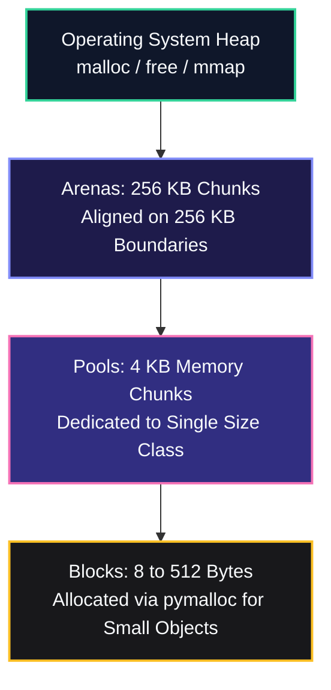
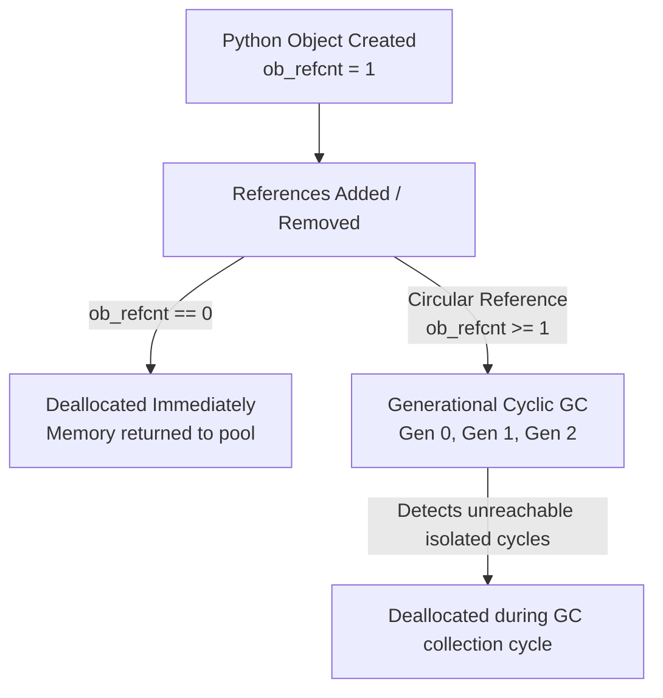
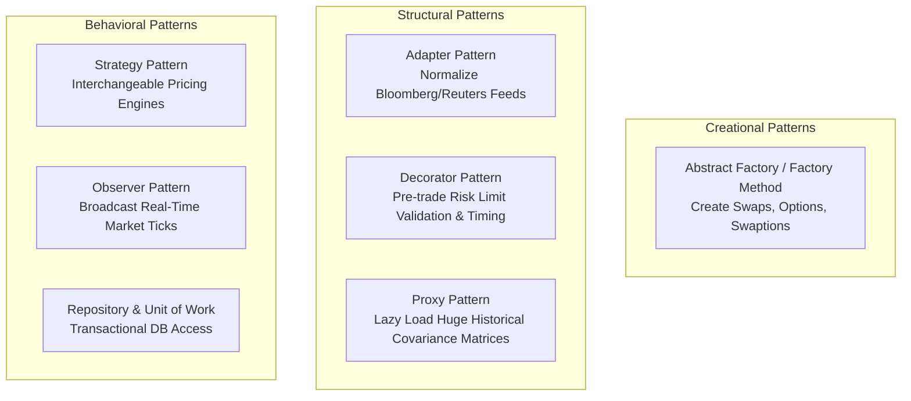

# Advanced Python, Object-Oriented Programming, and Design Patterns in Risk Systems

Deep-dive into Python language internals, memory architecture, CPython garbage collection, and enterprise software design patterns tailored for 5+ year senior engineers in Global Markets.

> [!NOTE]
> **Context**: In a 5+ year Python interview for market risk, basic syntax is taken for granted.
> Interviewers examine low-level mechanics: memory allocation pipelines, cyclic garbage collection, descriptor protocols, metaclasses, GIL release mechanics, and production design patterns.

---

## 1. CPython Internals & Memory Architecture

Senior developers must understand how Python manages heap memory when handling millions of financial data points.



### The CPython Memory Hierarchy

1. **Layer 3 (Object-Specific Allocators)**:
   - Built-in types (e.g., `int`, `float`, `list`, `dict`) have dedicated free lists.
   - For example, small integers from -5 to 256 are pre-allocated singletons in memory.

2. **Layer 2 (The PyMalloc Small Object Allocator)**:
   - For requests $\le 512$ bytes, CPython bypasses the OS `malloc` and uses `pymalloc`.
   - Organizes memory into **Arenas** (256 KB), partitioned into **Pools** (4 KB), which contain fixed-size **Blocks** (8 to 512 bytes).
   - High allocation speed and minimal memory fragmentation.

3. **Layer 1 & 0 (The OS Allocator)**:
   - Allocations $> 512$ bytes go directly to standard C library `malloc()`.

### Garbage Collection: Reference Counting vs Cyclic GC

CPython uses two complementary memory reclamation systems:



1. **Reference Counting (Primary)**:
   - Every `PyObject` carries `ob_refcnt`.
   - When `ob_refcnt` drops to zero, memory is freed immediately.
   - Deterministic and instantaneous; handles 99% of deallocations.

2. **Generational Cyclic Garbage Collector (Auxiliary)**:
   - Solves reference cycles (e.g., object $A$ points to $B$, and $B$ points back to $A$, but both are out of scope).
   - Three generations: Generation 0 (youngest, scanned most frequently), Generation 1, and Generation 2 (oldest, long-lived objects).
   - Triggered when `allocations - deallocations > threshold`.
   - **Production Risk Warning**: A full Gen 2 collection stops the world.
     During high-frequency risk batch runs, engineers often temporarily call `gc.disable()` and manually trigger `gc.collect()` between batch chunks to avoid unpredictable calculation pauses.

### Memory Optimization with `__slots__`

In standard Python classes, attributes are stored in an internal instance dictionary (`__dict__`).
This adds roughly 150-200 bytes of overhead per object.

```python
# Unoptimized trade representation: ~168 bytes overhead per instance
class NaiveTrade:
    def __init__(self, trade_id: str, notional: float, rate: float):
        self.trade_id = trade_id
        self.notional = notional
        self.rate = rate

# Optimized trade representation: ~56 bytes per instance (66% memory reduction)
class OptimizedTrade:
    __slots__ = ("trade_id", "notional", "rate")

    def __init__(self, trade_id: str, notional: float, rate: float):
        self.trade_id = trade_id
        self.notional = notional
        self.rate = rate
```

When holding 5 million trade positions in memory during a firm-wide risk aggregation run, `__slots__` saves gigabytes of RAM and significantly improves CPU L1/L2 cache locality.

---

## 2. Advanced Object Model: Descriptors & Metaclasses

### The Descriptor Protocol

A descriptor is any object that defines at least one of `__get__`, `__set__`, or `__delete__`.
Descriptors are the underlying engine behind Python's `@property`, `@classmethod`, `@staticmethod`, and ORM field mappings.

```python
class PositiveFloat:
    """A descriptor that enforces positive floating-point values for risk quantities."""

    def __set_name__(self, owner: type, name: str) -> None:
        self.private_name = f"_{name}"

    def __get__(self, instance: Any, owner: type) -> Any:
        if instance is None:
            return self
        return getattr(instance, self.private_name, 0.0)

    def __set__(self, instance: Any, value: float) -> None:
        if not isinstance(value, (int, float)) or value < 0:
            raise ValueError(f"Attribute {self.private_name[1:]} must be a positive number. Got: {value}")
        setattr(instance, self.private_name, float(value))


class BondPosition:
    notional = PositiveFloat()
    coupon = PositiveFloat()

    def __init__(self, notional: float, coupon: float):
        self.notional = notional
        self.coupon = coupon
```

### Metaclasses and `__init_subclass__`

A metaclass is the class of a class (`type`).
They allow dynamic registration, contract validation, and schema generation before an object class is even created.

In modern Python (3.6+), `__init_subclass__` provides a clean alternative to full metaclasses for plugin architectures:

```python
class RiskModelPlugin:
    """Base class that automatically registers all derivative pricing models in a central registry."""
    registry: dict[str, type] = {}

    def __init_subclass__(cls, model_name: str, **kwargs):
        super().__init_subclass__(**kwargs)
        if model_name in cls.registry:
            raise ValueError(f"Duplicate model registration: {model_name}")
        cls.registry[model_name] = cls
        cls.model_name = model_name


class BlackScholesModel(RiskModelPlugin, model_name="BlackScholes"):
    pass


class MonteCarloModel(RiskModelPlugin, model_name="MonteCarlo"):
    pass


# Registry automatically contains {'BlackScholes': <class BlackScholesModel>, 'MonteCarlo': <class MonteCarloModel>}
```

---

## 3. Software Design Patterns in Market Risk Systems



### GoF Pattern Mapping to Trading Systems

| Pattern | Architectural Role in Risk Systems | Concrete Example |
| :--- | :--- | :--- |
| **Strategy** | Swappable analytical valuation models | Switching between Black-76, Bachelier (for negative rates), and Hull-White |
| **Abstract Factory** | Creating families of related financial instruments | `FICCInstrumentFactory` creating Swaps and Swaptions under consistent market conventions |
| **Observer** | Publish/subscribe distribution of market ticks | Market data ticker notifying portfolio valuation nodes of live price changes |
| **Decorator** | Cross-cutting concerns without modifying math | Adding latency metrics, audit logging, and desk risk limit checks to pricing functions |
| **Adapter** | Normalizing heterogeneous third-party schemas | Converting a Bloomberg B-PIPE market feed into the internal Quartz curve model |
| **Unit of Work** | Managing database transactions across multiple tables | Ensuring that inserting a trade, its cashflows, and risk tags commits atomically or rolls back |

---

## 4. Worked Example: Extensible Financial Risk Engine

The runnable Python program below demonstrates the **Strategy**, **Factory Method**, and **Observer** patterns applied to an object-oriented risk engine with strict type annotations.

```python
"""
risk_patterns_engine.py
Object-oriented financial risk framework demonstrating:
- Strategy Pattern (Interchangeable pricing algorithms)
- Factory Pattern (Instrument instantiation)
- Observer Pattern (Market data tick broadcasting)
"""

from __future__ import annotations
from abc import ABC, abstractmethod
from dataclasses import dataclass
import math
from typing import Dict, List, Protocol


# --- Domain Models ---

@dataclass(frozen=True)
class MarketDataSnapshot:
    spot: float
    rate: float
    volatility: float


# --- Strategy Pattern: Pricing Engines ---

class PricingStrategy(ABC):
    """Abstract Strategy interface for option valuation models."""

    @abstractmethod
    def calculate_price_and_delta(self, spot: float, strike: float, rate: float, vol: float, t: float) -> tuple[float, float]:
        pass


class AnalyticBlackScholesStrategy(PricingStrategy):
    """Closed-form Black-Scholes model for European equity/FX options."""

    def calculate_price_and_delta(self, spot: float, strike: float, rate: float, vol: float, t: float) -> tuple[float, float]:
        if t <= 0:
            payoff = max(0.0, spot - strike)
            delta = 1.0 if spot > strike else 0.0
            return payoff, delta

        d1 = (math.log(spot / strike) + (rate + 0.5 * vol * vol) * t) / (vol * math.sqrt(t))
        d2 = d1 - vol * math.sqrt(t)

        cdf_d1 = 0.5 * (1.0 + math.erf(d1 / math.sqrt(2.0)))
        cdf_d2 = 0.5 * (1.0 + math.erf(d2 / math.sqrt(2.0)))

        price = spot * cdf_d1 - strike * math.exp(-rate * t) * cdf_d2
        delta = cdf_d1
        return price, delta


class BachelierNormalStrategy(PricingStrategy):
    """Bachelier normal model, ideal for negative interest rate environments (swaptions)."""

    def calculate_price_and_delta(self, spot: float, strike: float, rate: float, vol: float, t: float) -> tuple[float, float]:
        if t <= 0:
            return max(0.0, spot - strike), 1.0 if spot > strike else 0.0

        d = (spot - strike) / (vol * math.sqrt(t))
        pdf_d = math.exp(-0.5 * d * d) / math.sqrt(2.0 * math.pi)
        cdf_d = 0.5 * (1.0 + math.erf(d / math.sqrt(2.0)))

        price = math.exp(-rate * t) * ((spot - strike) * cdf_d + vol * math.sqrt(t) * pdf_d)
        delta = math.exp(-rate * t) * cdf_d
        return price, delta


# --- Financial Instrument Class Hierarchy ---

class FinancialInstrument(ABC):
    def __init__(self, instrument_id: str, notional: float):
        self.instrument_id: str = instrument_id
        self.notional: float = notional

    @abstractmethod
    def evaluate(self, market: MarketDataSnapshot) -> tuple[float, float]:
        """Returns total Present Value (PV) and Delta."""
        pass


class EuropeanOption(FinancialInstrument):
    def __init__(self, instrument_id: str, notional: float, strike: float, expiry: float, strategy: PricingStrategy):
        super().__init__(instrument_id, notional)
        self.strike: float = strike
        self.expiry: float = expiry
        self.strategy: PricingStrategy = strategy

    def set_strategy(self, strategy: PricingStrategy) -> None:
        self.strategy = strategy

    def evaluate(self, market: MarketDataSnapshot) -> tuple[float, float]:
        unit_price, unit_delta = self.strategy.calculate_price_and_delta(
            spot=market.spot, strike=self.strike, rate=market.rate, vol=market.volatility, t=self.expiry
        )
        return unit_price * self.notional, unit_delta * self.notional


# --- Factory Pattern ---

class InstrumentFactory:
    """Factory for instantiating standardized financial trades."""

    @staticmethod
    def create_equity_call(trade_id: str, notional: float, strike: float, expiry: float) -> EuropeanOption:
        return EuropeanOption(trade_id, notional, strike, expiry, strategy=AnalyticBlackScholesStrategy())

    @staticmethod
    def create_rate_swaption(trade_id: str, notional: float, strike: float, expiry: float) -> EuropeanOption:
        # Rate swaptions default to Bachelier normal model to handle low/negative rates
        return EuropeanOption(trade_id, notional, strike, expiry, strategy=BachelierNormalStrategy())


# --- Observer Pattern: Market Ticker Service ---

class MarketDataObserver(Protocol):
    def on_market_update(self, snapshot: MarketDataSnapshot) -> None:
        ...


class MarketDataPublisher:
    """Broadcaster for live market ticks to registered risk subscribers."""

    def __init__(self):
        self._subscribers: List[MarketDataObserver] = []

    def subscribe(self, observer: MarketDataObserver) -> None:
        self._subscribers.append(observer)

    def publish(self, snapshot: MarketDataSnapshot) -> None:
        for sub in self._subscribers:
            sub.on_market_update(snapshot)


class PortfolioRiskMonitor(MarketDataObserver):
    """Observer component aggregating real-time risk across a portfolio."""

    def __init__(self, portfolio_name: str):
        self.portfolio_name: str = portfolio_name
        self.instruments: List[FinancialInstrument] = []
        self.total_pv: float = 0.0
        self.total_delta: float = 0.0

    def add_instrument(self, instrument: FinancialInstrument) -> None:
        self.instruments.append(instrument)

    def on_market_update(self, snapshot: MarketDataSnapshot) -> None:
        total_pv = 0.0
        total_delta = 0.0
        for inst in self.instruments:
            pv, delta = inst.evaluate(snapshot)
            total_pv += pv
            total_delta += delta

        self.total_pv = total_pv
        self.total_delta = total_delta
        print(f"[{self.portfolio_name}] Market Shock: Spot={snapshot.spot:.2f} -> Total PV: ${self.total_pv:,.2f} | Net Delta: {self.total_delta:,.2f}")


# --- Execution Demonstration ---

def main():
    print("=== Market Risk Design Patterns Engine Demo ===")

    # 1. Setup Portfolio & Factory
    monitor = PortfolioRiskMonitor("Global Equity & Rates Book")
    factory = InstrumentFactory()

    trade_1 = factory.create_equity_call("EQ-CALL-001", notional=10_000, strike=100.0, expiry=1.0)
    trade_2 = factory.create_rate_swaption("IR-SWAPT-002", notional=50_000, strike=0.03, expiry=2.0)

    monitor.add_instrument(trade_1)
    monitor.add_instrument(trade_2)

    # 2. Setup Market Publisher
    market_feed = MarketDataPublisher()
    market_feed.subscribe(monitor)

    # 3. Broadcast Initial Market State
    initial_market = MarketDataSnapshot(spot=100.0, rate=0.04, volatility=0.20)
    print("\nPublishing Base Market Conditions:")
    market_feed.publish(initial_market)

    # 4. Market Move (Spot rises to 105)
    print("\nPublishing Market Shock (Spot +5%):")
    shocked_market = MarketDataSnapshot(spot=105.0, rate=0.04, volatility=0.22)
    market_feed.publish(shocked_market)

    # 5. Dynamic Strategy Swap at Runtime (Switching trade_1 to Bachelier)
    print("\nDynamically Swapping Model Strategy on EQ-CALL-001 to Bachelier Normal:")
    trade_1.set_strategy(BachelierNormalStrategy())
    market_feed.publish(shocked_market)


if __name__ == "__main__":
    main()
```

---

## 5. Core Python Interview Q&A

### Q1: What is the difference between `__new__` and `__init__` in Python?
- **Spoken Answer**:
  "`__new__` is the actual constructor method responsible for allocating the memory and returning a new instance of the class, whereas `__init__` is the initializer method that configures the attributes of the already-created instance.
  `__new__` is a static method that takes `cls` as its first parameter and must return an object instance; `__init__` takes `self` and returns `None`.
  We override `__new__` when subclassing immutable types like `int` or `tuple`, or when implementing a Singleton or Metaclass."

### Q2: How does Python resolve the method execution order in multiple inheritance (Diamond Problem)?
- **Spoken Answer**:
  "Python uses the **C3 Linearization** algorithm to determine the Method Resolution Order (MRO), accessible via `ClassName.__mro__` or `ClassName.mro()`.
  C3 ensures two properties: monotonicity (subclasses appear before base classes) and consistency of local precedence order (the order specified in the class definition tuple).
  If an inheritance structure violates these constraints, Python raises a `TypeError` at compile/import time rather than producing unpredictable runtime calls."

### Q3: When should you use a generator over a list in a data processing pipeline?
- **Spoken Answer**:
  "Generators produce items lazily on demand using the iterator protocol (`__iter__` and `__next__`), yielding values one by one rather than allocating the entire collection in memory.
  In risk systems processing millions of historical trade rows or scenario paths, storing everything in a list consumes gigabytes of memory and risks `MemoryError`.
  Generators provide $O(1)$ memory consumption and pipeline streaming, allowing consumer nodes to process records immediately before the producer finishes."
