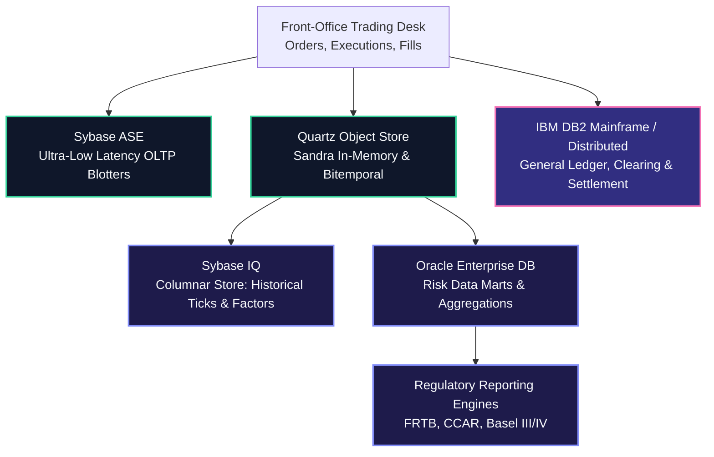
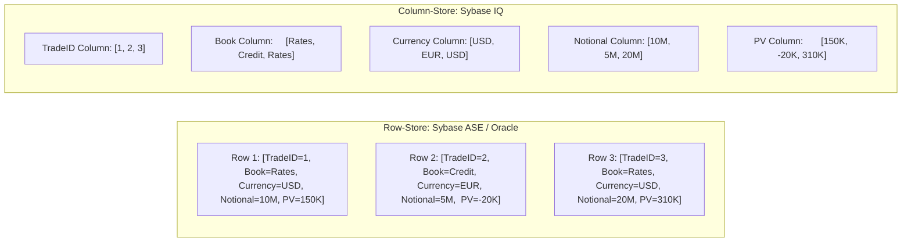
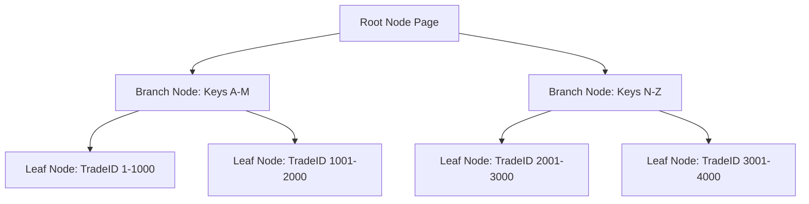

# Enterprise Relational Databases in Financial Tech: DB2, Sybase, and Oracle

Deep-dive into enterprise database architectures, Sybase ASE and IQ, DB2, and Oracle: query execution internals, indexing mechanics, lock escalation, isolation levels, and Python high-throughput database engineering.

> [!NOTE]
> **Context**: Global Markets platforms process millions of trades daily.
> While Python models the pricing graph, enterprise databases serve as the immutable system of record for positions, risk limits, cashflows, and regulatory submissions.
> Proving database depth (query plans, locking, isolation, and bulk ETL) is a non-negotiable requirement of this interview.

---

## 1. Enterprise Database Landscape in Investment Banking

Tier 1 investment banks rely on specific relational engines tailored to distinct financial workloads:



### The Big Four Compared

| Database Engine | Primary Role in Global Markets | Storage Architecture | Concurrency Model | Key Strength |
| :--- | :--- | :--- | :--- | :--- |
| **Sybase ASE** | Front-Office Trade Blotters, Order Management | Row-oriented, page-based (2KB-16KB pages) | Pessimistic 2-Phase Locking (2PL), Row/Page locks | Historic Wall Street standard for sub-millisecond OLTP trade capture |
| **Sybase IQ** | Historical Risk Factor Warehouse, EOD Time-Series | Columnar-oriented, highly compressed bit-vectors | Snapshot Isolation / MVCC (readers never block writers) | Blazing fast aggregations (`SUM`, `AVG`, `STDEV`) across billions of historical ticks |
| **IBM DB2** | Central General Ledger, Core Clearing & Settlement | Row-oriented with pureScale shared-data clustering | Adaptive locking, Next-Key locking, Lock Avoidance | Massive mainframe durability, zero data loss, rock-solid accounting integrity |
| **Oracle DB** | Firm-Wide Risk Marts, Regulatory Data Warehouses | Row-oriented with Hybrid Columnar Compression (HCC) | Multi-Version Concurrency Control (MVCC) without undo read locks | Advanced partitioning, Cost-Based Optimizer (CBO), analytical window functions |

---

## 2. Row-Store (Sybase ASE / Oracle) vs Column-Store (Sybase IQ)

Understanding when to store data by row versus by column is essential for designing risk calculation pipelines:



### When to Use Each in Market Risk

- **Row-Store (Sybase ASE / DB2 / Oracle)**:
  - Ideal for OLTP where the application inserts, updates, or fetches a **single complete trade record** across all its 50 attributes.
  - Efficient for write-heavy trade booking and transactional cashflow settlement.
- **Column-Store (Sybase IQ)**:
  - Ideal for analytical risk queries where the engine scans millions of historical scenarios but only accesses **2 or 3 columns** (e.g., `SELECT SUM(PV) FROM RiskResults WHERE Book = 'Rates' AND ScenarioDate = '2026-09-30'`).
  - Column compression achieves 5x-10x disk savings because identical data types sit contiguously on disk.
  - Drastically reduces I/O by reading only requested columns into memory.

---

## 3. Database Internals: Indexing & Query Optimization

### B-Tree Index Mechanics

A B-Tree index organizes sorted keys in a balanced tree structure:



- **Height**: Balanced B-Trees typically have a height of 3 to 4 levels, requiring at most 3 to 4 page I/O operations to locate any specific key among millions of rows ($O(\log N)$).
- **Clustered vs Non-Clustered Indexes**:
  - **Clustered Index** (Sybase ASE, DB2) / **Index-Organized Table** (Oracle): The leaf pages of the index *are* the actual physical table data pages. Only one clustered index can exist per table.
  - **Non-Clustered Index**: The leaf pages contain the indexed key values plus a row locator (RID in Sybase/DB2, ROWID in Oracle) pointing to the physical data heap.

### The Leftmost Prefix Rule (Composite Indexes)

If you create a composite index on `(BookID, TradeDate, Currency)`:
- Queries filtering on `WHERE BookID = 'RATES'` **use the index**.
- Queries filtering on `WHERE BookID = 'RATES' AND TradeDate = '2026-10-01'` **use the index**.
- Queries filtering on `WHERE TradeDate = '2026-10-01'` **CANNOT** use the index (causes a full table scan).
- **Rule**: Column order in composite indexes must match query access patterns, placing high-cardinality equality filters first.

### Covering Indexes (Index-Only Scan)

A covering index contains all columns requested by a `SELECT` statement:
```sql
CREATE INDEX idx_risk_summary ON Trades (BookID, TradeDate) INCLUDE (PresentValue);
```
When executing:
```sql
SELECT BookID, TradeDate, PresentValue FROM Trades WHERE BookID = 'FICC' AND TradeDate = '2026-10-01';
```
The database engine satisfies the entire query directly from the index leaf pages without ever touching the underlying table heap.
This eliminates table row lookups, transforming random disk I/O into fast sequential index scans.

---

## 4. Query Execution Plans & Join Algorithms

When a SQL query executes, the **Cost-Based Optimizer (CBO)** generates an execution plan based on table statistics:

### The Three Fundamental Join Algorithms

1. **Nested Loop Join**:
   - For each outer row, the engine searches the inner table using an index.
   - Optimal when the outer set is small (e.g., 50 selected portfolios) and the inner table has a fast B-Tree index lookup.

2. **Hash Join**:
   - The engine builds an in-memory hash table on the smaller table, then streams the larger table probing the hash table.
   - Optimal for large, unsorted datasets common in batch risk aggregations where no index exists.

3. **Sort-Merge Join**:
   - Both tables are sorted on the join key and scanned concurrently.
   - Optimal when both inputs are already sorted by an index or prior step.

---

## 5. Concurrency, Isolation Levels, and Lock Escalation

### The 4 ANSI SQL Isolation Levels & Concurrency Anomalies

| Isolation Level | Dirty Read | Non-Repeatable Read | Phantom Read | Implementation Mechanism |
| :--- | :--- | :--- | :--- | :--- |
| **Read Uncommitted** | Allowed | Allowed | Allowed | No read locks taken (dirty reads) |
| **Read Committed** | **Prevented** | Allowed | Allowed | Read locks released immediately after reading row/page |
| **Repeatable Read** | **Prevented** | **Prevented** | Allowed | Read locks held until end of transaction |
| **Serializable** | **Prevented** | **Prevented** | **Prevented** | Range locks / Predicate locks prevent inserts |

### Multi-Version Concurrency Control (MVCC) in Oracle and Modern DB2

Oracle avoids read locks completely:
- When a writer updates a row, it stores the old version in the **Undo Segment** (or Rollback Segment).
- Readers querying that row reconstruct the consistent snapshot from the undo segment as of the query's start timestamp.
- **Golden Rule in Oracle**: *Readers never block writers, and writers never block readers.*
- **ORA-01555 Snapshot Too Old**: Occurs if a long-running risk query requires an old undo block that was overwritten by heavy concurrent transactional writes.

### Lock Escalation in Sybase ASE and DB2

In Sybase ASE and DB2, each row lock consumes server memory.
When a single transaction acquires thousands of individual row locks (for example, during a bulk EOD risk position update):
1. The database hits the `lock escalation threshold`.
2. The engine escalates all row locks into a single **Page Lock** or **Table Lock** (Exclusive Lock `X`).
3. **Catastrophic Consequence**: The escalated table lock blocks all other trading desks from reading or inserting trades, causing cascading application timeouts.
4. **Prevention**: Batch bulk updates in chunks of 500-1,000 rows, committing between each batch to flush locks.

---

## 6. Python Database Engineering: Connection Pooling & Streaming

In production risk systems, naive database access crashes the platform.
Senior engineers adhere to two core patterns:

1. **Connection Pooling**:
   - Opening an enterprise DB connection (Sybase/Oracle/DB2) requires a full TLS handshake, authentication, and backend process spawning (50-200 ms).
   - A connection pool (e.g., `QueuePool` in SQLAlchemy or native DB drivers) maintains warm, reusable connections.

2. **Server-Side Streaming Cursors**:
   - Calling `cursor.fetchall()` on a 20-million-row risk table loads the entire result set into Python memory, causing an immediate `MemoryError` (OOM).
   - Use server-side cursors and `fetchmany(batch_size=10000)` to stream records through a generator pipeline.

---

## 7. Worked Example: High-Throughput Batch Persistence Script

The runnable Python module below illustrates connection pooling, transactional batch commits to avoid lock escalation, and memory-safe streaming cursor consumption.

```python
"""
enterprise_db_pipeline.py
Demonstrates high-throughput, transactional database operations for market risk:
- Thread-safe connection pooling
- Batch chunking to prevent lock escalation
- Server-side streaming cursor to avoid memory exhaustion
"""

from __future__ import annotations
import sqlite3
import time
from typing import Generator, List, Tuple
from contextlib import contextmanager
from queue import Queue, Empty


class MockDatabaseConnectionPool:
    """Simulates an enterprise connection pool (e.g., for Sybase ASE or Oracle)."""

    def __init__(self, db_path: str = ":memory:", pool_size: int = 5):
        self.db_path = db_path
        self.pool_size = pool_size
        self._pool: Queue[sqlite3.Connection] = Queue(maxsize=pool_size)
        self._initialize_pool()

    def _initialize_pool(self) -> None:
        for _ in range(self.pool_size):
            conn = sqlite3.connect(self.db_path, check_same_thread=False)
            conn.execute("PRAGMA journal_mode=WAL;")  # Write-Ahead Logging for high concurrency
            self._pool.put(conn)

    @contextmanager
    def get_connection(self) -> Generator[sqlite3.Connection, None, None]:
        conn = self._pool.get(timeout=5.0)
        try:
            yield conn
        finally:
            self._pool.put(conn)


def initialize_schema(conn: sqlite3.Connection) -> None:
    """Sets up high-volume trade risk staging table."""
    conn.execute("""
        CREATE TABLE IF NOT EXISTS TradeRiskStaging (
            trade_id TEXT PRIMARY KEY,
            book_id TEXT NOT NULL,
            currency TEXT NOT NULL,
            delta REAL NOT NULL,
            gamma REAL NOT NULL,
            vega REAL NOT NULL,
            updated_at REAL NOT NULL
        );
    """)
    conn.execute("CREATE INDEX IF NOT EXISTS idx_book_curr ON TradeRiskStaging (book_id, currency);")
    conn.commit()


def bulk_insert_risk_chunks(pool: MockDatabaseConnectionPool, records: List[Tuple], chunk_size: int = 1000) -> None:
    """
    Inserts large volume risk results in controlled transaction chunks.
    Prevents lock escalation and transaction log saturation in Sybase/DB2.
    """
    total_records = len(records)
    print(f"Starting bulk insert of {total_records:,} risk records in chunks of {chunk_size}...")
    start_time = time.time()

    with pool.get_connection() as conn:
        for i in range(0, total_records, chunk_size):
            chunk = records[i:i + chunk_size]
            with conn:  # Context manager starts and commits/rolls back transaction
                conn.executemany("""
                    INSERT OR REPLACE INTO TradeRiskStaging 
                    (trade_id, book_id, currency, delta, gamma, vega, updated_at)
                    VALUES (?, ?, ?, ?, ?, ?, ?);
                """, chunk)

    elapsed = time.time() - start_time
    print(f"Bulk insert complete in {elapsed:.3f}s (Throughput: {total_records/elapsed:,.0f} rows/sec).")


def stream_book_aggregations(pool: MockDatabaseConnectionPool, book_id: str, fetch_batch_size: int = 500) -> None:
    """
    Streams large query results in chunks using a cursor generator.
    Guarantees constant O(1) Python memory consumption.
    """
    print(f"\nStreaming risk aggregation for book: {book_id}...")
    with pool.get_connection() as conn:
        cursor = conn.cursor()
        cursor.execute("""
            SELECT trade_id, currency, delta, vega 
            FROM TradeRiskStaging 
            WHERE book_id = ?
        """, (book_id,))

        net_delta = 0.0
        net_vega = 0.0
        rows_processed = 0

        while True:
            batch = cursor.fetchmany(fetch_batch_size)
            if not batch:
                break
            for _, _, delta, vega in batch:
                net_delta += delta
                net_vega += vega
                rows_processed += 1

        print(f"Streamed {rows_processed:,} records: Total Net Delta = {net_delta:,.2f} | Total Net Vega = {net_vega:,.2f}")


def run_database_demonstration():
    pool = MockDatabaseConnectionPool()

    # 1. Setup Table Schema
    with pool.get_connection() as conn:
        initialize_schema(conn)

    # 2. Generate 10,000 Synthetic Trade Risk Records
    synthetic_records = [
        (f"TRD-{idx:06d}", "RATES-FICC" if idx % 2 == 0 else "CREDIT-EMEA", "USD" if idx % 3 == 0 else "EUR",
         100.5 * (idx % 10), 0.25 * (idx % 5), 50.0 * (idx % 8), time.time())
        for idx in range(10_000)
    ]

    # 3. Execute Chunked Transaction Insert
    bulk_insert_risk_chunks(pool, synthetic_records, chunk_size=2_000)

    # 4. Stream and Aggregate without OOM
    stream_book_aggregations(pool, "RATES-FICC", fetch_batch_size=1_000)


if __name__ == "__main__":
    run_database_demonstration()
```

---

## 8. High-Probability Interview Questions on DB2, Sybase, and Oracle

### Q1: What is a deadlock, how does the database detect it, and how do you resolve it in Python?
- **Spoken Answer**:
  "A deadlock occurs when Transaction $A$ holds Lock 1 and requests Lock 2, while Transaction $B$ holds Lock 2 and requests Lock 1, creating a circular wait condition.
  Database engines detect deadlocks using a background thread that periodically inspects the **Wait-For Graph** for cycles.
  When a cycle is detected, the engine aborts the transaction with the lowest cost/undo footprint, throwing a deadlock exception (such as Sybase Error 1205 or Oracle ORA-00060).
  In Python, we handle this by catching the specific operational error and implementing an exponential backoff with jitter retry decorator, ensuring the aborted transaction retries cleanly."

### Q2: What is lock escalation in Sybase ASE or DB2, and how do you prevent it during batch risk runs?
- **Spoken Answer**:
  "Lock escalation is an automated mechanism where a database converts many fine-grained row-level locks into a coarse page-level or table-level lock when a transaction crosses a configured threshold.
  In a high-pressure trading environment, an escalated table lock on a trade table blocks other trading desks from booking trades.
  We prevent it by chunking bulk updates into smaller transactions (e.g., committing every 500 to 1,000 rows), using appropriate indexing to ensure index row locks rather than table scans, and executing bulk operations via dedicated batch staging tables."

### Q3: Why does Sybase IQ perform analytical aggregations significantly faster than Sybase ASE?
- **Spoken Answer**:
  "Sybase ASE is a traditional row-store designed for OLTP trade booking, storing whole records consecutively on disk pages.
  Sybase IQ is a columnar data warehouse where each column is stored separately and compressed using bit-vector indexing.
  When calculating an aggregate like `SUM(delta)` across 100 million positions, Sybase IQ reads only the single delta column from disk, skipping all other trade attributes, and processes compressed column blocks directly in CPU cache, achieving 10x to 50x higher query throughput."
