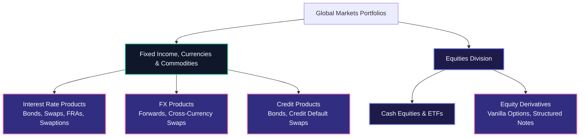
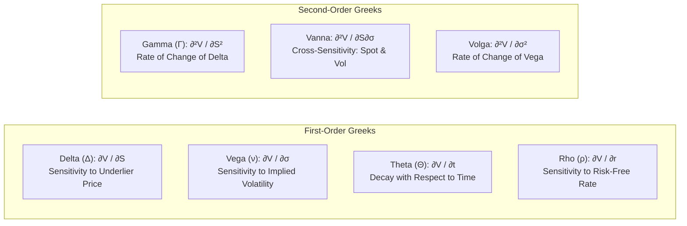
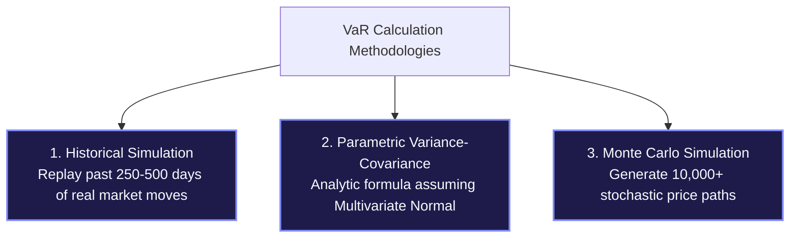
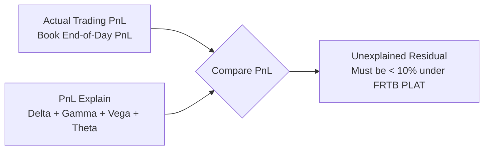

# Market Risk and Financial Domain Mastery: Greeks, VaR, FRTB, and Products

Comprehensive financial engineering reference for technology developers in Global Markets: sensitivities (Greeks), Value at Risk (VaR), Expected Shortfall, PnL attribution, and Basel IV/FRTB regulatory standards.

> [!NOTE]
> **Context**: Technology developers on market risk teams write the calculation pipelines that compute firm-wide risk numbers.
> Interviewers will test whether you understand the mathematics and financial intuition behind the numbers your code calculates.

---

## 1. Financial Products in Global Markets

Market risk aggregates exposure across multiple trading desks:



### Key Instrument Mechanics

1. **Bonds & Yield Curves**:
   - A bond pays periodic coupons plus principal at maturity.
   - Present Value: $PV = \sum_{t=1}^N \frac{C_t}{(1 + y_t)^t} + \frac{M}{(1 + y_N)^N}$
   - **Discount Factor**: $DF(t) = e^{-r(t) \cdot t}$ (translates future cashflow into today's dollar value).

2. **DV01 (Dollar Value of an 01) / PV01**:
   - The monetary change in portfolio value for a 1 basis point (0.01% or 0.0001) parallel shift in the interest rate curve:
     $$DV01 = - \frac{\partial PV}{\partial y} \times 0.0001$$
   - DV01 is the fundamental risk measure for interest rate trading desks.

3. **Interest Rate Swaps (IRS)**:
   - A contractual agreement between two counterparties to exchange interest rate cashflows:
     - **Payer Swap**: Pays fixed rate, receives floating rate (e.g., SOFR).
     - **Receiver Swap**: Receives fixed rate, pays floating rate.
   - At inception, the swap rate is set so the net Present Value equals zero ($PV = 0$).

---

## 2. The Greeks: First- and Second-Order Sensitivities

Greeks represent partial derivatives of portfolio value ($V$) with respect to underlying market variables:



### The Greeks Reference Table

| Greek | Mathematical Definition | Financial Meaning | Typical Sign / Behavior |
| :--- | :--- | :--- | :--- |
| **Delta ($\Delta$)** | $\frac{\partial V}{\partial S}$ | Dollar exposure to a $1 move in underlier spot price | Call: $0 \le \Delta \le 1$, Put: $-1 \le \Delta \le 0$ |
| **Gamma ($\Gamma$)** | $\frac{\partial^2 V}{\partial S^2} = \frac{\partial \Delta}{\partial S}$ | Convexity; how fast Delta changes as spot moves | Always positive ($\Gamma > 0$) for long options |
| **Vega ($\nu$)** | $\frac{\partial V}{\partial \sigma}$ | Dollar change for a 1% (0.01) rise in implied volatility | Always positive ($\nu > 0$) for long options |
| **Theta ($\Theta$)** | $\frac{\partial V}{\partial t}$ | Time decay; dollar loss per day passing holding all else constant | Negative ($\Theta < 0$) for long options |
| **Rho ($\rho$)** | $\frac{\partial V}{\partial r}$ | Dollar change for a 100 bps shift in risk-free interest rate | Positive for calls, negative for puts |
| **Vanna** | $\frac{\partial^2 V}{\partial S \partial \sigma} = \frac{\partial \Delta}{\partial \sigma}$ | Sensitivity of Delta to shifts in volatility | Critical for skew management and FX options |
| **Volga (Vomma)** | $\frac{\partial^2 V}{\partial \sigma^2} = \frac{\partial \nu}{\partial \sigma}$ | Convexity of Vega; exposure to large volatility spikes | Essential for volatility smile and structured notes |

---

## 3. Value at Risk (VaR) and Expected Shortfall (ES)

### Value at Risk (VaR) Defined

Value at Risk measures the maximum expected loss over a given holding period ($T$) at a specified confidence level ($1 - \alpha$):
$$P(L > \text{VaR}_\alpha) = 1 - \alpha$$
For example, a **1-day 99% VaR of $10 million** means: *There is only a 1% probability that the portfolio will lose more than $10 million over the next trading day.*

### The Three Classic VaR Methodologies



| Dimension | Historical Simulation | Parametric (Var-Covar) | Monte Carlo Simulation |
| :--- | :--- | :--- | :--- |
| **Distribution Assumption** | Non-parametric (empirical) | Multivariate Normal Distribution | User-defined (Log-normal, Student-t, Jump-Diffusion) |
| **Fat Tails Captured?** | Yes (inherits past market crashes) | **No** (normal distribution severely underestimates fat tails) | Yes (if fat-tailed stochastic process chosen) |
| **Non-Linear Instruments (Options)** | Accurate via Full Revaluation | Inaccurate (relies on linear Delta-Gamma Taylor approximation) | Highly accurate across path-dependent and exotic derivatives |
| **Computational Cost** | Moderate ($O(N_{\text{trades}} \times N_{\text{scenarios}})$) | Ultra-fast ($O(N_{\text{factors}}^2)$ matrix algebra) | Extremely high ($O(N_{\text{trades}} \times N_{\text{paths}} \times N_{\text{steps}})$) |
| **Key Limitation** | Backward-looking; cannot simulate scenarios never seen in window | Fails in extreme market crises; misses non-linear jump risk | Massive compute grid footprint; random sampling noise |

### Expected Shortfall (CVaR): The Coherent Risk Metric

VaR has a critical mathematical flaw: **it is not subadditive**.
For two portfolios $A$ and $B$, it is possible that:
$$\text{VaR}(A + B) > \text{VaR}(A) + \text{VaR}(B)$$
This violates the fundamental principle that diversification should reduce risk.
Furthermore, VaR is blind to the severity of losses beyond the cutoff threshold.

**Expected Shortfall (ES)** solves this by calculating the **conditional average loss** given that the loss exceeds VaR:
$$ES_\alpha = \mathbb{E}[L \mid L > \text{VaR}_\alpha]$$
Because Expected Shortfall is a **coherent risk measure**, the Basel Committee made ES the official metric under FRTB.

---

## 4. PnL Attribution & Greeks Reconciliation (PnL Explain)

Every morning, Market Risk and Product Control run **PnL Explain** to verify that the desk's actual profit or loss matches the theoretical sensitivity predictions:

$$\Delta \text{PnL}_{\text{theoretical}} \approx \Delta \cdot \Delta S + \frac{1}{2} \Gamma (\Delta S)^2 + \nu \cdot \Delta \sigma + \Theta \cdot \Delta t + \rho \cdot \Delta r$$



- **Delta PnL**: Profit/loss generated by changes in underlier spot prices ($\Delta \cdot \Delta S$).
- **Gamma PnL**: Second-order convexity PnL from large market movements ($\frac{1}{2} \Gamma (\Delta S)^2$).
- **Vega PnL**: PnL driven by shifts in the implied volatility surface ($\nu \cdot \Delta \sigma$).
- **Theta PnL**: Predictable passage of time decay ($\Theta \cdot \Delta t$).
- **Unexplained PnL (Residual)**: Any difference between Actual PnL and Theoretical PnL.
  A large residual indicates missing risk factors, unmodeled cross-gamma, or stale market data.

---

## 5. Regulatory Framework: Basel III/IV and FRTB

### What is FRTB (Fundamental Review of the Trading Book)?

FRTB is the comprehensive Basel reform replacing legacy Basel II.5 market risk capital rules:

1. **Shift from VaR to Expected Shortfall**:
   - Replaced 99% 10-day VaR with **97.5% Expected Shortfall** under stressed market conditions.

2. **Internal Model Approach (IMA) vs Standardized Approach (SBA)**:
   - Banks must qualify each trading desk individually to use their internal models (IMA).
   - Desks that fail model validation are forced onto the punitive **Standardized Approach (SBA)**, requiring significantly higher regulatory capital.

3. **P&L Attribution Test (PLAT)**:
   - Daily statistical test comparing **Hypothetical PnL (HPL)** from front office models with **Risk-Theoretical PnL (RTPL)** generated by the market risk engine.
   - Evaluated using two statistical tests:
     - **Spearman Rank Correlation** (measures directional alignment).
     - **Kolmogorov-Smirnov (KS) Test** (measures distribution divergence).
   - If a desk enters the "Red Zone", it loses internal model approval.

4. **Non-Modellable Risk Factors (NMRF)**:
   - Any risk factor lacking sufficient real, observable market quotes (fewer than 24 observable market prices per year) is classified as NMRF and subjected to conservative capital surcharges.

---

## 6. Worked Example: Python Risk Calculation Engine

Below is a runnable, self-contained Python module computing Parametric VaR, Historical Simulation VaR, Expected Shortfall, and Greek-based PnL Attribution.

```python
"""
market_risk_calculator.py
Production-grade financial risk calculator computing:
- Parametric VaR (Variance-Covariance)
- Historical Simulation VaR
- Expected Shortfall (Conditional VaR)
- PnL Attribution (Explain vs Actual)
"""

from __future__ import annotations
import numpy as np
from dataclasses import dataclass
from typing import List, Tuple


@dataclass(frozen=True)
class RiskReport:
    portfolio_value: float
    parametric_var_99_1d: float
    historical_var_99_1d: float
    expected_shortfall_975_1d: float


def calculate_parametric_var(portfolio_value: float, weights: np.ndarray, cov_matrix: np.ndarray, confidence: float = 0.99) -> float:
    """
    Computes analytical 1-day Parametric VaR under Normal distribution.
    Z-score for 99% confidence = ~2.3263
    """
    portfolio_variance = float(weights.T @ cov_matrix @ weights)
    portfolio_std = np.sqrt(portfolio_variance)

    # Standard normal quantile: 99% -> 2.3263, 95% -> 1.6449
    z_score = 2.3263 if confidence == 0.99 else 1.6449
    dollar_var = portfolio_value * z_score * portfolio_std
    return float(dollar_var)


def calculate_historical_var_and_es(portfolio_value: float, historical_returns: np.ndarray, 
                                    var_confidence: float = 0.99, es_confidence: float = 0.975) -> Tuple[float, float]:
    """
    Computes Historical Simulation VaR and Expected Shortfall using empirical loss distribution.
    """
    # Convert returns to dollar PnL (Loss = negative PnL)
    dollar_pnl = portfolio_value * historical_returns
    losses = -dollar_pnl  # Positive values represent losses

    # VaR is the (confidence * 100)th percentile of loss distribution
    var_threshold = float(np.percentile(losses, var_confidence * 100))

    # Expected Shortfall (CVaR) is the average loss beyond the ES percentile
    es_cutoff = float(np.percentile(losses, es_confidence * 100))
    tail_losses = losses[losses >= es_cutoff]
    expected_shortfall = float(np.mean(tail_losses)) if len(tail_losses) > 0 else var_threshold

    return var_threshold, expected_shortfall


def explain_pnl(delta: float, gamma: float, vega: float, theta: float,
                delta_spot: float, delta_vol: float, delta_days: float, actual_pnl: float) -> dict[str, float]:
    """
    Calculates PnL Attribution (Explain) using Taylor-series Greeks expansion.
    """
    pnl_delta = delta * delta_spot
    pnl_gamma = 0.5 * gamma * (delta_spot ** 2)
    pnl_vega = vega * delta_vol
    pnl_theta = theta * delta_days

    theoretical_pnl = pnl_delta + pnl_gamma + pnl_vega + pnl_theta
    unexplained_residual = actual_pnl - theoretical_pnl

    return {
        "Delta_PnL": pnl_delta,
        "Gamma_PnL": pnl_gamma,
        "Vega_PnL": pnl_vega,
        "Theta_PnL": pnl_theta,
        "Theoretical_PnL": theoretical_pnl,
        "Actual_PnL": actual_pnl,
        "Unexplained_Residual": unexplained_residual,
        "Explained_Ratio": (theoretical_pnl / actual_pnl) if actual_pnl != 0 else 1.0
    }


def run_demonstration():
    print("=== Global Markets Risk Calculator Demonstration ===")

    # 1. Setup Portfolio Parameters ($100M Equities/FICC Book across 3 Assets)
    portfolio_value = 100_000_000.0  # $100 Million
    weights = np.array([0.50, 0.30, 0.20])

    # Daily Asset Volatilities: Asset 1 (1.5%), Asset 2 (1.0%), Asset 3 (2.0%)
    # Annualized ~24%, 16%, 32%
    cov_matrix = np.array([
        [0.015**2, 0.00010, 0.00015],
        [0.00010, 0.010**2, 0.00008],
        [0.00015, 0.00008, 0.020**2]
    ])

    # 2. Compute Parametric VaR
    param_var_99 = calculate_parametric_var(portfolio_value, weights, cov_matrix, confidence=0.99)

    # 3. Simulate 500 Historical Days of Empirical Returns (with fat-tailed student-t shock)
    np.random.seed(42)
    synthetic_historical_returns = np.random.standard_t(df=4, size=500) * 0.012

    # Compute Historical VaR & Expected Shortfall (FRTB standard: 97.5% ES)
    hist_var_99, hist_es_975 = calculate_historical_var_and_es(
        portfolio_value, synthetic_historical_returns, var_confidence=0.99, es_confidence=0.975
    )

    print(f"Portfolio Value:                  ${portfolio_value:,.2f}")
    print(f"1-Day 99.0% Parametric VaR:       ${param_var_99:,.2f}")
    print(f"1-Day 99.0% Historical VaR:       ${hist_var_99:,.2f}")
    print(f"1-Day 97.5% Expected Shortfall:   ${hist_es_975:,.2f} (FRTB Standard)")

    # 4. Run PnL Explain on a Trading Desk
    print("\n--- PnL Attribution (Greeks Reconciliation) ---")
    desk_delta = 250_000.0   # $250k per $1 underlier move
    desk_gamma = 15_000.0    # Second-order convexity
    desk_vega  = 50_000.0    # $50k per 1 vol point
    desk_theta = -10_000.0   # -$10k time decay per day

    # Observed Market Shock
    spot_move = 2.50         # Spot up $2.50
    vol_move = -0.015        # Vol down 1.5% (-1.5 vol points)
    days_elapsed = 1.0       # 1 trading day
    actual_desk_pnl = 575_000.0  # Actual trading desk profit reported by broker

    attribution = explain_pnl(
        delta=desk_delta, gamma=desk_gamma, vega=desk_vega, theta=desk_theta,
        delta_spot=spot_move, delta_vol=vol_move, delta_days=days_elapsed, actual_pnl=actual_desk_pnl
    )

    for k, v in attribution.items():
        if "Ratio" in k:
            print(f"{k:25s}: {v*100:.2f}%")
        else:
            print(f"{k:25s}: ${v:,.2f}")


if __name__ == "__main__":
    run_demonstration()
```

---

## 7. High-Yield Domain Interview Questions

### Q1: Why did the Basel Committee replace Value at Risk (VaR) with Expected Shortfall (ES) in FRTB?
- **Spoken Answer**:
  "VaR has two fatal weaknesses that were exposed during the 2008 financial crisis: first, it is not a coherent risk measure because it violates subadditivity, meaning a diversified portfolio can paradoxically produce a higher VaR than the sum of its parts.
  Second, VaR tells you nothing about the severity of losses beyond the cutoff threshold; it only tells you the probability of crossing it.
  Expected Shortfall (or Conditional VaR) measures the expected average loss in the extreme tail beyond the 97.5% threshold, ensuring capital reserves adequately cover catastrophic tail shocks."

### Q2: What is the P&L Attribution Test (PLAT) in FRTB, and what happens if a desk fails?
- **Spoken Answer**:
  "PLAT is the daily regulatory test that assesses whether a trading desk's front-office pricing model aligns with the risk engine's theoretical valuation model.
  It measures the difference between Hypothetical PnL (from front-office trading systems) and Risk-Theoretical PnL (from the risk engine) using Spearman correlation and the Kolmogorov-Smirnov distribution test.
  If a desk repeatedly fails the test and enters the Red Zone, it loses approval to use the Internal Model Approach (IMA) and is demoted to the Standardized Approach (SBA), which drastically increases the desk's regulatory capital charge."

### Q3: What is the difference between Delta, Gamma, and Vega hedging?
- **Spoken Answer**:
  "Delta hedging neutralizes directional price risk by trading the underlying asset so net $\Delta = 0$; however, Delta changes continuously as the underlier moves due to Gamma.
  Gamma hedging neutralizes that second-order risk by trading options to make net $\Gamma = 0$, reducing how frequently the trader must rebalance Delta.
  Vega hedging neutralizes exposure to shifts in implied volatility by trading options or volatility swaps so net $\nu = 0$.
  While linear assets like stocks or futures can hedge Delta, you must trade non-linear derivatives (options) to hedge Gamma and Vega."
