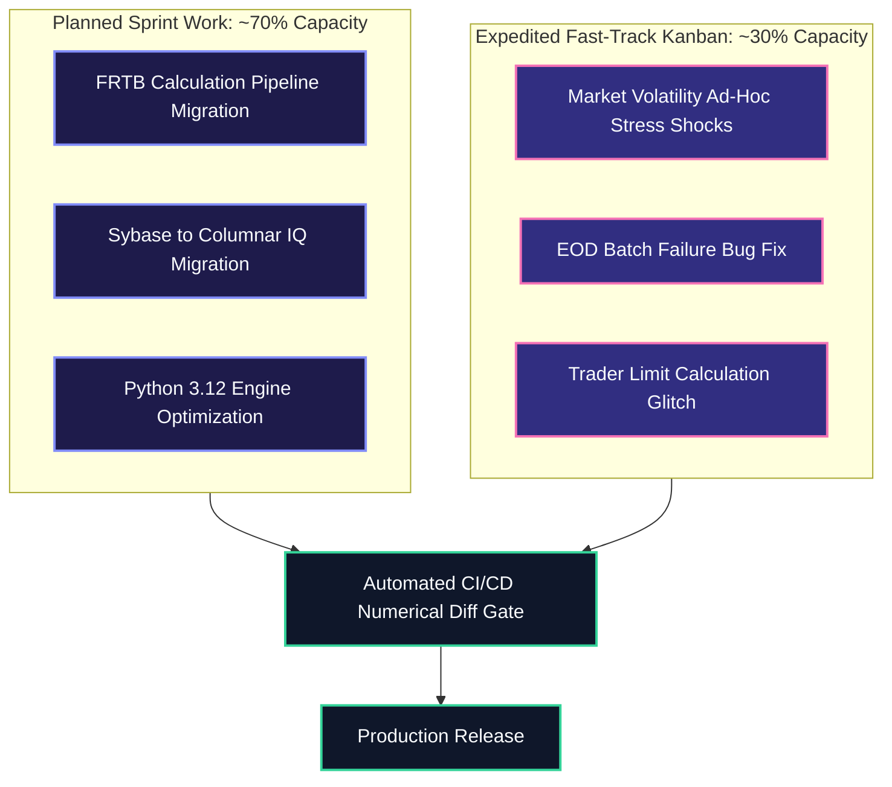
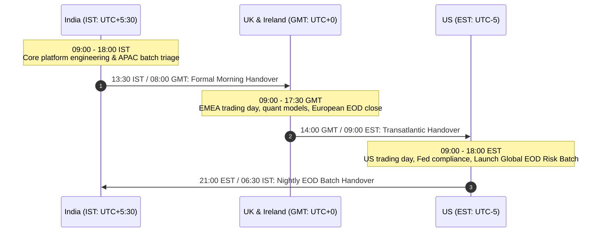
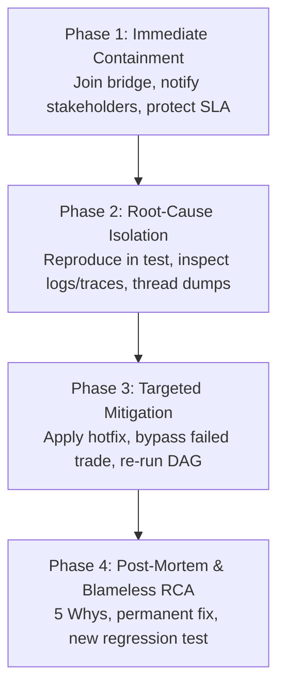

# Agile Development in High-Pressure Global Markets Risk Environments

Operational playbook for agile software delivery, 24/7 cross-region collaboration across Ireland, the UK, India, and the US, and high-stakes production incident triage.

> [!NOTE]
> **Context**: Global Markets environments operate under intense pressure.
> Missing an End-of-Day risk batch deadline can result in multi-million-dollar regulatory fines, inaccurate capital allocations, and trading halts.
> Demonstrating agile discipline and calm incident leadership is what separates senior engineers from junior coders.

---

## 1. Adapting Agile for Global Markets: The Scrumban Model

Textbook two-week Scrum sprints often struggle on financial trading desks because market shocks and regulatory audit demands cannot wait for sprint planning.
Top-tier risk technology teams utilize a **Scrumban** framework:

### Core Tenets of Financial Scrumban

1. **Capacity Splitting (70/30 Rule)**:
   - 70% of team story points are dedicated to planned multi-sprint strategic architecture (e.g., FRTB models, grid performance).
   - 30% buffer capacity is reserved for unplanned operational interrupts, ad-hoc regulatory audits, and front-office desk requests.

2. **Daily Standup Across Timezones**:
   - Time-boxed to 15 minutes.
   - Structured around: *What was deployed yesterday, what is blocking the active batch, and what is being handed over to the next regional hub.*

3. **Definition of Done (DoD) in Market Risk**:
   - Code is clean, typed, and unit-tested ($> 85\%$ coverage).
   - Numerical regression test passes: zero variance in official Greeks above the epsilon threshold ($| \Delta \text{Greeks} | < 10^{-5}$).
   - Peer reviewed by at least one quantitative analyst or senior risk developer.
   - Runbook updated for overnight support teams in India and Ireland.

---

## 2. The 24/7 Follow-the-Sun Global Collaboration Model

Developing software across **Ireland (Dublin/Chester)**, the **UK (London)**, **India (Mumbai/Hyderabad/Chennai)**, and the **US (New York/Charlotte)** requires strict operational handovers:

### Best Practices for Multi-Region Engineering Teams

1. **Asynchronous Documentation by Default**:
   - Zero reliance on oral consensus or transient chat messages.
   - Every architectural decision is recorded in an Architecture Decision Record (ADR) in the repository.
   - Every production deployment includes a standardized Git commit tag, Jira ticket linkage, and rollback command.

2. **Standardized Handover Checklist**:
   - Current health of the calculation grid (active nodes, queued tasks, memory saturation).
   - Status of market data curve feeds (any missing fixings or stale swap curves).
   - List of active P1/P2 tickets and hotfixes deployed in the prior 12 hours.

3. **Branching & Feature Flag Governance**:
   - Use trunk-based development with short-lived feature branches ($< 2$ days).
   - All high-impact risk calculation changes are protected behind dynamic runtime feature flags.
   - Enables "Dark Launching": running new calculation logic in shadow mode on production grid inputs without exposing numbers to downstream regulatory reports until verified.

---

## 3. High-Pressure Incident Management Playbook

When an End-of-Day risk run fails or a trading desk PnL calculation breaks, panic is fatal.
Senior engineers execute a calm, standardized four-phase triage protocol:

### Severity Levels in Banking

- **Severity 0 (P0 - Catastrophic)**: Global risk batch frozen; Federal Reserve or PRA reporting deadline at imminent risk; trading desk completely blinded to market exposure.
- **Severity 1 (P1 - Critical)**: Major asset class risk missing; single desk limit monitoring broken; significant calculation discrepancy in multi-million dollar portfolios.
- **Severity 2 (P2 - Major)**: Sub-optimal grid performance; minor batch delay with no SLA breach; non-critical report generation failed.

### The 4-Phase Incident Response Procedure

#### Phase 1: Immediate Containment
- Join the active incident conference bridge.
- Notify the Incident Commander, Market Risk Duty Officer, and Desk Leads with an initial assessment: *What failed, what is impacted, and the target ETA for the next update.*
- Protect the calculation audit trail: snapshot logs, thread dumps, and database lock state before killing processes.

#### Phase 2: Root-Cause Isolation
- Identify the exact failure point in the DAG: Did the job crash on market data ingestion, curve bootstrapping, trade valuation, or database insertion?
- Check system telemetry: Memory exhaustion (OOM killer), database deadlocks, connection pool depletion, or CPU starvation on grid workers.

#### Phase 3: Targeted Mitigation
- If a single malformed trade or bad market data fixing broke the batch:
  - Quarantine the bad trade into an exception queue.
  - Re-run the batch for the remaining 99.99% of the portfolio to meet the regulatory cutoff.
  - Rerun the isolated trade through an offline debugger.
- If a database query plan regressed, inject an explicit optimizer hint or index seek.

#### Phase 4: Blameless Post-Mortem & Root Cause Analysis (RCA)
- Hold a blameless post-mortem within 48 hours.
- Perform a **5 Whys Analysis** to find organizational and systemic root causes.
- Convert findings into mandatory engineering tickets:
  - Add an automated regression test reproducing the failure.
  - Add circuit breakers or input validation decorators.
  - Update runbooks and alerting thresholds.

---

## 4. Release Governance and Change Freezes

Financial institutions enforce strict operational freezes to prevent self-inflicted trading outages:

| Freeze Period | Timing | Policy |
| :--- | :--- | :--- |
| **Triple / Quadruple Witching** | Third Friday of March, June, September, December | Hard code freeze across all derivatives and trading systems |
| **FOMC / Central Bank Announcements** | Federal Reserve rate decision days | Zero deployments 2 hours prior and 2 hours after announcement |
| **Quarter-End / Year-End Regulatory Freeze** | Last 2 weeks of December, quarter close days | Strict emergency-only hotfix policy requiring Chief Technology Officer (CTO) sign-off |

---

## 5. Behavioral Scenarios & Frameworks for the Interview

### Framework 1: Handling Disagreement with Quantitative Researchers or Traders
- **The Challenge**: A desk trader insists that the risk engine is calculating excessive Delta on an exotic structured swap, causing their desk to breach risk limits.
- **The Approach**:
  1. *De-escalate*: Never argue verbally; point to verifiable mathematical data and inputs.
  2. *Isolate Inputs*: Replicate the valuation in a standalone Jupyter notebook using the exact market data snapshot from the trade timestamp.
  3. *Deconstruct*: Break down the DAG nodes: verify curve bootstrapping, discount factors, and volatility skew interpolation.
  4. *Collaborate*: If an input fixing was erroneous, correct the market data feed.
     If the model is mathematically correct, walk the trader through the second-order cross-gamma effects explaining the sensitivity spike.

### Framework 2: Delivering Under Severe Time Pressure
- **Key Message to Convey**:
  "Under pressure, speed without rigor creates bigger disasters.
  My philosophy is to prioritize containment first (meeting the regulatory SLA), isolation second, and permanent remediation third.
  I maintain clear, factual communication on incident bridges and never guess - if I need 10 minutes to analyze a core dump, I communicate that timeline explicitly so stakeholders can manage desk expectations."
