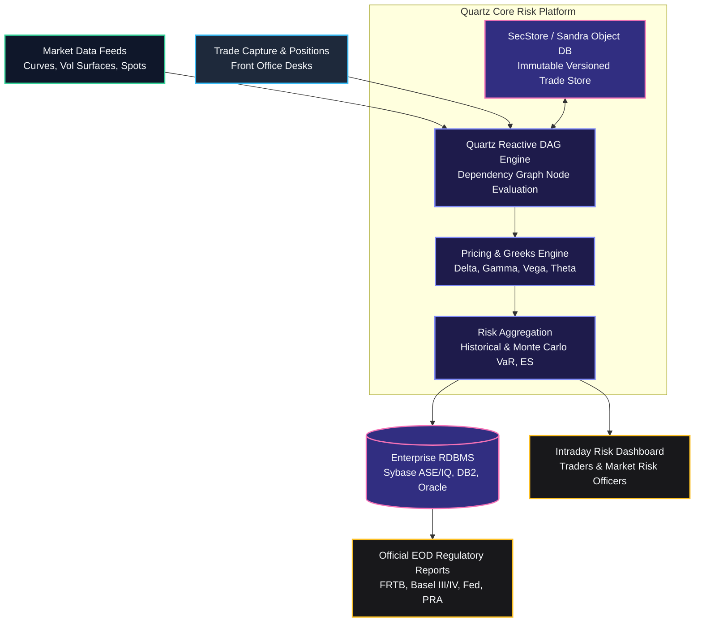
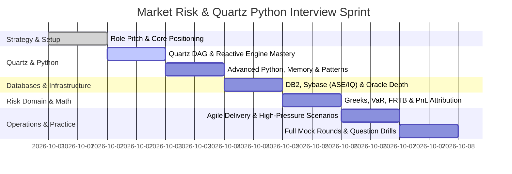

# Market Risk Technology (Quartz & Python) Interview Preparation Pack

Targeted preparation curriculum for senior Python engineers entering the Market Risk Technology space within Global Markets.
This pack addresses the exact requirements for cross-asset risk platforms (such as Bank of America Quartz, Goldman Sachs SecDB, and J.P. Morgan Athena), focusing on reactive dependency graphs, enterprise relational databases (DB2, Sybase, Oracle), object-oriented design patterns, market risk metrics, and high-pressure agile delivery.

> [!IMPORTANT]
> **Role Profile Summary**:
> - **Primary Skill**: Python (5+ years hands-on, advanced OOP, internals, memory management, concurrency).
> - **Secondary Skill**: Quartz platform experience (reactive dependency graph DAG, object database, pricing pipelines).
> - **Database Development**: DB2, Sybase (ASE and IQ), Oracle (indexing, query execution plans, transactions, locking, partitioning).
> - **Domain Knowledge**: Market Risk, Greeks (Delta, Gamma, Vega), VaR (Historical, Parametric, Monte Carlo), Expected Shortfall, FRTB, Basel III/IV.
> - **Delivery Context**: High-pressure global trading floor environment, distributed teams (Ireland, UK, India, US), Agile/Scrum.

---

## Obsidian Interactive Dashboard

### Preparation Modules Status

```dataview
TABLE file.link AS "Module", type AS "Type", level AS "Level", status AS "Status", last_reviewed AS "Reviewed"
FROM "06-Interview-Prep/04-Market-Risk-Quartz-Python"
WHERE file.name != "README"
SORT file.name ASC
```

### Readiness Checklist

- [ ] Rehearse the 2-minute elevator pitch highlighting Quartz, Python 3 migration, and EOD batch delivery.
- [ ] Understand the Quartz reactive dependency graph (DAG) architecture, memoization, and cache invalidation mechanics.
- [ ] Implement a mock reactive DAG engine in pure Python with topological sorting.
- [ ] Master Python internals: CPython memory arenas, garbage collection cycles, descriptors, metaclasses, and the GIL.
- [ ] Explain GoF design patterns (Strategy, Factory, Observer, Decorator) applied to financial instrument pricing.
- [ ] Differentiate Sybase ASE (row-store OLTP) versus Sybase IQ (columnar analytics), DB2, and Oracle.
- [ ] Deep-dive database internals: B-Tree indexing, execution plan analysis, isolation levels, and lock escalation.
- [ ] Calculate Delta, Gamma, Vega, Theta, Rho and explain the PnL Attribution (Explain) formula.
- [ ] Compare Historical, Parametric, and Monte Carlo VaR, including Expected Shortfall and FRTB regulations.
- [ ] Prepare 5 STAR behavioral stories for high-pressure trading floor production incidents and global collaboration.
- [ ] Review all 50+ questions in the curated Question Bank.

---

## Curriculum Structure

| # | Document | Primary Focus | Critical Topics |
| :--- | :--- | :--- | :--- |
| 1 | [[01-Role-Overview-and-Pitch\|Role Overview & Pitch]] | Strategic Framing | Global Markets structure, FICC vs Equities risk, 2-minute pitch, STAR incident stories |
| 2 | [[02-Quartz-Architecture-and-Ecosystem\|Quartz Architecture]] | System Architecture | Reactive DAG, Sandra/SecStore object store, memoization, cache invalidation, runnable DAG engine |
| 3 | [[03-Python-Advanced-and-OOP-Design-Patterns\|Python Advanced & OOP Patterns]] | Language Depth | CPython internals, GC, descriptors, GIL, Strategy, Factory, Observer, Decorator, runnable engine |
| 4 | [[04-Enterprise-Databases-DB2-Sybase-Oracle\|Enterprise Databases]] | Data Engineering | DB2, Sybase ASE/IQ, Oracle, B-Tree indexes, execution plans, ACID isolation, lock escalation |
| 5 | [[05-Market-Risk-and-Financial-Domain-Mastery\|Market Risk & Financial Domain]] | Quantitative Domain | Greeks, Historical/Parametric/Monte Carlo VaR, Expected Shortfall, PnL attribution, FRTB, Basel IV |
| 6 | [[06-Agile-Global-Collaboration-and-High-Pressure\|Agile & Global Collaboration]] | Delivery & Operations | EOD batch SLAs, trading floor incident triage, US-UK-India-Ireland handover, change freezes |
| 7 | [[07-Interview-Question-Bank-and-Mock-Rounds\|Interview Question Bank]] | Execution & Drills | 50+ curated questions with spoken answers, deep-dive points, traps, and 3 mock rounds |

---

## Architecture Visual Overview



---

## Cross-Vault Integrations

This module directly interfaces with existing vault knowledge bases:
- [[02-Programming-Languages/Python/Python-Backend-Interview-Prep/01-Pitch-and-Resume\|Python Backend Pitch & Resume]]: Base elevator pitch and career history.
- [[02-Programming-Languages/Python/Python-Backend-Interview-Prep/02-Python-Core\|Python Core Knowledge]]: Python language fundamentals and tricky syntax edge cases.
- [[02-Programming-Languages/Python/Python-Backend-Interview-Prep/14-Concurrency-Fundamentals-and-Threading\|Concurrency & GIL]]: Multithreading and GIL mechanics.
- [[01-CS-Foundations/DBMS/dbms_complete_reference\|DBMS Complete Reference]]: General database theory and relational design.
- [[05-Quantitative-Finance/README\|Quantitative Finance Roadmap]]: Core mathematical finance foundations.
- [[05-Quantitative-Finance/01-Mathematics/README\|Mathematics & Option Pricing]]: Black-Scholes and Monte Carlo implementations.
- [[16-Interview-Command-Center/01-Roles/Quant-Dev/_Hub\|Quant Dev Role Hub]]: General Quant Developer skill matrix and study plan.
- [[06-Interview-Prep/01-Behavioral/star_method\|Behavioral STAR Method]]: Framework for articulating behavioral scenarios.

---

## 7-Day Sprint Study Plan



---

## Visual Canvas

An interactive visual mental model of this curriculum is available at [[06-Interview-Prep/04-Market-Risk-Quartz-Python/Market-Risk-Prep-Canvas.canvas\|Market-Risk-Prep-Canvas]].
It maps the interplay between the reactive graph nodes, data ingestion pipelines, relational storage schemas, and risk metric calculations.
