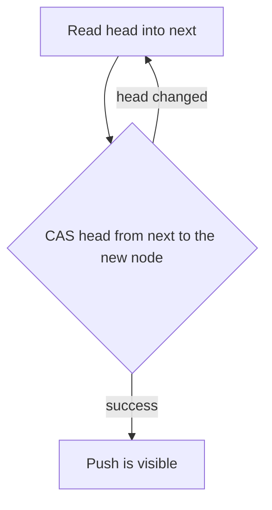
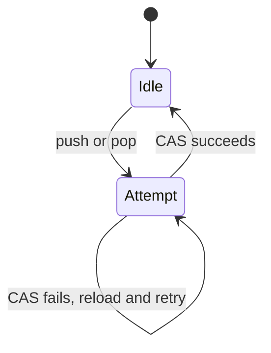

# Lock-Free Stack

## TL;DR

A lock-free stack lets many threads push and pop without a mutex.
The Treiber stack does it by swinging an atomic head pointer with compare-and-swap.
The lab in [[lock_free_stack.cpp]] is that algorithm and nothing else.
It leaks nodes, and it is exposed to the ABA problem, because it never retires a pointer safely.

## Mental Model

Two threads read the same head.
Each builds a new node that points at that head.
Only one compare-and-swap succeeds.
The loser reloads the new head and tries again.
No thread waits on a lock.
A thread that is scheduled out mid-update does not stop the others.

## How It Works

`push` allocates a node, stores the current head in `node->next`, then calls `compare_exchange_weak` on `head`.
The weak form may fail spuriously, so the loop is required even on one thread.
The success order in the lab is `memory_order_release`, so the writes that filled the node become visible to a thread that later acquires the head.
The failure order is `memory_order_relaxed`, because the failed CAS only tells you to try again.

`pop` reads the head, reads `head->next`, and swings `head` forward.
The value in the detached node is the result.
A correct pop also has to guarantee that no other thread still treats that node as the head.

The linearization point is the successful CAS.
Everything before it is a private guess.
Everything after it is shared history.

## Trade-offs and When to Use

A mutex stack is the right default until a profiler shows the lock in the tail.
A lock-free stack wins when the critical section is a pointer swing and the holders would otherwise bounce a cache line.
It loses when the payload work dominates, or when you need blocking wait, fairness, or a simple lifetime story.

The stack is not wait-free.
One thread can theoretically retry forever if others keep winning the CAS.
It is lock-free: some thread makes progress on every attempt.

## Failure Modes and Pitfalls

> [!warning] ABA
> Thread A reads head `N`.
> Thread B pops `N`, pops the next node, and pushes `N` back at the same address.
> A's CAS still sees `N` and succeeds, and the stack now points at a node A thought was the successor.
> The lab has no version tag and no hazard pointer, so this window is open.

> [!warning] Reclamation
> `pop` in the lab never deletes the node, which hides the use-after-free.
> Deleting it immediately is worse: another thread may still be reading `next`.
> Production code uses hazard pointers, epoch reclamation, or an allocator that does not recycle an address while a reader might hold it.

> [!warning] The lab is not a concurrent queue
> A stack reverses order and has a single hot head.
> A bounded SPSC ring is the usual low-latency structure, and it avoids both ABA and allocation on the hot path.
> See [[Concurrency-Synchronization-and-CAS]] for the CAS rules this stack depends on.

`compare_exchange_weak` on a contended head also thrashes the cache line that holds `head`.
Lock-free does not mean uncontended.

## Hands-On

Build and run [[lock_free_stack.cpp]].
Then answer these from the source, without adding features yet:

1. Which argument of `compare_exchange_weak` is overwritten on failure, and why does `push` rely on that?
2. What breaks if `pop` deletes the node before the CAS?
3. Where would a stamp or a hazard pointer have to sit to close the ABA window?

## Interview Questions

> [!question] What does lock-free mean here?
>
> > [!success]- Answer
> > Some thread completes an operation in a finite number of its own steps, even if other threads are suspended.
> > It does not mean every thread finishes, and it does not mean the operation is a single instruction.

> [!question] Why is release on success and relaxed on failure?
>
> > [!success]- Answer
> > The successful CAS publishes the node.
> > Readers that synchronize with that head must see the node's fields.
> > A failed CAS publishes nothing, so it does not need a heavier order.

> [!question] When would you refuse this design in a matching engine?
>
> > [!success]- Answer
> > When the hot path must not allocate, must not retry on a shared head, or must bound the worst-case attempt.
> > A preallocated SPSC ring with cached indexes is the usual replacement.

## Related

- [[Concurrency-Synchronization-and-CAS]]
- [[false_sharing.cpp]]
- [[Raft-Consensus]]

## Further Reading

- Treiber's 1986 IBM report is the original stack.
- Herlihy and Shavit cover linearizability, ABA, and safe reclamation in one place.
- The C++ memory model notes in the low-latency programming module are the orderings this CAS uses.
