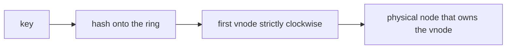
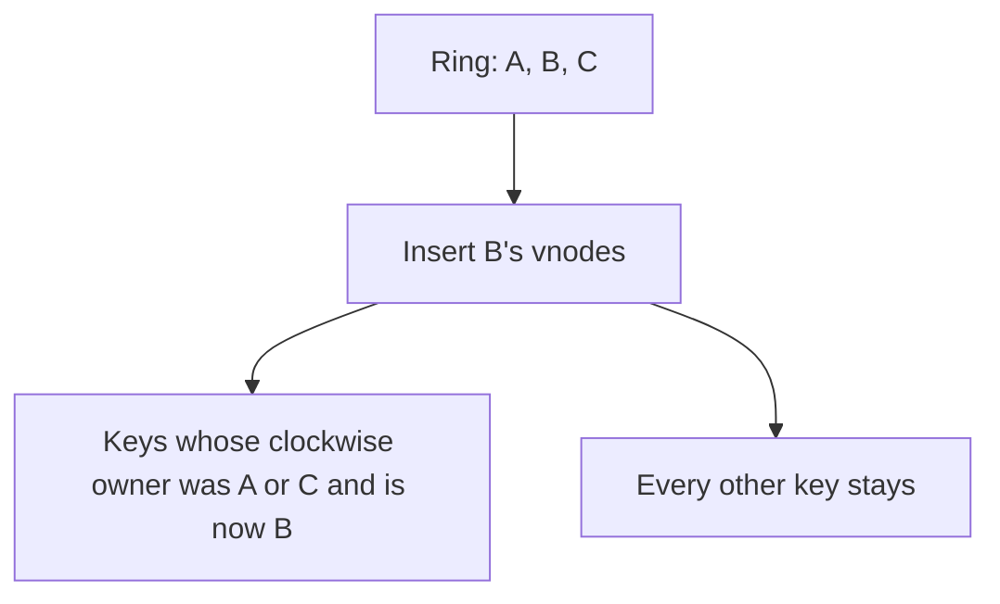

# Consistent Hash Ring

## TL;DR

A hash ring maps both keys and nodes onto one circle and assigns each key to the next node clockwise.
Adding a node moves only the keys on the arc that node takes over.
Virtual nodes spread a physical machine around the ring so the arcs stay close in size.
The lab in [[consistent_hashing.py]] is that ring: MD5, a sorted key list, and binary search.
[[Consistent-Hashing]] is the concept note with the interview framing.
This page is the picture of the lab.

## Mental Model

Hash the key.
Walk clockwise to the first vnode strictly after that point.
That vnode's physical owner stores the key.
Remove the owner and the same walk lands on the next vnode.
Keys that lived on other arcs do not move.

With three replicas in the lab, each physical node places three points.
`_hash` is MD5 interpreted as an integer.
`bisect_right` finds the first point strictly greater than the key hash, and the search wraps to index 0 at the end of the circle.
A key whose hash lands exactly on a vnode belongs to the next vnode, which matches `upper_bound`.

## How It Works

`add_node("A")` inserts hashes of `A:0`, `A:1`, and `A:2`.
`get_node(key)` hashes the key and returns the owner of the first ring point strictly greater than that hash.
`remove_node` deletes those three points.
The next `get_node` for a key that used to hit one of them returns the following owner.

The fraction of keys that move when you add one physical node is about `1/n` if the vnodes are balanced, where `n` is the number of physical nodes after the add.
A modulo hash of `hash(key) % n` moves most keys when `n` changes.
That is the contrast to draw in an interview.
The ring exists so membership changes do not reshuffle the whole dataset.

## Trade-offs and When to Use

Use a ring when nodes come and go and you want a stable owner for each key: caches, Dynamo-style stores, and some load-balancer backends.
Cassandra's partitioner is this idea with a different hash and with token assignment as an explicit operator choice.

The lab's MD5 ring is not a production partitioner.
MD5 is fine as a mixer here and is the wrong tool if you needed a cryptographic commitment.
Balance depends on vnode count.
Three replicas, as in the lab, leave visible imbalance on a small cluster.
Production rings use tens or hundreds of vnodes, or they abandon random tokens and assign ranges explicitly.

Replication is a second walk around the ring.
The preference list is the next distinct physical nodes clockwise, skipping further vnodes of a node you already picked.
The lab returns one owner and does not build that list.

## Failure Modes and Pitfalls

> [!warning] Vnodes of the same machine are not replicas
> Hitting `A:1` and then `A:2` is still one machine.
> A replica set has to skip ahead to a different physical node.
> Forgetting the skip copies data onto the same disk twice and calls it durable.

> [!warning] The ring does not move bytes
> `add_node` only changes the lookup.
> Existing keys stay where they were written until a streaming or repair job copies them.
> Reads that trust the new owner before the copy finish will miss.

> [!warning] Hot keys ignore a balanced ring
> One key that is half your traffic always lands on one owner.
> Vnodes spread cold keys.
> They do not split a single hot key.
> That split is a different design: an application-level shard, or a cache in front.

## Hands-On

Run [[consistent_hashing.py]].
Add a fourth node and print `get_node` for a fixed list of keys before and after.
Count how many owners changed.
Then set `replicas=1` and repeat.
The move count should stay near `1/n`, and the per-node counts should get lumpier.

## Interview Questions

> [!question] What moves when a node joins?
>
> > [!success]- Answer
> > Only the keys whose clockwise successor is one of the new vnodes.
> > In a balanced ring that is about one nth of the keys.
> > A modulo map moves almost all of them.

> [!question] Why virtual nodes?
>
> > [!success]- Answer
> > One random point per machine makes unlucky arcs.
> > Many points per machine turn the load into an average of many small arcs.
> > They also let a bigger machine own more points.

> [!question] How do you place replicas without double-booking a host?
>
> > [!success]- Answer
> > Walk clockwise and take the next physical nodes, skipping extra vnodes of a node already chosen.
> > Stop at the replication factor.

## Related

- [[Consistent-Hashing]]
- [[Partitioning-and-Sharding]]
- [[Apache-Cassandra]]
- [[Load-Balancing]]

## Further Reading

- Karger and others, STOC 1997, define the ring and the movement bound.
- The Dynamo paper, SOSP 2007, is the systems version: vnodes, preference lists, and sloppy quorums.
- [[Consistent-Hashing]] carries the longer interview treatment.
