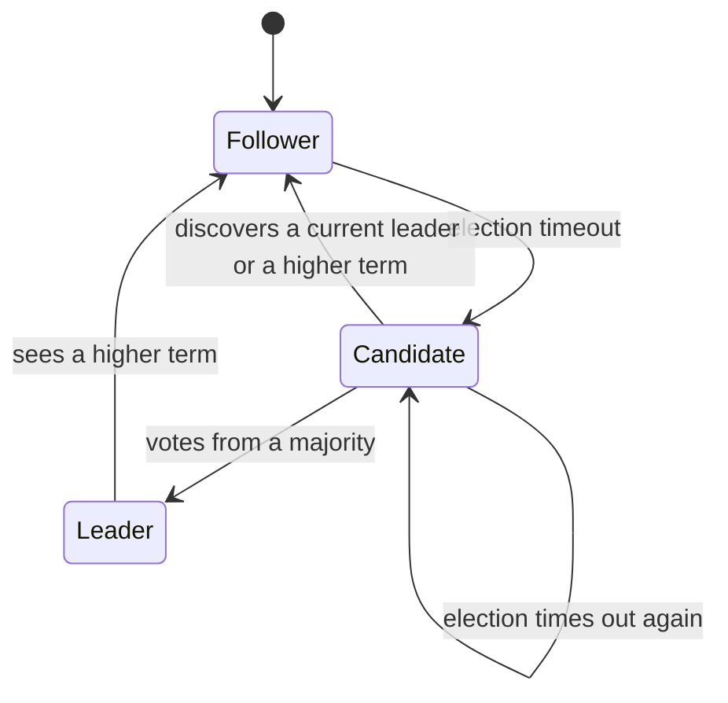
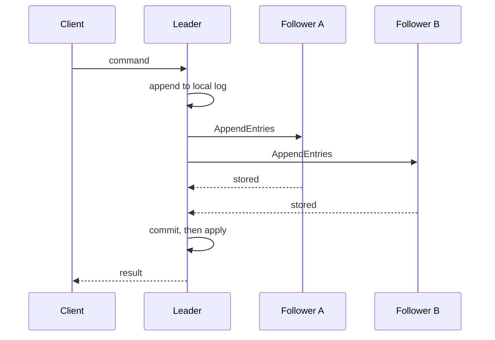

# Raft Consensus

## TL;DR

Raft keeps a replicated log that a majority agrees on.
One leader accepts writes, replicates them, and commits an entry only after a majority has stored it.
Followers become candidates when they stop hearing heartbeats.
The lab in [[raft_consensus.py]] shows the roles, the vote, and a happy-path append.
It does not persist the log, check `prevLogIndex`, or handle membership changes.

## Mental Model

Time is divided into terms.
Each term has at most one leader.
A node is a follower, a candidate, or a leader.
Clients talk only to the leader.
The log is the state machine's input.
If two nodes have committed an entry at a given index, that entry is the same command.

## How It Works

A follower expects an AppendEntries heartbeat inside its election timeout.
If none arrives, it increments the term, votes for itself, and asks the others for a vote.
A voter grants the vote only when the candidate's term is current and the candidate's log is at least as new as the voter's.
"At least as new" means a higher last term, or the same last term and an equal or greater length.
The first candidate to collect a majority becomes leader and begins sending heartbeats.

The leader tracks, for each follower, the next index to send.
AppendEntries carries the term, the leader id, the previous log index and term, the entries, and the leader's commit index.
A follower rejects the call when the previous entry does not match.
The leader then walks backward and retries.
That check is how Raft repairs a divergent log.
The lab skips it and appends whatever it is given.

An entry is committed when it is stored on a majority and it is from the current term.
The leader applies committed entries to the state machine in order and tells followers the new commit index on the next heartbeat.
A leader never commits an entry from an older term by counting replicas alone.
Raft's Figure 8 is that bug.
The fix is the current-term rule.

## Trade-offs and When to Use

Raft is the default replicated log when you want a primary, a total order, and an explanation you can put on a whiteboard.
etcd, Consul, CockroachDB, and TiKV use it for metadata or for the transaction log.
It is the wrong tool for a nanosecond matching path.
A single sequencer plus a downstream replicated journal is the usual exchange shape.
See [[Replicated State Machine Pattern in Exchanges]].

Majority quorum means a cluster of 5 stays available through 2 failures, and a cluster of 3 through 1.
Writes wait for disk on a majority, so the commit latency is the slowest of that majority, not the mean of the cluster.

## Failure Modes and Pitfalls

> [!warning] The lab will elect a leader that a real cluster would reject
> `receive_request_vote` implements the log-freshness check.
> The simulation calls it with `last_log_idx = -1` and `last_log_term = 0` on empty logs, which happens to pass.
> Nothing persists `term` or `votedFor`.
> A restart would forget both and could vote twice in one term.

> [!warning] Split vote
> Two candidates can each collect a minority.
> The term ends with no leader.
> Randomized election timeouts make a repeat collision unlikely.
> The lab uses no timers, so it cannot show this.

> [!warning] Committing an old-term entry by replication count
> A leader can be deposed after replicating an entry that a later leader overwrites.
> Counting replicas of an old-term entry can commit two different commands at the same index.
> Only an entry from the current term may be committed directly.
> Older entries in front of it commit along with it.

Network partitions do not create two leaders in the same term.
They do stall commits on the side that lacks a majority.
That is the CP choice in [[CAP-Theorem-and-PACELC]].

## Hands-On

Run [[raft_consensus.py]] and watch node 1 become leader and replicate `SET X=5`.
Then change the simulation so node 2 starts an election at a higher term before the append.
The existing `receive_append_entries` steps the old leader down only when it sees that higher term.
Confirm the old leader stops treating itself as leader before it appends.

## Interview Questions

> [!question] Why can a term have no leader?
>
> > [!success]- Answer
> > An election can split the votes.
> > The candidates time out, increment the term, and try again.
> > Safety does not require every term to have a leader.
> > It requires that a term never have two.

> [!question] Why must a voter compare logs, not just terms?
>
> > [!success]- Answer
> > A candidate with a stale log must not win, or committed entries could be overwritten.
> > The voter grants the vote only when the candidate's last entry is at least as new as its own.

> [!question] Where is the commit point?
>
> > [!success]- Answer
> > On the leader, once a current-term entry is stored on a majority.
> > Followers learn that index from later AppendEntries calls.
> > A follower does not commit because it has stored the entry locally.

## Related

- [[Apache-ZooKeeper]]
- [[CockroachDB-Distributed-SQL]]
- [[CAP-Theorem-and-PACELC]]
- [[Replicated State Machine Pattern in Exchanges]]

## Further Reading

- Ongaro and Ousterhout, USENIX ATC 2014, is the paper to read, including the membership-change section the lab omits.
- Ongaro's dissertation expands the same algorithm with the figures interviews expect.
- The etcd Raft library is a production reading of those rules.
