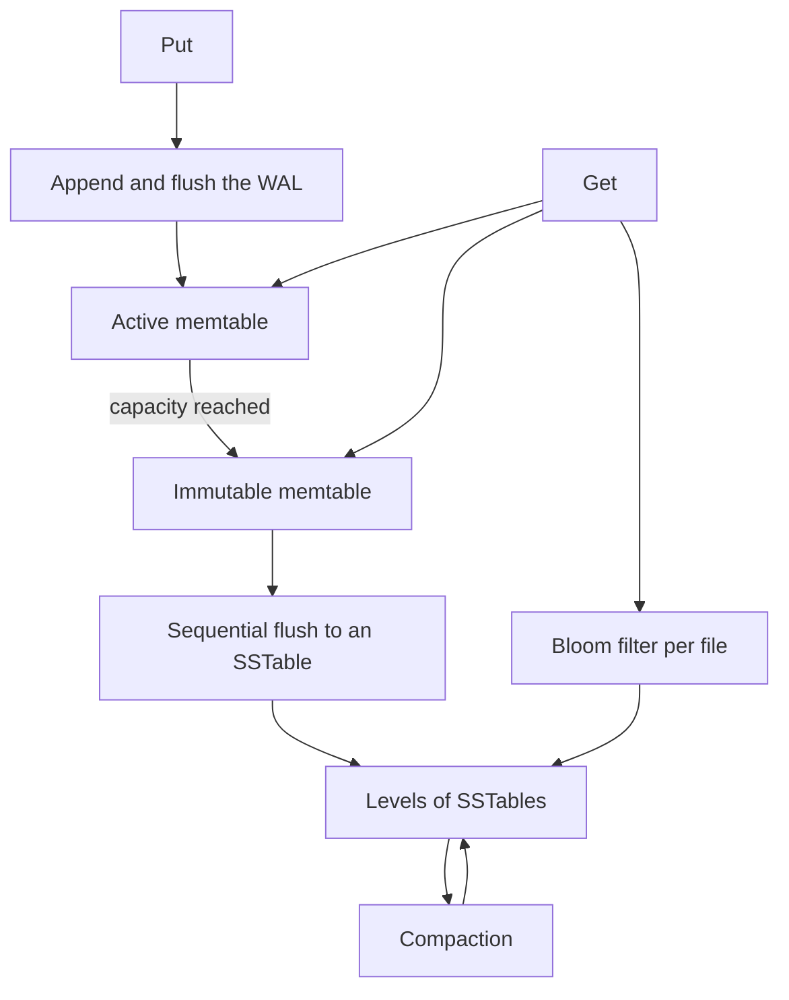

# LSM Tree

## TL;DR

An LSM tree turns random updates into sequential writes.
A put appends a [[Write-Ahead-Log]], then lands in an in-memory sorted table.
When that table fills, it is frozen and flushed as an immutable sorted file.
Reads check memory first, then the files from newest to oldest.
Compaction merges those files so a key does not stay duplicated forever.
The lab in [[lsm_tree.cpp]] is only the memtable and the flush.
The picture below is the rest of the engine.

## Mental Model

The memtable in the lab is a `std::map`.
That gives ordered flush and a simple point read.
A production memtable is usually a skiplist or a similar structure that allows concurrent readers during a write.
The flush in the lab prints rows.
A real flush writes a sorted string table, an index, and a bloom filter, then can drop the matching WAL segment.

## How It Works

A write is two steps, in this order.
The WAL record hits disk first.
Then the memtable takes the key.
A crash before the memtable update is recovered by replaying the log.
A crash after both is a replay that overwrites the same key, which is harmless if the record is idempotent.

When `size_bytes` crosses the lab's tiny capacity, `flush_to_disk` walks the map in key order and clears it.
A real engine does not block puts on that walk.
It seals the active table, installs a fresh one, and flushes the sealed table in the background.
The lab has no sealed table, so a put during flush would be lost if the clear raced with it.
The class is also unsynchronized.

A get probes the active memtable, then the immutable one, then each SSTable from newest to oldest, and stops at the first hit.
A bloom filter skips files that cannot contain the key.
A tombstone is a value that means "deleted", and it has to win over older copies until compaction drops both.

Compaction reads several sorted files and writes one.
Leveled compaction keeps each level much larger than the one above it and bounds how many files a read might touch.
Size-tiered compaction merges similarly sized files and writes less on the way in, at the cost of a fatter read.

## Trade-offs and When to Use

LSM storage is the right shape for a write-heavy log, a time series, or a wide-column store.
RocksDB, LevelDB, Cassandra, and HBase are this family.
A B-tree wins when you need in-place updates, stable read amplification, and cheap range scans over the current row without merging generations.

The write amplification is the price.
One logical put is a WAL write, a flush, and several compaction rewrites.
The read amplification is the other price.
A missing key can touch every level.

## Failure Modes and Pitfalls

> [!warning] WAL after the memtable
> The comment in [[lsm_tree.cpp]] says the WAL belongs inside `put`, and the code never writes one.
> Updating memory first and logging second drops the put on a crash, or recovers a put the caller was told had failed.
> [[Write-Ahead-Log]] shows the durable order.

> [!warning] Space amplification and tombstones
> A delete is another write.
> Until compaction passes the tombstone and every older copy, the key still occupies space and can resurrect if a compaction drops the tombstone too early.
> Drop a tombstone only once you know no older level still holds the key.

> [!warning] The lab's get misses disk
> `get` returns an empty string on a memtable miss.
> After `flush_to_disk` the map is empty and the "file" is stdout.
> A later get cannot see what was flushed.
> That is the bug to close if you extend the lab: keep the flushed runs and search them.

Compaction also has a write stall.
If flush falls behind the incoming puts, the engine stops accepting writes rather than grow memory without bound.

## Hands-On

Run [[lsm_tree.cpp]] and watch the flush.
Then sketch, on paper, the files that would exist after three flushes of the same key with three different values.
A correct get returns the newest.
A correct compaction emits one row.

## Interview Questions

> [!question] Why is the memtable sorted if the WAL is already durable?
>
> > [!success]- Answer
> > The WAL is a recovery log in arrival order.
> > The memtable is the structure that flushes as a sorted run and serves recent reads.
> > Sorting at flush time would block the flush on a large sort.
> > Keeping the memtable sorted spreads that cost across the puts.

> [!question] Why check files newest first?
>
> > [!success]- Answer
> > A key can live in several runs.
> > The newest run wins, including when the newest record is a tombstone.
> > Searching oldest first returns a stale value.

> [!question] What is write amplification in one sentence?
>
> > [!success]- Answer
> > It is the ratio of bytes written to disk over the bytes the user put, and compaction is where most of those extra bytes come from.

## Related

- [[Write-Ahead-Log]]
- [[Apache-Cassandra]]
- [[MySQL-and-InnoDB]]
- [[ACID-vs-BASE]]

## Further Reading

- O'Neil, Cheng, Gawlick, and O'Neil, 1996, is the original LSM paper.
- Kleppmann's chapter 3 is the clean comparison with B-trees.
- The RocksDB wiki on compaction is the production detail this note does not copy.
