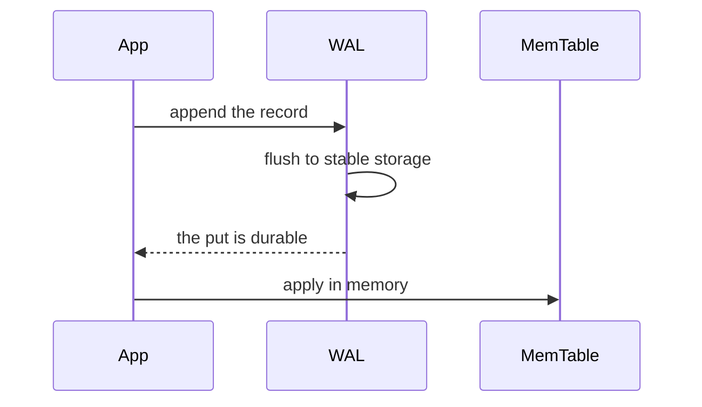
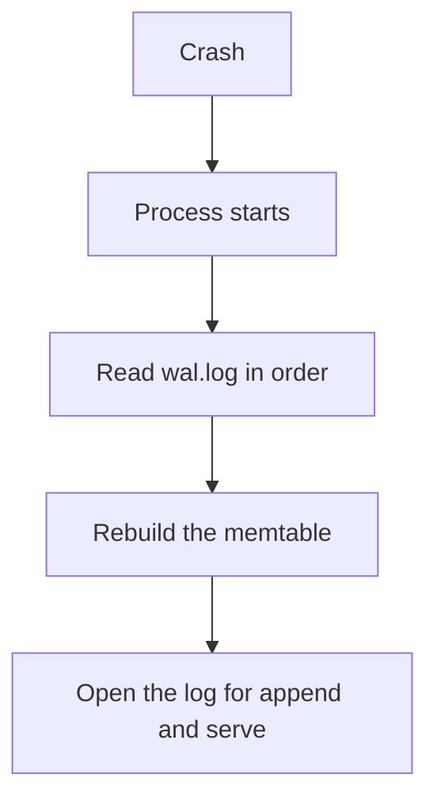

# Write-Ahead Log

## TL;DR

A write-ahead log records an operation on disk before the in-memory page or memtable is allowed to treat it as durable.
After a crash, recovery replays that log and rebuilds the state the caller was promised.
The lab in [[wal.cpp]] appends `key,value` lines, flushes them, then updates a `std::map`.
On startup it replays the file.
It has no checksums, no transactions, and no checkpoint.

## Mental Model

The rule is the order, not the file format.
If the memtable is updated first and the log write fails, recovery cannot see a put the caller may already have observed.
If the log is written first and the process dies before the memtable update, recovery applies it once and the caller who never got a response can safely retry.

## How It Works

`Database::put` writes the line, calls `flush`, then inserts into `memTable`.
`flush` pushes the C++ buffer to the OS.
It does not by itself issue `fsync`.
A power loss can still drop data the process believed it had flushed, depending on the filesystem and the disk cache.
The lab is honest about the algorithm and incomplete about durability.

`recover` reads every line, splits on the first comma, and inserts.
Later lines for the same key overwrite earlier ones, which is the right last-write-wins rule for this format.
A torn final line, a comma inside a value, or a partial write will parse wrong.
A production record has a length, a checksum, and a type.

A checkpoint, or an LSM flush, lets you drop the log prefix that is now inside a sealed file.
Without that, `wal.log` grows without bound and restart time grows with it.
The lab never truncates.

ARIES adds three ideas this file does not have.
Each log record has a link to the previous record of the same page or transaction.
Recovery repeats history, including the losers, and then undoes the losers.
Idempotent page writes use a log sequence number so a replayed record is not applied twice to a page that already contains it.

## Trade-offs and When to Use

Use a WAL anywhere a crash must not lose an acknowledged write: databases, replicated logs, and the memtable in [[LSM-Tree]].
Group commit is how you keep the fsync tax off the single-put latency.
Many puts share one fsync.
The caller waits for the shared flush, not for a private one.

Skipping the log is valid only when the dataset can be rebuilt from somewhere else, or when loss is an accepted feature of the cache.

## Failure Modes and Pitfalls

> [!warning] flush is not fsync
> `ofstream::flush` and `fflush` move bytes to the kernel.
> `fsync` or `fdatasync` asks the device to make them stable.
> Interview answers that stop at "we flush the file" have not reached durability.

> [!warning] Replay must be idempotent
> A record can be applied, then the process can crash before the caller is told, then recovery can apply it again.
> Key-value overwrite survives that.
> "Add 10 to the balance" does not, unless the log stores the new value or a transaction id the applier has already seen.

> [!warning] The log is on the same disk as the data
> One disk losing both the log and the latest memtable is a single failure domain.
> Replicated systems put the log through Raft or an equivalent before acknowledging.
> A local WAL alone survives a process crash, not a dead disk.

## Hands-On

Run [[wal.cpp]], put two keys, stop the process, and run it again.
The recover path should print the keys before any new put.
Then kill it after a partial line, if you can arrange one, and watch the parser.
That is the bug a checksum and a length prefix close.

## Interview Questions

> [!question] Why log before applying?
>
> > [!success]- Answer
> > The log is the record you can replay.
> > Memory is the record you lose.
> > Acknowledging a write that exists only in memory is a lie after a crash.

> [!question] Why does a long WAL make restart slow, and what fixes it?
>
> > [!success]- Answer
> > Recovery replays every record after the last sealed checkpoint.
> > Flushing a memtable or checkpointing dirty pages lets you discard that prefix.

> [!question] How does group commit help?
>
> > [!success]- Answer
> > One fsync covers many appended records.
> > Throughput rises because the disk sees fewer syncs.
> > A single put still waits for that shared sync, so the latency floor does not disappear.

## Related

- [[LSM-Tree]]
- [[MySQL-and-InnoDB]]
- [[ACID-vs-BASE]]
- [[Raft-Consensus]]

## Further Reading

- Mohan and others, ARIES, ACM TODS 1992, is the recovery paper behind InnoDB-style engines.
- Kleppmann, chapter 3, connects the log to LSM flushes and to replication.
- The PostgreSQL WAL internals notes are a readable production format: records, checksums, and checkpoints.
