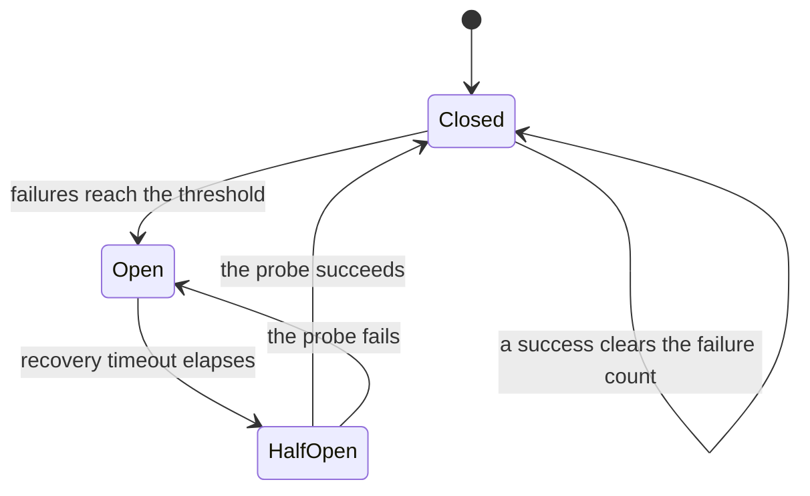
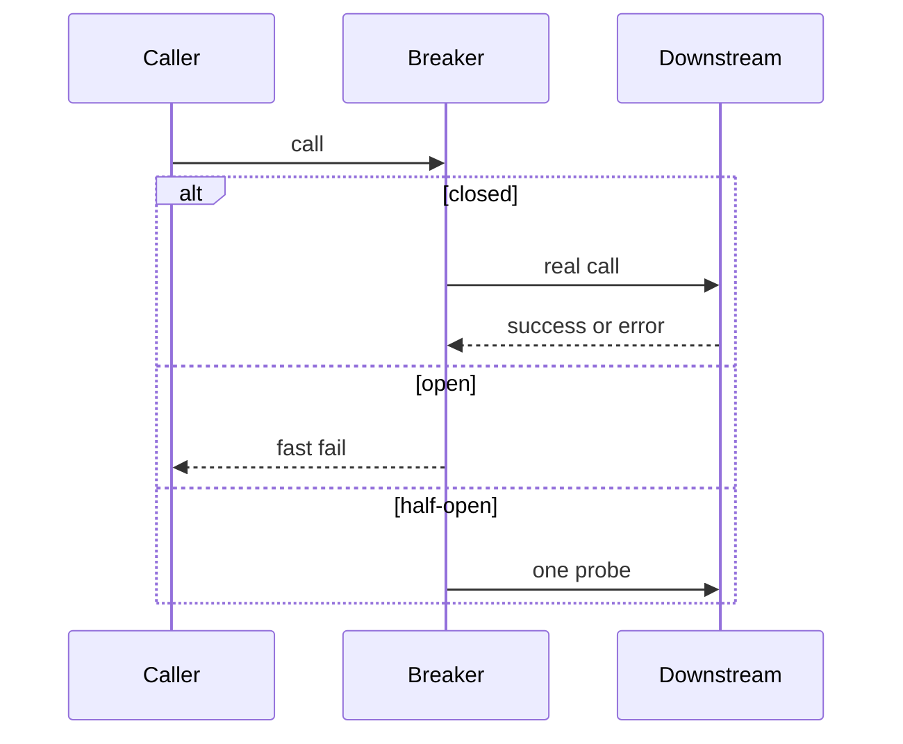

# Circuit Breaker

## TL;DR

A circuit breaker stops calling a dependency that is already failing.
Closed means calls go through.
Open means calls fail immediately.
Half-open lets a single trial through after a cool-down, and the result decides the next state.
The lab in [[circuit_breaker.py]] is one process, one counter, and a wall-clock timeout.
It does not share state across workers, and a half-open success resets the breaker even if the next calls fail immediately after.

## Mental Model

The point of the fast fail is to spare the caller's threads, pools, and deadlines.
Retrying a dead dependency from every worker makes the outage worse.
The breaker is how the caller admits that.

## How It Works

`call` checks the state.
In `OPEN`, if `recovery_timeout` has passed, it moves to `HALF-OPEN` and allows this call.
Otherwise it returns `None`.
A raised exception counts as a failure.
When `failures` reaches `failure_threshold`, the state becomes `OPEN` and `last_failure_time` is set.
`_success` zeroes the counter and closes the breaker.

The lab treats every exception as a trip signal.
A production breaker separates timeouts and `5xx` responses from a `4xx` that means the request was bad.
Tripping on client errors opens the circuit because your caller is wrong, which then hides a healthy dependency.

## Trade-offs and When to Use

Put a breaker on a remote call whose failure you can turn into a clear error, a fallback, or a skipped side effect.
Do not put one around a local function that fails because of a bug in the argument.
Do not use one as a substitute for backpressure.
If the dependency is slow rather than failing, you want a timeout and a limit on concurrency, or the breaker never sees an exception and the threads stay blocked.

The lab returns `None` for an open circuit and for a failed call.
The caller cannot tell "we did not try" from "we tried and got nothing".
Return a distinct open-circuit error so metrics and fallbacks can branch.

## Failure Modes and Pitfalls

> [!warning] Half-open stampede
> The lab flips to half-open inside `call` and then lets that call proceed.
> Ten threads can all observe `OPEN`, all see that the timeout has elapsed, and all send a probe.
> A correct half-open state allows one probe, or a small budget, and parks the rest.

> [!warning] One breaker per process is not one breaker per dependency
> Five replicas each keep their own counter.
> Four may be open while the fifth keeps sending the full traffic of its users.
> If you need a shared view, the state has to live somewhere the replicas can read, and that read cannot be more expensive than the call you are protecting.

> [!warning] A success in half-open forgets a bad minute
> `_success` clears `failures` and closes immediately.
> One lucky probe after a timeout hides a dependency that is still mostly dead.
> Count a small number of successes before closing, or reopen quickly if the error rate returns.

Timeouts have to count.
A call that hangs until the client gives up is a failure even though the lab's `func` would have to raise for that to register.

## Hands-On

Run [[circuit_breaker.py]] and watch it open.
Then change `unreliable_service` so it fails twice and succeeds once, forever.
With the current threshold of 3 it should stay closed.
Drop the threshold to 2 and it should open.
That is the difference between a blip and a trip.

## Interview Questions

> [!question] How is this different from a retry?
>
> > [!success]- Answer
> > A retry spends more work on a call that just failed.
> > A breaker refuses the call so the dependency and the caller can recover.
> > Retries belong inside a closed breaker, with a budget, and they stop once the breaker opens.

> [!question] What do you return when the circuit is open?
>
> > [!success]- Answer
> > A specific, fast error the caller can branch on.
> > Sometimes a cached or degraded answer, when that answer is still honest.
> > Never a silent `None` that looks like an empty success.

> [!question] Where do you place it in a microservice call chain?
>
> > [!success]- Answer
> > Around each remote dependency, on the client side of that hop.
> > One breaker around the whole request hides which hop is sick and trips healthy traffic.

## Related

- [[microservices_vs_monolith]]
- [[saga_pattern]]
- [[04-System-Design/02-Case-Studies/02-Rate-Limiter/design|Rate limiter]]

## Further Reading

- Nygard, *Release It!*, is the source of the pattern as operators use it.
- Fowler's CircuitBreaker note is the short version of the three states.
- [[microservices_vs_monolith]] is the boundary that makes this pattern necessary.
