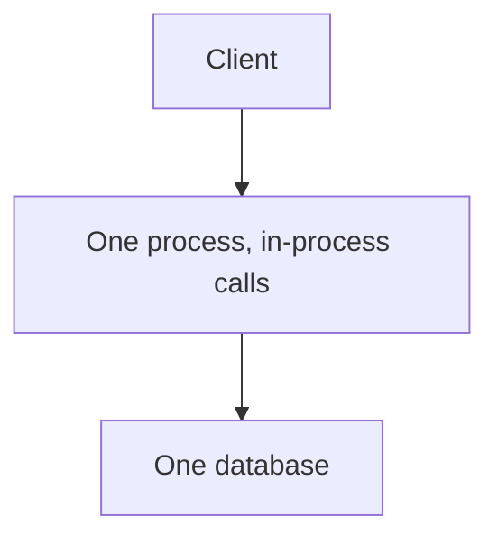
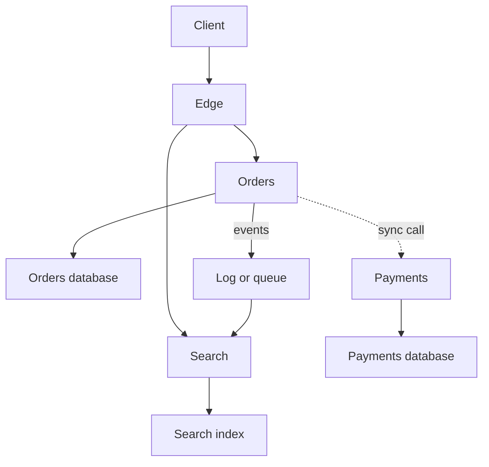

# Microservices vs Monolith

## TL;DR

A monolith is one deployable unit and, usually, one database.
Microservices are separately deployed units that talk over the network and own their own data.
Start with a monolith while the domain boundaries are still a guess.
Split a service out when a team, a scaling limit, or a failure domain is real enough to pay for the network.
[[saga_pattern]] and [[Circuit-Breaker]] are the two patterns you pick up the moment you do.

## Mental Model

The second picture is where a local transaction stops being available.
Orders and payments cannot `COMMIT` together.
They either call each other and live with partial failure, or they publish an event and live with delay.
[[Synchronous-vs-Asynchronous-Communication]] is that choice.
[[saga_pattern]] is how a multi-step business action survives it.

## How It Works

Inside a monolith, a method call is the interface.
A bug can take down the whole process.
A scale-out copies the whole process, including the parts that were not busy.
A schema migration is one project.
ACID transactions are ordinary, because there is one database.

A service boundary is a network interface plus a private schema.
Orders does not read payments' tables.
If it needs a fact, it stores a copy, asks over RPC, or consumes an event.
That copy will be stale.
The team that owns payments can deploy without redeploying search, and search can be scaled, or killed, without taking orders with it.

The split is expensive in places the diagram does not show.
You now operate service discovery, timeouts, authentication between services, distributed traces, and a way to know which version is talking to which version.
[[Circuit-Breaker]] is the client-side stop switch for a dependency that is failing.
Without it, one slow service occupies the caller's threads and the outage spreads.

## Trade-offs and When to Use

Stay in the monolith while one team can still hold the domain in their head and the database is not the constraint.
Extract a service when one of these is true:

- A part of the system has to scale, or fail, on its own.
- A part has a release cadence the rest cannot share.
- A boundary in the data is already stable, and the teams on each side are different.

A file layout that looks like services, backed by one shared database and one joint deploy, has the costs of both shapes.
Newman calls the healthy version a modular monolith: firm module boundaries, still one process, until a boundary earns a network.

## Failure Modes and Pitfalls

> [!warning] Shared tables across "services"
> If two deployables write the same tables, you have a distributed monolith.
> A migration still locks both teams, and a bad query from one still takes the other's pages.
> Split the data with the code, or do not split the code.

> [!warning] Chatty synchronous chains
> A request that calls five services, each of which calls two more, spends its budget on network round trips.
> One slow hop sets the tail of the whole call.
> Prefer a coarser API, or an event, on the path that has to be fast.

> [!warning] Distributed transactions by accident
> A flow that used to be one transaction becomes several local commits the moment the tables move apart.
> Name the saga, or the reservation, before you deploy the split.
> Discovering it from a double charge is the expensive version.

## Interview Questions

> [!question] When would you refuse to split a service out?
>
> > [!success]- Answer
> > When the boundary is still changing every sprint, or when the two sides need a strongly consistent transaction more than they need independent deploys.
> > A modular monolith keeps that option open.

> [!question] What do you add on the client the day a call becomes remote?
>
> > [!success]- Answer
> > A timeout, a bounded retry, a circuit breaker, and a metric for the outcome.
> > Plus a decision about the stale read or the saga, if the call used to sit inside one transaction.

> [!question] How do you find a boundary?
>
> > [!success]- Answer
> > By the data that changes together and the team that can own that change.
> > A boundary that cuts through a single aggregate will spend its life in distributed transactions.

## Related

- [[saga_pattern]]
- [[Circuit-Breaker]]
- [[Synchronous-vs-Asynchronous-Communication]]
- [[CAP-Theorem-and-PACELC]]
- [[Pub-Sub-Architecture]]

## Further Reading

- Fowler's MonolithFirst is the short argument for waiting.
- Newman, *Building Microservices*, is the longer treatment of boundaries, data ownership, and the operational tax.
- [[saga_pattern]] is the next note once a workflow crosses the line in the second diagram.
