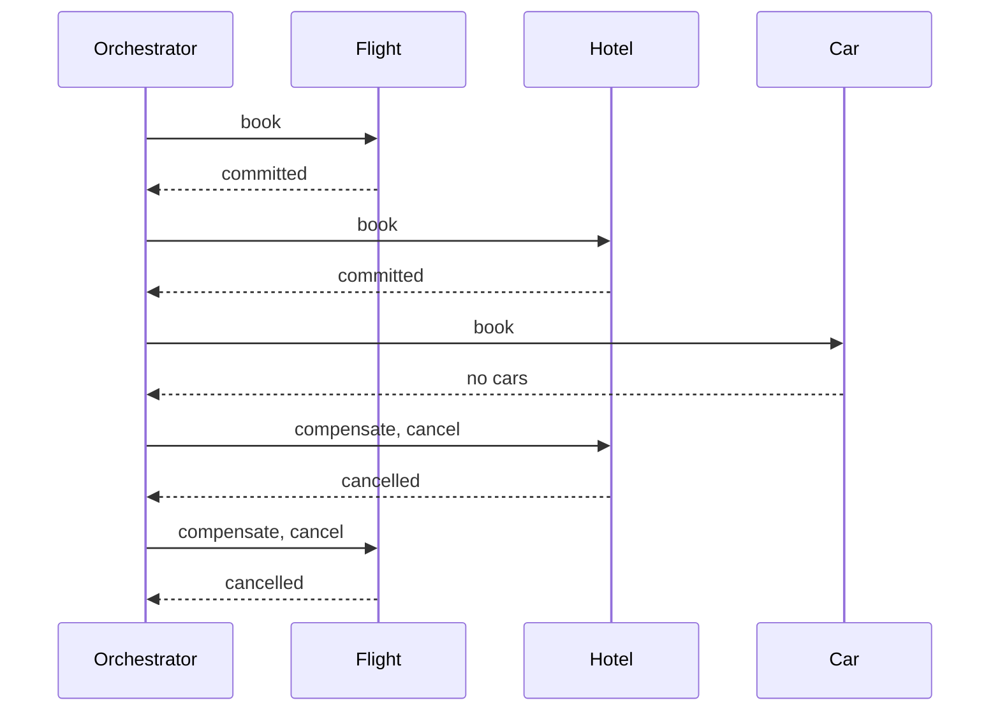
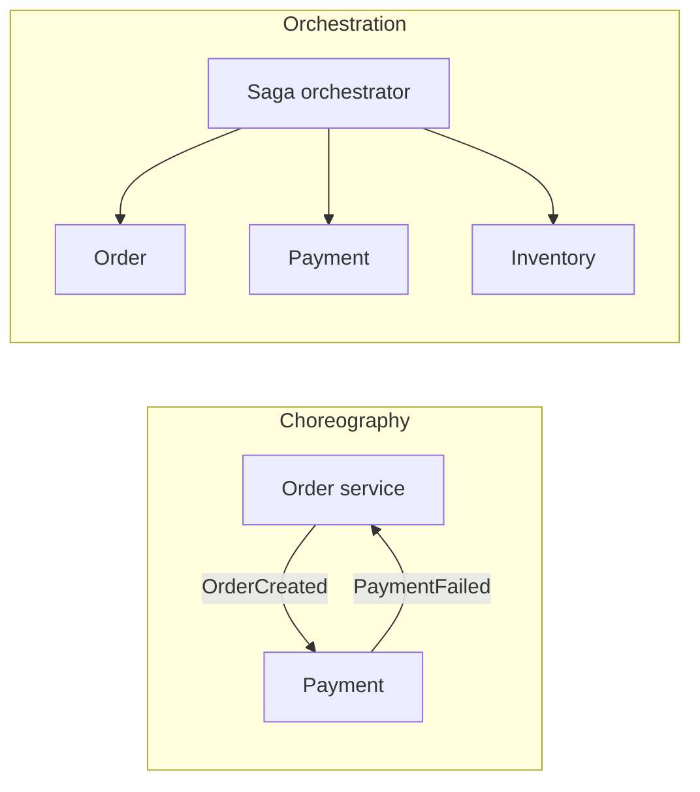

# SAGA Pattern

## TL;DR

A saga splits one business transaction into local transactions, one per service.
Each local transaction commits on its own database.
If a later step fails, the saga runs compensating transactions in reverse, undoing the business effect of the steps that already committed.
It does not hold locks across services, and it is not atomic.
The orchestrator sketch at the bottom of this note is the control flow, not a production coordinator.

## Mental Model

Book a trip as three local commits.
The car booking fails.
The saga cancels the hotel, then cancels the flight.
A reader can observe the hotel booking in the gap before the cancel.
That gap is the point of the pattern and the thing you have to design for.





## How It Works

Choreography has no central coordinator.
Each service subscribes to the events that tell it to move or to undo.
The order service emits `OrderCreated`.
Payment consumes it and emits `PaymentProcessed` or `PaymentFailed`.
The order service consumes the failure and cancels.
This stays simple while the graph is a short line.
It gets hard to follow once several services emit events that loop back.

Orchestration puts the sequence in one state machine.
The orchestrator calls `OrderService.create`, then `PaymentService.charge`, and on failure calls the compensations it knows have run.
The lab below is that shape with three in-process function calls.
A real orchestrator persists the step it has reached, or a crash after the hotel commit and before the cancel loses the saga.

```python
class TripBookingSaga:
    def execute(self):
        try:
            self.flight_id = flight_service.book()
            self.hotel_id = hotel_service.book()
            self.car_id = car_service.book()
        except Exception:
            self.compensate()

    def compensate(self):
        if hasattr(self, "car_id"):
            car_service.cancel(self.car_id)
        if hasattr(self, "hotel_id"):
            hotel_service.cancel(self.hotel_id)
        if hasattr(self, "flight_id"):
            flight_service.cancel(self.flight_id)
```

Compensations run in reverse order of the successful steps.
A step that never started does not need a cancel.
A cancel must be safe to repeat, because the orchestrator will retry it after its own crash.

## Trade-offs and When to Use

Use a saga when the steps have different owners and different databases, and the business can tolerate a visible intermediate state.
A monolith with one database should use a local transaction.
Two-phase commit can still be right for a short, colocated pair of resource managers that must not show the intermediate state.
It is a poor default across slow or failure-prone service calls, because the locks stay held for the whole round trip.

The semantic counterweight to a lost isolation level is a business rule.
"A seat is reserved, not sold, until the payment step commits."
The reservation expires.
That expiry is a compensation that time can run, so a lost orchestrator does not hold the seat forever.

## Failure Modes and Pitfalls

> [!warning] A compensation can fail
> Cancelling the hotel can time out.
> The saga is then stuck between "hotel booked" and "hotel cancelled".
> The orchestrator has to retry the compensation, and the hotel cancel has to be idempotent.
> A poison compensation needs a human queue, not an infinite loop.

> [!warning] Sagas do not give you isolation
> Another customer can observe or buy the seat you have booked and not yet cancelled.
> Garcia-Molina and Salem assumed compensations were the undo.
> They did not pretend concurrent sagas were serializable.
> If the business cannot allow the anomaly, the design needs a reservation, a semantic lock, or a single database.

> [!warning] The sketch forgets its place
> `TripBookingSaga` keeps step ids on `self`.
> A process restart clears them and the compensations never run.
> Persist each completed step before you start the next one.

An at-least-once event bus will deliver `OrderCreated` twice.
Every step needs an idempotency key.
[[Circuit-Breaker]] belongs on the calls the orchestrator makes, so one dead service does not pin the saga's threads.

## Interview Questions

> [!question] Why not two-phase commit between the services?
>
> > [!success]- Answer
> > Two-phase commit holds locks until every participant has prepared and the coordinator has decided.
> > A slow or dead participant stalls the others.
> > A saga commits each local transaction and undoes with a business action, so a failure does not pin locks across the network.

> [!question] What do you persist in the orchestrator?
>
> > [!success]- Answer
> > The saga id, the current step, and the ids needed to compensate the steps that have committed.
> > Without that record, recovery does not know what to undo.

> [!question] How do you make a compensation safe to retry?
>
> > [!success]- Answer
> > Key it by the saga id and the step.
> > A second cancel of the same booking returns success and does not cancel a newer booking that reused the resource.

## Related

- [[microservices_vs_monolith]]
- [[Circuit-Breaker]]
- [[ACID-vs-BASE]]
- [[Consistency-Models]]

## Further Reading

- Garcia-Molina and Salem, SIGMOD 1987, is the original definition.
- Richardson's saga chapter is the choreography versus orchestration split interviews use.
- [[ACID-vs-BASE]] is the consistency backdrop for giving up a single commit.
