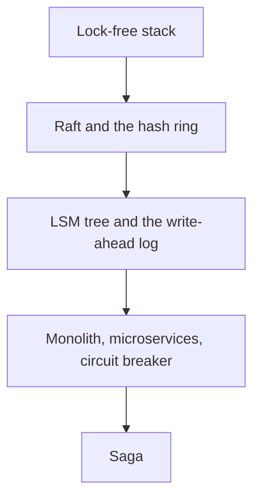

# Distinguished Engineering

Staff-plus systems depth: advanced concurrency, distributed systems internals, database internals, architecture patterns, and distributed transactions.
Each folder pairs a short lab with an architecture note.
Read the diagram, run the code, then read the pitfalls.
The labs are teaching implementations.
The notes name the production hazards those labs leave out.

- [[Lock-Free-Stack]] sits next to the Treiber stack lab.
- [[Raft-Consensus]] sits next to the election and replication lab.
- [[Consistent-Hash-Ring]] is the ring used by the Python lab, and [[Consistent-Hashing]] is the concept note.
- [[LSM-Tree]] and [[Write-Ahead-Log]] are the two halves of a write-optimized store.
- [[microservices_vs_monolith]] and [[Circuit-Breaker]] are the service boundary.
- [[saga_pattern]] is what replaces a single ACID transaction once that boundary exists.

<!-- moc:start (generated by tools/build_mocs.py; edits inside are overwritten) -->
## Contents

**Sections**

- [Distributed Systems Internals](02-Distributed-Systems-Internals/README.md)
- [Database Internals](03-Database-Internals/README.md)
- [Architecture Patterns](04-Architecture-Patterns/README.md)

<!-- moc:end -->
