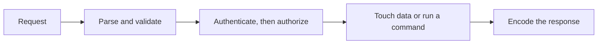

# Security And Cryptography

Security: common vulnerabilities and secure coding.

[[owasp_top_10]] is the catalog of what goes wrong on those arrows.
[[cpp_safety.cpp]] is the memory-safety side of the same idea in C++.
