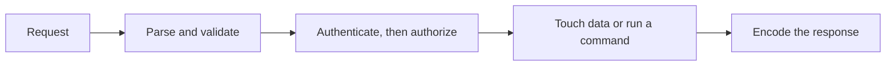

# Security And Cryptography

Security: common vulnerabilities and secure coding.

The common-vulnerabilities note is the catalog of what goes wrong on those arrows.
[[cpp_safety.cpp]] is the memory-safety side of the same idea in C++.
The cryptographic mechanism those arrows are supposed to rely on lives on the canon shelf.
[[Symmetric-Crypto-and-Hashes]] is the shared-key half: authenticated encryption, hashes, and password hashing.
[[Public-Key-Crypto-and-TLS]] is agreement, signatures, and the TLS 1.3 handshake.
This page stays the list of how application code breaks that reliance.

<!-- moc:start (generated by tools/build_mocs.py; edits inside are overwritten) -->
## Contents

**Sections**

- [Common Vulnerabilities](01-Common-Vulnerabilities/owasp_top_10.md)

<!-- moc:end -->
