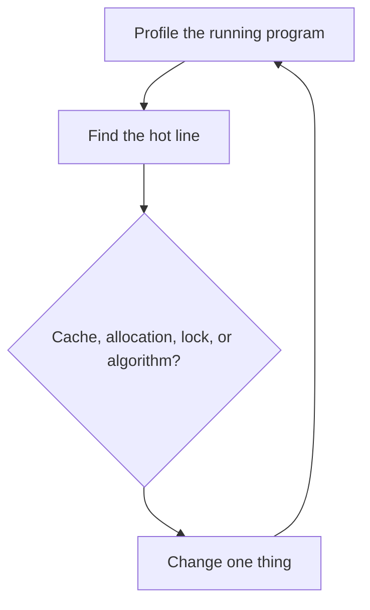

# Performance Engineering

Performance engineering: CPU architecture effects and profiling.

The profiling note is the measurement step.
[[false_sharing.cpp]] is one concrete cause: two cores writing different fields that share a cache line.
Do not start at the change box.

<!-- moc:start (generated by tools/build_mocs.py; edits inside are overwritten) -->
## Contents

**Sections**

- [Profiling](02-Profiling/profiling_guide.md)

<!-- moc:end -->
