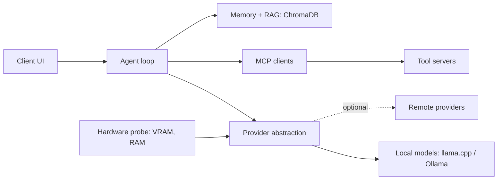

# Pitch and resume deep dives

Asked in almost every interview, and the place where candidates lose the most points.
The interviewer is checking three things: can you explain your own work crisply, do the numbers hold up under follow-up, and did you do what you say you did.

## Ground rules

- **Say who built what.**
  For the agentic harness, the tools are mostly open-source forks (upstream author Kun Chen, `kunchenguid/*`); the routing policy, manual generator, guard hooks, fleet operations, and fork patches are mine.
  Say it in the first minute; see [Agentic Harness - authorship](../Agentic-Harness/00-Executive-Summary.md).
- **Only quote numbers you can defend.**
  Every number needs a baseline, a method, and a time window; anything else is a **[fill in]**.
- **Keep the years consistent.**
  The prep draft says "about six years"; other material says seven.
  **[fill in: pick the number that matches the resume and use it everywhere.]**
- **Answer shape:** problem, architecture, hard parts, results, what I would change.

---

## Q1. Tell me about yourself.

Aim for about 90 seconds: past, present, why this role.

> "I'm a C++ and Python engineer with about six years across trading systems and applied ML.
> I started at Bank of America building ML platforms and trade-processing services, then did quant development at Versor on merger-arb strategies, and led a 12-person team at LogiNext on geospatial routing.
> There I built an LLM-powered debugging tool that cut bug-resolution time by 80%, which is what pulled me into applied LLM work.
> Most recently at BNP Paribas I worked on the low-latency market-making stack and integrated on-prem LLM tooling with Git, Jira, and Confluence.
> On my own time I've built two agentic systems.
> One is a local-first agent platform that orchestrates multiple LLM providers over MCP, with RAG and persistent memory.
> The other is the control layer for a multi-agent engineering harness: agents run in isolated git worktrees and can only ship through a gate that reviews, tests, and opens the PR.
> The agent tools in that harness are open-source forks; what I own is the routing policy, the safety hooks, the config generation, and running it daily.
> What I bring is production engineering discipline: latency, reliability, testing.
> Agent systems need exactly that to move from demos to production, and that's why this role fits."

**30-second version** (for a recruiter screen or a "quick intro"):

> "C++ and Python engineer, about six years in trading systems and applied ML at Bank of America, Versor, LogiNext, and BNP Paribas.
> I moved into applied LLM work after an LLM debugging tool I built at LogiNext cut bug-resolution time by 80%.
> I now build agent systems with the same discipline as trading systems: isolation, verification gates, budgets, and kill switches."

**Delivery notes.**
- Stop at 90 seconds; let them pick the thread.
- End on the role, not on your history.
- If the role is platform-heavy, lead with the harness; if it is product-heavy, lead with the LogiNext tool and adoption.

---

## Q2. Walk me through the Sovereign AI Command Center.

Structure: problem, architecture, hard parts, results.

- **Problem:** use agents on sensitive data with zero data leaving the host, without lock-in to one LLM provider.
- **Architecture:**
  - A unified provider-abstraction API: local quantized models plus optional remote providers behind one interface.
  - An agent loop that calls tools via MCP.
  - RAG and semantic memory on ChromaDB.
  - A hardware-aware layer that picks the model and quantization level from available VRAM and RAM.
- **Hard parts to mention:**
  - Normalizing tool-calling formats across providers (see R2).
  - Small local models being unreliable at tool calling.
    Fixes: constrained or JSON-schema decoding, fewer tools per step, and retries that feed the validation error back to the model.
  - Deciding what goes into long-term memory versus what is only retrieved (see R4).
- **Results:** **[fill in: p50/p95 latency per turn, models supported, tasks it handles, tool-call success rate before and after constrained decoding]**.
- **What I would change:** **[fill in: one honest regret, e.g. building evals earlier]**.

Go deeper: [The API Layer](../Agentic_AI_Zero_to_Godhood/Volume_02_Working_With_LLMs/Chapter_01_The_API_Layer.md), [Structured Output](../Agentic_AI_Zero_to_Godhood/Volume_02_Working_With_LLMs/Chapter_04_Structured_Output.md), [Long-Term Memory](../Agentic_AI_Zero_to_Godhood/Volume_06_Memory_and_Context_Engineering/Chapter_05_Long_Term_Memory.md).

---

## Q3. Walk me through the Agentic Engineering Harness.

Facts below are verified in the [Agentic Harness pack](../Agentic-Harness/README.md); rehearse its [Pitches](../Agentic-Harness/interview/Pitches.md) for the 30-second, 2-minute, and 10-minute versions.

- **One supervisor, many workers.**
  I talk to one supervisor agent (firstmate) that never edits code.
  It files a backlog row, picks a model tier from live quota, and spawns worker agents (Claude Code, Grok Build, Gemini) in their own git worktrees.
- **Isolation.**
  Each task gets a pooled, detached-HEAD worktree, so parallel agents cannot clobber each other's working tree or branch.
- **Gated shipping.**
  Workers publish only by pushing to a local gate (no-mistakes) that runs a fixed nine-step pipeline: review, tests, docs, lint, a verified push, the PR, and CI babysitting.
  A bare `git push` is forbidden by rule and by hook.
- **Safety hooks.**
  A version-controlled PreToolUse hook always denies hook bypasses and force-pushes to shared branches, and asks before other destructive commands; 51 unit tests cover the hooks.
- **Reproducible machine.**
  A Nix flake (nix-darwin plus Home Manager on macOS, Home Manager on Linux and WSL) declares the machine; one source file generates the operating manual for every AI tool, and CI fails on drift.
  It is not NixOS; do not say NixOS.
- **Overnight runs.**
  A separate loop tool (gnhf) restarts the agent every iteration and carries only a small notes file forward, so context never rots.
- **Key insight to state:**
  "The model isn't the bottleneck. Verification and isolation are. Worktrees plus a pre-publication gate turn agent output into something you can safely merge."

**Likely follow-ups** are answered in the harness [Question Bank](../Agentic-Harness/interview/Question-Bank.md): why not MCP (Q10), why not LangGraph (Q11), what happens when quota runs out (Q16), prompt injection (Q23), scaling to 50 engineers (Q34).

**Landmine:** the harness defines zero MCP servers in its Claude config; agents reach tools through token-efficient CLIs.
If you say "the harness is built on MCP," you will be contradicted by your own repo.

---

## Q4. Tell me about the LLM debugging tool at LogiNext.

Cover these points, in this order:

1. **Inputs:** logs, stack traces, the codebase, and docs.
2. **Mechanism:** retrieval over code, tickets, and runbooks; the LLM proposes a root cause and a fix with citations to the retrieved files.
3. **Measurement:** how the 80% was measured.
   Mean time to resolution before versus after, over what window, on which ticket classes, and how you controlled for the ticket mix changing.
4. **Adoption:** how people actually used it (IDE, chat, ticket bot) and what fraction of engineers used it weekly.
5. **What went wrong:** hallucinated file paths, fixed by grounding answers in retrieved code and requiring every claim to cite a retrieved chunk.

**[fill in real details: stack, model, retrieval method, team size, the before/after numbers, the time window]**

**Follow-up you should expect:** "80% is a big number. How do you know it was the tool?"
A good answer names the comparison (same team, same ticket categories, before and after), admits confounders (team learning, ticket mix), and says what you would do now (an A/B split by ticket or a matched comparison).

---

## Q5. What did you do with on-prem LLMs at BNP?

- Integrated secure, on-prem LLM tooling with Git, Jira, and Confluence to automate code, test, and documentation workflows.
- Emphasize the constraints: data residency, no external API calls, access control, auditability.
- These constraints are exactly what regulated enterprises worry about with agents.
- Name the controls: document-level permissions enforced at retrieval, audit logs of prompts and outputs, human review before anything is written back to Jira or Git, and model versions pinned for reproducibility.

**[fill in: which workflows, which model family, how many users, one measured outcome]**

Go deeper: [Governance and Standards](../Agentic_AI_Zero_to_Godhood/Volume_11_Safety_Security_Alignment/Chapter_07_Governance_and_Standards.md).

---

## Q6. Why agentic AI, coming from quant and trading?

- Trading systems and agent systems share the same core problems: autonomous decision loops, risk limits, observability, fail-safes, and latency and cost budgets.
- A market-making engine is essentially a constrained autonomous agent with kill switches; I think about agents the same way.

| Trading concept | Agent equivalent |
| --- | --- |
| Pre-trade risk checks | Action guardrails and permission tiers |
| Kill switch | Step, token, and spend budgets; human interrupt |
| Order idempotency (client order IDs) | Idempotency keys on side-effecting tools |
| Market-data replay | Trace replay and record-and-replay tests |
| Latency budget per hop | Latency budget per step: TTFT, tool time, decode |
| Model risk management (SR 11-7) | Eval suites, model cards, change control for prompts |
| Golden-source reference data | Pinned models, versioned prompts, generated manuals |

---

## Follow-up questions on the projects (R1-R12)

**R1. Why ChromaDB and not pgvector or Qdrant?**
Chroma is embedded, needs no separate service, and uses HNSW, which fits a single-host, local-first design.
At larger scale or with multi-tenant ACL filtering I would move to pgvector (transactions and joins with metadata) or Qdrant (filtered HNSW, quantization).
**[fill in: corpus size and query latency]**

**R2. How do you normalize tool calling across providers?**
Define one internal tool schema (name, description, JSON Schema for parameters) and one internal tool-call and tool-result type.
Write a thin adapter per provider that maps to its wire format: Anthropic `tool_use` and `tool_result` content blocks, OpenAI `tool_calls` with a `tool` role message (Chat Completions) or `function_call` and `function_call_output` items (Responses API), and for local models either the model's chat template or constrained JSON decoding.
Test each adapter with recorded fixtures, because the formats differ in where call IDs live, whether parallel calls are allowed, and how errors are signaled.

**R3. How does the hardware-aware layer choose a model?**
Estimate memory as weights plus KV cache plus overhead:
`weights_GB = params_B * bits_per_weight / 8`, and `kv_bytes_per_token = 2 * layers * kv_heads * head_dim * bytes_per_value`.
Example: an 8B model at Q4_K_M (about 4.85 bits per weight) needs about 4.9 GB of weights; its KV cache in FP16 is 128 KiB per token, so an 8K context adds 1 GiB.
Pick the largest model and least aggressive quantization that fits with headroom, then cap the context length to what the remaining memory allows.
**[fill in: the actual thresholds and fallback order]**

**R4. What goes into long-term memory, and what is only retrieved?**
Memory holds distilled, durable facts about the user and prior outcomes (preferences, decisions, past failures); retrieval holds source documents that already exist elsewhere.
Write memories only after a salience check and deduplicate against existing ones; store the source and timestamp so stale or conflicting memories can be resolved.

**R5. What would break first if 100 people used the Sovereign platform?**
The single-host model server: requests serialize on the GPU.
Next would be the embedded vector store and per-user isolation of memory.
Fixes: a batched inference server (vLLM or llama.cpp server with parallel slots), a real vector database with per-tenant filters, and a queue for long tasks.

**R6. Why worktrees instead of containers for isolation?**
Worktrees isolate the filesystem and the branch cheaply and share the object store, which is enough when the threat is agents colliding, not agents attacking.
They do not isolate the network, processes, or secrets; for untrusted code or untrusted input I would add a container or microVM per task.
Say this trade-off out loud; it shows you know where the boundary is.

**R7. How do you know the gate actually catches problems?**
Point to evidence: in [STAR Story 1](../Agentic-Harness/interview/STAR-Stories.md) the gate's review found fail-open bypasses in my own security hook, then found a regression introduced by the fix.

**R8. What is the hardest bug you hit in an agent system?**
Pick one from [STAR Stories](../Agentic-Harness/interview/STAR-Stories.md) or the defects table in the [Executive Summary](../Agentic-Harness/00-Executive-Summary.md) (for example, the server-side sync loop that silently aborted under `bash -e`).

**R9. How did you measure latency improvements in the market-making stack?**
**[fill in]**; if you cannot give percentiles, method, and hardware, say what you would measure rather than inventing numbers.

**R10. What is the one thing you would do differently in each project?**
Prepare one honest answer per project; "I would have built the eval set on day one" is almost always true.

**R11. How much of the code did AI write?**
Be honest and specific: what was generated, what you designed, and how it was verified (tests, review, the gate).

**R12. Why are you leaving trading?**
Frame it as moving toward, not away: agent systems are where production discipline is scarcest and most valuable.

---

## Claims to avoid

| Do not say | Say instead |
| --- | --- |
| "I wrote firstmate / no-mistakes" | "I run it, configure it, patched it, and gate everything through it" |
| "It runs on NixOS" | "A Nix flake: nix-darwin plus Home Manager" |
| "The harness is built on MCP" | "Agents use token-efficient CLIs; MCP is used where a tool needs it" |
| "It made me X% more productive" | Nothing; no productivity number was measured |
| Any latency or cost number without a method | "I did not measure that; here is how I would" |
