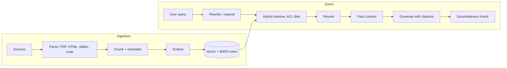

# RAG and knowledge systems

Almost always asked for agent roles.
The senior signal is separating retrieval quality from generation quality and measuring each.

---

## Q21. Explain the RAG pipeline end to end.

- **Ingestion:** parse (PDFs and tables are hard), chunk, attach metadata (source, section, timestamp, ACL), embed, index.
- **Query:** rewrite or expand the query, retrieve (hybrid, filtered by permissions), rerank, pack context, generate with citations, optionally verify groundedness.
- Most quality problems are in parsing and chunking, not in the LLM.

Go deeper: [Why Retrieval](../Agentic_AI_Zero_to_Godhood/Volume_05_RAG_and_Knowledge_Systems/Chapter_01_Why_Retrieval.md).

---

## Q22. Chunking strategies?

| Strategy | How | Good for | Weakness |
| --- | --- | --- | --- |
| Fixed-size with overlap | N tokens, M overlap | Baseline, uniform text | Cuts mid-thought |
| Recursive by separators | Split on headings, paragraphs, sentences, then characters | General documents | Uneven sizes |
| Semantic | Split where embedding similarity between sentences drops | Long prose | Cost at ingestion |
| Structure-aware | Headings, code functions (AST), table rows | Docs, code, tables | Needs a parser per format |
| Late chunking | Embed the whole document with a long-context model, then pool token embeddings per chunk | Chunks that depend on document context | Needs a long-context embedder |
| Contextual retrieval | Prepend an LLM-generated summary of the chunk's place in the document before embedding and BM25 indexing | Chunks that are ambiguous alone | LLM cost per chunk (cache the document prefix) |

Typical size: 256-1024 tokens; tune it with evaluation, not intuition.
Anthropic reported contextual retrieval cut top-20 retrieval failures by 49% (67% with reranking added) on its benchmarks.

The tested chunker is in [Coding Round Q57](09-Coding-Round.md).

Go deeper: [Chunking and Indexing](../Agentic_AI_Zero_to_Godhood/Volume_05_RAG_and_Knowledge_Systems/Chapter_02_Chunking_and_Indexing.md).

---

## Q23. Dense versus sparse versus hybrid retrieval?

- **Dense:** embeddings.
  Good for semantics and paraphrase, weak on exact terms, IDs, error codes, and rare names.
- **Sparse:** BM25 (or learned sparse such as SPLADE).
  Good for exact keywords.
- **Hybrid:** combine both with **Reciprocal Rank Fusion**: `score(d) = sum over lists of 1 / (k + rank(d))`, with k = 60 by convention.
  RRF uses ranks, not raw scores, so it needs no score normalization across very different retrievers.
- Then **rerank** with a cross-encoder: slower but much more accurate, because it attends jointly over the query and the document.
  Retrieve about 50-100 candidates, rerank, keep the top 5-20.

**Worked RRF example** (k = 60):

| Doc | Dense rank | BM25 rank | RRF score |
| --- | --- | --- | --- |
| A | 1 | 1 | 1/61 + 1/61 = 0.0328 |
| B | 2 | 10 | 1/62 + 1/70 = 0.0304 |
| C | - | 2 | 1/62 = 0.0161 |

A document ranked well by both retrievers beats one ranked first by only one of them.
The tested implementation is in [Coding Round Q58](09-Coding-Round.md).

Go deeper: [Hybrid Retrieval and Reranking](../Agentic_AI_Zero_to_Godhood/Volume_05_RAG_and_Knowledge_Systems/Chapter_05_Hybrid_Retrieval_and_Reranking.md).

---

## Q24. How do vector indexes work?

- **Exact search:** brute-force k-NN; O(n d) per query, perfect recall; fine up to about a million vectors on a GPU or with batching.
- **HNSW:** a layered proximity graph; greedy search from the sparse top layer down.
  High recall and fast, but memory-heavy, and deletes and updates are awkward.
  Parameters: `M` (links per node), `efConstruction` (build quality), `efSearch` (query-time recall versus latency).
- **IVF:** k-means clusters; search only the `nprobe` nearest centroids.
- **PQ (product quantization):** split each vector into sub-vectors and replace each with a codebook index; large compression, some recall loss.
  Often combined as IVF-PQ.
- **Distance metrics:** cosine, dot product, L2; on normalized vectors, cosine and dot product give the same ranking.
- **Trade-offs:** recall versus latency versus memory versus update cost.
- **Stores:** ChromaDB (mine; HNSW-based, embedded, simple), pgvector, Qdrant, Milvus, Weaviate, Pinecone, and FAISS (a library, not a database).

**Worked memory estimate** for 1 million 1024-dimension float32 vectors:

| Component | Size |
| --- | --- |
| Raw vectors: 1M x 1024 x 4 bytes | 4.1 GB |
| HNSW layer-0 links with M = 16 (2M = 32 neighbors x 4 bytes) | about 128 MB |
| PQ codes with 128 sub-quantizers x 1 byte | 128 MB (32x smaller than raw) |

Go deeper: [Vector Search Internals](../Agentic_AI_Zero_to_Godhood/Volume_05_RAG_and_Knowledge_Systems/Chapter_03_Vector_Search_Internals.md), [The Vector Database Landscape](../Agentic_AI_Zero_to_Godhood/Volume_05_RAG_and_Knowledge_Systems/Chapter_04_The_Vector_Database_Landscape.md).

---

## Q25. Advanced RAG techniques?

- **Query rewriting and multi-query:** rewrite the conversational question into a standalone query; generate several phrasings and fuse the results.
- **HyDE:** embed a hypothetical answer instead of the question, because answers look more like documents than questions do.
- **Parent-document retrieval:** retrieve small chunks for precision, return the larger parent for context.
- **Metadata filtering:** date, source, product, ACL.
- **GraphRAG:** build an entity graph and community summaries for global questions ("what are the main themes across all incidents?") that no single chunk answers.
- **Agentic RAG:** retrieval is a tool; the agent decides when and what to retrieve, and iterates.
- **Self-RAG and corrective RAG (CRAG):** grade the retrieved documents and re-retrieve, rewrite the query, or fall back to web search if they are poor.

Go deeper: [Agentic RAG and Beyond](../Agentic_AI_Zero_to_Godhood/Volume_05_RAG_and_Knowledge_Systems/Chapter_07_Agentic_RAG_and_Beyond.md).

---

## Q26. How do you evaluate RAG?

Separate retrieval from generation.

| Layer | Metric | Question it answers |
| --- | --- | --- |
| Retrieval | recall@k | Did any of the right chunks come back? |
| Retrieval | precision@k | How much of what came back is relevant? |
| Retrieval | MRR | How high is the first relevant chunk? |
| Retrieval | nDCG | Is the ranking good, with graded relevance? |
| Generation | Faithfulness or groundedness | Is every claim supported by the retrieved context? |
| Generation | Answer relevance | Does it answer the question asked? |
| Generation | Context relevance | Was the packed context on-topic? |
| End to end | Correctness against a reference, citation accuracy | Is it right, and are the sources real? |

- **Tools:** RAGAS, TruLens, DeepEval, or code plus an LLM judge.
- Build a golden dataset of questions, expected answers, and expected source chunks; seed it from real user queries and add every production failure.
- Diagnose with the matrix: good retrieval and bad answer points at the prompt or model; bad retrieval points at chunking, embeddings, or the query.

Go deeper: [RAG Evaluation](../Agentic_AI_Zero_to_Godhood/Volume_05_RAG_and_Knowledge_Systems/Chapter_06_RAG_Evaluation.md).

---

## Q27. RAG versus fine-tuning versus long context?

| Need | Best tool | Why |
| --- | --- | --- |
| Knowledge that changes | RAG | Update the index, not the model |
| Citations and auditability | RAG | Answers point at sources |
| Per-user access control | RAG | Filter at retrieval time |
| Behavior, format, style, domain language | Fine-tuning | Changes how the model responds |
| Cheap, fast model for a narrow task | Fine-tuning (distillation) | Small model imitates a big one |
| Small, static corpus, few queries | Long context | Simplest; no pipeline |
| Large corpus, many queries | RAG plus caching | Cost per query stays flat |

- Fine-tuning is not a good way to add facts: it is expensive to update, hard to attribute, and can raise hallucination on unfamiliar facts.
- Long context is simple but costly per call and prone to "lost in the middle" (models use the start and end of the context best).
- Often you combine them: retrieval plus a large window plus prompt caching.

---

## Expansion questions (G1-G10)

**G1. How do you choose an embedding model?**
Evaluate on your own queries: retrieval benchmarks such as MTEB are a shortlist, not a decision.
Consider domain fit, languages, maximum input length, dimension (memory and latency), Matryoshka support (truncate dimensions with small loss), cost, and whether it can run on-prem.
Changing the embedding model means re-embedding everything; plan for it.

**G2. How do you enforce document-level access control?**
Store ACLs (users, groups) as metadata on every chunk at ingestion and filter at query time by the caller's identity, resolved server-side.
Pre-filtering (filter, then search) is correct but can hurt HNSW recall on very selective filters; post-filtering (search, then drop) can return too few results.
Use a store with filtered search, or partition indexes by tenant; never ask the model to respect permissions.

**G3. How do you keep the index fresh?**
Incremental sync with change detection (timestamps or content hashes), tombstones for deletes, and a freshness field that ranking can use.
For an embedding model change, build a new versioned index in the background, dual-read to compare, then switch atomically.

**G4. How do you handle tables and PDFs?**
Use a layout-aware parser; keep tables as structured rows or Markdown with their headers repeated per chunk; store page numbers for citations.
For scanned documents, OCR quality is the ceiling on everything downstream.

**G5. How do you pack context once you have the chunks?**
Deduplicate, group by source, order by relevance with the best at the start (and optionally the end) to avoid lost-in-the-middle, and label each chunk with a citation ID the model must use.

**G6. How do you enforce citations?**
Require a citation ID per claim in a structured output, then verify in code that every ID exists in the retrieved set; optionally check each claim against its cited chunk with an NLI model or LLM judge.
If support is missing, answer "not found in the sources" rather than guessing.

**G7. What are the common RAG failure modes?**

| Symptom | Likely cause | Fix |
| --- | --- | --- |
| Right document exists, never retrieved | Chunking or vocabulary mismatch | Hybrid search, contextual chunks, query rewriting |
| Retrieved but ignored | Buried in the middle, too much context | Rerank, fewer chunks, better ordering |
| Confident wrong answer | Stale or conflicting sources | Freshness weighting, show dates, abstain on conflict |
| Leaks another team's data | ACL not enforced at retrieval | Filter by identity server-side |
| Slow | Too many candidates reranked | Tune candidate count, cache frequent queries |

**G8. How is retrieval over code different?**
Chunk by function or class (AST), index symbols and call graphs, and keep exact-match search.
Coding agents often skip vectors entirely and use agentic search (grep, file listing, reading) because code has exact identifiers and a navigable structure.

**G9. How do you tune HNSW?**
Raise `efSearch` until recall@k on a labeled query set plateaus, then check p95 latency; raise `M` only if recall still falls short, since it costs memory and build time.
Measure recall against exact brute-force search on a sample, not against intuition.

**G10. When would you not use RAG?**
When the corpus fits in context and is queried rarely, when the task needs reasoning over everything at once (use map-reduce or GraphRAG summaries), or when the data is structured (use SQL or an API as a tool).
