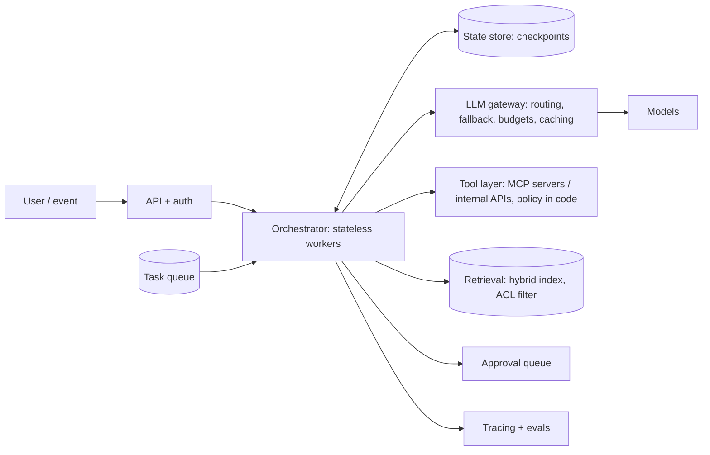
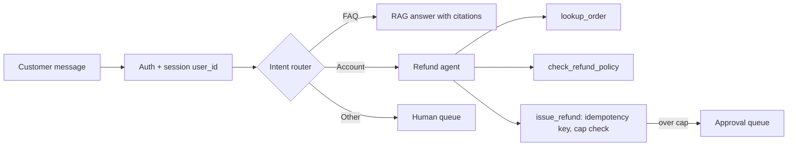
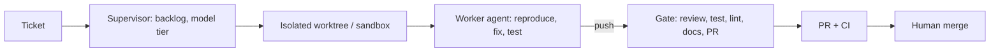

# System design

Expect one 30-45 minute round.
Interviewers grade the process as much as the diagram: clarify, justify workflow versus agent, name failure modes, and propose an eval and a rollout.

## The 9-step frame

Use this structure for any design question, and say the steps out loud so the interviewer can follow.

1. **Clarify** requirements, users, scale, and the risk of the actions involved.
2. **Decide: workflow or agent?** Justify it; default to the simplest option that works.
3. **Components:** orchestrator, tools or MCP servers, memory and RAG, state store, model gateway.
4. **Guardrails and human-in-the-loop:** where policy lives in code; which actions need approval.
5. **Evaluation plan:** offline suite, graders, success metric.
6. **Observability:** traces, dashboards, alerts.
7. **Cost and latency:** a back-of-envelope estimate (see [Cost and Latency](07-Cost-and-Latency.md)).
8. **Failure modes:** what breaks and how the system degrades.
9. **Rollout:** shadow mode, then human-approved, then autonomous for low-risk actions.

**Time plan for 45 minutes:** clarify 5, high-level design 10, deep dive on the riskiest component 15, evals and failure modes 10, rollout and questions 5.

**The generic reference architecture** most answers adapt:

Go deeper: [Deployment Architectures](../Agentic_AI_Zero_to_Godhood/Volume_12_Production_Engineering/Chapter_05_Deployment_Architectures.md), [Choosing An Architecture](../Agentic_AI_Zero_to_Godhood/Volume_04_Agent_Architectures/Chapter_07_Choosing_An_Architecture.md).

---

## Q49. Design a customer-support agent that can issue refunds.

**Clarify:** channels (chat, email), volume, refund limits, which systems hold orders and policy, languages, required response time.

- **Routing:** classify intent first; FAQs go to RAG over help articles, account actions go to the agent, anything else escalates to a human.
- **Tools:** `lookup_order`, `check_refund_policy`, `issue_refund` (requires an idempotency key), `escalate_to_human`.
- **Policy in code:**
  - Refunds under $X are automatic; larger ones go to an approval queue.
  - Authenticate the user before any account tool is callable, and scope tools to that user's ID server-side; never trust the model to pass the right user ID.
  - `issue_refund` re-checks eligibility itself; it does not trust the model's reading of the policy.
- **Injection risk:** the user can type anything, so policy is enforced in code, not in the prompt.
- **Evaluation:** a tau-bench-style simulated user with scripted goals and a check of the final database state; report pass^k, because a customer does not get retries.
- **Metrics:** resolution rate, escalation rate, wrong-refund rate (the safety metric), CSAT, cost per resolved ticket.
- **Failure modes:** refund issued twice on retry (idempotency key), policy misread (tool re-checks), angry user loops (escalate after N turns), order system down (graceful handoff).
- **Rollout:** shadow mode (agent drafts, humans send), then auto-send for FAQs, then auto-refunds under a low cap, raising the cap as the wrong-refund rate stays at zero.

---

## Q50. Design a deep-research agent.

- An orchestrator plans sub-questions and spawns parallel search subagents, each with a clean context and a clear brief (objective, output format, sources to prefer, stop condition).
- Subagents return condensed findings with sources, not raw pages.
- The orchestrator synthesizes, and a citation agent verifies each claim against its source.
- **Controls:** budgets on subagent count, depth, and tokens; scale effort to query complexity (one agent for a fact lookup, many for a broad survey); source-quality heuristics; deduplication.
- **State:** the plan and findings persisted outside the context so the orchestrator can compact and resume.
- **Evaluation:** an LLM-judge rubric (factual accuracy, citation accuracy, completeness, source quality, tool efficiency) plus human spot checks for subtle failures.
- **Failure modes:** subagents duplicating work (clear task boundaries), SEO spam sources (quality heuristics), runaway spawning (budgets), synthesis hallucinating beyond sources (citation check).

Go deeper: [Multi-Agent Case Studies](../Agentic_AI_Zero_to_Godhood/Volume_07_Multi_Agent_Systems/Chapter_07_Case_Studies.md).

---

## Q51. Design a coding agent that fixes bugs from tickets.

This is essentially my harness; answer from experience and link to the [End-to-End Lifecycle](../Agentic-Harness/03-End-to-End-Lifecycle.md).

- A ticket arrives; the orchestrator files it, picks a model tier, and starts a worker in an isolated worktree or sandbox with repo search, file read and edit, and test running.
- The worker reproduces the bug with a failing test, fixes it, runs the full test suite, lint, and typecheck.
- It publishes only through a gate that reviews the diff, reruns tests, and opens the PR; a human reviews and merges.
- **Guardrails:** no push to main, no secret access, no edits to CI or lint configs without approval, time and token budgets, and a hook that blocks destructive commands.
- **Evaluation:** SWE-bench-style resolved rate on internal historical bugs (replay a fixed commit, hidden tests decide), plus reviewer acceptance rate and revert rate after merge.
- **Failure modes:** the agent "fixes" the test instead of the code (protected tests, diff review), flaky tests misread as regressions (rerun and quarantine), large tickets (decompose or escalate), environment drift (reproducible dev environment).
- **Rollout:** start with low-risk ticket classes (lint, dependency bumps, small bugs), measure acceptance, widen.

---

## Q52. Design an agent for trading or finance operations.

Likely if the company is in finance.
Example: a **trade-break investigation agent**.

- **Tools:** read-only access to trade stores, market data, confirmations, and the reconciliation system.
  The agent proposes a root cause and a fix; a human approves any booking change.
- **Requirements:**
  - A full audit log: inputs, sources, tool calls, model and prompt versions, approvals.
  - Deterministic reproducibility of what the agent saw (snapshot IDs for the data it read).
  - Data never leaves the premises: on-prem models, which is my BNP experience.
  - Model risk management documentation (SR 11-7): purpose, limitations, validation results, monitoring.
- **Hard rule:** never let the LLM compute numbers that matter.
  It calls calculation tools (P&L, notional, FX conversion) and cites their outputs.
- **Evaluation:** historical breaks with known root causes; measure root-cause accuracy and time-to-resolution against the current manual process.
- **Rollout:** analyst assist first (suggestions in the break UI), then auto-classification of common break types, never autonomous booking.

---

## Q53. Design an enterprise knowledge assistant over Confluence, Jira, and Git with access control.

- One connector or MCP server per source, with incremental sync (change feeds or timestamps) and tombstones for deletes.
- **Document-level ACLs stored as metadata and enforced at retrieval time**, filtered by the caller's identity resolved server-side.
  This is the most important point to raise; permissions change, so sync them too.
- Hybrid search plus reranking, citations with links, freshness weighting, and PII handling.
- Source-specific chunking: pages by heading, tickets as title plus description plus resolution, code by function.
- Evaluation on real employee questions, with expected sources, and a permission-leak test suite (users who must not see a document ask about it).
- Failure modes: stale pages outranking current ones (freshness), permission drift (periodic full ACL resync), questions that need aggregation across many tickets (agentic retrieval or precomputed summaries).

---

## Q54. How do you scale an agent platform to many concurrent users?

- Stateless orchestrator workers plus an external state store (Postgres or Redis checkpoints), so any worker can resume any task.
- A queue for long-running tasks, with visibility timeouts and idempotent steps.
- Per-tenant rate limits and budgets.
- An LLM gateway: routing, fallback across providers, caching, key management, cost attribution.
- Async I/O for tool calls; connection pools to downstream APIs.
- Streaming responses to users.
- Autoscaling of self-hosted inference on queue depth and KV-cache utilization, not CPU.
- Backpressure: when providers rate-limit, queue and shed low-priority work rather than retry-storming.

---

## Expansion designs (D1-D6)

**D1. Design an LLM gateway.**
One API in front of all providers: authentication, per-tenant keys and budgets, routing by model and policy, retries and fallback across providers, response and prompt caching, request and token logging for cost attribution, PII redaction, and rate limiting with fair queuing.
Hot path must add little latency: keep policy checks in memory, log asynchronously.
Failure mode to name: a gateway outage takes down every AI feature, so run it redundantly and fail open only for non-sensitive paths.

**D2. Design an evaluation platform for agents.**
A versioned dataset store (tasks, fixtures, expected outcomes), a runner that executes each task n times in sandboxes against a pinned model and prompt version, pluggable graders (code, state checks, LLM judges with calibration sets), and a results store with per-task diffs between versions.
CI blocks a merge when pass rates drop beyond the confidence interval (see E2 in [Evals](04-Evals-Reliability-Observability.md)).
Production failures flow back into the dataset.

**D3. Design a personal assistant that reads email and calendar and can send email.**
This is the lethal trifecta by construction: private data, untrusted content (incoming email), and an exfiltration channel (sending email).
Break it: drafting is autonomous, sending requires user confirmation; quarantine email content from the planning model; restrict links and attachments in outgoing mail; log every action.
Memory of user preferences is stored with provenance and is user-visible and deletable.

**D4. Design a compliance-alert triage agent for trade surveillance.**
Inputs: alerts from surveillance rules, trade and order data, communications metadata.
The agent gathers context (related trades, market moves, prior alerts on the account) with read-only tools, drafts a disposition with evidence, and routes to an analyst; it never closes an alert on its own.
Evaluate against historical analyst dispositions; watch for automation bias (analysts approving without reading) by sampling and second review.

**D5. Design an internal MCP tool platform for a large company.**
A registry of approved MCP servers with owners, versions, scopes, and security review status; a gateway that authenticates users with OAuth, issues audience-bound tokens per server, and logs every call.
Tool definitions are pinned per version and diffed on change (rug-pull protection); servers run with least privilege, and high-impact tools require approval flows.

**D6. Design a text-to-SQL data analyst agent.**
Give the agent schema search, sample-rows, and query tools against a read-only replica with row-level security and query cost limits.
Validate SQL before running (parse, allowlist statements, `LIMIT`), return results with the query shown, and let the agent iterate on errors.
Evaluate on questions with known answers (execution accuracy), and flag ambiguous metric definitions for a human rather than guessing.
