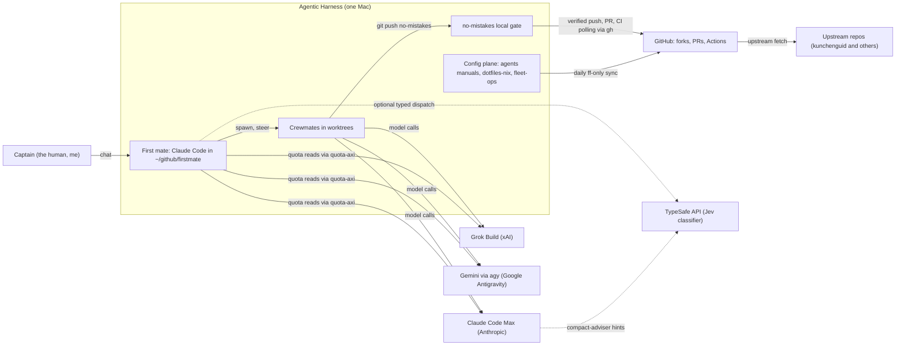
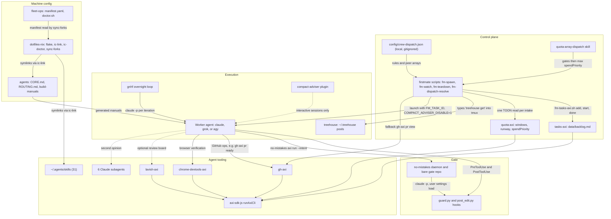
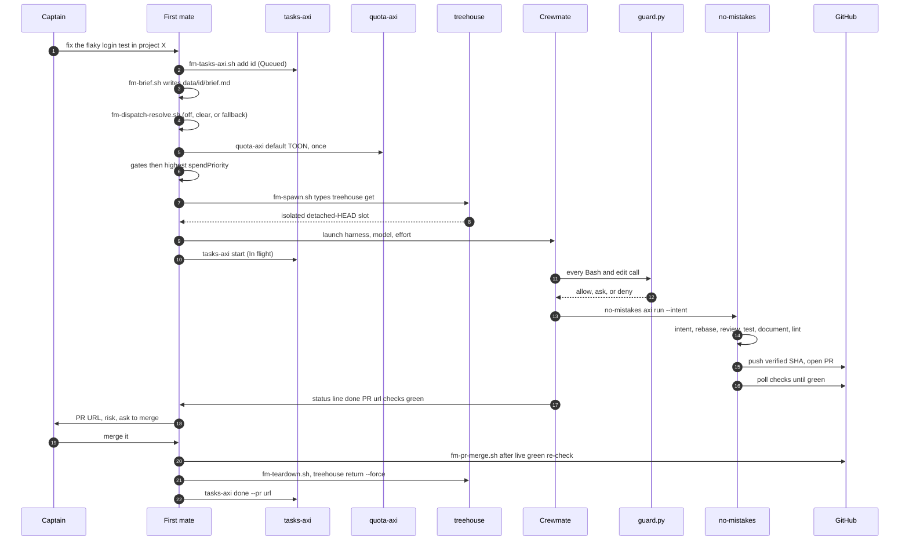
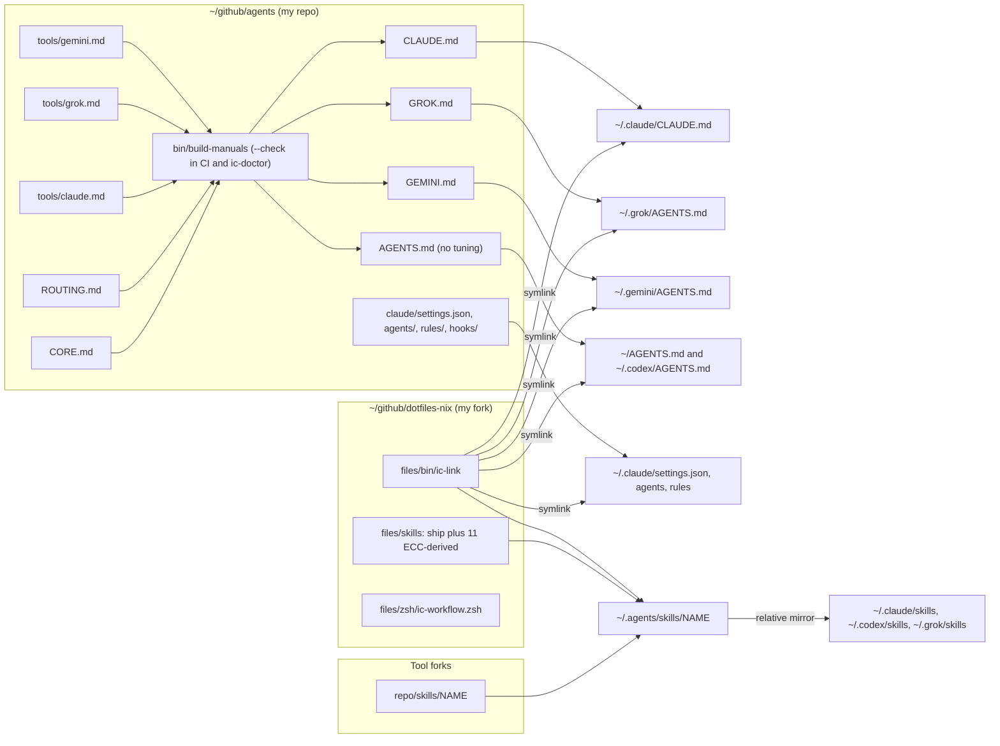
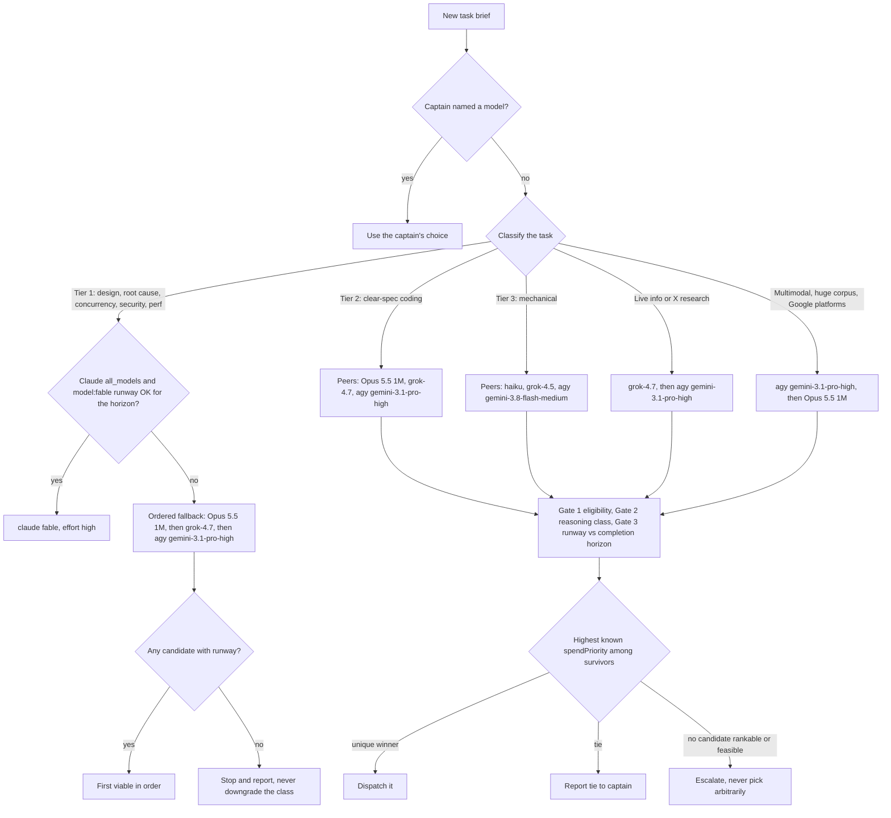
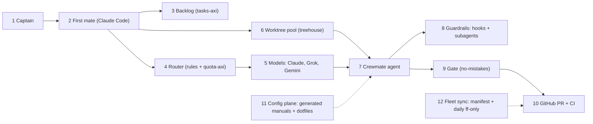

# Agentic Harness - architecture and diagrams

Six diagrams, each followed by a short explanation, from widest to narrowest, ending with a whiteboard version to draw from memory.
Citations use `repo/path:line` relative to `~/github`; see [00-Executive-Summary](00-Executive-Summary.md) for context and [components/](components/) for depth.

## 1. System context

The harness is a box on one laptop with three paid model subscriptions and GitHub as its only publication target.
The human talks only to the first mate; crewmates never address the human (`firstmate/AGENTS.md:38-40`).
Every edge that leaves the box toward GitHub goes through `no-mistakes` or the fork-sync job, which is the property that makes the rest of the design safe to automate.
The TypeSafe edges are dotted because both are optional: typed dispatch runs only when `TYPESAFE_API_KEY` is set (`firstmate/bin/fm-dispatch-resolve.sh:8-12`), and compact-adviser only in interactive sessions with its key injected (`dotfiles-nix/files/zsh/ic-workflow.zsh:538-550`).

## 2. Container view

Each box is one repo or one file, and each edge is a real call or file contract.
The control plane never edits projects; its only write paths are the backlog, its own `state/` files, and tmux (`firstmate/AGENTS.md:27-31`).
All five Node CLIs share `runAxiCli` from `axi-sdk-js`, which is why they share one exit-code contract: 0 success, 2 validation error, 1 otherwise ([axi](components/axi.md)).
The gate is two things at two scopes: per-tool-call hooks (`guard.py` before, `post_edit.py` after) and the per-branch pipeline (`no-mistakes`).
The machine-config layer has no runtime role; it produces the files everything else reads, which is why a broken link there fails quietly and `ic-doctor` exists ([dotfiles-nix](components/dotfiles-nix.md)).

## 3. Sequence: one task end to end

This is the happy path for a `no-mistakes` ship with `yolo` off; [03-End-to-End-Lifecycle](03-End-to-End-Lifecycle.md) walks each numbered arrow with file and line citations.
Two details matter in an interview.
The backlog row moves to In flight only after the launch succeeds (`firstmate/bin/fm-spawn.sh:4937`), and teardown pairs worktree removal with `tasks-axi done` under one lock with a crash-replay marker (`firstmate/bin/fm-backlog-transition-lib.sh:7-20`).
The merge needs the human's word unless the project is `+yolo` (`firstmate/AGENTS.md:32-33`, `:357-358`).

## 4. Config generation flow

`render()` concatenates `CORE.md`, `ROUTING.md`, and one tuning file per tool, with a "Generated by ... Do not edit" header (`agents/bin/build-manuals:48-62`).
Before rendering, `check_no_restated_rules` rejects any tuning or subagent file that repeats a core line verbatim (`agents/bin/build-manuals:79-121`), and `--check` compares rendered output byte for byte against the committed manuals.
`ic-link` then points each tool's home at its own manual and never falls back to Claude's manual for another tool (`dotfiles-nix/files/bin/ic-link:103-135`, `:143-175`).
Hooks are not copied anywhere: `settings.json` runs them by absolute path from the `agents` clone, guarded by `[ ! -f "$f" ] ||` so a missing clone is a no-op ([claude-code-config](components/claude-code-config.md)).
The weak point is the reverse edge: Claude Code writes its own settings through the symlink, which is how the committed `model` pin was dropped from the live file ([agents](components/agents.md) section 5).

## 5. Model routing decision

Step 1 (fit) comes from `agents/ROUTING.md:10-16` and is encoded as rules in `firstmate/config/crew-dispatch.json:2-56`.
Step 2 (quota) comes from `agents/ROUTING.md:17-19` and is executed by the `quota-array-dispatch` skill (`firstmate/.agents/skills/quota-array-dispatch/SKILL.md:58-134`).
Tier 1 is deliberately outside `spendPriority`: a cheaper model is a quality downgrade, not a peer (`firstmate/config/crew-dispatch.json:6`).
Unknown `spendPriority` (for example every `agy` row today) keeps a candidate eligible but never ranks it above a peer with known evidence (`agents/ROUTING.md:18`).
Full detail, formula, and a worked example are in [04-Model-Routing-and-Quota](04-Model-Routing-and-Quota.md).

## 6. Whiteboard version (12 boxes, 2 minutes)

Draw it left to right in three rows: the decision row (1 to 5), the work row (6 to 9), and the platform row (10 to 12).

### Narration script

1. Draw box 1, "Captain": "I am the only human; I talk to exactly one agent."
2. Draw box 2, "First mate": "A Claude Code session whose job description forbids it from editing code; it supervises."
3. Draw box 3, "Backlog": "Every request becomes a row in a Markdown backlog, changed only through a CLI with a lockfile and atomic rename, so crashes and races do not lose work."
4. Draw box 4, "Router": "Routing is two steps: classify the task into a tier, then pick among that tier's models using live quota runway and a use-it-or-lose-it score."
5. Draw box 5, "Models": "Three subscriptions; the frontier model is reserved for hard reasoning and never traded down to save quota."
6. Draw box 6, "Worktree pool": "Each task gets a recycled git worktree at detached HEAD, so parallel agents never share a checkout."
7. Draw box 7, "Crewmate": "The worker agent implements in that worktree, reports status by appending to a file, and a zero-token bash watcher wakes the supervisor only when something is actionable."
8. Draw box 8, "Guardrails": "Every shell and edit call passes a hook that always blocks force-push to main and hook bypasses, asks a human for risky commands when one is present, and blocks config tampering when none is; reviewer subagents give a second opinion."
9. Draw box 9, "Gate": "The worker cannot push to origin; it pushes to a local gate that reviews, tests, documents, lints, pushes an exact verified SHA, opens the PR, and watches CI."
10. Draw box 10, "GitHub": "Only green, attested branches arrive here, and I approve the merge."
11. Draw box 11 with a dotted line to 7: "All agents read one generated manual per tool, built from a single source with a drift check in CI."
12. Draw box 12 with a dotted line to 10: "A manifest of 22 forks is fast-forwarded and rebuilt daily, and a read-only doctor verifies the whole machine."
13. Close: "Deterministic scripts own anything that can be exact; agents own judgment; nothing reaches GitHub except through the gate."
