# Agentic Harness - one task, end to end

This note traces one realistic request, "fix the flaky login test in project X", through the real files, then the two side paths: the overnight `gnhf` loop and context pressure via `compact-adviser`.
Citations use `repo/path:line` relative to `~/github`; every step names the file that owns it.
A step that is instruction-only (an agent is told to do it, but no code enforces it) is labeled "instruction", and a step I could not confirm in code is marked (unverified).
The live first-mate home currently has no registered projects and no `data/backlog.md` ([firstmate](components/firstmate.md) section 3), so this is a code-and-docs trace, not a replay of a logged run; the gate run quoted in step 13 is a real run from the `agents` repo.

## 0. Map of the path

```mermaid
flowchart LR
  A["1 Launch fm"] --> B["2 Intake and classify"]
  B --> C["3 Backlog row (tasks-axi)"]
  C --> D["4 Brief"]
  D --> E["5 Route (rules + quota-axi)"]
  E --> F["6 Spawn in treehouse slot"]
  F --> G["7 Implement under hooks"]
  G --> H["8 Reviewer subagents"]
  H --> I["9 Browser verification"]
  I --> J["10 no-mistakes gate"]
  J --> K["11 Ready signal and merge"]
  K --> L["12 Teardown, tasks-axi done --pr"]
  L --> M["13 stow"]
```

## 1. Launch the first mate

- I type `fm`, which is `alias fm='firstmate'`; the function does `cd "$HOME/github/firstmate"` and runs `command "${FM_DEFAULT_HARNESS:-claude}"` (`dotfiles-nix/files/zsh/ic-workflow.zsh:518-526`).
- `command` skips the `claude()` wrapper that injects the TypeSafe key from the Keychain, on purpose, so the first mate does not inherit it from the shell (`dotfiles-nix/files/zsh/ic-workflow.zsh:528-536`).
- Claude Code loads the global layer: `~/.claude/settings.json` (symlink to `agents/claude/settings.json`, with the `guard.py` and `post_edit.py` hooks) and `~/.claude/CLAUDE.md` (generated manual) ([claude-code-config](components/claude-code-config.md)).
- It also loads the project layer from the cwd: `firstmate/AGENTS.md` is the first mate's job description, and `firstmate/.claude/settings.json` adds its own hooks.
- The project `SessionStart` hook runs `bin/fm-sessionstart-run.sh`, which runs `fm-session-start.sh`: session lock, bootstrap (full on a normal locked start with network checks deferred; detect-only only when the lock is refused or the digest is re-emitted after a clear or compact, `firstmate/bin/fm-session-start.sh:684-697`), wake-queue drain, supervision block, fleet digest, network checks (`firstmate/bin/fm-session-start.sh:26-55`).
- If the lock is already held by another session, this one stays read-only (`firstmate/AGENTS.md:179-180`).
- Whether Claude Code runs both the global hooks and the firstmate project hooks together in this session is (unverified); both are registered in their respective files.

## 2. Intake and classification

- The first mate resolves the project: explicit name wins, otherwise match against the registry and work under way (`firstmate/AGENTS.md:293-296`).
- An unregistered project is cloned into `projects/X` through the `project-management` skill, which runs `no-mistakes init && no-mistakes doctor` ([firstmate](components/firstmate.md) section 7, step 2).
- It classifies the deliverable as a ship (a code change) rather than a scout (a report) (`firstmate/AGENTS.md:305-308`).
- It resolves delivery mode and `yolo` merge posture now; an unregistered project resolves to `no-mistakes` with `yolo` off (`firstmate/AGENTS.md:315-320`).
- Hard rule: the first mate never edits the project itself (`firstmate/AGENTS.md:27-31`).

## 3. Backlog row (tasks-axi)

- The first mate files the item with `bin/fm-tasks-axi.sh add <id> ...` (`firstmate/AGENTS.md:537`, `:544`).
- The wrapper runs tasks-axi from the data directory's parent with `TASKS_AXI_FILE=<data>/backlog.md`, and refuses a caller `--file` or a symlinked backlog with exit 2 (`firstmate/bin/fm-tasks-axi.sh:17-43`).
- tasks-axi takes an `O_EXCL` lockfile, retries every 25 ms up to 2.5 s, checks that the file did not change since it was read, and writes through a temp file plus rename (`tasks-axi/src/backends/lock.ts:23-25`, `tasks-axi/src/backends/markdown.ts:481-493`).
- The row lands in `## Queued`; it moves to In flight only in step 6.

## 4. Brief

- `bin/fm-brief.sh <id> X --mode no-mistakes` writes `data/<id>/brief.md` from a scaffold (`firstmate/AGENTS.md:552-558`).
- `## Captain's intent` holds my words; `## Firstmate spec` holds only build instructions (`firstmate/AGENTS.md:555-556`).
- The ship brief's first action is `git checkout -b fm/$ID`, and its rules include "Use gh-axi for GitHub operations and chrome-devtools-axi for browser operations" and an append-only status protocol (`firstmate/bin/fm-brief.sh:509-517`).

## 5. Route: harness, model, effort

- Same turn, the first mate runs `bin/fm-dispatch-resolve.sh data/<id>/brief.md --project X` (`firstmate/AGENTS.md:235`).
- If `TYPESAFE_API_KEY` is set in the environment or the home `.env`, it sends the brief and every rule's `when` text to TypeSafe's classifier as one choice question, then does all quota math in `jq` from one `quota-axi --json` snapshot; otherwise it prints `dispatch-resolve: off` (`firstmate/bin/fm-dispatch-resolve.sh:8-31`).
- Every outcome exits 0; only `clear` yields a `profile:` line, and `ambiguous`, `escalate`, `error`, or `off` fall back to the manual procedure (`firstmate/bin/fm-dispatch-resolve.sh:34-48`).
- The manual procedure is the `quota-array-dispatch` skill: read `quota-axi` default TOON once, apply eligibility, reasoning-class, and runway gates, then take the highest known `spendPriority` (`firstmate/.agents/skills/quota-array-dispatch/SKILL.md:39-122`).
- The rules themselves live in my gitignored `firstmate/config/crew-dispatch.json`; "fix a flaky test with a known cause" matches the Tier 2 rule, whose peers are Opus 5.5 1M, `grok-4.7`, and `agy gemini-3.1-pro-high` (`firstmate/config/crew-dispatch.json:17-25`).
- A "flaky test with no clear cause" would instead match Tier 1 ("root-cause debugging with no clear cause") and go to `claude fable` (`firstmate/config/crew-dispatch.json:4-6`).
- The real snapshot at 2026-09-23T22:48Z shows why the gates matter: Claude had budget left but a projected five-hour exhaustion in 6,860 s, Grok was `exhausted_now`, and Gemini's `spendPriority` was `unknown`, so a multi-hour Tier 2 task had no candidate that was both ranked and provably feasible, and the skill says to escalate rather than guess ([firstmate](components/firstmate.md) section 7, step 5).
- Details: [04-Model-Routing-and-Quota](04-Model-Routing-and-Quota.md).

## 6. Spawn the crewmate in a treehouse slot

- `bin/fm-spawn.sh <id> projects/X --mode no-mistakes --yolo off --harness claude --model 'claude-opus-5-5[1m]' --effort high`.
- It refuses without an explicit harness while `config/crew-dispatch.json` exists, so the rules can never be skipped silently (`firstmate/bin/fm-spawn.sh:2088-2090`).
- It refuses a task with no backlog row (`firstmate/bin/fm-spawn.sh:3106-3112`).
- It types `treehouse get` into the new tmux window and waits until the pane's cwd is a distinct isolated worktree (`firstmate/bin/fm-spawn.sh:3843-3902`).
- Inside treehouse, `get` fetches `origin`, takes the pool state lock, and reuses only a slot that is idle, unleased, clean, and provably merged, else adds a new worktree under `max_trees` (`treehouse/internal/pool/pool.go:355-371`, `:433-457`).
- The slot is at detached HEAD, so no two slots fight over a branch name ([treehouse](components/treehouse.md) section 11).
- Before launch it exports `COMPACT_ADVISER_DISABLE=1` and `FM_TASK_ID=<id>` into the pane (`firstmate/bin/fm-spawn.sh:4727`, `:4737`).
- Only after the launch succeeds does it move the backlog row to In flight via `tasks-axi start` (`firstmate/bin/fm-spawn.sh:4937`, `firstmate/bin/fm-backlog-transition-lib.sh:14`).

## 7. Implement under guard.py and post_edit.py

- The crewmate is a normal Claude Code session in a project worktree, so it loads the global `~/.claude/settings.json` hooks but not firstmate's project hooks (inferred from the cwd; not separately tested).
- Because `FM_TASK_ID` is set, `guard.py` treats the session as unattended: `human_present` returns false (`agents/claude/hooks/guard.py:59-65`).
- Unattended consequences: always-deny classes still deny (hook bypass with `--no-verify`, force-push or delete of `main`/`master`/`develop`/`trunk`, recursive `rm` of critical paths); ask-level commands such as `git reset --hard` are allowed; edits to an existing lint, format, or gate config such as `.no-mistakes.yaml` or `ruff.toml` are denied ([agents](components/agents.md) section 5).
- Reproduced decisions: `git push --force origin main` deny in both modes; `git reset --hard HEAD~1` ask attended, allow unattended; editing an existing `ruff.toml` unattended is denied ([agents](components/agents.md) section 7).
- After every edit, `post_edit.py` runs `ruff check` and `ruff format --check` only if the project configures ruff, and `clang-format --dry-run` only with a `.clang-format`, returning findings on stderr with exit 2 so the model sees them in the same turn (`agents/claude/hooks/post_edit.py:86-118`, `:150-161`).
- The worker reports progress by appending lines such as `working [at=<epoch>]: ...` to `state/<id>.status` (`firstmate/bin/fm-brief.sh:515-517`).
- The first mate does not poll: its `Stop` hook arms a zero-token bash watcher (`fm-claude-stop-autoarm.sh`, `asyncRewake`, 28,800 s timeout) that rewakes the model only on `signal:`, `stale:`, `check:`, or `heartbeat` (`firstmate/.claude/settings.json`, `firstmate/docs/supervision-protocols/claude.md:1-9`).

## 8. Reviewer subagents (instruction)

- The Claude manual tells every Claude session to get a fresh-context second opinion before the gate: `python-reviewer` or `cpp-reviewer` for nontrivial diffs, `silent-failure-hunter` for code that moves data or state, `pr-test-analyzer` for whether tests prove the change (`agents/tools/claude.md:28-30`).
- The C++ rule file adds that opening C++ files should load `cpp-coding-standards` and delegate review to `cpp-reviewer` ([claude-code-config](components/claude-code-config.md) section 7, step 7).
- All six subagents pin `claude-opus-5-5` at high effort so delegated review never spends the Fable week; five are read-only (`agents/tools/claude.md:29-30`).
- No script or hook invokes them; whether a given crewmate actually calls them is up to the model (unverified per run).
- The first mate itself is blocked from delegating to harness-native subagents by `bin/fm-subagent-pretool-check.sh`, because untracked delegated work would escape supervision (`firstmate/bin/fm-subagent-pretool-check.sh:1-12`).

## 9. Browser verification with chrome-devtools-axi (instruction)

- The brief's rule 3 and the `ship` skill both say to use `chrome-devtools-axi` for anything with a web surface and to "drive the real page, do not guess" (`firstmate/bin/fm-brief.sh:514`, `dotfiles-nix/files/skills/ship/SKILL.md:48`).
- The tool is a short-lived CLI talking to a detached bridge on `127.0.0.1:9224`, which holds one MCP session to `chrome-devtools-mcp` driving headless, isolated Chrome over CDP ([chrome-devtools-axi](components/chrome-devtools-axi.md)).
- Element refs are generation-stamped and fail with `STALE_REF` rather than clicking the wrong element ([chrome-devtools-axi](components/chrome-devtools-axi.md)).
- Nothing enforces that a crewmate ran it; a login-test fix would only reach a browser if the worker chose to (unverified per run).

## 10. The no-mistakes gate

The brief makes the worker the owner of the pipeline: pass `--intent` taken only from the Captain's-intent subsection, never pass `--yes`, route ask-user findings to the first mate, and background long drive calls then poll `axi status` (`firstmate/bin/fm-dod-lib.sh:283-306`).

1. The worker runs `no-mistakes axi run --intent "..."` (`no-mistakes/internal/cli/axi_drive.go:119-152`), which pushes the branch to the `no-mistakes` remote, a local bare gate repo under `~/.no-mistakes/repos/` ([no-mistakes](components/no-mistakes.md) section 7).
2. The gate's post-receive hook calls the hidden `no-mistakes daemon notify-push`, which hands off to the run manager with a per repo and branch mutex (`no-mistakes/internal/git/hook.go:133-209`, `no-mistakes/internal/daemon/manager.go:771`, `:1274-1281`).
3. The executor runs the fixed step list `intent, rebase, review, test, document, lint, push, pr, ci` in a disposable worktree (`no-mistakes/internal/pipeline/steps/common.go:361-376`, `no-mistakes/internal/pipeline/executor.go:209-292`).
4. Agent-driven steps launch `claude -p --verbose --output-format stream-json [--setting-sources user] [--json-schema ...] --dangerously-skip-permissions`; the setting-sources flag is added only when the repo sets `disable_project_settings`, and user settings, including `guard.py`, still load (`no-mistakes/internal/agent/claude.go:174-204`).
5. With my `auto_fix.review: 0`, review findings park for a decision; lint, test, document, rebase, and CI auto-fix up to 3 times ([no-mistakes](components/no-mistakes.md) section 5).
6. Push never pushes a mutable `HEAD`: it pushes a verified SHA, uses `--force-with-lease` anchored to an explicit remote SHA when needed, rewrites the PR attestation first, and re-reads the remote with `ls-remote` afterwards (`no-mistakes/internal/pipeline/steps/push.go:170-205`).
7. The PR step opens the PR with a body that includes a `no-mistakes-pipeline-attestation` comment, which upstream repos' required `require-no-mistakes` check verifies ([no-mistakes](components/no-mistakes.md) section 7, step 11).
8. The CI step uses the `gh` CLI (version 2.50 or newer for `gh pr checks --json`), not gh-axi, and polls every 30 s, then 60 s, then 120 s (`no-mistakes/docs/src/content/docs/reference/pipeline-steps.md:323`, `:332`).

A real run, for scale: PR #9 on my `agents` repo took review 226.7 s, test 128.3 s, document 61.2 s, and CI 166.5 s, and ended `passed` ([no-mistakes](components/no-mistakes.md) section 7).

## 11. Ready signal, human merge decision

- On CI green the worker confirms the PR is not a draft with `gh pr view <url> --json isDraft`, then appends `done [at=<epoch>]: PR <url> checks green` (`firstmate/bin/fm-dod-lib.sh:308-310`).
- In `direct-PR` mode the worker opens the PR itself with `gh-axi` and marks it ready with `gh-axi pr ready` (`firstmate/bin/fm-dod-lib.sh:256-257`).
- The watcher wakes the first mate, which runs `bin/fm-pr-check.sh <id> <url>` to record `pr=` and arm a merge poll, then tells me the full PR URL and risk (`firstmate/AGENTS.md:394-396`).
- firstmate's PR library falls back to `gh-axi pr view --repo` and parses exactly one lowercase `state:` line (`firstmate/bin/fm-pr-lib.sh:908`, [gh-axi](components/gh-axi.md) section 6).
- Only on my explicit word (or project `+yolo`) does `bin/fm-pr-merge.sh` merge, after a live read proves open, not draft, mergeable, and green, using `--match-head-commit` (`firstmate/AGENTS.md:32-33`, `:357-363`, [firstmate](components/firstmate.md) section 4).

## 12. Teardown and backlog close

- `bin/fm-teardown.sh <id>` proves the work landed, then returns the slot with `treehouse return --force`, retrying on a stale `index.lock` (`firstmate/bin/fm-teardown.sh:1702-1762`).
- treehouse kills lingering processes under the state lock, resets, and recycles the slot ([treehouse](components/treehouse.md) section 7).
- In the same process and under the task's meta lock, teardown removes `state/<id>.meta` and runs `tasks-axi done` with the PR link; a `state/<id>.backlog-close` marker makes a crash replayable, and `done` on an already-closed task only backfills links (`firstmate/bin/fm-backlog-transition-lib.sh:7-20`, `:41-51`).
- tasks-axi accepts only canonical GitHub `/pull/<n>` or Forgejo `/pulls/<n>` URLs (`tasks-axi/src/pr-url.ts:16-31`) and keeps the last 10 Done rows, archiving the rest (`firstmate/.tasks.toml`).
- Teardown refuses dirty or unlanded worktrees; `--force` needs explicit discard authority (`firstmate/AGENTS.md:34-37`, `:401-403`).

## 13. stow

- When I invoke `/stow`, the first mate loads the `stow` skill to curate memory and persist open work records; it never reconciles the backlog against repository or PR reality (`firstmate/AGENTS.md:285`).
- Outside firstmate, the `ship` skill ends every loop with `tasks-axi done <id> --pr <url>` and then `stow` (`dotfiles-nix/files/skills/ship/SKILL.md:75-82`).
- `~/.agents/skills/stow` links to `firstmate/skills/stow` ([skills-catalog](components/skills-catalog.md)).

## 14. Where lavish-axi fits

- lavish-axi is for plans, comparisons, and visual reports where a rich artifact beats prose (`agents/ROUTING.md:28`, `dotfiles-nix/files/skills/ship/SKILL.md:49`).
- In firstmate, scout briefs (not ship briefs) get a Lavish line: arm the board with `bin/fm-procevent-lavish.sh arm <artifact.html> --for <task-id>` and never run `lavish-axi poll` directly, which turns a blocking human review into a wake event (`firstmate/bin/fm-brief.sh:403-407`).
- If lavish-axi is missing or below `LAVISH_AXI_MIN=0.1.46`, the brief asks for a text report instead (`firstmate/bin/fm-bootstrap.sh:926`, `firstmate/bin/fm-brief.sh:406-407`).
- The first mate uses plain chat for yes-or-no decisions and Lavish only for multi-option or structured reports (`firstmate/AGENTS.md:528`).
- So in the flaky-test ship, Lavish is not on the default path; it appears if a scout first produced a diagnosis report for review.

## 15. Side path A: the overnight gnhf loop

gnhf is not called by firstmate (no reference in `firstmate/bin`); it is a separate supervisor I start by hand, alias `gn` (`dotfiles-nix/files/zsh/ic-workflow.zsh:506`).

1. Before starting, the `loop-design-check` skill asks for a machine-decidable goal, boundaries, and damping ([skills-catalog](components/skills-catalog.md)).
2. `gnhf --max-iterations 10 --stop-when "all tests pass" "fix the flaky suite"` refuses a dirty tree, creates branch `gnhf/<slug>`, and writes `.gnhf/runs/<runId>/` (prompt, `notes.md`, schema, base commit), excluded from git ([gnhf](components/gnhf.md) section 7).
3. Each iteration spawns a fresh `claude -p ... --output-format stream-json --json-schema ... --dangerously-skip-permissions` (`gnhf/src/core/agents/claude.ts:180-191`); `notes.md` is the only memory carried forward.
4. Success commits the iteration with signing disabled; failure runs `git reset --hard HEAD` and `git clean -fd` (`gnhf/src/core/git.ts:238-252`, `:293-296`).
5. A rate-limit rejection waits for the provider's reset and retries the same iteration without counting a failure; 3 consecutive failures abort ([gnhf](components/gnhf.md) section 8).
6. Inside these `claude -p` calls, `guard.py` runs in unattended mode and compact-adviser stays inert because the session is non-interactive (`compact-adviser/packages/claude-mod/hooks/register.ts:693-696`).
7. In the morning the `gnhf` skill's review step treats "stop condition met" as a claim to verify, not acceptance ([gnhf](components/gnhf.md) section 7, step 10).
8. The branch ships only through `no-mistakes`; `gnhf --push` performs a bare `git push`, which my manual forbids (`agents/ROUTING.md:29`, `gnhf/src/core/git.ts:273-291`).

## 16. Side path B: context pressure via compact-adviser

- compact-adviser runs only in interactive Claude Code sessions with `CLAUDE_CODE_ENABLE_FUNCTION_HOOKS=1` and without `COMPACT_ADVISER_DISABLE` (`compact-adviser/packages/claude-mod/hooks/register.ts:113-125`).
- On each completed turn it asks TypeSafe two questions (is the unit finished, is this hands-on work), scores `P(finished) x (0.5 + 0.5 x P(hands_on))`, and compares it to a floor that relaxes from 0.90 to 0.50 as context fills (`compact-adviser/packages/claude-mod/lib/judge.ts:188-211`).
- It shows a hint (or, on opt-in, compacts) only when the score clears the floor, with a 2 s timeout and without blocking the turn ([compact-adviser](components/compact-adviser.md) section 7).
- Crewmates never see it: `fm-spawn.sh` exports `COMPACT_ADVISER_DISABLE=1` (`firstmate/bin/fm-spawn.sh:4727`); `no-mistakes` and `gnhf` use non-interactive `claude -p`.
- A configuration question I found: the plugin resolves its key from the environment, then a menu-saved key, then a `.env` file in the working directory (`compact-adviser/packages/claude-mod/hooks/register.ts:127-141`).
  The first mate runs in `~/github/firstmate`, whose `.env` contains a `TYPESAFE_API_KEY` line (value not read), so the first-mate session may pick up the key through that fallback even though `fm` deliberately bypasses the Keychain wrapper (inferred from code; not observed live).
  The same `.env` line also opts the home into typed dispatch (`firstmate/bin/fm-dispatch-resolve.sh:8-12`), which the fleet manifest says should not happen (`.fleet/manifest.yaml:341`), so this is worth reconciling.

## 17. Failure points along the path

| Step | What can go wrong | What catches it |
| --- | --- | --- |
| 3 | Concurrent backlog edits | Lockfile, compare-before-write `CONFLICT`, atomic rename |
| 5 | Routing to a window that dies mid-task | Runway gate against the completion horizon; escalate when unprovable |
| 6 | Worker launched in the primary checkout | Spawn isolation assertion; `FM_TASK_ID` makes `fm-test-run.sh` refuse (`firstmate/docs/architecture.md:273-274`) |
| 7 | Agent force-pushes or bypasses hooks | `guard.py` always-deny class |
| 7 | Agent weakens lint instead of fixing code | Unattended config-edit deny |
| 10 | Pushed head differs from reviewed head | Push requires descent from the review-approved commit (`no-mistakes/internal/pipeline/steps/push.go:346`) |
| 11 | Merge of red or stale PR | Live re-check plus `--match-head-commit` |
| 12 | Crash between worktree return and backlog close | `backlog-close` marker replayed at next start |
| 15 | Overnight loop spins or games its stop condition | Caps, failure breaker, no-op counts as failure, morning verification |

## 18. Interview angle

**Q: Walk me through what happens when you ask for a bug fix.**
Use the 13-step map above, and stress three properties: the supervisor never edits code, every state change is paired with a durable record under a lock, and publication happens only through a gate that attests to review and tests.

**Q: Which steps are enforced by code and which rely on the model following instructions?**
Enforced: isolation, backlog pairing, dispatch-file consultation, hook denies, gate step order, verified push, merge authority.
Instruction-only: reviewer subagents, browser verification, and Lavish usage; I would close that gap by making the gate's Test step demand browser evidence for web-surface diffs.
