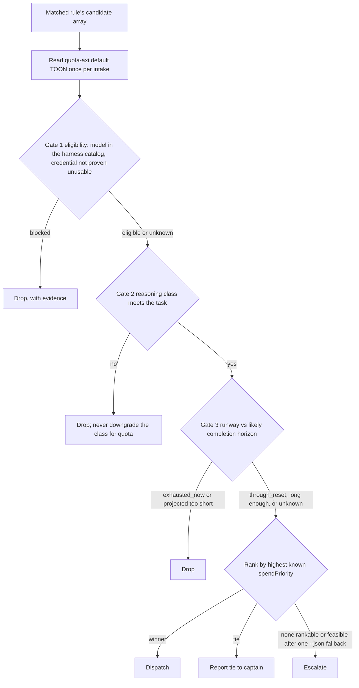

# Agentic Harness - model routing and quota

How each task gets a harness, a model, and an effort level, where every rule is written down, and why it is shaped this way.
Citations use `repo/path:line` relative to `~/github`, and `~/...` for home files.
The routing policy and its encoding are my work; the quota measurement (quota-axi) and the dispatch machinery (firstmate) are upstream code ([02-Inventory](02-Inventory.md)).

## 1. TL;DR

Routing is two steps: first classify the task and pick the best model class for it, then use live quota to pick among the peers in that class (`agents/ROUTING.md:9-17`).
Tier 1 (hard reasoning) goes to Claude Fable only, with an ordered fallback and a hard rule never to downgrade the class to save quota (`agents/ROUTING.md:11`, `:19`).
Tiers 2 and 3 are peer pools balanced by quota-axi's `spendPriority`, a signed, cycle-weighted "use it or lose it" score, after three gates: eligibility, reasoning class, and runway versus the task's completion horizon (`firstmate/.agents/skills/quota-array-dispatch/SKILL.md:58-122`).
The same policy exists in three forms: prose in every generated manual, rules in `firstmate/config/crew-dispatch.json`, and a procedure in the `quota-array-dispatch` skill.

## 2. The three subscriptions and their windows

| Subscription | How the harness reaches it | Windows quota-axi reports | Scopes used for routing | Evidence |
| --- | --- | --- | --- | --- |
| Claude Code Max | `claude` CLI | `five_hour` (session), `seven_day` (weekly), `model:fable` (Fable's own weekly window) | `all_models` = {`five_hour`, `seven_day`}; `model:<id>` = those plus the model's own window | `quota-axi/src/interpretation.ts:461-496` |
| Grok Build | `grok` CLI (`~/.local/bin/grok`) | `credits` plus product windows | `all_products` = {`credits`}; `product:<id>` = `credits` plus the product window | `quota-axi/src/interpretation.ts:553-584` |
| Gemini Pro | `agy` (Google Antigravity), because it is "the only surface `quota-axi` can measure Gemini on" | `gemini_5h`, `gemini_weekly` (and a separate `claude_gpt` group) | `gemini` = {`gemini_5h`, `gemini_weekly`} | `agents/ROUTING.md:9`, `quota-axi/src/interpretation.ts:895-930` |

The Fable window is separate from the shared window: exhausting Fable does not touch `all_models`, but it cannot be refilled early, which is why Fable is reserved for Tier 1 (`agents/tools/claude.md:13-14`).
Opus 5.5 draws on the shared `all_models` window, so it still has runway after a spent Fable week, which makes it the first Tier 1 fallback (`agents/tools/claude.md:15`).

## 3. Step 1: classify (the tiers)

| Class | What belongs here | Candidates (harness, model, effort) | Balanced by quota? | Evidence |
| --- | --- | --- | --- | --- |
| Tier 1, Claude has runway | Architecture, risky or wide refactors, concurrency, lifetime and UB work, root-cause debugging with no clear cause, security-sensitive changes, measured performance work, ambiguous multi-file tasks | `claude`, `fable`, high | No | `firstmate/config/crew-dispatch.json:3-7` |
| Tier 1, Claude cannot carry it | Same, when the `all_models` or `model:fable` row is `exhausted_now` or its projected runway is shorter than the task | Ordered: `claude` `claude-opus-5-5[1m]` high, then `grok` `grok-4.7` high, then `agy` `gemini-3.1-pro-high` | No, strict order; stop and report if none has runway | `firstmate/config/crew-dispatch.json:8-16` |
| Tier 2 | Scoped features, known-cause fixes, tests, contained refactors, normal reviews | `claude-opus-5-5[1m]` high, `grok-4.7` high, `agy gemini-3.1-pro-high` | Yes, by `spendPriority` | `firstmate/config/crew-dispatch.json:17-25` |
| Tier 3 | Renames, lint and format sweeps, typos, bumps, boilerplate, docs wording | `claude` `haiku` low, `grok` `grok-4.5` low, `agy` `gemini-3.8-flash-medium` | Yes | `firstmate/config/crew-dispatch.json:26-34` |
| Live or post-cutoff information, X research | Investigations, not code changes | `grok-4.7` high, then `agy gemini-3.1-pro-high` | Yes, among the two | `firstmate/config/crew-dispatch.json:35-42` |
| Multimodal, huge-corpus ingestion, Google platforms | Images, video, audio, scanned PDFs; whole-corpus reads; Gemini API, Vertex, Firebase, Workspace, Android | `agy gemini-3.1-pro-high`, then `claude-opus-5-5[1m]` high | Yes, among the two | `firstmate/config/crew-dispatch.json:43-50` |
| Default (no rule matched) | Anything else | Opus 5.5 1M, `grok-4.7`, `agy gemini-3.1-pro-high` | Yes | `firstmate/config/crew-dispatch.json:52-56` |

Every model ID above was checked against the live `grok models` and `agy models` catalogs on 2026-09-23 ([firstmate](components/firstmate.md) section 5).
Precedence inside firstmate is: an explicit per-task captain override, then the best-fit rule, then the default array, then the static crew harness (`firstmate/AGENTS.md:224`).
Effort follows the rule's `effort`; the Claude manual sets `high` as the floor for intelligence-sensitive work and reserves `max` for correctness-over-cost cases (`agents/tools/claude.md:18-19`).

## 4. Step 2: quota (gates, then spendPriority)



- Read the default TOON once and reuse it for every candidate; fall back to one `quota-axi --json` call only when the TOON is genuinely ambiguous (`firstmate/.agents/skills/quota-array-dispatch/SKILL.md:39-53`).
- Uncertainty is not ineligibility: missing model-level windows or an `unknown` scope keep a candidate eligible with disclosed uncertainty; only concrete contradictory evidence blocks (`firstmate/.agents/skills/quota-array-dispatch/SKILL.md:81-87`).
- Reasoning class is a hard gate: "Never use `spendPriority` or remaining quota to silently replace that class" (`firstmate/.agents/skills/quota-array-dispatch/SKILL.md:97-101`).
- Runway gate: `through_reset` passes; `exhausted_now` is zero; `projected_exhaustion` uses `usableRunwaySeconds`; a high `spendPriority` on a window that will die mid-task still fails (`firstmate/.agents/skills/quota-array-dispatch/SKILL.md:103-110`).
- Ranking: highest known `spendPriority`; `unknown` is never treated as zero or healthy; ties go to the captain, never array order (`firstmate/.agents/skills/quota-array-dispatch/SKILL.md:112-129`).
- My policy adds the same rule in one line: "Unknown runway or `spendPriority` keeps a candidate eligible but never ranks it above a peer with known viable evidence" (`agents/ROUTING.md:18`).

## 5. What quota-axi computes

All formulas are from upstream code; see [quota-axi](components/quota-axi.md) for the full walkthrough.

**Effective remaining.**
For a scope, `effectivePercentRemaining = min(percentRemaining over its bounding windows)`, and the window at that minimum is `limitedBy` (`quota-axi/src/interpretation.ts:840-856`).

**Runway.**
Any bound at 0% gives `exhausted_now`; any unmeasurable bound gives `unknown`; otherwise the earliest window whose cycle-average projection exhausts before its own reset gives `projected_exhaustion` with `usableRunwaySeconds`, and if none does the result is `through_reset` (`quota-axi/src/pace.ts:107-246`).
Confidence is `early` when less than 10% of the cycle has elapsed.

**spendPriority.**
Per window, `gap = percentRemaining / timeRemainingPercent - burnMultiple` (`quota-axi/src/pace.ts:363-382`), and the scope's value is the cycle-length-weighted mean of the gaps, clamped to [-100, 100] (`quota-axi/src/pace.ts:308-360`).

```text
gap_w         = percentRemaining_w / timeRemainingPercent_w - burnMultiple_w
spendPriority = clamp( SUM(gap_w * cycleSeconds_w) / SUM(cycleSeconds_w), -100, +100 )
```

- Positive: allowance is on track to reach reset unused, so spending there recovers paid capacity.
- Zero: exact utilization.
- Negative: overdrawn against the reset clock.
- Weighting by cycle length stops a five-hour window from swamping a weekly one; dividing by time remaining makes different reset clocks comparable.
- Any bounding window without usable pace makes the whole scope `unknown`.

**Worked example (real snapshot, 2026-09-23T22:40:08Z, from [quota-axi](components/quota-axi.md) section 3).**

| Window | Remaining % | burnMultiple | timeRemaining % | gap | cycle seconds |
| --- | --- | --- | --- | --- | --- |
| `five_hour` | 89 | 1.6385 | 93.2864 | -0.6845 | 18,000 |
| `seven_day` | 54 | 0.8339 | 44.8399 | 0.3704 | 604,800 |
| `model:fable` | 94 | 0.1088 | 44.8399 | 1.9876 | 604,800 |

- `all_models` = (-0.6845 x 18,000 + 0.3704 x 604,800) / 622,800 = 0.3399, matching the tool.
- `model:fable` = 1.1516: the barely used Fable week is the most "use it or lose it" allowance, which is exactly why Fable is spent on Tier 1 work.
- Grok `credits` at 0% remaining gave `spendPriority -6.2834` and `exhausted_now`.
- Gemini via `agy` showed 74% remaining but `unknown` runway and `spendPriority`, because the adapter publishes no cycle start (`missing_cycle`).
- Runway for `all_models` was `projected_exhaustion` in about 9,777 s, limited by `five_hour`, while the percentage was limited by `seven_day`: percentage and runway answer different questions.

## 6. Where each rule is encoded

| Encoding | What it holds | Who reads it | Evidence |
| --- | --- | --- | --- |
| `agents/ROUTING.md` | The policy in prose: tiers, the two steps, Tier 1 fallback, "size against the limiting window" | Generated into `CLAUDE.md`, `GROK.md`, `GEMINI.md`, `AGENTS.md`, so every tool sees it | `agents/ROUTING.md:9-22`, `agents/bin/build-manuals:48-62` |
| `agents/tools/claude.md` | Fable only for Tier 1; Opus 5.5 pinned by full ID; Haiku mechanical only; effort ladder | Claude sessions | `agents/tools/claude.md:11-20` |
| `agents/claude/settings.json` | `modelSettings.claude-opus-5-5.effortLevel: high` (Opus 5.5 ignores top-level `effortLevel`); committed `model` pin `claude-opus-5-5[1m]` | Claude Code at session start | `git show HEAD:claude/settings.json` lines 2 and 5 in `~/github/agents` |
| `agents/claude/agents/*.md` | All six subagents `model: claude-opus-5-5`, `effort: high`, so delegated review never spends Fable | Claude subagent launches | frontmatter of each file |
| `firstmate/config/crew-dispatch.json` (local, gitignored) | Six rules plus a default, each with `when`, `use`, `why` | `fm-dispatch-resolve.sh`, the first mate, `fm-spawn.sh` | `firstmate/config/crew-dispatch.json:1-57`, `firstmate/.gitignore:13` |
| `firstmate/.agents/skills/quota-array-dispatch/SKILL.md` (upstream) | The three gates and the ranking procedure | The first mate at every intake | `firstmate/.agents/skills/quota-array-dispatch/SKILL.md:39-134` |
| `firstmate/AGENTS.md` section 4 (upstream) | Precedence, strongest-class preservation when every candidate is tight, when to run the typed resolver | The first mate | `firstmate/AGENTS.md:224-235` |
| `firstmate/bin/fm-dispatch-resolve.sh` (upstream) | Optional typed rule match via TypeSafe, then `jq` quota math and `spendPriority` argmax from one `--json` snapshot | The first mate, when a key is present | `firstmate/bin/fm-dispatch-resolve.sh:8-48` |
| `firstmate/bin/fm-spawn.sh` (upstream) | Refuses a launch with no explicit harness while the dispatch file exists | Every crewmate spawn | `firstmate/bin/fm-spawn.sh:2088-2090` |
| `firstmate/bin/fm-quota-choose.sh` (upstream) | Narrow helper: first candidate with no `exhausted_now` and remaining above 0 | Worker-side selection when order is already fixed | `firstmate/bin/fm-quota-choose.sh:1-25` |
| `firstmate/bin/fm-procevent-quota.sh` (upstream) | Optional mid-task watch: wake below 10% remaining or on `exhausted_now` | Watcher | `firstmate/bin/fm-procevent-quota.sh:11-17` |
| `firstmate/bin/fm-quota-axi-lib.sh` (upstream) | Version floor `FM_QUOTA_AXI_MIN=0.1.29`; accepts JSON schema 5 and 6 | Bootstrap and all quota readers | `firstmate/bin/fm-quota-axi-lib.sh:12-20` |
| `~/.no-mistakes/config.yaml` | Gate agent `auto` (resolves to Claude); comment: switch to `grok` only while Claude has no runway; Grok pinned to `grok-4.7` high | The no-mistakes daemon | `~/.no-mistakes/config.yaml:7-16` |
| `dotfiles-nix/files/skills/ship/SKILL.md` | Step 0: run `quota-axi` and warn before a long run | Sessions outside firstmate | `dotfiles-nix/files/skills/ship/SKILL.md:15-21` |

The Opus pin appears in two places that must change together, `claude/settings.json` and `crew-dispatch.json`, and the manual says so (`agents/tools/claude.md:16`).

## 7. Why it is designed this way

- **Fit before cost.** A cheaper model on a hard design task is a quality downgrade, not a peer, so Tier 1 is never balanced by quota (`firstmate/config/crew-dispatch.json:6`).
- **Balance only where substitution is safe.** Tier 2 balancing is acceptable because the spec is clear and `no-mistakes` gates the result; the rule's own `why` admits that a Grok or Gemini win trades some quality for utilization (`firstmate/config/crew-dispatch.json:24`).
- **Runway before score.** A stalled worker mid-task is the most expensive failure in an autonomous run, so a window that will die before the task finishes is dropped even if its score is highest (`firstmate/.agents/skills/quota-array-dispatch/SKILL.md:105-108`).
- **Size against the limiting window.** The five-hour window sits inside the weekly one, a 1M-context session drains it faster, and a long gate run can consume a week of Grok credits (`agents/ROUTING.md:20`); the relative drain rates are stated in policy, not measured here (unverified).
- **Data-only measurement.** quota-axi never routes; policy lives in one place I control, like separating a risk-limit service from the order router ([quota-axi](components/quota-axi.md) section 11).
- **Deterministic enforcement where possible.** Spawn refuses to skip the rules file, and typed resolution does all arithmetic in `jq`, while the model only classifies the brief (`firstmate/bin/fm-dispatch-resolve.sh:16-31`).

## 8. Known gaps and open questions

| Issue | Effect | Evidence |
| --- | --- | --- |
| Gemini via `agy` is always `unknown` | Stays eligible but can never outrank a known peer, so it rarely wins Tier 2 or Tier 3 | [quota-axi](components/quota-axi.md) section 6 |
| Grok `credits` reading conflicts | quota-axi reports `exhausted_now` limited by credits; the skill says prepaid credits must never be read as exhaustion; which applies is (unverified) | `firstmate/.agents/skills/quota-array-dispatch/SKILL.md:93` |
| Everything tight at once | On 2026-09-23 no Tier 2 candidate was both ranked and provably feasible for a multi-hour task, so the correct action was escalation | [firstmate](components/firstmate.md) section 7 |
| Live settings lost the `model` pin | The committed pin is not in the live file; the session still ran on `claude-opus-5-5[1m]` by another route (unverified which) | [agents](components/agents.md) section 5 |
| Gate agent fallback is manual | Switching no-mistakes from `auto` to `grok` is a hand edit, and `acp:gemini` needs `acpx`, which `no-mistakes doctor` did not find | `~/.no-mistakes/config.yaml:7`, [no-mistakes](components/no-mistakes.md) section 6 |
| Typed dispatch may be on unintentionally | The home `.env` has a `TYPESAFE_API_KEY` line, while the dotfiles comment and manifest say the key should not reach firstmate | `firstmate/bin/fm-dispatch-resolve.sh:8-12`, `.fleet/manifest.yaml:341` |
| Paraphrase drift | The manual generator catches verbatim duplicate rules only; the JSON rules and the prose can still disagree | `agents/bin/build-manuals:73-78` |

## 9. Interview angle

**Q: How do you decide which model runs a task?**
Classify first, then spend: the task's class picks the candidate set, and live quota only chooses among true peers, after dropping anything whose runway would not last the task.
The hardest work always gets the strongest model, and if that model cannot run, the system falls back in a fixed order or stops and asks rather than silently downgrading.

**Q: Explain `spendPriority` in one sentence.**
It is the cycle-weighted average, over a scope's windows, of how much allowance is on track to be forfeited at reset per point of remaining time, so a positive value means "spend here or lose it".

**Q: Why not just pick the provider with the most percentage left?**
Percentage is not runway: on 2026-09-23 Claude showed 54% weekly headroom but under three hours of runway on the five-hour window at the current burn, and a long task routed on percentage alone would stall mid-run.

**Q: What is the analogue in a trading system?**
It is pre-trade risk plus smart order routing: hard limits (eligibility, class, runway) are checks that can only reject, and a single transparent score ranks the venues that pass; the limit service stays neutral and auditable, and the policy lives in one place.

**Defensible trade-off.**
Treating `unknown` as eligible-but-unranked is conservative: it never routes into an unmeasured window on a guess, but it leaves Gemini under-used whenever the other two report numbers, which is a cost I accept until the `agy` adapter reports cycle starts.
