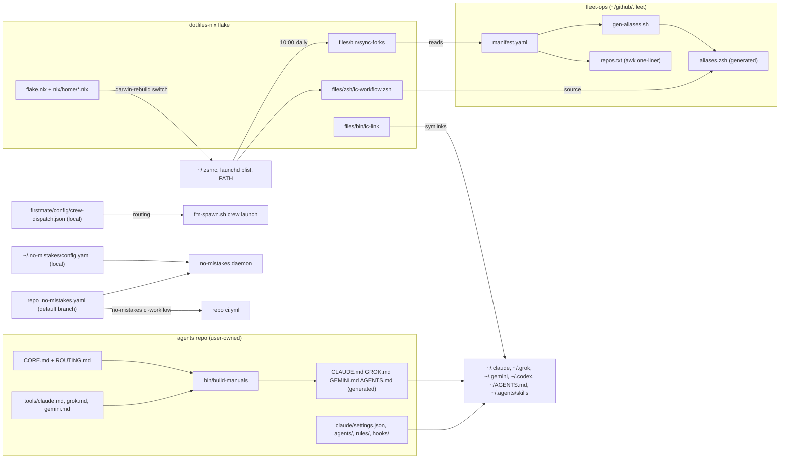

# Configuration topology - every source of truth and how a change propagates

Evidence was read from disk on 2026-09-23 with `readlink`, `ls -la`, `git status`, and key-only reads of JSON and YAML files.
Citations use `repo/path:line` relative to `~/github`, `.fleet/...` for the fleet-ops checkout at `~/github/.fleet`, and `~/...` for home files.
Credential-like values are written as <redacted>.

## 1. TL;DR

The harness has seven configuration sources of truth, and each one owns a distinct slice of behavior.
Four of them are version-controlled: the user's `agents` and `fleet-ops` repos, the user's `dotfiles-nix` fork, and each gated repo's `.no-mistakes.yaml` (written by upstream in the forks, by the user in the user's own repos).
Three are local files that are deliberately or accidentally outside version control (`firstmate/config/crew-dispatch.json`, `~/.no-mistakes/config.yaml`, and `~/.claude/settings.local.json`).
Nothing the harness manages is copied into `$HOME`: every manual, settings file, subagent, rule, and skill is a symlink into a git checkout, so a `git pull` or a regeneration changes live behavior with no install step.
The price of that design is that a tool which writes its own config writes straight into a tracked file, which is exactly how the live `~/.claude/settings.json` lost its committed model pin.

## 2. The inventory

| # | Source of truth | Owner and versioning | What it controls | Generated from it | Consumers |
|---|---|---|---|---|---|
| 1 | `agents/CORE.md`, `agents/ROUTING.md`, `agents/tools/{claude,grok,gemini}.md` | User's own repo `agents`, no upstream | Operating rules for every AI tool, routing policy, per-tool tuning | `CLAUDE.md`, `GROK.md`, `GEMINI.md`, `AGENTS.md` by `bin/build-manuals` (`agents/bin/build-manuals:48-62`, `:123-146`) | Claude, Grok, Gemini, Codex via symlinks |
| 2 | `agents/claude/settings.json`, `claude/agents/*.md`, `claude/rules/*.md`, `claude/hooks/*.py`, `grok/agents/*.md` | Same repo | Claude Code hooks, plugins, effort defaults, subagents, path rules; Grok agents | nothing (linked as-is) | Claude Code, Grok |
| 3 | `.fleet/manifest.yaml` | User's own repo `fleet-ops`, checked out at `~/github/.fleet` | Which forks exist, their upstream, branch, install command, binaries, aliases, `sync` flag | `aliases.zsh` by `gen-aliases.sh` (`.fleet/gen-aliases.sh:91`); `repos.txt` by an awk one-liner run by hand (`.fleet/README.md:67`) | `sync-forks`, `bootstrap.sh`, `doctor.sh`, `ic-doctor`, `fleet-sync.yml` |
| 4 | `dotfiles-nix/flake.nix` and `nix/**` | User's fork of kunchenguid/dotfiles-mac-nix (45 fork commits, all the user's) | macOS system settings, Homebrew subset, Home Manager dotfiles, `PATH`, git identity and signing, the daily sync launchd agent | Nix store generations; `~/.zshrc` and friends as store symlinks; `~/Library/LaunchAgents/org.nix-community.home.sync-forks.plist` | the whole machine |
| 5 | `firstmate/config/crew-dispatch.json` | Local and gitignored (`firstmate/.gitignore:13` ignores all of `config/`) | Which harness, model, and effort a crewmate gets for each task class | nothing | the first mate agent, `fm-dispatch-resolve.sh`, `fm-spawn.sh` enforcement, secondmate homes by inheritance |
| 6 | `~/.no-mistakes/config.yaml` | Local plain file, not a symlink, not in any repo (`ls -la` on 2026-09-23) | Which agent runs the gate, Grok pin, auto-fix budgets, CI babysit timeout, intent extraction | nothing | the no-mistakes daemon for every repo |
| 7 | `<repo>/.no-mistakes.yaml` | Tracked in each gated repo; 7 repos under `~/github` carry one | Repo lint and test commands, doc policy, trusted-only gate controls | `.github/workflows/ci.yml` by `no-mistakes ci-workflow` (for example `SDE-Interview-Prep/.github/workflows/ci.yml:1`) | the no-mistakes daemon, read from the default branch only |

Secrets are not a source of truth in any file above.
The one API key the harness uses on the interactive path lives in the macOS login Keychain under service `typesafe-api-key` and is injected per invocation into `claude` and `grok` only (`dotfiles-nix/files/zsh/ic-workflow.zsh:538-550`).

Tool-owned files the harness deliberately does not manage: `~/.gemini/settings.json` (Gemini owns it; the harness only relies on its `context.fileName` key), `~/.grok/config.toml` (Grok rewrites it in place), and `~/.grok/hooks` (firstmate owns it) (`dotfiles-nix/files/bin/ic-link:139-142`, `:165-168`).

## 3. What is generated from what

### The manual generator

`bin/build-manuals` renders each manual as a "Generated by" header, then `CORE.md`, then `ROUTING.md`, then the tool's tuning file; the neutral `AGENTS.md` omits the tuning file (`agents/bin/build-manuals:48-62`).
Before rendering, it refuses any tuning file, Grok agent, Claude subagent, or Claude rule that repeats a whole line of `CORE.md` or `ROUTING.md` verbatim, using `grep -Fxf` (`agents/bin/build-manuals:79-90`, `:112-121`).
The script's own comment says this catches verbatim copies only, and paraphrased duplicates remain a review responsibility (`agents/bin/build-manuals:73-78`).
`--check` renders to a temp file and `cmp`s it against the committed manual, printing `X.md is stale or hand-edited` and exiting 1 (`agents/bin/build-manuals:135-140`).
That check runs in the repo's CI and inside `ic-doctor` section 7 (`agents/bin/build-manuals:16-21`).

Doc drift found while verifying: the comment at `agents/bin/build-manuals:28-30` says "No global symlink points at it yet" about `AGENTS.md`, but `readlink ~/AGENTS.md` returned `~/github/agents/AGENTS.md` on 2026-09-23, created by `dotfiles-nix/files/bin/ic-link:104-105`.

### The fleet manifest

The manifest is flat YAML parsed by line-oriented awk in five scripts, chosen so the launchd job needs no `yq` under a minimal `PATH` ([fleet-ops](components/fleet-ops.md)).
Only some keys are parsed; `owner`, `is_fork`, `toolchain`, `install_mechanism`, and `notes` are documentation only ([fleet-ops](components/fleet-ops.md), section 3).
`bootstrap.sh` splits each entry on `|`, so an `install` string must never contain `|` (`.fleet/bootstrap.sh:28-37`, `:48`; recorded in `.fleet/manifest.yaml:337`).
`repos.txt` is the server-side copy of the `sync: true` list; it is regenerated by hand and `doctor.sh` fails if it drifts from the manifest (`.fleet/doctor.sh:119-130`).

## 4. What is symlinked where

All links below were read with `readlink` on 2026-09-23 and are created by `ic-link` (`dotfiles-nix/files/bin/ic-link:60-175`).

| Live path | Points at | Link step |
|---|---|---|
| `~/.agents/skills/<tool>` for chrome-devtools-axi, gh-axi, gnhf, no-mistakes, quota-axi, tasks-axi | `~/github/<tool>/skills/<tool>` | `ic-link:82` |
| `~/.agents/skills/lavish`, `stow`, `axi` | `lavish-axi/skills/lavish`, `firstmate/skills/stow`, `axi/.agents/skills/axi` | `ic-link:84-86` |
| `~/.agents/skills/<owned>` (ship plus 11 ECC-derived) | `dotfiles-nix/files/skills/<name>` | `ic-link:88` |
| `~/.claude/skills/<name>`, `~/.codex/skills/<name>` | relative `../../.agents/skills/<name>` | `ic-link:93-94` |
| `~/AGENTS.md` | `~/github/agents/AGENTS.md` (tool-neutral) | `ic-link:104-105` |
| `~/.codex/AGENTS.md` | `~/AGENTS.md` | `ic-link:111` |
| `~/.claude/CLAUDE.md`, `~/.claude/settings.json`, `~/OPINIONS.md`, `~/VOICE.md` | files in `~/github/agents` | `ic-link:115-118` |
| `~/.claude/agents/*.md`, `~/.claude/rules/*.md` | one link per file into `agents/claude/{agents,rules}` | `ic-link:121-133` |
| `~/.grok/AGENTS.md`, `~/.grok/agents/*.md`, `~/.grok/skills/*` | `agents/GROK.md`, `agents/grok/agents/*.md`, skill mirrors (only if `~/.grok` exists) | `ic-link:143-161` |
| `~/.gemini/AGENTS.md` | `agents/GEMINI.md` (never Gemini's own `GEMINI.md` memory file) | `ic-link:165-175` |
| `~/.zshrc` | `/nix/store/...-home-manager-files/.zshrc` | Home Manager activation |

Hooks are not linked at all: `settings.json` runs them by absolute path, guarded so a missing clone is a no-op, for example `f="$HOME/github/agents/claude/hooks/guard.py"; [ ! -f "$f" ] || exec python3 "$f" bash` (`agents/claude/settings.json:12`).

Why links and not copies: one reviewed copy of every file, and edits are live immediately.
Why that hurts: Claude Code writes to its settings file through the symlink, so an in-app toggle becomes an uncommitted diff in a public repo (section 7).

## 5. Must never be hand-edited

| File | Why | Enforcement |
|---|---|---|
| `agents/{CLAUDE,GROK,GEMINI,AGENTS}.md` | Generated; header says "Do not edit this file" (`agents/CLAUDE.md:1`) | `build-manuals --check` in CI and in `ic-doctor` |
| `~/.claude/CLAUDE.md` and the other linked manuals | They are the generated files above | same check, through the link |
| `.fleet/aliases.zsh` | Header: "GENERATED by gen-aliases.sh from manifest.yaml. Do not hand-edit." (`.fleet/aliases.zsh:2`) | none mechanical; regenerated by every `bootstrap.sh` run (`.fleet/bootstrap.sh:102-107`) |
| `.fleet/repos.txt` | Derived from the manifest | `doctor.sh` drift check (`.fleet/doctor.sh:119-130`) |
| `no-mistakes/skills/no-mistakes/SKILL.md` | Upstream generates it from `internal/skill` with `go run ./cmd/genskill` (`no-mistakes/Makefile:78-81`) | upstream `make lint` drift check |
| `CHANGELOG.md` in any repo | Global rule in `agents/CORE.md` | convention only |
| Home Manager files such as `~/.zshrc` | Read-only Nix store paths | the filesystem itself |
| `dotfiles-nix/AGENTS.md` "Deliberate decisions" | Not generated, but the file says "do NOT silently revert them" (`dotfiles-nix/AGENTS.md:5`) | convention only |

One generated file was edited by design: this vault's `ci.yml` says it was generated by `no-mistakes ci-workflow` "then switched from setup-go to setup-python" (`SDE-Interview-Prep/.github/workflows/ci.yml:1-2`), so a future `ci-workflow -f` would overwrite that edit.

## 6. How a change propagates

| Change | Edit here | Then run | Becomes live when | Verified by |
|---|---|---|---|---|
| A rule for every AI tool | `agents/CORE.md` or `ROUTING.md` | `bin/build-manuals`, commit, ship through no-mistakes | next session of each tool (the manual is a symlink) | CI `manuals` job, `ic-doctor` section 7 |
| A Claude-only rule | `agents/tools/claude.md` | same | next Claude session | same |
| A new hook rule | `agents/claude/hooks/guard.py` plus tests | unittest, ship | next tool call (the hook is read from the clone each time) | CI `hooks` job (51 cases passed locally on 2026-09-23) |
| A Claude model or effort pin | `agents/claude/settings.json` and `firstmate/config/crew-dispatch.json` together (`agents/tools/claude.md:16`) | ship the repo half; the dispatch half has no repo | next Claude launch and next crew spawn | nothing checks that the two agree |
| A Grok model pin | `~/.no-mistakes/config.yaml` `agent_config.grok`, `crew-dispatch.json`, and the Grok tuning file (`agents/tools/grok.md:48`) | edit three places | next gate run and next spawn | nothing checks that the three agree |
| A new fork | `.fleet/manifest.yaml` | regenerate `repos.txt`, `gen-aliases.sh`, `bootstrap.sh`, `doctor.sh`, ship (`.fleet/README.md:63-68`) | next 10:00 sync | `fleet-doctor` |
| A shell alias or `PATH` entry | `dotfiles-nix/nix/home/*.nix` or `files/zsh/ic-workflow.zsh` | `rebuild` (sudo `darwin-rebuild switch`) | new shell | `ic-doctor` section 1 |
| A new owned skill | `dotfiles-nix/files/skills/<name>/SKILL.md` | `ic-link` (discovers every `files/skills/*/SKILL.md`, `dotfiles-nix/setup/lib/skills.sh:15-22`) | next session | `ic-doctor` section 4 |
| An upstream tool update | nothing; upstream moves | `sync-forks` at 10:00 fast-forwards and re-runs the manifest install | immediately for npm-linked CLIs, which point into the clone | `===== done ... failed:[ ]` log line, `fleet-doctor` |
| A repo's lint or test gate | `<repo>/.no-mistakes.yaml` | merge to the default branch | next gate run; values are read from the default branch, never the pushed branch (`no-mistakes/docs/src/content/docs/reference/repo-config.md:8-13`) | the gate itself |
| Gate agent or auto-fix budget | `~/.no-mistakes/config.yaml` | nothing | next run | nothing; the file is unversioned |
| Crew routing | `firstmate/config/crew-dispatch.json` | nothing | next intake; bootstrap validates it with `jq` and reports `CREW_DISPATCH: invalid` rather than routing around a bad file (`firstmate/docs/configuration.md:507-512`); secondmate homes inherit the file (`firstmate/docs/configuration.md:513`) | firstmate bootstrap |

## 7. Known drift and gaps (measured, not hypothetical)

- `agents/claude/settings.json` is dirty: `git diff --stat` shows 21 insertions and 21 deletions, the live file has no top-level `model` key, and it adds `telegram@claude-plugins-official: false` (`agents/claude/settings.json:41-45`), while `agents/tools/claude.md:16` says the pin lives there.
  The likely cause is Claude Code rewriting its settings through the symlink (unverified).
- `~/.no-mistakes/config.yaml` and `firstmate/config/crew-dispatch.json` hold the same Grok pin (`grok-4.7`, high) as the Grok manual, and the Claude Opus pin appears in both `settings.json` and four places in `crew-dispatch.json` (lines 11, 20, 47, 53); nothing mechanical keeps these in agreement.
- Neither local file is backed up in a repo, so a new machine cannot reproduce the gate or the routing policy from git alone; `agents/ROUTING.md:9-22` is the only versioned statement of the routing policy, in prose.
- `repos.txt` is regenerated by hand; the drift check catches a mismatch after the fact but does not prevent it.
- The fleet-ops and agents READMEs describe their repos as private (`.fleet/README.md:52`, `.fleet/README.md:70`, `agents/README.md:3`), but `gh repo view` reported both `PUBLIC` on 2026-09-23.
- `~/.claude/settings.local.json` is a real, unversioned file holding an ad hoc permission allowlist ([claude-code-config](components/claude-code-config.md)).

## 8. Interview angle

**Q: How do you manage configuration for a fleet of tools without drift?**
Treat it like infrastructure as code: one source per concern, generated artifacts committed and byte-checked in CI, and a read-only doctor that proves the live machine matches.
It is the same pattern as one CDK app synthesizing several CloudFormation templates, plus drift detection.

**Q: What would you change?**
Put `~/.no-mistakes/config.yaml` and a redacted `crew-dispatch.json` under version control, and generate every model pin from one file so the four copies cannot disagree.
Point Claude Code's writable settings at an untracked layer so in-app toggles never dirty the tracked file.

**Trade-off stated plainly:** symlinks to working trees buy instant, reviewable changes and cost Nix-style immutability; a moved checkout or a tool writing its own config breaks the invariant silently, which is why `ic-doctor` and `fleet-doctor` exist.

## Related

- [Agentic Harness index](README.md)
- [00 Executive summary](00-Executive-Summary.md)
- [01 Architecture and diagrams](01-Architecture-and-Diagrams.md)
- [02 Inventory](02-Inventory.md)
- [03 End-to-end lifecycle](03-End-to-End-Lifecycle.md)
- [04 Model routing and quota](04-Model-Routing-and-Quota.md)
- [06 Safety and quality gates](06-Safety-and-Quality-Gates.md)
- [07 Fleet operations](07-Fleet-Operations.md)
- [08 Design principles and trade-offs](08-Design-Principles-and-Tradeoffs.md)
- [09 Glossary](09-Glossary.md)
- Components: [agents](components/agents.md), [claude-code-config](components/claude-code-config.md), [dotfiles-nix](components/dotfiles-nix.md), [fleet-ops](components/fleet-ops.md), [firstmate](components/firstmate.md), [no-mistakes](components/no-mistakes.md), [skills-catalog](components/skills-catalog.md)
