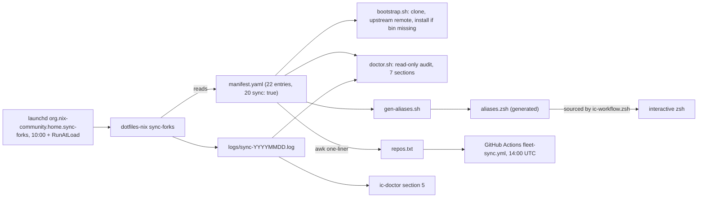

# Fleet operations - bootstrap, doctor, daily sync, and adding a repo

Evidence was read from disk and from read-only commands on 2026-09-23.
Citations use `.fleet/<path>:<line>` for the fleet-ops checkout at `~/github/.fleet`, and `dotfiles-nix/<path>:<line>` relative to `~/github`.

## 1. TL;DR

The harness is built from 22 GitHub forks under `~/github`, declared once in `.fleet/manifest.yaml`.
Four scripts operate on that list: `bootstrap.sh` converges a machine, `doctor.sh` audits it read-only, `gen-aliases.sh` generates shell aliases, and `sync-forks` (in dotfiles-nix) fast-forwards every fork from its upstream at 10:00 each day and reinstalls what changed.
A second, server-side layer in GitHub Actions runs the same fast-forward while the laptop is off.
The policy is "forks stay pristine mirrors": sync is fast-forward-only, a fork with its own commits is reported rather than merged, and the repos that deliberately carry commits are marked `sync: false` and updated through reviewed merge PRs.
All of this is the user's own work: fleet-ops has no upstream and 29 commits by the user; `sync-forks`, `ic-link`, and `ic-doctor` are fork additions in dotfiles-nix ([dotfiles-nix](components/dotfiles-nix.md), section 10).
The tools being synced were built upstream, mostly by kunchenguid.

## 2. Moving parts



| Piece | Where | Owner | Evidence |
|---|---|---|---|
| Manifest | `.fleet/manifest.yaml` | fleet-ops (user) | [fleet-ops](components/fleet-ops.md), section 3 |
| Bootstrap | `.fleet/bootstrap.sh` | fleet-ops | `.fleet/bootstrap.sh:1-11` |
| Fleet doctor | `.fleet/doctor.sh` | fleet-ops | `.fleet/doctor.sh:1-16` |
| Alias generator | `.fleet/gen-aliases.sh` | fleet-ops | `.fleet/gen-aliases.sh:91` |
| Daily sync engine | `dotfiles-nix/files/bin/sync-forks` | dotfiles-nix fork work | `dotfiles-nix/files/bin/sync-forks:1-24` |
| Schedule | Home Manager launchd agent | dotfiles-nix | `dotfiles-nix/nix/home/darwin.nix:79-96` |
| Toolchain doctor | `dotfiles-nix/files/bin/ic-doctor` | dotfiles-nix fork work | `dotfiles-nix/files/bin/ic-doctor:57-508` |
| Symlink farm | `dotfiles-nix/files/bin/ic-link` | dotfiles-nix fork work | `dotfiles-nix/files/bin/ic-link:60-175` |
| Server-side sync | `.fleet/.github/workflows/fleet-sync.yml` | fleet-ops | `.fleet/.github/workflows/fleet-sync.yml:1-40` |

## 3. Bootstrap a machine

Order on a fresh Mac, from the dotfiles-nix runbook "From scratch: the full setup, step by step" (`dotfiles-nix/README.md:383-555`):

1. Step 0: prerequisites and the Nix base system through `bash setup/install.sh` (supports `--dry-run`; the dry run on this Mac reported `target: darwin`, `profile: darwinConfigurations.mac`).
2. Step 1: authenticate `gh` and create the SSH commit-signing key.
3. Steps 2 to 4: fork and clone every tool with an `upstream` remote, build the Go tools into `~/go/bin`, build and `npm link` the Node tools; `bootstrap.sh` automates these idempotently.
4. Step 5: clone the `agents` personal layer.
5. Step 6: `ic-link` to wire every symlink.
6. Step 7: `rebuild` to load the daily sync agent.
7. Step 8: one-time per-tool setup (logins, `no-mistakes init` per repo).
8. Step 9: `ic-doctor`.

What `bootstrap.sh` does per manifest entry (`.fleet/bootstrap.sh:48-100`):
- Clone `shreejitverma/<name>` if missing, with stdin from `/dev/null` so a tool cannot eat the loop's input (`:52-56`).
- Add the `upstream` remote if absent; if it differs from the manifest, log a NOTE and leave it alone (`:58-68`).
- Run the `install` command only when a declared binary is missing, then `npm link` any Node binary still missing (`:70-87`).
- Print a per-repo verdict, regenerate `aliases.zsh`, and exit non-zero if any repo failed (`:89-110`).
It "never touches dirty repos, never switches branches, never deletes" (`:11`), and it refuses to start without `gh` auth (`:23-26`).
The runbook is honest that on a fresh machine the dotfiles-nix rebuild must come first, and bootstrap "converges over re-runs" (`.fleet/README.md:71`).

## 4. The two doctors

| | `fleet-doctor` (`.fleet/doctor.sh`) | `ic-doctor` (`dotfiles-nix/files/bin/ic-doctor`) |
|---|---|---|
| Scope | every manifest entry | the 11 harness forks, 8 harness binaries, 21 harness skills, cross-tool wiring |
| Sections | repos, remotes, identity; binaries on PATH; alias collisions; server-side list drift; sync agent; Grok; smoke (`.fleet/doctor.sh:48-211`) | dotfiles checkout; forks; binaries; agent skills; daily sync; auth; cross-tool defaults (`ic-doctor:57`, `:109`, `:142`, `:172`, `:181`, `:224`, `:244`) |
| Unique checks | no local `user.email` overrides; npm links point at the clones; `repos.txt` equals the `sync: true` list; only `kind: cli` is smoke-tested because smoke-testing a script "EXECUTES" it | every manual link targets the right tool's manual; hook scripts named in `settings.json` exist; `build-manuals --check` passes |
| Exit | non-zero on any FAIL (`.fleet/doctor.sh:215`) | 1 on any FAIL (`ic-doctor:503-508`) |
| Result | re-run for this note on 2026-09-23: 130 `ok`, 1 `warn` (the deliberate `nm` shadow of `/usr/bin/nm`), `DOCTOR: all checks passed` | 2026-09-23 run by the component author: exit 0, 67 `ok`, 1 `warn` (uncommitted change in `agents`) ([dotfiles-nix](components/dotfiles-nix.md), section 3) |

Both are read-only by design, and both print plain `ok` / `warn` / `FAIL` lines rather than TOON.

## 5. Daily fast-forward-only sync

### Local layer: `sync-forks` under launchd

Scheduled at 10:00 with `RunAtLoad` (a missed run fires on wake) and `ProcessType = "Standard"`, because Background QoS stretched the first run to 3.5 hours (`dotfiles-nix/nix/home/darwin.nix:79-96`).
Per `sync: true` entry ([dotfiles-nix](components/dotfiles-nix.md), section 3, and `dotfiles-nix/files/bin/sync-forks:141-250`):

1. Skip if not cloned, mid-rebase or mid-merge, dirty, or off the manifest branch.
2. Strip local identity overrides and fail the repo if the resolved author identity is wrong.
3. `git fetch --all --prune`, one retry after 30 s; fail if `upstream/<branch>` does not exist.
4. Count `behind` and `ahead`.
5. Only when `ahead == 0`, run `gh repo sync -b <branch>` server-side (non-fatal) (`sync-forks:195-204`).
6. `behind > 0` and `ahead > 0` is DIVERGED and left untouched; ahead-only is never published; `behind == 0` is up to date (`sync-forks:206-224`).
7. `git merge --ff-only upstream/<branch>`, then `eval` the manifest `install` with stdin from `/dev/null`; a failed reinstall fails the repo (`sync-forks:226-242`).
8. `git push -q origin <branch>`, a normal push, never forced (`sync-forks:244-249`).
9. Summary line `===== done. synced:[...] diverged:[...] skipped:[...] failed:[...] =====` and a desktop notification only on failure or divergence (`sync-forks:252-262`).

Real run, 2026-09-23 at 10:00 (`.fleet/logs/sync-20260923.log`, last line): 18 repos synced or already current, `skipped:[ org-bench wheelhouse ]`, `failed:[ ]`.
org-bench is skipped because its tree is dirty (an uncommitted `package-lock.json`); wheelhouse because it is ahead-only by 117 commits ([fleet-ops](components/fleet-ops.md), section 3).

Operational subtlety: `sync-forks` exits 0 even when repos fail; the success signal is the summary line, which `fleet-doctor` parses (`.fleet/doctor.sh:132-151`), not the process exit code ([dotfiles-nix](components/dotfiles-nix.md), section 4).

### Server-side layer: `fleet-sync.yml`

Daily `cron: "0 14 * * *"` plus manual dispatch, looping `repos.txt` with `gh repo sync` using the `FLEET_SYNC_TOKEN` fine-grained PAT (`.fleet/.github/workflows/fleet-sync.yml:10-40`).
Per-fork workflow files were rejected because "a workflow commit on a fork's default branch permanently diverges it from upstream" (`fleet-sync.yml:3-5`).
Known defect: GitHub runs the step with `bash -e`, so `out=$(gh repo sync ...)` failing on line 29 exits the step before `status=$?` on line 30, the `diverged` and `FAILED` branches are unreachable, and every repo after the failing one is skipped ([fleet-ops](components/fleet-ops.md), section 8).
`gh run list -R shreejitverma/fleet-ops` on 2026-09-23: failures on 2026-09-22 and 2026-09-23, successes 2026-09-18 to 2026-09-21.
The per-repo root cause is (unverified) because the early exit swallows the error text; the loop fix is `out=$(...) && status=0 || status=$?`.
`fleet-doctor` does not see this failure, because it reads only the local log.

## 6. `sync: false` forks and how upstream updates arrive

| Repo | Why not fast-forward | How upstream changes are taken | Evidence |
|---|---|---|---|
| dotfiles-nix | 45 fork commits; can never fast-forward | `git fetch upstream && git merge upstream/main` on a branch, PR through no-mistakes, merged with "Create a merge commit", never squash, because squash drops the parent and the fork reads as diverged forever | `dotfiles-nix/AGENTS.md:37-45`, `.fleet/manifest.yaml:293-294` |
| firstmate | 6 non-merge fork commits the owner does not upstream (2 by hand, 4 written by gate steps) | a sync-upstream merge PR on the fork via no-mistakes, then `/updatefirstmate` in the running home, which updates the repo and every secondmate through a guarded path and restarts live secondmates | `.fleet/manifest.yaml:38-39`, `firstmate/.agents/skills/updatefirstmate/SKILL.md:3-6` |
| wheelhouse (still `sync: true`) | ahead-only by 117 commits (103 are the original author's history); reported and left alone | once the parent moves it becomes DIVERGED and gets a sync-upstream merge PR (precedent `shreejitverma/wheelhouse#3`) | `.fleet/manifest.yaml:326` |

Today firstmate is 31 commits behind its parent (`git rev-list --left-right --count upstream/main...HEAD` returned `31 11`), so the manual path has a visible cost: fork fixes are kept, but upstream fixes wait for a deliberate PR.

## 7. Logs

| Log | Written by | Retention |
|---|---|---|
| `~/github/.fleet/logs/sync-YYYYMMDD.log` | `sync-forks` (`dotfiles-nix/files/bin/sync-forks:41`) | 30 days (`:47`) |
| `~/github/.fleet/logs/launchd.{out,err}.log` | launchd `StandardOutPath` and `StandardErrorPath` (`dotfiles-nix/nix/home/darwin.nix:86-87`) | unbounded |
| `~/github/.fleet/logs/bootstrap-YYYYMMDD-HHMMSS.log` | `.fleet/bootstrap.sh:18` | unbounded |
| Server-side run logs | GitHub Actions | GitHub retention |

`logs/` is gitignored; the log directory is created at Home Manager activation so launchd can open its log paths before the fleet exists (`dotfiles-nix/nix/home/darwin.nix:75-77`).

## 8. Aliases

- Generated: one `cd<x>` jump alias per entry, run aliases only when the binary exists, and `fleet-sync`, `fleet-sync-dry`, `fleet-doctor`, `fleet-status`, `fleet-cd` (`.fleet/README.md:41-43`).
- Hand-written in dotfiles-nix: `th`, `nm`, `gn`, `cda`, `ta`, `qa` guarded by `command -v`, plus `syncforks`, `syncforks-dry`, `icdoctor`, and `fm` (`dotfiles-nix/files/zsh/ic-workflow.zsh:504-526`).
- `aliases.zsh` returns immediately in non-interactive shells, so agents never inherit aliases (`.fleet/aliases.zsh:5`).
- `nm` deliberately shadows `/usr/bin/nm`; the doctor warns rather than fails (`.fleet/README.md:42`).

## 9. Add a repo to the fleet

The runbook (`.fleet/README.md:63-68`), plus the extra edits a harness tool needs:

```bash
# 1. fork under your account and clone with an upstream remote
gh repo fork kunchenguid/<name> --clone=false
gh repo clone shreejitverma/<name> ~/github/<name>
git -C ~/github/<name> remote add upstream https://github.com/kunchenguid/<name>.git

# 2. add a manifest entry (copy an existing one): upstream, default_branch, kind,
#    install (no '|' characters), provides_bin, aliases, sync, notes
$EDITOR ~/github/.fleet/manifest.yaml

# 3. regenerate the server-side list
cd ~/github/.fleet
awk '/^- name:/ {name=$3} /^  sync: true/ {print name}' manifest.yaml > repos.txt

# 4. converge and verify
./gen-aliases.sh && ./bootstrap.sh && ./doctor.sh
```

Then ship the fleet-ops change through no-mistakes, like any other.
If the repo is a harness tool, two lists outside the manifest are hardcoded and must also change in a dotfiles-nix PR: the skill links in `dotfiles-nix/files/bin/ic-link:81-86` and the `FORKS`, `BINARIES`, `SKILLS` lists in `dotfiles-nix/files/bin/ic-doctor:43-46`.
Worked example: compact-adviser was added on 2026-09-21 in `2fe710e`; the no-mistakes review step rewrote its install string to remove a `|` (`b0b990a`), and the next local sync logged `manifest: 20 sync-eligible entries` ([fleet-ops](components/fleet-ops.md), section 7).

To stop syncing one repo: set `sync: false`, record why in `notes`, and regenerate `repos.txt` (`.fleet/README.md:75`).
To stop everything: disable the launchd agent in `darwin.nix` and `rebuild`, or `launchctl bootout gui/$(id -u)/org.nix-community.home.sync-forks` once (`.fleet/README.md:76`).

## 10. Known issues and next fixes

| Issue | Impact | Fix |
|---|---|---|
| `fleet-sync.yml` aborts on the first failing repo under `bash -e` | silent partial sync, error text lost | capture status without tripping `-e`; print `$out`; publish a summary |
| `sync-forks` exits 0 on failures | any consumer of exit status alone misses failures | exit non-zero when `failed` is non-empty |
| `fleet-doctor` reads only the local log | a red server-side run passes the doctor | add a `gh run list` check |
| Both layers run at 10:00 EDT | possible rejected local push if the server moves `origin` first (inferred, not observed) | shift one schedule |
| Automatic reinstall of new upstream code every morning | supply-chain exposure without review | pin to reviewed tags, or stage updates behind a gate |
| Two hardcoded tool lists outside the manifest | adding a harness tool touches three repos | derive `ic-link` and `ic-doctor` lists from manifest fields |
| READMEs call fleet-ops private | `gh repo view` reports `PUBLIC` | correct the docs or change visibility |

## 11. Interview angle

**Q: How do you keep twenty-plus dependencies current without breaking your own changes?**
One declared inventory, a fast-forward-only sync that treats divergence as a signal rather than something to auto-resolve, and explicit `sync: false` exceptions with reasons written next to them.
The same shape works for vendored libraries or internal forks in a bank: mirror upstream automatically, change it only through reviewed merges.

**Q: How do you know the nightly job worked?**
Per-run dated logs with a machine-parseable summary line, notifications only on failure, and a read-only doctor that checks the last summary.
The honest gap is exit codes: the job exits 0 on partial failure, and the cloud layer hides which repo failed, which I would fix before calling it production-grade.

## Related

- [Agentic Harness index](README.md)
- [00 Executive summary](00-Executive-Summary.md)
- [01 Architecture and diagrams](01-Architecture-and-Diagrams.md)
- [02 Inventory](02-Inventory.md)
- [03 End-to-end lifecycle](03-End-to-End-Lifecycle.md)
- [04 Model routing and quota](04-Model-Routing-and-Quota.md)
- [05 Configuration topology](05-Configuration-Topology.md)
- [06 Safety and quality gates](06-Safety-and-Quality-Gates.md)
- [08 Design principles and trade-offs](08-Design-Principles-and-Tradeoffs.md)
- [09 Glossary](09-Glossary.md)
- Components: [fleet-ops](components/fleet-ops.md), [dotfiles-nix](components/dotfiles-nix.md), [skills-catalog](components/skills-catalog.md), [firstmate](components/firstmate.md), [wheelhouse](components/wheelhouse.md), [apps-and-benchmarks-overview](components/apps-and-benchmarks-overview.md)
