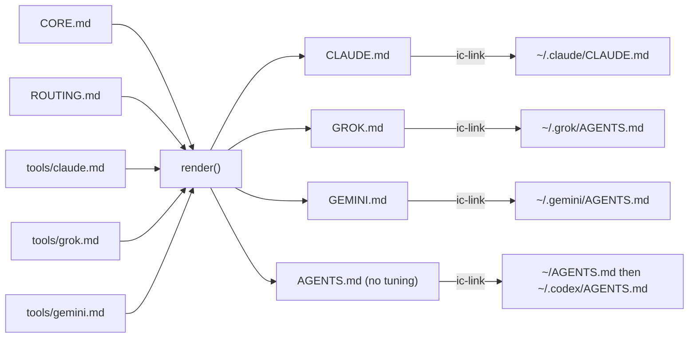

# agents - one operating manual per AI tool, from one source

Evidence was gathered read-only on 2026-09-23 from `~/github/agents` at `main` (`edce7bf`), plus `ls -la` of the live symlinks in `~` and `~/.claude`.
Citations use `agents/path:line`.

## 1. TL;DR

`agents` is the user's own repo (not a fork) that version-controls the personal layer every AI coding tool on the Mac reads: the operating manuals, Claude Code settings, Claude subagents, path-scoped rules, and two Python hooks.
A small bash generator, `bin/build-manuals`, compiles one shared rule source (`CORE.md` + `ROUTING.md`) plus a thin per-tool tuning file into `CLAUDE.md`, `GROK.md`, `GEMINI.md`, and a tool-neutral `AGENTS.md`, and CI fails if any generated manual is stale or hand-edited.
`ic-link` from dotfiles-nix symlinks those files into `~/.claude`, `~/.grok`, `~/.gemini`, `~/.codex`, and `~`, so editing one line in `CORE.md` changes the behavior of Claude, Grok, Gemini, and Codex together.

## 2. Problem it solves, and what breaks without it

Each agent CLI reads a different instructions file (`~/.claude/CLAUDE.md`, `~/.grok/AGENTS.md`, `~/.gemini/AGENTS.md`, `~/AGENTS.md` for Codex), and hand-maintaining four copies guarantees drift: one tool gets a rule, another gets an older paraphrase, and they contradict each other.
The repo makes the shared rules exist exactly once and makes drift a build failure (`agents/README.md:9`, `agents/bin/build-manuals:4` to `:5`).
It also puts safety policy under version control and code review: the guard hook that blocks `--no-verify` and force-pushes to `main` is Python with a unit-test suite, not a loose dotfile.

Without it:
- Grok could silently load Claude's manual (the fault `ic-doctor` explicitly FAILs, `dotfiles-nix/files/bin/ic-doctor:261` to `:262`).
- Model pins and effort defaults would live in whatever `~/.claude/settings.json` happened to contain on a given day.
- Agents would have no mechanical backstop against destructive shell commands or against "fixing" a failing lint by editing the lint config.

## 3. Architecture

### Layout (from `find . -type f`)

| Path | Kind | Role |
|---|---|---|
| `CORE.md` (157 lines) | source | Rules identical for every tool: mission, coding, testing, git hygiene, C++ and Python preferences, cross-tool rules, AXI principles |
| `ROUTING.md` (33 lines) | source | "Default development system": firstmate, the IC toolchain, and the two-step model routing (fit tier, then quota) |
| `tools/claude.md`, `tools/grok.md`, `tools/gemini.md` | source | Per-tool tuning, additive only |
| `CLAUDE.md`, `GROK.md`, `GEMINI.md`, `AGENTS.md` | generated | Manuals; header says "Generated by bin/build-manuals ... Do not edit" |
| `bin/build-manuals` | generator | 148-line bash script |
| `claude/settings.json` | config | Claude Code user settings (symlinked to `~/.claude/settings.json`) |
| `claude/agents/*.md` | config | Six Claude subagents |
| `claude/rules/cpp.md`, `claude/rules/python.md` | config | Path-scoped rules |
| `claude/hooks/guard.py` (1204 lines), `post_edit.py` (165 lines) | code | PreToolUse and PostToolUse hooks |
| `claude/hooks/test_guard.py`, `test_post_edit.py` | tests | 31 + 20 unittest cases |
| `grok/agents/implementer.md`, `reviewer.md` | config | Grok user agents with `agents_md: true` |
| `OPINIONS.md`, `VOICE.md` | content | Read on demand by agents |
| `ruff.toml` | config | Lint settings for the hooks (line length 120, py311, rules E F W B UP SIM I) |
| `.github/workflows/ci.yml` | CI | Two jobs: manuals and hooks |

### Build model

- `TOOLS="claude grok gemini"` and `NEUTRAL="agents"` (`agents/bin/build-manuals:27`, `:31`).
- `render()` prints a "Generated by" header, then `cat CORE.md`, `ROUTING.md`, and, except for the neutral build, `tools/<tool>.md` (`agents/bin/build-manuals:48` to `:62`).
- Output sizes today: `CLAUDE.md` 18,021 bytes, `GROK.md` 17,780, `GEMINI.md` 16,407, `AGENTS.md` 13,758 (`wc -c`).
- Grok has an advisory 20,000-character ceiling; the README records a measurement that Grok 1.0.34 loaded a 16,693-character manual despite a documented 10,000 cap (`agents/bin/build-manuals:39` to `:44`, `agents/README.md:75` to `:79`).

### State

The repo has no runtime state of its own; its "state" is the set of symlinks `ic-link` creates.
The hooks are stateless per call: they read one JSON payload on stdin and write a decision.
The only machine-mutable file is `claude/settings.json`, because Claude Code writes to its settings file through the symlink (for example `/effort` or plugin toggles), which is why that file is currently dirty (section 5).

## 4. Interfaces

### `bin/build-manuals`

| Invocation | Behavior | Exit |
|---|---|---|
| `bin/build-manuals` | Regenerate the four manuals at the repo root; prints `wrote X.md (N chars)` | 0 |
| `bin/build-manuals --check` | Render to temp files and `cmp` against the committed manuals; print `X.md is stale or hand-edited` | 0 clean, 1 stale or duplicated rule |
| anything else | `usage: build-manuals [--check]` | 2 |

Before rendering, both modes run the duplicate-rule check over every tuning file, Grok agent, Claude subagent, and Claude rule (`agents/bin/build-manuals:112` to `:121`).
Output is plain text on stdout, errors on stderr.

### `claude/hooks/guard.py bash|edit`

- Input: Claude Code PreToolUse JSON on stdin; reads `tool_input.command` (bash) or `tool_input.file_path` (edit) (`agents/claude/hooks/guard.py:1176` to `:1192`).
- Output: nothing for allow, or `{"hookSpecificOutput": {"hookEventName": "PreToolUse", "permissionDecision": "deny"|"ask", "permissionDecisionReason": ...}}` (`guard.py:1108` to `:1115`).
- Exit code is 0 in every case, including internal errors (fail open, `guard.py:1195` to `:1202`); a wrong argv raises a usage `SystemExit`.
- Kill switch: `CLAUDE_GUARD_DISABLE=1` (`guard.py:1180`).

### `claude/hooks/post_edit.py`

- Input: PostToolUse JSON; uses `tool_input.file_path`, resolving relative paths against the payload `cwd` (`agents/claude/hooks/post_edit.py:121` to `:136`).
- Output: findings on stderr with exit 2 (Claude Code shows exit-2 stderr to the model), silence and exit 0 when clean or on any error (`post_edit.py:150` to `:161`).
- Kill switch: `CLAUDE_POST_EDIT_DISABLE=1` (`post_edit.py:123`).

## 5. Configuration

### `claude/settings.json` (linked as `~/.claude/settings.json`)

| Key | Value | Why |
|---|---|---|
| `env.CLAUDE_CODE_ENABLE_FUNCTION_HOOKS` | `"1"` | Needed by the compact-adviser plugin's function-hook mod (`agents/README.md:72`) |
| `hooks.PreToolUse[Bash]` | `f="$HOME/github/agents/claude/hooks/guard.py"; [ ! -f "$f" ] \|\| exec python3 "$f" bash`, timeout 10 | Guard every shell call; the `[ ! -f ]` test makes a missing clone a no-op instead of an error |
| `hooks.PreToolUse[Write\|Edit\|MultiEdit]` | same script with `edit`, timeout 10 | Protect existing lint, format, and gate configs |
| `hooks.PostToolUse[Write\|Edit\|MultiEdit]` | `post_edit.py`, timeout 20 | Lint feedback after every edit |
| `enabledPlugins` | `vercel@claude-plugins-official: true`, `compact-adviser@compact-adviser: true`, `telegram@claude-plugins-official: false` | Plugins in use |
| `extraKnownMarketplaces.compact-adviser` | directory source `~/github/compact-adviser` | Plugin hooks are read live from the local clone ([compact-adviser](../components/compact-adviser.md)) |
| `modelSettings.claude-opus-5-5.effortLevel` | `"high"` | Opus 5.5 defaults to `medium` and ignores a top-level `effortLevel` (`agents/tools/claude.md:20`) |
| `skipDangerousModePermissionPrompt` | `true` | No confirmation prompt when starting in bypass mode |
| `theme` | `"dark"` | UI |
| `model` | `"claude-opus-5-5[1m]"` in the committed file (`git show HEAD:claude/settings.json`, line 2) | Pin by full ID, not the moving `opus[1m]` alias (`agents/tools/claude.md:16`) |

Observed drift: the working tree (`git diff claude/settings.json`, 21 insertions, 21 deletions) reorders keys, adds `telegram@claude-plugins-official: false`, and drops the top-level `model` pin.
The most likely cause is Claude Code rewriting its own settings file through the symlink (unverified).
Until that is reconciled, the committed pin that `tools/claude.md:16` describes is not what the live file contains.
No secrets are in the file; the README warns never to save the TypeSafe API key via the `/compact-adviser` menu because it would land in this tracked file (`agents/README.md:73`).

### Subagents (`claude/agents/*.md` frontmatter)

| Name | Tools | Model / effort | Preloaded skills |
|---|---|---|---|
| `cpp-reviewer` | Read, Grep, Glob, Bash | `claude-opus-5-5` / high | cpp-coding-standards, silent-failure-hunt |
| `python-reviewer` | Read, Grep, Glob, Bash | same | python-testing, silent-failure-hunt |
| `pr-test-analyzer` | Read, Grep, Glob, Bash | same | cpp-testing, python-testing |
| `silent-failure-hunter` | Read, Grep, Glob, Bash | same | silent-failure-hunt |
| `type-design-analyzer` | Read, Grep, Glob | same | none |
| `cpp-build-resolver` | Read, Edit, Write, Bash, Grep, Glob | same | cpp-coding-standards |

Only `cpp-build-resolver` can write; the rest are review-only, and their findings feed the no-mistakes gate rather than replace it (`agents/tools/claude.md:28` to `:30`).
Pinning `claude-opus-5-5` keeps delegated review off the separate Fable weekly window.

### Rules (`claude/rules/`)

- `cpp.md` loads for `**/*.{cpp,cc,cxx,c++,h,hh,hpp,hxx,ipp,tpp,inl}`, `CMakeLists.txt`, `*.cmake`, `CMakePresets.json` (`agents/claude/rules/cpp.md:2` to `:6`); it prescribes the build, `ctest`, `run-clang-tidy`, ASan+UBSan, and notes Apple clang lacks MSan, LSan, and libFuzzer (`:12` to `:14`).
- `python.md` loads for `*.py`, `*.pyi`, `pyproject.toml`, `*.ipynb` (`agents/claude/rules/python.md:2` to `:5`); it prescribes ruff, the repo's type checker, and pytest (`:12`).

### guard.py rules (enumerated)

Presence: a human is present when `FM_TASK_ID` is unset and `CLAUDE_CODE_SESSION_ATTENDED == "1"`; older Claude Code without that variable falls back to `CLAUDE_CODE_ENTRYPOINT == "cli"` (`agents/claude/hooks/guard.py:59` to `:65`).
`FM_TASK_ID` is exported by firstmate into every ship and scout pane (`firstmate/bin/fm-spawn.sh:4737`).

| Class | Examples | Attended | Unattended | Evidence |
|---|---|---|---|---|
| BLOCK: hook bypass | `git commit/push/merge/cherry-pick/rebase/am --no-verify` (any unambiguous prefix like `--no-ver`), `commit -n` clusters, `git -c core.hooksPath=...` | deny | deny | `guard.py:586`, `:634` to `:687`, `:757` to `:761` |
| BLOCK: shared branches | force, `+ref`, or lease push to `main`, `master`, `develop`, `trunk`; `:main` or `--delete main`; `--mirror` | deny | deny | `guard.py:585`, `:699` to `:749` |
| BLOCK: critical rm | recursive rm of `/`, `/*`, `~`, `$HOME`, `.`, `..`, `*`, system dirs (`/usr`, `/etc`, `/nix`, ...), or any `/Users/<name>` home | deny | deny | `guard.py:798` to `:876`, `:910` to `:912` |
| BLOCK: disks | `diskutil erase*/partition/zerodisk/secureerase`, `mkfs*` | deny | deny | `guard.py:973` to `:977` |
| ASK: git | `reset --hard`, checkout over paths or `-f`, `clean -f` (not `-n`), `restore` of worktree, `switch -f/-C`, `branch -D`, `stash drop/clear`, `reflog expire/delete`, `update-ref -d`, `filter-branch/filter-repo`, non-shared `push --force` or `--delete` | ask | allow | `guard.py:745` to `:792` |
| ASK: rm | `rm -rf` of anything not all artifact dirs (`build`, `dist`, `node_modules`, `__pycache__`, `cmake-build-*`, ...) or temp paths | ask | allow | `guard.py:835` to `:917` |
| ASK: SQL | `DROP TABLE/DATABASE/SCHEMA/INDEX/VIEW`, `TRUNCATE`, `DELETE FROM` without `WHERE`, via psql, mysql, sqlite3, duckdb, and others, including heredocs fed to them | ask | allow | `guard.py:472`, `:922` to `:936`, `:996` to `:1000` |
| ASK: other | `find -exec rm`, `dd of=` | ask | allow | `guard.py:934` to `:972` |
| CONFIG | editing an existing file named `.clang-format`, `ruff.toml`, `.eslintrc*`, `biome.json`, `.golangci.yml`, `.pre-commit-config.yaml`, `lefthook.yml`, `.no-mistakes.yaml`, and about 60 others; creating a new one is allowed | ask | deny | `guard.py:1016` to `:1100`, `:1158` to `:1173` |

The lexer is a bash subset that splits on `; & && | || ( )` and newlines, strips quotes, drops redirections, and recursively scans `$(...)`, backticks, process substitution, `sh -c`, `eval`, and wrappers like `sudo`, `env`, `timeout`, `xargs` up to depth 6 (`guard.py:52`, `:232`, `:522` to `:550`, `:953` to `:967`).
Heredoc bodies are scanned only when a shell or SQL client on the same line consumes them (`guard.py:990` to `:1000`).
If parsing fails, a crude separator split still denies any BLOCK marker; anything else fails open with a stderr note (`guard.py:1121` to `:1144`).
The docstring states the design honestly: "a backstop against accidents, not a sandbox" (`guard.py:24` to `:25`); the user can always run a refused command with the `!` prefix.

### post_edit.py rules

- Python (`.py`, `.pyi`): `ruff check --quiet --no-fix --force-exclude --output-format concise` and `ruff format --check`, only when `ruff.toml`, `.ruff.toml`, or a `pyproject.toml` with `[tool.ruff` exists between the file and its repo root (`agents/claude/hooks/post_edit.py:43`, `:47` to `:101`).
- C and C++ (12 suffixes): `clang-format --dry-run --Werror --style=file`, only with `.clang-format` or `_clang-format`; it reports a count and the fix command, not the excerpts (`post_edit.py:42`, `:104` to `:118`).
- Bounds: 8 s per tool, 30 lines of findings per file (`post_edit.py:38` to `:39`).

## 6. Connections

- [dotfiles-nix](../components/dotfiles-nix.md): `ic-link` creates every link (`dotfiles-nix/files/bin/ic-link:103` to `:135`): `~/AGENTS.md -> agents/AGENTS.md` (only if generated; otherwise warn, never point Codex at Claude's manual), `~/.codex/AGENTS.md -> ~/AGENTS.md`, `~/.claude/CLAUDE.md`, `~/OPINIONS.md`, `~/VOICE.md`, `~/.claude/settings.json`, and one link per file in `~/.claude/agents` and `~/.claude/rules` (a real file there is left untouched with a warning, so files Claude's `/agents` command writes survive).
  `ic-doctor` verifies the chain, every hook script the settings run, and `bin/build-manuals --check` (`dotfiles-nix/README.md:552`, `dotfiles-nix/files/bin/ic-doctor:245` to `:281`).
- Grok and Gemini: `~/.grok/AGENTS.md -> GROK.md`, `~/.grok/agents/{implementer,reviewer}.md`, `~/.gemini/AGENTS.md -> GEMINI.md`, with `~/.gemini/settings.json` `context.fileName = ["GEMINI.md", "AGENTS.md"]` (verified with `ls -la` and by reading the key).
  `~/.gemini/GEMINI.md` is never linked because Gemini writes its own memory there (`agents/README.md:65` to `:67`).
- [no-mistakes](../components/no-mistakes.md): the repo ships only through it; `no-mistakes runs` in this repo lists 14 runs and PRs #3 to #9, and commit subjects like `no-mistakes(review): Harden guard parser ...` are gate fix commits.
  `CORE.md:59` makes no-mistakes mandatory for every tool; `tools/claude.md:4` ties the gate agent to `agent: auto`.
  The guard lists `.no-mistakes.yaml` as a protected config, so an unattended agent (including the no-mistakes pipeline agent, which runs `claude -p`) cannot weaken a repo's gate.
- [firstmate](../components/firstmate.md): `FM_TASK_ID` flips the guard to unattended mode; firstmate's `config/crew-dispatch.json:11` pins `claude-opus-5-5[1m]` at high effort, and `tools/claude.md:16` says bump both together.
- [quota-axi](../components/quota-axi.md): `ROUTING.md:17` makes quota the second routing step (`exhausted_now`, `spendPriority`).
- Skills: rules and subagents reference skills that live in `~/.agents/skills` (for example `cpp-coding-standards`, `silent-failure-hunt`), which `ic-link` mirrors into `~/.claude/skills`; subagents preload them via `skills:` frontmatter.
- ECC: `guard.py` and `post_edit.py` are adapted from `affaan-m/ecc` (MIT) and say so in their docstrings (`guard.py:32` to `:35`, `post_edit.py:23` to `:25`).
- Live wiring detail is in [claude-code-config](../components/claude-code-config.md).

## 7. Lifecycle walkthrough

### A. Changing a shared rule

1. Edit `CORE.md` (never a generated file).
2. Run `bin/build-manuals`; `set -euo pipefail` and `cd "$REPO"` make it location-independent (`agents/bin/build-manuals:22` to `:25`).
3. `check_sources` confirms `CORE.md`, `ROUTING.md`, and all three tuning files exist (`:92` to `:104`, called at `:112`).
4. `check_no_restated_rules` runs on each `tools/*.md` and each `grok/agents`, `claude/agents`, `claude/rules` file: it strips headings, blank lines, table rows, and rules, trims whitespace, and uses `grep -Fxf` to find any whole line identical to a line of `CORE.md` or `ROUTING.md`; any hit aborts with exit 1 (`:79` to `:90`, `:113` to `:121`).
   The comment is candid that this catches verbatim copies only and paraphrases remain a review responsibility (`:73` to `:78`).
5. For each tool, `render` goes to a `mktemp` file, size is checked against the Grok ceiling, then the file is `chmod 644` and `mv`'d over the root manual (`:123` to `:146`).
6. Because `~/.claude/CLAUDE.md` is a symlink to `agents/CLAUDE.md`, the next Claude session reads the new rule with no install step.
7. Commit and ship through `no-mistakes`; CI job `manuals` runs `shellcheck -x bin/build-manuals` and `bin/build-manuals --check` (`agents/.github/workflows/ci.yml:17` to `:32`).

### B. One guarded shell call (reproduced here)

Piping PreToolUse JSON into `guard.py bash` on 2026-09-23 gave:

| Command | Attended (`CLAUDE_CODE_SESSION_ATTENDED=1`) | Unattended (`=0`) |
|---|---|---|
| `git push --force origin main` | deny | deny |
| `git reset --hard HEAD~1` | ask | allow |
| `rm -rf build` | allow | allow |
| `rm -rf src` | ask | allow |
| edit existing `ruff.toml` | (not run) | deny |

Trace for `git reset --hard HEAD~1` attended: `main` reads stdin and computes presence (`guard.py:1176` to `:1187`) -> `decide_bash` (`:1136`) -> `classify_command` lexes to one segment (`:981` to `:987`) -> `classify_words` unwraps and dispatches on `git` (`:953` to `:964`) -> `classify_git` matches `reset` with `--hard` and returns ASK (`:767` to `:768`) -> `worst` picks it (`:1004`) -> present, so `decision("ask", ...)` (`:1153` to `:1154`) -> Claude Code prompts the human.

## 8. Failure modes and safeguards

| Failure | Safeguard |
|---|---|
| Someone hand-edits `CLAUDE.md` | Generated header, `--check` in CI and in `ic-doctor` |
| A tuning file copies a CORE rule verbatim | `check_no_restated_rules` aborts the build |
| A paraphrased duplicate slips through | Not caught mechanically; the README says so (`agents/README.md:39` to `:41`) |
| Clone missing on a new machine | Hook commands are `[ ! -f "$f" ] \|\| exec ...`, so they no-op; `ic-link` skips the personal layer with a note |
| Guard bug blocks all work | Fail open on parse errors and internal errors, only BLOCK markers survive a failed parse; `CLAUDE_GUARD_DISABLE=1` |
| Unattended agent wedges on an approval prompt nobody answers | ASK-level commands are allowed when unattended (`guard.py:13` to `:16`) |
| Unattended agent weakens a check instead of fixing code | Existing protected configs are denied when unattended (`guard.py:17` to `:19`) |
| Lint hook floods the context | 30-line clip, 8 s timeouts, silence on success |
| Claude rewrites `settings.json` through the symlink | Shows up as a dirty tree; currently dirty and missing the `model` pin (see section 5) |
| Visibility mismatch | `agents/README.md:3` and `dotfiles-nix/README.md:344` describe the repo as private, but `gh repo view` reports it `PUBLIC`; nothing secret is committed, but the docs are inaccurate |

## 9. Testing and quality

- CI (`agents/.github/workflows/ci.yml`): job `manuals` (shellcheck plus `--check`) and job `hooks` (`python3 -m unittest discover -s claude/hooks -v`, then `pipx run ruff==0.16.1 check` and `format --check`), on every PR and push to `main`, with `contents: read` permissions and SHA-pinned `actions/checkout`.
- The suites drive the real scripts, including as subprocesses the way Claude Code calls them, and `SettingsHookTest` runs the exact command string from `settings.json` against a temp `HOME` (`agents/claude/hooks/test_post_edit.py:204` to `:257`).
- Run here on 2026-09-23 (Python 3.14.7):
  - `python3 -m unittest discover -s claude/hooks` -> `Ran 51 tests ... OK` (31 guard, 20 post-edit); three expected stderr lines `guard: could not parse the command, allowing` come from fail-open tests.
  - `bin/build-manuals --check` -> exit 0.
  - `shellcheck -x bin/build-manuals` -> clean.
  - `ruff check claude/hooks` -> `All checks passed!`; `ruff format --check` -> `4 files already formatted` (ruff 0.16.1).
- The test run created an ignored `claude/hooks/__pycache__/`; nothing tracked changed.

## 10. Fork delta

Not a fork: only `origin` (`github.com/shreejitverma/agents`) plus the local `no-mistakes` gate remote; no `upstream`.
All 44 commits are the user's (43 under the user's name, one early commit under a since-reverted persona author name, reverted by `ef2435d`), from `7997882` (2026-07-15, initial commit) to `edce7bf` (2026-09-23).
Milestones:
- `6ce09e2` make no-mistakes the mandatory ship gate for all pushes.
- `4681dfe` firstmate as the default for all AI work.
- `dcfab28` one generated manual per tool from a single shared source; `66c57d2` CI verifies generated manuals.
- `7fa9453` enable the compact-adviser plugin.
- `9e1c520` pin Opus 5.5 and Grok 4.7 at high effort.
- `ee57f59` guard hook, subagents, and path-scoped rules adapted from ECC; hardened by gate fix commits `8d05cab` and `9e92de5`.
- `ab94045` post-edit ruff and clang-format feedback.
Borrowed work: the guard and post-edit hook ideas and parts of the classifier come from ECC (MIT), attributed in the source.

## 11. Interview angle

**Q: How do you keep configuration consistent across several tools that each read their own config file?**
One source of truth, a generator, and a CI check that fails on drift: the same pattern as generating per-environment CloudFormation from one CDK app instead of hand-editing four templates.
The generated artifacts are committed, so the check is a byte comparison, not a heuristic.

**Q: How would you stop an autonomous agent from doing something destructive without blocking useful work?**
Three tiers: always-deny for irreversible, shared-state damage (force-push to `main`, `--no-verify`, `rm -rf ~`), ask-a-human for recoverable-but-risky actions, and silent allow when no human is present so pipelines never wedge.
The asymmetry for config edits (ask when attended, deny when unattended) targets the exact unattended failure mode: weakening a check instead of fixing code.

**Q: Why fail open in a security hook?**
Because it is an accident backstop, not a sandbox; a hook bug that blocks every command would get the hook disabled, which is worse.
The compromise is that the highest-severity markers still deny even when parsing fails.

**Defensible trade-off:** the manuals are generated at the repo root rather than a `build/` directory, so a session working inside this repo loads the shared text twice (three times for Gemini).
That cost is accepted because `ic-link` already targets those paths and moving them means repointing every link (`agents/README.md:43` to `:47`).
