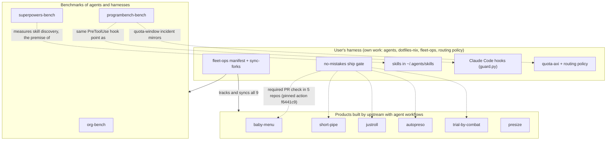

# Apps and benchmarks - overview and JD mapping

This note compares the nine app and benchmark repos in the user's fleet and maps them to a Global Markets full-stack role (React, ES6+, websockets, OpenFin / Electron, Tailwind, Python / Java, testing, release compliance, CI/CD).
Evidence was gathered read-only on 2026-09-23; each row links to a full case study with `repo/path:line` citations.

## Authorship, stated once

All nine repos are forks of upstream `kunchenguid/*` projects, and every one has zero fork-specific commits: `git log upstream/<branch>..HEAD` is empty and all commit authors are upstream (Kun Chen, `kunchenguid`, bots, and a few external contributors).
Live `git ls-remote upstream` checks for four of them returned the same tip as local HEAD on 2026-09-23.
The user's own work around these repos is operational: fleet manifest entries, daily fast-forward sync, jump and run aliases, npm-link installs, a Homebrew install of Baby Menu, custom ACP agent registrations and personal widgets in `~/.baby-menu`, and the evaluation of what the benchmarks mean for the harness's own policies.
In an interview, present these as "tools and studies I adopted, run, and learned from", not as code you wrote.

## How they relate to the harness

Three roles:
- **Dogfood products** (baby-menu, short-pipe, justroll, autopreso, trial-by-combat): upstream apps developed under the no-mistakes gate; five of them require every human PR to carry a no-mistakes pipeline attestation, checked by the shared `require-no-mistakes` action pinned at `f6441c9` (v1.80.1) (for example `baby-menu/.github/workflows/no-mistakes-required.yml:58`).
  baby-menu is also a personal tool the user installed and extended with agent-generated widgets.
- **Legacy app** (presize): a 2023 web app with no harness wiring.
- **Benchmarks** (org-bench, superpowers-bench, programbench-bench): measurements of agent organization, skill discovery, and harness choices; their findings inform how the user writes skills, sizes long runs, and treats TDD mandates.

## Comparison table

| Repo | Kind | Stack | JD-relevant frontend evidence | Harness relation | Tests (my run, 2026-09-23) | Results on disk |
| --- | --- | --- | --- | --- | --- | --- |
| [baby-menu](baby-menu.md) | macOS tray app | Electron 42, React 19, Tailwind v4, TypeScript 6, Radix, Vitest, ACP | strongest: Electron main/preload/renderer split, `contextBridge`, React 19, Tailwind v4 design system, generated type contracts | no-mistakes gate; user installed v0.1.24 and added Grok and Gemini ACP agents | 554 pass, 2 skip; 2 suites could not load (Electron binary not installed) | none |
| [short-pipe](short-pipe.md) | desktop app | Electron 41, React 19, TypeScript 5.9, Biome, Vitest, pi-coding-agent | Electron with `sandbox: true`, typed IPC plus a push event stream, React 19 | no-mistakes gate; Agent Skills `SKILL.md` | 305 pass, 2 skip | none |
| [justroll](justroll.md) | CLI | Node ESM, React 19 via Ink, ffmpeg | React component model in a terminal UI, `ink-testing-library` | no-mistakes gate; npm-linked, alias `jr` | 72 pass | none |
| [autopreso](autopreso.md) | local web app | Node 24, Express 5, `ws`, Vercel AI SDK, React 19 via import maps, Excalidraw | strongest websocket evidence: bidirectional typed JSON protocol, broadcast, coalescing queue | no-mistakes gate; npm-linked, alias `ap` | 237 pass, 1 skip (Chrome smoke) | none |
| [presize](presize.md) | web app | Qwik City, React 18 islands, Tailwind 3, daisyUI, Cloudflare Pages | React inside another framework, Tailwind, client-side file processing | none | not run (no test suite) | none |
| [trial-by-combat](trial-by-combat.md) | arena and benchmark | Node, Express 4, `ws`, vanilla JS client, Biome | websocket fan-out to spectators, long-poll HTTP for agents | no-mistakes gate | 129 pass | 3 map evals (best score 66.25 vs baseline 55.19) |
| [org-bench](org-bench.md) | benchmark | TypeScript monorepo, opencode, zod, Preact + Vite viewer | SSE consumer, Preact viewer | none; fleet sync skipped daily (dirty lockfile) | typecheck passed (no tests exist) | 12 runs, rubric sums 21 to 30 of 40 |
| [superpowers-bench](superpowers-bench.md) | benchmark | TypeScript, tsx | none | measures skill discovery for the skill format the harness uses | not run (deps not installed) | 8 conditions x 18 tasks, F1 40 to 92 percent |
| [programbench-bench](programbench-bench.md) | benchmark | bash, Docker, Python (scipy) | none | same hook point as `guard.py`; quota lesson mirrors routing policy | `bash -n` on 27 scripts passed | 3 studies, n = 192; headline p-values recomputed and matched |

## JD mapping: evidence and gaps

| JD item | Evidence in this cluster | Strength | Gap and how to frame it |
| --- | --- | --- | --- |
| React / ES6+ | React 19 in baby-menu, short-pipe, justroll (Ink), autopreso; React 18 in presize | strong, but upstream code | Say "I read, run, and test these codebases"; do not claim authorship |
| Websockets | autopreso `ws` server and client protocol (`autopreso/src/server.js:37`, `autopreso/public/app.js:211`); trial-by-combat spectator push with heartbeats (`trial-by-combat/src/server.js:130`) | strong | No sequence numbers, snapshots plus deltas, or reconnect-replay; be ready to explain how a market-data feed adds those |
| OpenFin / Electron | baby-menu and short-pipe: context isolation, sandbox, preload bridge, custom protocols, signed and notarized release (baby-menu) | strong for Electron | No OpenFin code anywhere (git grep, 2026-09-23); map the Electron security model to OpenFin's window and channel APIs verbally |
| Tailwind | Tailwind v4 with a single `@theme` token file compiled per widget (baby-menu); Tailwind 3 with daisyUI (presize) | strong | none |
| Python / Java OO | Python only as analysis scripts (programbench-bench `harness/analyze.py`) and a Moonshine sidecar script in autopreso | weak | No Java in any of the nine repos (0 `.java` files); cover Java from other experience |
| Unit test coverage | Vitest suites (baby-menu, short-pipe), `node:test` (justroll, autopreso, trial-by-combat); 1,297 passing tests across my five runs | strong | Coverage percentages are not measured in any CI here |
| Release compliance | baby-menu release workflow: Developer ID signing, notarization, `codesign --verify --deep --strict`, universal-binary and entitlements checks, draft-release verification (`baby-menu/.github/workflows/release-please.yml:229`); no-mistakes attestation required on PRs | strong analogue | No regulatory change-management (for example ticket linkage or approvals); explain how the attestation check is the automated analogue |
| CI/CD with AWS CDK / CloudFormation / CodeBuild | GitHub Actions only | none | No AWS infrastructure-as-code in any of the nine repos (the one `git grep` hit was `xcodebuild`); be explicit that this is a gap |
| Distributed, reliable pipelines | org-bench orchestrator (worktrees, PRs, budgets, finalize stages); programbench-bench batch resume and watchdogs | moderate | These are batch pipelines, not streaming systems |
| Partnering with business | not evidenced in code | none | Use other experience |

## Cross-repo facts worth remembering

- Five repos pin the same no-mistakes action commit `f6441c9` and exempt only automation accounts and the upstream owner (`justroll/.github/workflows/no-mistakes-required.yml:61`); the action verifies a head-SHA-bound pipeline attestation in the PR body (`no-mistakes/.github/actions/require-no-mistakes/README.md:1`).
  See [no-mistakes](no-mistakes.md).
- The fleet's daily `sync-forks` launchd job skips dirty trees, and org-bench has been skipped in every log from 2026-08-23 to 2026-09-23 because of an uncommitted `package-lock.json` change (`.fleet/logs/sync-20260923.log:276`, `dotfiles-nix/files/bin/sync-forks:155`).
  See [fleet-ops](fleet-ops.md).
- presize is the one Node repo pinned to pnpm 8.6.2; the manifest warns not to force the global pnpm 11 there (`.fleet/manifest.yaml:230`).
- Across the benchmarks the recurring lesson is measurement hygiene: paired tests and n = 192 in programbench-bench, versus n = 1 per cell in org-bench and superpowers-bench, where rankings should be read as anecdotes.

## Suggested 60-second interview framing

"My agent harness is mostly integration and policy on top of open-source tools.
To keep myself honest about which harness choices actually help, I track three benchmark repos: one measures agent team topologies, one measures whether agents discover skills, and one A/B tests harness decisions with paired statistics.
For example, its TDD study found a mandated test-first skill cost 55 percent more and scored lower on hidden-spec tasks, which I verified from the committed CSV.
On the frontend side, the apps in my fleet are Electron, React 19, Tailwind, and websocket codebases I run and test locally, and I can walk through their security model and streaming design in the terms a trading desktop needs."
