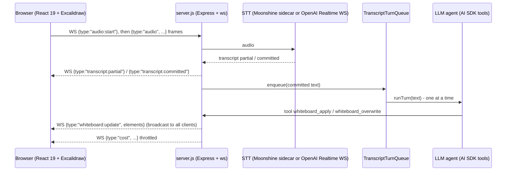

# autopreso - speech to a live whiteboard over websockets

Evidence was gathered read-only on 2026-09-23 from the local clone at `~/github/autopreso` (HEAD `60a0c90`), real `--help` output, and a real test run.
Citations use `repo/path:line`.

## 1. TL;DR

autopreso is a local Node web app: the browser streams microphone audio over a websocket, a speech-to-text engine (local Moonshine or OpenAI Realtime) turns it into transcript chunks, and a tool-calling LLM agent edits a live Excalidraw canvas that every connected client sees in real time (`autopreso/README.md:23`).
It is the most websocket-heavy repo in this cluster: an Express 5 + `ws` server with a typed JSON message protocol in both directions, and a React 19 front end loaded through browser import maps with no bundler (`autopreso/package.json:51`, `autopreso/package.json:53`, `autopreso/public/index.html:12`).
Upstream (Kun Chen, `kunchenguid/autopreso`) built it; the user's fork has no fork-specific commits, and the user npm-linked it as `autopreso` (alias `ap`) but has not run it (no `~/.config/autopreso`).

## 2. Problem it solves, and what breaks without it

A speaker wants to talk, not click through a deck; autopreso lets the whiteboard draw itself from speech (`autopreso/README.md:23`).

What breaks without its design:
- Speech arrives as many small chunks, and an LLM turn takes seconds; without a turn queue, turns would overlap and fight over the canvas.
  The queue runs one turn at a time and coalesces chunks that arrive meanwhile (`autopreso/src/transcript-turn-queue.js:1`).
- Fillers like "uh" would each trigger a paid model call; the queue only fires when the buffer has a substantive word (`autopreso/src/whiteboard-session.js:86`).
- A cold model makes the first sentence slow; a warmup loop primes the agent on the staging content (`autopreso/README.md:88`).
- Exposing a mic-driven agent on the LAN would be risky; the server binds to `127.0.0.1` only (`autopreso/src/cli-options.js:3`).

## 3. Architecture



Modules (`autopreso/src/`):
- `cli.js`: entry; loads settings, resolves the agent provider, starts the server, opens the browser (`autopreso/src/cli.js:13`).
- `server.js`: Express REST routes plus `WebSocketServer` on path `/ws` (`autopreso/src/server.js:37`), the websocket message router (`autopreso/src/server.js:157`), and the agent call with two tools (`autopreso/src/server.js:399`, `autopreso/src/server.js:417`).
- `whiteboard-session.js`: per-session state, the turn queue wiring, and the `broadcast` helper that fans a JSON message out to every open client (`autopreso/src/whiteboard-session.js:76`, `autopreso/src/whiteboard-session.js:255`).
- `transcript-turn-queue.js`: single-flight turn runner with coalescing (`autopreso/src/transcript-turn-queue.js:1`).
- `openai-transcription.js` and `moonshine-transcription.js`: two STT backends; OpenAI Realtime is itself a websocket client (`autopreso/src/openai-transcription.js:1`).
- `whiteboard-tools.js`: line-numbered edit operations over the element array, rejecting out-of-range lines (`autopreso/src/whiteboard-tools.js:10`).
- `settings-store.js`, `session-cost.js`, `codex-auth.js`, `agent-provider.js`.
- `public/app.js`: the React client that opens one persistent websocket for the app's lifetime (`autopreso/public/app.js:209`).

Data model: the whiteboard is an array of Excalidraw elements held server-side in `state.elements`; clients receive full element arrays on `whiteboard:update`.

State files: `~/.config/autopreso/settings.json` plus logs `~/.config/autopreso/logs/cache.log` and `debug.log` (`autopreso/src/cli.js:11`, `autopreso/README.md:106`).

## 4. Interfaces

Real `autopreso --help` output (2026-09-23, exit 0), abridged:

```text
Usage:
  autopreso [options]

Options:
  --no-open                Do not open the browser automatically
  -h, --help               Show this help

The server binds to 127.0.0.1 only.

Environment:
  PORT                     Port to listen on. Default: 3210
  OPENAI_API_KEY           Seeds the OpenAI key on first run if no settings file exists
  OPENAI_MODEL / OPENAI_BASE_URL / OPENAI_REASONING_EFFORT
  CODEX_HOME / CODEX_MODEL / CODEX_BASE_URL
  OLLAMA_MODEL / OLLAMA_BASE_URL
  AUTOPRESO_CACHE_LOG / AUTOPRESO_DEBUG_LOG
```

Exit codes: 1 on bad arguments, on an unconfigured agent, or on OpenAI transcription without a key (`autopreso/src/cli.js:20`, `autopreso/src/cli.js:39`, `autopreso/src/cli.js:46`).

HTTP routes (`autopreso/src/server.js:59` onward): `GET /api/config`, `GET /api/settings`, `PUT /api/settings`, `POST /api/session/reset`, `POST /api/preso/start`, `POST /api/preso/warmup/cancel`, `POST /api/preso/back-to-staging`.

Websocket protocol (JSON with a `type` discriminator):

| Direction | Types | Evidence |
| --- | --- | --- |
| client -> server | `audio:start`, `audio`, `stop`, `whiteboard:screenshot`, `warmup:cancel`, `whiteboard:user-elements`, `settings:update` | `autopreso/src/server.js:180` to `autopreso/src/server.js:217` |
| server -> client | `config`, `settings`, `mode`, `transcript:partial`, `transcript:committed`, `agent:status`, `warmup`, `whiteboard:update`, `whiteboard:viewport`, `cost` | `autopreso/public/app.js:216` onward, `autopreso/src/server.js:75`, `autopreso/src/server.js:455` |

## 5. Configuration

`~/.config/autopreso/settings.json`, defaults in `autopreso/src/settings-store.js:8`:

| Key | Default |
| --- | --- |
| `agent.provider` | `openai` |
| `agent.openai` | model `gpt-5.5`, `reasoningEffort: low` |
| `agent.codex` | model `gpt-5.5-fast` |
| `agent.ollama` | model empty, base URL `http://localhost:11434/v1` |
| `transcription.provider` | `moonshine` (model `medium`) |
| `apiKeys.openai` | empty (<redacted> when set) |
| `agentInstructions` | empty, max 100,000 chars (`autopreso/src/settings-store.js:6`) |

First-run auto-detection precedence for the agent is Codex CLI auth, then `OLLAMA_MODEL`, then `OPENAI_API_KEY` (`autopreso/README.md:123`).
The settings payload sent to browsers is sanitized: `apiKeys` is removed and replaced by a boolean `hasOpenAIKey` (`autopreso/src/settings-store.js:70`, `autopreso/src/settings-store.js:73`).
User's actual setting: none; `~/.config/autopreso/` does not exist on this machine (2026-09-23).

## 6. Connections

- **fleet-ops**: `kind: cli`, `toolchain: [node@>=24, npm]`, npm-linked into `/opt/homebrew/lib/node_modules`, aliases `cdap` and `ap` (`.fleet/manifest.yaml:101`, `.fleet/aliases.zsh:21`, `.fleet/aliases.zsh:22`); verified symlink `/opt/homebrew/lib/node_modules/autopreso -> ~/github/autopreso`.
  See [fleet-ops](fleet-ops.md).
- **no-mistakes**: upstream requires PRs through no-mistakes (`autopreso/CONTRIBUTING.md:5`), and the repo even has a test that asserts its own required-check workflow shape (`autopreso/test/no-mistakes-required-workflow.test.js`), pinning the shared action at `f6441c9` (`autopreso/.github/workflows/no-mistakes-required.yml:65`); see [no-mistakes](no-mistakes.md).
- **chrome-devtools-axi (conceptual)**: autopreso's own browser smoke test drives Chrome over the DevTools websocket protocol (`autopreso/test/browser-smoke.test.js:89`), the same CDP mechanism the harness's browser CLI uses; there is no code dependency.
- **Other harness components**: no reference from `agents`, skills, hooks, `firstmate`, or `dotfiles-nix` (grep, 2026-09-23).

## 7. Lifecycle walkthrough

Trace: the presenter clicks Start Preso and says "OpenAI just released a new model".

1. `cli.js` loads settings, resolves the provider, and calls `startServer`, which listens on `127.0.0.1:3210` (`autopreso/src/cli.js:29`, `autopreso/src/cli.js:50`, `autopreso/src/server.js:231`).
2. The React client opens `ws://<host>/ws` in a `useEffect` with an empty dependency list, so there is one socket for the app's lifetime (`autopreso/public/app.js:209`, `autopreso/public/app.js:211`).
3. `POST /api/preso/start` switches mode to live and broadcasts `mode` and the current elements (`autopreso/src/server.js:80`, `autopreso/src/server.js:123`).
4. The client sends `audio:start` then `audio` frames; the server forwards them to the STT backend (`autopreso/src/server.js:180`, `autopreso/src/server.js:184`).
5. STT emits partial and committed transcripts, which are broadcast for captions and the committed text is enqueued (`autopreso/src/whiteboard-session.js:115`).
6. The queue checks `isReady` (non-filler), and if no turn is running, starts `runTurn`; otherwise it buffers and joins the text for the next turn (`autopreso/src/transcript-turn-queue.js:13`, `autopreso/src/transcript-turn-queue.js:23`, `autopreso/src/transcript-turn-queue.js:38`).
7. `runWhiteboardAgent` calls the AI SDK with `stopWhen: stepCountIs(4)` and tools `whiteboard_overwrite` and `whiteboard_apply` (`autopreso/src/server.js:338`, `autopreso/src/server.js:395`).
8. Each successful tool call updates `state.elements` and broadcasts `whiteboard:update` (and optionally `whiteboard:viewport`) to all open sockets whose `readyState` is `OPEN` (`autopreso/src/server.js:443`, `autopreso/src/whiteboard-session.js:258`).
9. The client applies the elements to Excalidraw; cost estimates stream as throttled `cost` messages (`autopreso/src/server.js:317`).

## 8. Failure modes and safeguards

| Failure | Safeguard | Evidence |
| --- | --- | --- |
| Overlapping agent turns | single-flight queue; later chunks coalesce | `autopreso/src/transcript-turn-queue.js:23` |
| Filler words trigger model calls | `isReady` requires a non-trivial transcript | `autopreso/src/whiteboard-session.js:86` |
| Runaway tool loops | `stopWhen: stepCountIs(4)` | `autopreso/src/server.js:395` |
| Agent edits a non-existent line | edit operations throw with the valid line count | `autopreso/src/whiteboard-tools.js:40` |
| Empty tool calls waste steps | `whiteboard_apply` rejects calls with neither operations nor viewport | `autopreso/src/server.js:432` |
| Session ended mid-turn | the turn captures its session at start and checks it is still active | `autopreso/src/whiteboard-session.js:92` |
| API key leaks to the browser | settings sanitized to `hasOpenAIKey` | `autopreso/src/settings-store.js:70` |
| Sending on a closing socket | broadcast skips clients not in `OPEN` state | `autopreso/src/whiteboard-session.js:258` |

## 9. Testing and quality

- Tests: `node --test` (`autopreso/package.json:44`), plus `tsc --noEmit` with `allowJs` and `checkJs` over `src`, `scripts`, and `test`, non-strict, excluding `public/app.js` (`autopreso/tsconfig.json:6`).
- CI: Node 24, `npm ci`, `npm run typecheck`, `npm test` (`autopreso/.github/workflows/ci.yml:27`, `autopreso/.github/workflows/ci.yml:30`).
- A real-Chrome smoke test skips itself when Chrome is absent (`autopreso/test/browser-smoke.test.js:17`).

Real run (2026-09-23, `HOME` redirected to scratch, `OPENAI_API_KEY` unset, `CHROME_BIN=/nonexistent` to force-skip the browser smoke, `node --test`): 238 tests, 237 pass, 0 fail, 1 skipped (the Chrome smoke), about 2.6 s.

## 10. Fork delta

No fork-specific commits; tracks upstream.
`git log upstream/main..HEAD` is empty; commits are by upstream authors (Kun Chen, `kunchenguid`, `github-actions[bot]`, one external contributor).
The user's contribution: fleet manifest entry, npm-link install, `ap` alias.

## 11. Interview angle

**Q1. Walk me through a websocket protocol design.**
Use one persistent socket per client, JSON messages with a `type` discriminator in both directions, server-authoritative state (`state.elements`), and full-state broadcasts for small documents so late joiners and reconnects converge (`autopreso/src/whiteboard-session.js:255`).
For a Global Markets blotter you would keep the discriminated union but send deltas with sequence numbers plus periodic snapshots, because full-state broadcast does not scale to thousands of rows at tick rate.

**Q2. How do you handle backpressure between a fast producer and a slow consumer?**
The transcript queue is a coalescing buffer: while a turn runs, new chunks are joined and processed as one next turn, never dropped and never run concurrently (`autopreso/src/transcript-turn-queue.js:23`).
The same conflation pattern is standard for market data: when the UI cannot keep up, collapse intermediate ticks to the latest state per key.

**Q3. Why no bundler?**
The client uses an import map pointing at `esm.sh` for React 19 and Excalidraw (`autopreso/public/index.html:12`), which removes the build step for a local tool.
The downside is a runtime dependency on a public CDN and no tree-shaking, which you would not accept in a regulated enterprise deployment.

**Trade-off to defend.** Broadcasting the whole element array on every change is simple and self-healing, but its bandwidth grows with document size times client count; it is right for a single-presenter local app and wrong for a multi-user trading surface, where you would switch to versioned deltas.
