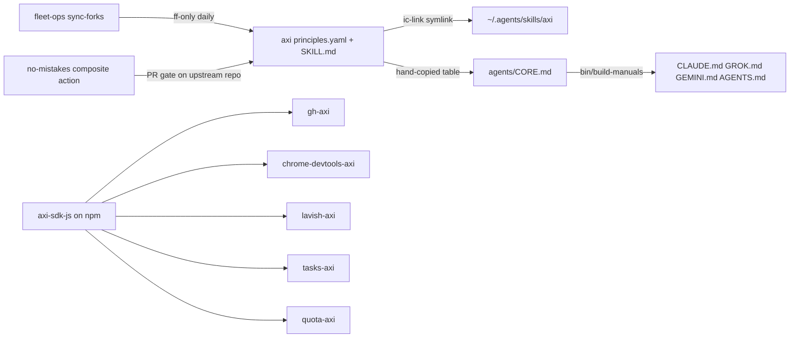

# axi - the Agent eXperience Interface spec and SDK

Sibling notes in this cluster: [gh-axi](gh-axi.md), [chrome-devtools-axi](chrome-devtools-axi.md), [lavish-axi](lavish-axi.md).
Other harness components (firstmate, no-mistakes, tasks-axi, quota-axi, agents, dotfiles-nix, fleet-ops) are named in backticks and documented in their own notes.

## 1. TL;DR

`axi` is an upstream repo (kunchenguid/axi) that defines 10 design principles for CLIs whose primary user is an LLM agent, plus `axi-sdk-js`, a small Node runtime that turns those principles into shared code.
Every Node CLI in this harness that an agent calls for GitHub, browser, review, backlog, or quota work (`gh-axi`, `chrome-devtools-axi`, `lavish-axi`, `tasks-axi`, `quota-axi`) is built on `runAxiCli` from that SDK.
My fork carries no code changes; my contribution is wiring: the `axi` skill is symlinked into every agent's skill directory by `ic-link`, the principles are compiled into every agent manual by the `agents` generator, and the fork is fast-forwarded daily by `fleet-ops`.

## 2. Problem it solves, and what breaks without it

Agents consume CLIs through a shell, so every byte of stdout is billed as input tokens and every ambiguous answer costs another turn.
Human-oriented CLIs fail agents in predictable ways:

- Wide tables and JSON dumps burn tokens on fields the agent never uses.
- Empty output is ambiguous (did the filter match nothing, or did the command fail silently?), so the agent re-runs with different flags to check.
- Interactive prompts hang a non-interactive shell forever.
- Unknown flags that are silently ignored produce plausible but wrong output, which is worse than an error.
- Help-first entry points force a second call before the agent sees any live state.

The upstream README publishes benchmark numbers for this claim: on a 490-run browser benchmark `chrome-devtools-axi` hit 100% success at $0.074 average cost versus $0.101 for raw `chrome-devtools-mcp` (`axi/README.md:23-33`), and on a 425-run GitHub benchmark `gh-axi` hit 100% versus 86% for plain `gh` and 87% for the GitHub MCP server (`axi/README.md:37-45`).
These are upstream's published numbers with Claude Sonnet 4.6 as the agent; I did not re-run the benchmarks.

Without the SDK, each CLI would re-implement dispatch, TOON serialization, the error contract, `--version`, self-update, and hook installation, and they would drift.

## 3. Architecture

The repo is a pnpm workspace (`axi/pnpm-workspace.yaml:1-5`) with four parts.

| Part | Path | Role |
| --- | --- | --- |
| Principles source | `principles.yaml` | Single source for the 10 principle titles and summaries (`axi/principles.yaml:1-11`) |
| Full spec | `.agents/skills/axi/SKILL.md` | Installable Agent Skill with the long-form rules, examples, and exit-code contract |
| Catalog | `catalog.yaml` | Official and community AXIs, rendered into the README |
| SDK | `packages/axi-sdk-js` | npm package `axi-sdk-js` 0.1.12 locally (`axi/packages/axi-sdk-js/package.json:3`) |
| Benchmarks | `bench-browser/`, `bench-github/` | Agent-task harnesses with published results under `published-results/` |
| Docs generator | `scripts/generate-docs.mjs` | Renders principles and catalog into README and `docs/index.html`; `--check` fails on drift |

### The 10 principles

Titles are verbatim from `axi/principles.yaml:12-41`; the one-line gloss is mine.

| # | Principle | What it means in practice |
| --- | --- | --- |
| 1 | Token-efficient output | TOON on stdout, JSON internally, convert at the boundary (`axi/.agents/skills/axi/SKILL.md:16-26`) |
| 2 | Minimal default schemas | 3-4 fields per list row, `--fields` to widen (`SKILL.md:28-36`) |
| 3 | Content truncation | Truncated preview plus total size plus a `--full` hint only when truncated (`SKILL.md:38-56`) |
| 4 | Pre-computed aggregates | `count: 30 of 847 total`, `checks: 3/3 passed` so the agent skips a follow-up call (`SKILL.md:58-82`) |
| 5 | Definitive empty states | Say "0 results" with context (`SKILL.md:84-93`) |
| 6 | Structured errors and exit codes | Idempotent mutations, errors on stdout, no prompts, reject unknown flags with exit 2 (`SKILL.md:95-145`) |
| 7 | Ambient context | Opt-in `SessionStart` hooks first, installable skill second (`SKILL.md:147-200`) |
| 8 | Content first | No-arg run shows live state, not a manual (`SKILL.md:202-216`) |
| 9 | Contextual disclosure | `help[]` next-step commands with placeholders, omitted when self-contained (`SKILL.md:218-231`) |
| 10 | Consistent way to get help | Concise per-subcommand `--help`, `bin:` and `description:` in the home view, fast `--version` (`SKILL.md:233-273`) |

The exit-code contract is fixed: 0 success including no-ops, 1 error, 2 usage error (`axi/.agents/skills/axi/SKILL.md:141-143`).
Structured output and errors go to stdout; progress and diagnostics go to stderr (`SKILL.md:139-145`).

### TOON in one example

TOON (Token-Oriented Object Notation) declares a uniform array's length and field names once in a header and then emits one CSV-like row per item, which is where the roughly 40% saving over JSON comes from (`axi/principles.yaml:14`).
A real `gh-axi pr list` run on 2026-09-23 printed:

```text
count: 3 of 6 total
pull_requests[3]{number,title,state,author,draft,review}:
  157,"fix: stream GitHub subprocess stderr live",open,connectwithclayton,no,none
help[2]:
  Run `gh-axi pr view <number> -R kunchenguid/gh-axi` to view details
```

(Rows trimmed.)
The `[3]` length marker is also a correctness aid: the agent can tell a complete list from a truncated one without counting.

### axi-sdk-js modules

| File | Lines | Responsibility |
| --- | --- | --- |
| `src/cli.ts` | 321 | `runAxiCli`: dispatch, `--help`, `--version`, reserved `update`, home header, error boundary |
| `src/output.ts` | 77 | `renderOutput` (TOON via `@toon-format/toon` `encode`), `errorOutput`, `collapseHomeDirectory` |
| `src/errors.ts` | 18 | `AxiError(message, code, suggestions)` and `exitCodeForError` |
| `src/fast-path.ts` | 54 | Dependency-free `tryFastPath` for `-v/-V/--version` |
| `src/hooks.ts` | 928 | Install, status, and uninstall of SessionStart hooks for Claude Code, Codex, OpenCode |
| `src/update.ts` | 904 | Built-in `update` self-updater: registry lookup, install-method detection, upgrade plan |

The only runtime dependency is `@toon-format/toon` (`axi/packages/axi-sdk-js/package.json:40-42`), and it requires Node 20+ (`package.json:51-53`).

### State files

The SDK itself persists nothing of its own.
It writes other tools' config only when a CLI's explicit `setup hooks` command calls `installSessionStartHooks`:

- `~/.claude/settings.json` and `~/.codex/hooks.json` (or the project-scope equivalents), merged in place (`axi/packages/axi-sdk-js/src/hooks.ts:460-481`).
- `~/.codex/config.toml`, where it ensures `[features] hooks = true`, always at user scope even for a project install (`hooks.ts:454-456`, `hooks.ts:256-262`).
- An OpenCode plugin file `axi-<marker>.js` under `~/.config/opencode/plugins/` (`hooks.ts:428-446`).

## 4. Interfaces

`axi` ships no binary (`~/github/.fleet/manifest.yaml:65-66` records `provides_bin: []`).
Its interfaces are the skill, the SDK API, and the repo scripts.

### SDK API (from `axi/packages/axi-sdk-js/README.md:108-130`)

| API | Purpose |
| --- | --- |
| `runAxiCli(options)` | The runtime every AXI calls; options include `description`, `version`, `topLevelHelp`, `commands`, `home`, `getCommandHelp`, `resolveContext`, `formatError`, `renderUnknownCommand` (`src/cli.ts:32-50`) |
| `tryFastPath(argv, {version})` | Answers a bare version flag before the heavy module graph loads (`src/fast-path.ts:39-54`) |
| `AxiError` | Throwable structured error; code `VALIDATION_ERROR` maps to exit 2, everything else to exit 1 (`src/errors.ts:1-18`) |
| `installSessionStartHooks`, `sessionStartHookStatus`, `uninstallSessionStartHooks` | Hook lifecycle (`src/hooks.ts:692`, `:847`, `:880`) |
| `runUpdate`, `fetchLatestVersion`, `detectInstallMethod`, `planUpgrade` | Self-update internals (`src/update.ts:798`, `:577`, `:192`, `:402`) |

### Behavior every SDK-based CLI inherits

| Input | Output | Exit | Source |
| --- | --- | --- | --- |
| no args | `bin:` + `description:` header merged with the tool's home output | 0 | `src/cli.ts:118-128`, `:291-307` |
| bare `--help` | tool's `topLevelHelp` plus a `"built-in":` block for `update` | 0 | `src/cli.ts:91-103`, `:253-261` |
| `-v`, `-V`, `--version` | bare version string | 0 | `src/cli.ts:105-116` |
| a flag before the command | `error: Flags must come after the command` | 2 | `src/cli.ts:131-135`, `:275-285` |
| unknown command | `error: "Unknown command: <x>"`, `code: VALIDATION_ERROR` | 2 | `src/cli.ts:154-160`, `:70-74` |
| `update` / `update --check` | self-upgrade or version report, TOON | 0/1 | `src/cli.ts:141-144`, `:216-237` |
| handler throws `AxiError` | `error`, `code`, `help[]` in TOON on stdout | 1 or 2 | `src/cli.ts:52-68`, `:239-247` |
| downstream closes the pipe early, for example piped into head | EPIPE treated as success | 0 | `src/cli.ts:166-194` |

I verified the two usage-error rows live against `gh-axi` on 2026-09-23 (`gh-axi bogus` and `gh-axi --repo x/y issue list` both printed a TOON error and exited 2).

### Repo scripts (`axi/package.json:5-12`)

- `pnpm run docs:gen` regenerates README and site regions from YAML.
- `pnpm run docs:check` fails on drift, including skill headings that stop matching `principles.yaml` titles (`axi/principles.yaml:4-8`).
- `pnpm --dir packages/axi-sdk-js test` runs the SDK Vitest suite.
- `pnpm --dir bench-browser run bench -- matrix --repeat 5` and the `bench-github` equivalent reproduce the benchmarks (`axi/README.md:228-263`).

## 5. Configuration

| Config | Key or file | Default | My setting | Why |
| --- | --- | --- | --- | --- |
| Workspace supply-chain guard | `minimumReleaseAge` in `pnpm-workspace.yaml` | 10080 minutes (7 days), strict, `axi-sdk-js` exempt (`axi/pnpm-workspace.yaml:7-10`) | Upstream value, unchanged | Refuses dependency versions younger than a week, a cheap defense against a hijacked npm release |
| Hook timeout | `timeoutSeconds` option | 10 s (`src/hooks.ts:154`, `:177`, `:738`) | Not used: no AXI SessionStart hooks are installed on this machine | `~/.claude/settings.json` (a symlink into `agents/claude/settings.json`) has only `PreToolUse` and `PostToolUse` hooks; I checked on 2026-09-23 |
| Hook scope | `scope` option, `user` or `project` | `user` (`src/hooks.ts:465`) | n/a | n/a |
| Skill install | `~/.agents/skills/axi` | none | Symlink to `~/github/axi/.agents/skills/axi` | Created by `dotfiles-nix/files/bin/ic-link:86`, mirrored into `~/.claude/skills` and `~/.codex/skills` (`ic-link:91-94`) |
| Manual text | AXI section of `CORE.md` | n/a | 10-row table in `agents/CORE.md:142-155` | Every generated manual (Claude, Grok, Gemini, AGENTS.md) carries it |

One drift worth knowing: my manual's principle 6 summary reads "Idempotent mutations, structured errors, no interactive prompts." (`agents/CORE.md:153`), while upstream has since appended "fail loud on unknown flags" (`axi/principles.yaml:29`).
The generator (`agents/bin/build-manuals`) copies my own text, not upstream's, so it does not pick this up automatically.

The dotfiles README deliberately leaves ambient hooks off and documents how to enable them per tool (`dotfiles-nix/README.md:524-530`).

## 6. Connections



- SDK consumers, by `package.json`: `gh-axi/package.json:45`, `chrome-devtools-axi/package.json:48`, `tasks-axi/package.json:51`, `quota-axi/package.json:62` depend on `^0.1.10`; `lavish-axi/package.json:35` on `^0.1.8`.
- Resolved versions on disk (checked 2026-09-23): 0.1.10 in the first four and 0.1.8 in `lavish-axi`, from npm, not from the local fork (which is at 0.1.12).
  So the local `axi` checkout is a reading copy; nothing I change there reaches a CLI unless it is published to npm.
- `tasks-axi/src/cli.ts:150` and `quota-axi/src/cli.ts:56` call `runAxiCli`, the same as the three sibling CLIs in this cluster.
- `dotfiles-nix`: `ic-link` owns the skill links (`dotfiles-nix/files/bin/ic-link:60-94`); `ic-doctor` lists `axi` among required forks and skills (`dotfiles-nix/files/bin/ic-doctor:43-46`).
- `fleet-ops`: manifest entry with `sync: true` and `install: "pnpm install"` (`~/github/.fleet/manifest.yaml:56-69`); the 2026-09-23 run logged `[axi] already up to date with upstream` (`~/github/.fleet/logs/sync-20260923.log`).
- `no-mistakes`: upstream's PR gate is a thin caller of `kunchenguid/no-mistakes/.github/actions/require-no-mistakes`, pinned to SHA `f6441c96` (v1.80.1) (`axi/.github/workflows/no-mistakes-required.yml`), so every upstream PR must carry a no-mistakes pipeline attestation.
- `agents`: `OPINIONS.md:78` states "Tools built for agents should follow the AXI principles in the operating manual."

## 7. Lifecycle walkthrough: `gh-axi pr list -R kunchenguid/gh-axi --limit 3`

This traces the SDK's role in one real run; the gh-axi-specific parts are in [gh-axi](gh-axi.md).

1. `gh-axi/bin/gh-axi.ts:5` calls `tryFastPath(argv, {version})`; argv has four elements, so `axi-sdk-js/src/fast-path.ts:43-45` returns `false` without writing.
2. The bin dynamically imports `src/cli.js` and calls `main()` (`gh-axi/bin/gh-axi.ts:6-7`), which calls `runAxiCli` (`gh-axi/src/cli.ts:136`).
3. `runAxiCli` installs the EPIPE handler (`axi-sdk-js/src/cli.ts:80`, `:166-194`) and runs `initialize` if provided (`:82-87`).
4. argv is not bare `--help` or a version flag (`:91-116`); `command = "pr"`, which does not start with `-` (`:131-135`) and is not `update` (`:141`).
5. `args` does not include `--help` (`:146`), so the handler is looked up in `options.commands` (`:154`).
6. `runHandler` resolves context inside the same try block (`:204-208`), so a bad `-R` value surfaces as a structured error rather than a crash.
7. The handler returns a string; since this is not the home view, `renderCommandOutput` passes it through `renderOutput` unchanged (`:291-298`, `output.ts:55-61`) and it is written with a trailing newline (`:210`).
8. If anything throws, `writeFormattedError` writes the tool's formatted error to stdout and sets `process.exitCode` (`:239-247`); for `gh-axi`, the tool overrides `formatError` to add operation outcomes (`gh-axi/src/cli.ts:104-133`).

## 8. Failure modes and safeguards

| Failure | Safeguard |
| --- | --- |
| Hook installer clobbers a user's other hooks | Hooks are identified by a marker substring in the command; only matching entries are updated or removed (`src/hooks.ts:108-110`, `:112-183`) |
| Reinstall moves the binary and the hook points at a dead path | `resolvePortableHookCommand` prefers a PATH name that realpath-resolves to the current executable, else the absolute path; re-running setup repairs it (`src/hooks.ts:519-559`) |
| Dev entrypoint (`pnpm run dev`) registers itself as a hook | `shouldInstallHooksForNodeAxiExecPath` gate (`src/hooks.ts:616`); `chrome-devtools-axi/src/hooks.ts:39-44` uses it |
| Repeated install rewrites files | `computeSessionStartHookUpdate` returns `changed=false` when the entry is already correct, so no write (`src/hooks.ts:160-162`, `:754`) |
| `--version` probe pays for the whole module graph on every session start | `axi-sdk-js/fast-path` imports nothing (`src/fast-path.ts:1-23`); consumers keep `VERSION` in a leaf module (`SKILL.md:249-273`) |
| Self-update guesses the wrong package manager | `detectInstallMethod` maps npm, pnpm, Homebrew, npx; unknown methods print the command and do not run it (`packages/axi-sdk-js/README.md:82-88`) |
| Registry hangs | 20 s fetch timeout (`src/update.ts:12`) with an `npm view` fallback (`README.md:81`) |
| Hand edits to generated docs | `docs-check.yml` runs `docs:test` and `docs:check`; `guard-generated-files.yml` fails PRs touching release-please outputs |

## 9. Testing and quality

- CI: `axi-sdk-js-ci.yml` runs `format:check`, `lint`, build, and tests on Node 24 for SDK path changes; `docs-check.yml` runs the drift check; `axi-sdk-js-release-please.yml` re-runs the gates and publishes with `npm publish --provenance` (`axi/.github/workflows/`).
- I ran these locally on 2026-09-23 (read-only; hook tests use `mkdtemp` homes, for example `test/hooks.test.ts:532`):

```text
$ pnpm --dir packages/axi-sdk-js test
 Test Files  6 passed (6)
      Tests  181 passed (181)
$ pnpm run docs:check
docs:check ok - generated regions match their sources
$ pnpm run docs:test
tests 11, pass 11, fail 0
```

- The suite includes subprocess tests against fixture bins that assert the stdout error shape and exit codes (`test/cli.test.ts:54-85`) and a fast-path parity test (`test/fast-path.test.ts:136-157`).

## 10. Fork delta

- Remotes: `origin` is `shreejitverma/axi`, `upstream` is `kunchenguid/axi` (`git remote -v`, 2026-09-23).
- `git log upstream/main..HEAD` is empty and `HEAD..upstream/main` is 0 commits: no fork-specific commits; tracks upstream at `85a8723` (2026-09-22).
- Authorship: the top authors in `git log` are Kun Chen / kunchenguid (81 commits), github-actions[bot], and outside contributors; none are mine.
- What is mine is outside this repo: the `ic-link` skill wiring, the AXI section in `agents/CORE.md`, and the `fleet-ops` manifest entry.

## 11. Interview angle

**Q1. Why build CLIs for agents instead of exposing an MCP server?**
An MCP server loads every tool schema into context up front and returns verbose JSON, while a CLI is discovered on demand through `--help` and contextual `help[]` lines.
Upstream's GitHub benchmark shows the CLI path at $0.050 per task versus $0.148 for the GitHub MCP server at higher success (`axi/README.md:39-45`).
The same argument applies to any internal tool a trading desk exposes to an assistant: the interface is the token budget.

**Q2. How do you keep a CLI's agent contract from regressing?**
Make the contract executable: exit codes and stdout error shape are asserted by subprocess tests, generated docs have `--check` modes in CI, and help text is tested as the flag contract (`gh-axi/AGENTS.md:67-73`).
This is the same discipline as contract testing an API consumed by another team.

**Q3. What is the risk of an agent silently doing the wrong thing, and how does AXI address it?**
The worst case is plausible wrong output, for example a mistyped filter flag that is ignored so the agent acts on unfiltered data.
Principle 6 requires rejecting unknown flags with exit 2 before any dependency call (`axi/.agents/skills/axi/SKILL.md:123-137`).
In a regulated release process this is the difference between a failed step that pages someone and a green step that shipped the wrong thing.

**Defensible trade-off: TOON instead of JSON on stdout.**
Upside: roughly 40% fewer tokens and explicit array lengths.
Downside: TOON is a young format with less tooling than `jq`, so shell scripts that parse AXI output are brittle; `firstmate` parses `gh-axi` TOON with `awk` (`firstmate/bin/fm-pr-lib.sh:908-915`) and only uses it as a fallback after plain `gh --json` (`fm-pr-lib.sh:949-955`).
I accept it because the primary consumer is a model, and scripts that need stability call the underlying tool's JSON directly.
