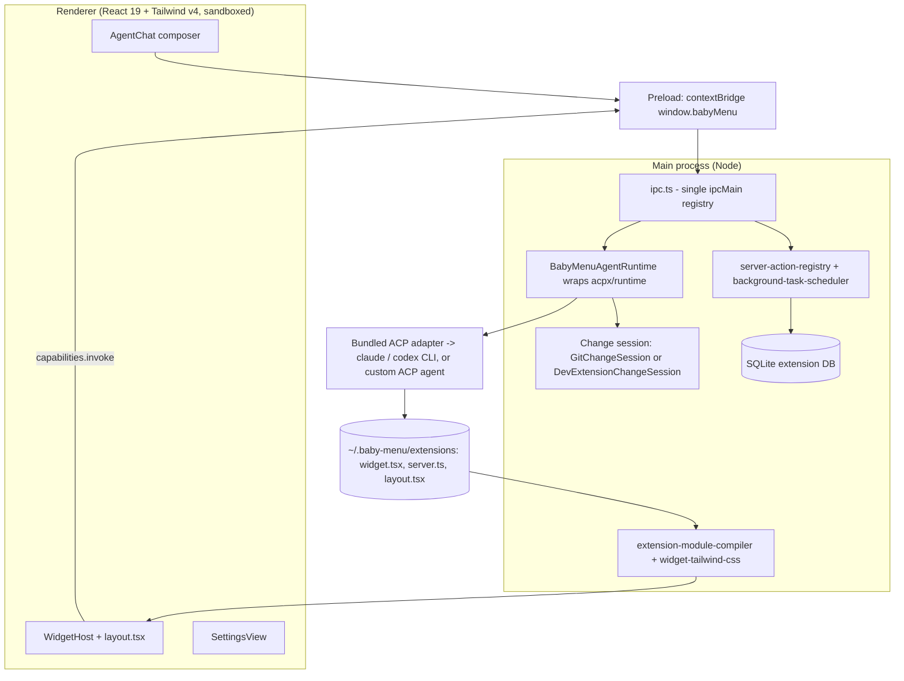

# baby-menu - a menu-bar app whose own agent writes its widgets

Evidence was gathered read-only on 2026-09-23 from the local clone at `~/github/baby-menu` (HEAD `ab696fc`), the installed app state under `~/.baby-menu` (key names only), and a real test run.
Citations use `repo/path:line`.

## 1. TL;DR

baby-menu is a macOS tray (menu-bar) Electron app with React 19 and Tailwind v4, where an embedded coding agent edits the app's own extension workspace and the widgets hot-reload live (`baby-menu/README.md:24`, `baby-menu/package.json:44`, `baby-menu/package.json:47`, `baby-menu/package.json:59`).
Every agent turn is wrapped in a change session (git or filesystem snapshot), so the user gets a Keep / Undo bar derived from the real diff, never from the agent's prose (`baby-menu/AGENTS.md:149`, `baby-menu/README.md:108`).
Upstream (Kun Chen, `kunchenguid/baby-menu`) built the whole app; the user's fork has no fork-specific commits, and the user's contribution is fleet tracking, installing it through the Homebrew cask, and generating personal quota and CPU widgets with it.

## 2. Problem it solves, and what breaks without it

Menu-bar utilities ship a fixed widget set, so "my Claude quota next to my CPU next to my next meeting" requires waiting for someone to build exactly that (`baby-menu/README.md:20`).
baby-menu turns the widget set into agent-authored code: you type "add a CPU usage widget" in the popover, the agent writes `<id>/widget.tsx` plus an optional `server.ts`, and it hot-reloads into the menu (`baby-menu/README.md:26`).

What breaks without its safety design:
- An agent editing a live app can leave it half-broken; the change session lets one click restore the pre-turn state (`baby-menu/src/main/git-change-session.ts:149`).
- A renderer with Node access plus agent-written code would be a local code-execution hole; the popover runs with `contextIsolation: true` and `nodeIntegration: false` (`baby-menu/src/main/popover.ts:80`, `baby-menu/src/main/popover.ts:81`).
- Per-widget IPC channels would make every new widget an Electron core change; instead all privileged work goes through one generic `capabilities.invoke` route (`baby-menu/src/main/ipc.ts:116`).

## 3. Architecture

Three Electron processes plus agent-authored extension modules (`baby-menu/AGENTS.md:48`).

Modules (`src/main/`, indexed from `baby-menu/AGENTS.md:62`):
- `app.ts` is the lifecycle entry; `package.json#main` points at the built `out/main/index.js` (`baby-menu/package.json:9`).
- `popover.ts` builds the frameless, always-on-top, context-isolated `BrowserWindow` (`baby-menu/src/main/popover.ts:73`).
- `ipc.ts` is the only place new generic IPC routes are registered; it exposes agent send, git save/rollback/status, capabilities list/invoke, and db query/get/run/exec (`baby-menu/src/main/ipc.ts:90`, `baby-menu/src/main/ipc.ts:100`, `baby-menu/src/main/ipc.ts:116`, `baby-menu/src/main/ipc.ts:120`).
- `agent-runtime.ts` is `BabyMenuAgentRuntime`, which serializes turns and gates each through a change session (`baby-menu/src/main/agent-runtime.ts:430`).
- `git-change-session.ts` and `dev-extension-change-session.ts` implement Save / Rollback for git-tracked and snapshot workspaces (`baby-menu/src/main/git-change-session.ts:56`, `baby-menu/src/main/dev-extension-change-session.ts:27`).
- `extension-module-compiler.ts` compiles agent-written TSX for packaged mode and rewrites `react` and `@babymenu/ui` imports to host protocol modules, rejecting any other external import (`baby-menu/AGENTS.md:77`).
- `widget-tailwind-css.ts` runs Tailwind in the main process to compile each widget's utilities against the single `@theme` token file `src/ui/theme.css` (`baby-menu/AGENTS.md:78`).
- `background-task-scheduler.ts` enforces a 60-second minimum interval for extension background tasks (`baby-menu/src/main/background-task-scheduler.ts:8`).
- `update-checker.ts` polls GitHub Releases at most every 4 hours (`baby-menu/src/main/update-checker.ts:9`).
- `src/ui/` is a shadcn-derived Radix + Tailwind v4 design system shared by the shell and extensions (`baby-menu/AGENTS.md:123`).

Data model and contracts:
- `src/shared/contracts.ts` holds `BabyMenuApi`, `BabyMenuWidget`, `GitSessionSnapshot`, and the `Window.babyMenu` global (`baby-menu/AGENTS.md:58`).
- The extension-facing slice is generated into `extensions/babymenu-env.d.ts` by `pnpm generate:contracts`, and CI fails on a stale file (`baby-menu/.github/workflows/ci.yml:41`).

State files (packaged mode, all under `~/.baby-menu`, per `baby-menu/docs/configuration.md:7`):

| Path | What it holds |
| --- | --- |
| `~/.baby-menu/extensions/` | agent-authored `<id>/widget.tsx`, `server.ts`, root `layout.tsx`, recipes |
| `~/.baby-menu/baby-menu.db` | shared SQLite store exposed as `context.db` / `window.babyMenu.db` |
| `~/.baby-menu/cache/acp-sessions` | persisted ACP conversation (`sessionKey: "baby-menu-agent-chat"`) |
| `~/.baby-menu/agents.json` | custom ACP agent catalog |
| `~/.baby-menu/preferences.json` | selected agent, open-at-login |

The user's live install has exactly these files: `agents.json`, `baby-menu.db` (with WAL), `cache/`, `extensions/`, `preferences.json` (listed 2026-09-23).

## 4. Interfaces

baby-menu has no CLI binary; the fleet manifest records `provides_bin: []` (`.fleet/manifest.yaml:126`).
Its interfaces are the developer scripts, the renderer bridge, and environment flags.

Developer scripts (`baby-menu/package.json:14` onward, described in `baby-menu/AGENTS.md:9`):

| Command | Effect |
| --- | --- |
| `pnpm dev` | builds adapters, prepares gitignored `extensions-dev/`, runs `electron-vite dev` |
| `pnpm dev:reset` | wipes `extensions-dev/` and cached ACP sessions, then dev |
| `pnpm build` | electron-vite build of main, preload, renderer plus adapter bundles |
| `pnpm generate:contracts` | regenerates `extensions/babymenu-env.d.ts` from `contracts.ts` |
| `pnpm package:mac` | ad-hoc-signed universal `Baby Menu Dev.app` with a distinct bundle id |
| `pnpm test` / `pnpm test:e2e` | Vitest unit suite / real `acpx` runtime against `acp-mock` |
| `pnpm typecheck` / `pnpm lint` | both `tsc --noEmit` |

Renderer bridge (`window.babyMenu`, exposed at `baby-menu/src/preload/index.ts:80`): every call is `ipcRenderer.invoke` request/response, for example `agent.send(prompt)` maps to channel `baby-menu:agent:send` (`baby-menu/src/preload/index.ts:21`) and `capabilities.invoke(extensionId, action, input)` maps to `baby-menu:capabilities:invoke` (`baby-menu/src/preload/index.ts:31`).
Return values are typed objects such as `AgentChatResult` and `GitActionResult` (`{ ok: true, commit }` or `{ ok: false, reason }`, `baby-menu/src/main/git-change-session.ts:159`).

Environment flags (`baby-menu/AGENTS.md:34`): `BABY_MENU_AGENT`, `BABY_MENU_AGENT_TIMEOUT_MS`, `BABY_MENU_KEEP_POPOVER_OPEN`, `BABY_MENU_REMOTE_DEBUGGING_PORT`, `BABY_MENU_TELEMETRY=0`.

## 5. Configuration

| Config | Keys | Default | User's actual setting |
| --- | --- | --- | --- |
| `~/.baby-menu/preferences.json` | `agentName`, `openAtLogin` | auto-detect Claude Code then Codex (`baby-menu/docs/configuration.md:16`) | `agentName: claude`, `openAtLogin: true` |
| `~/.baby-menu/agents.json` | list of `{name, label, command, launchCommand}` (`baby-menu/docs/configuration.md:39`) | empty; built-ins are Claude Code and Codex | two custom ACP agents: `grok` (`launchCommand: grok agent stdio`) and `gemini` (launch command <redacted>) |
| Telemetry | `BABY_MENU_TELEMETRY` | on only in packaged release builds (`baby-menu/AGENTS.md:89`) | not set (unverified whether opted out) |

Why the user's setting matters for the harness: the user registered Grok and Gemini as extra ACP agents, which mirrors the three-provider routing policy (Claude, Grok, Gemini) in the user's manual (`~/.claude/CLAUDE.md:180`).
The user's extension workspace holds agent-generated widgets `claude-code-quota`, `cpu-usage`, `gemini-usage`, `grok-quota` and a custom `layout.tsx` (file mtimes 2026-08-11 to 2026-08-14), each with `widget.tsx`, `server.ts`, `store.ts`, `types.ts`, `components.tsx`.
Installed version is 0.1.24 via the Homebrew cask (read from the app bundle's `CFBundleShortVersionString`), matching `baby-menu/package.json:3`.

## 6. Connections

- **no-mistakes**: human PRs to upstream `main` must be raised through no-mistakes (`baby-menu/CONTRIBUTING.md:6`), enforced by the `Require no-mistakes` workflow that calls the shared composite action pinned to `f6441c9` (v1.80.1) (`baby-menu/.github/workflows/no-mistakes-required.yml:58`).
  The action lives in the no-mistakes repo (`no-mistakes/.github/actions/require-no-mistakes/README.md:1`); see [no-mistakes](no-mistakes.md).
  baby-menu's AGENTS.md also has a packaging-hygiene rule specifically for agents running in no-mistakes worktrees (`baby-menu/AGENTS.md:23`).
- **quota-axi**: baby-menu's quota recipes deliberately avoid separate quota helpers such as `quota-axi` and treat each recipe as authoritative for its provider (`baby-menu/README.md:106`).
  So the menu-bar quota widgets and `quota-axi` are parallel readers of the same provider state, not a pipeline.
- **fleet-ops**: manifest entry `kind: app`, `sync: true`, jump alias `cdbm` (`.fleet/manifest.yaml:116`, `.fleet/aliases.zsh:23`); the daily sync on 2026-09-23 reported "already up to date with upstream" (`.fleet/logs/sync-20260923.log:137`).
  See [fleet-ops](fleet-ops.md).
- **dotfiles-nix**: the `sync-forks` launchd agent that drives that sync is defined in `dotfiles-nix/nix/home/darwin.nix:79`.
- **agents / skills / hooks**: no reference to baby-menu in `~/github/agents`, `~/.agents/skills`, or `~/.claude/{agents,hooks,rules}` (grep, 2026-09-23).
- **acpx / ACP**: agents are driven through the Agent Client Protocol via `acpx` 0.7.0 and `@agentclientprotocol/sdk` 0.21.1 (`baby-menu/package.json:39`, `baby-menu/package.json:30`).

## 7. Lifecycle walkthrough

Trace: the user types "add a CPU usage widget" in the popover.

1. The renderer calls `window.babyMenu.agent.send(prompt)`, which invokes channel `baby-menu:agent:send` (`baby-menu/src/preload/index.ts:21`).
2. `ipc.ts` routes it to the runtime (`baby-menu/src/main/ipc.ts:90`).
3. `send()` refuses overlap: if a turn is active it returns "An agent turn is already running" without touching the workspace (`baby-menu/src/main/agent-runtime.ts:430`).
4. `runSend` resolves the workspace and begins a change session; packaged `~/.baby-menu/extensions` uses the snapshot session, a tracked source workspace uses `GitChangeSession` (`baby-menu/src/main/agent-runtime.ts:670`, `baby-menu/src/main/agent-runtime.ts:673`).
5. If the session did not start clean, the turn is refused with a "commit or stash first" message and telemetry status `blocked_dirty` (`baby-menu/src/main/agent-runtime.ts:455`).
   `GitChangeSession.begin` records `HEAD` only when the tree is clean (`baby-menu/src/main/git-change-session.ts:58`).
6. The ACP runtime is created lazily with a file session store and `permissionMode: "approve-all"` (`baby-menu/src/main/agent-runtime.ts:683`, `baby-menu/src/main/agent-runtime.ts:687`), and the persistent session key is fixed to `baby-menu-agent-chat` (`baby-menu/src/main/agent-runtime.ts:54`, `baby-menu/src/main/agent-runtime.ts:509`).
7. The agent reads the matching recipe (HTML spec) and writes `cpu-usage/widget.tsx` and `server.ts` in its cwd (`baby-menu/AGENTS.md:159`).
8. On success, the runtime enriches the snapshot with `dirty` and `changes` computed from the actual diff; if nothing changed it auto-closes the session so no useless Keep / Undo bar appears (`baby-menu/src/main/agent-runtime.ts:568`).
9. The widget registry rediscovers modules; in packaged mode the compiler emits a `baby-menu-widget://` module plus compiled CSS and the `WidgetHost` mounts it (`baby-menu/AGENTS.md:79`).
10. Keep calls `baby-menu:git:save`; Undo calls `baby-menu:git:rollback`, which for the git session runs `git reset --hard <recorded HEAD>` plus `git clean -fd`, but only after `ensureSafeToApply` confirms a clean start, not already completed, and `HEAD` unchanged (`baby-menu/src/main/git-change-session.ts:149`, `baby-menu/src/main/git-change-session.ts:159`).

## 8. Failure modes and safeguards

| Failure | Safeguard | Evidence |
| --- | --- | --- |
| Destructive rollback runs on someone else's work | refuses unless clean start, not completed, HEAD unmoved | `baby-menu/src/main/git-change-session.ts:159` |
| Concurrent turns race on the workspace | single active `send()`; overlap returns a message | `baby-menu/src/main/agent-runtime.ts:431` |
| Stale persisted ACP session after restart | deletes the session file and retries once on `SESSION_RESUME_REQUIRED` | `baby-menu/src/main/agent-runtime.ts:467` |
| Agent hangs | `withAgentTimeout`; partial changes stay reviewable for Keep / Undo | `baby-menu/src/main/agent-runtime.ts:507` |
| Agent-written widget imports arbitrary packages | compiler allowlist: only `react` and `@babymenu/ui` | `baby-menu/AGENTS.md:77` |
| Widget polling burns CPU | host owns refresh via `useViewRefresh`; background tasks min 60 s | `baby-menu/src/main/background-task-scheduler.ts:8` |
| Recipes fabricate data | recipe rules require real data or an explicit unavailable state | `baby-menu/AGENTS.md:187` |
| Local dev bundles hijack LaunchServices | dev packaging uses a distinct bundle id; agents must delete `release/` | `baby-menu/AGENTS.md:25` |
| Secrets in renderer storage | Chromium mock keychain; credential work stays in server actions | `baby-menu/src/main/app.ts:32` |

## 9. Testing and quality

- Suite: Vitest over `tests/` with jsdom and Testing Library; there are 74 test files including real-runtime e2e files against `acp-mock` (`baby-menu/package.json:22`).
- CI (`baby-menu/.github/workflows/ci.yml:21`): pnpm 11.1.1, Node 22, frozen install, contract freshness check, typecheck, test, build.
- Guard workflow rejects PRs that commit `out`, `release`, `.cache`, `extensions-dev`, or `CHANGELOG.md` (`baby-menu/.github/workflows/guard-generated-files.yml:46`).
- Release workflow signs with a Developer ID, notarizes and staples both app and DMG, then verifies `codesign --verify --deep --strict`, universal `lipo` architectures, and entitlements before publishing (`baby-menu/.github/workflows/release-please.yml:229`, `baby-menu/.github/workflows/release-please.yml:293`, `baby-menu/.github/workflows/release-please.yml:311`).

Real run (2026-09-23, `HOME` redirected to a scratch dir, `BABY_MENU_TELEMETRY=0`, `./node_modules/.bin/vitest run tests`):
- 554 tests passed, 2 skipped; 71 files passed, 1 skipped.
- 2 suites (`tests/app-paths.test.ts`, `tests/widget-protocol.test.ts`) failed to load because the local Electron binary is not installed (`electron/path.txt` missing).
  This is a local environment gap, not a code failure.
- Side effect: electron's lazy installer attempted a download and rewrote two license files inside the gitignored `node_modules/.pnpm/electron@42.2.0/.../dist/`; the directory's mtime was unchanged (no files added or removed) and `git status` stayed clean.

## 10. Fork delta

No fork-specific commits; tracks upstream.
`git log upstream/main..HEAD` is empty and `git ls-remote upstream refs/heads/main` returned `ab696fc`, equal to local HEAD (2026-09-23).
All 109 commits are by upstream authors (Kun Chen, `kunchenguid`, `github-actions[bot]`).
The user's work here is operational: fleet tracking, Homebrew install, two custom ACP agent registrations, and four agent-generated personal widgets that live in `~/.baby-menu`, not in the repo.

## 11. Interview angle

**Q1. How do you let an AI agent modify a running desktop app safely?**
Wrap every turn in a transaction-like change session: snapshot or record `HEAD` before, derive the Keep / Undo label from the real diff after, and guard the destructive rollback with preconditions (clean start, not completed, HEAD unmoved) (`baby-menu/src/main/git-change-session.ts:159`).
The key idea is that UI state comes from the filesystem, not from what the model says it did.

**Q2. What is the Electron security model here, and why does it matter for trading desktops (OpenFin / Electron)?**
The renderer is sandboxed by `contextIsolation: true` and `nodeIntegration: false` (`baby-menu/src/main/popover.ts:80`), and the only way to do privileged work is a typed `contextBridge` API (`baby-menu/src/preload/index.ts:80`) that routes to one IPC registry.
The same pattern applies to an OpenFin or Electron trading blotter: untrusted or third-party UI never gets Node, and all entitlement-sensitive calls go through a narrow, audited bridge.

**Q3. How do you keep a plugin API stable when plugins are generated code?**
Treat the contract as a generated artifact: `contracts.ts` is the source, the extension `.d.ts` is regenerated, and CI fails if they drift (`baby-menu/.github/workflows/ci.yml:41`); the UI kit has its own export-contract test (`baby-menu/AGENTS.md:126`).

**Trade-off to defend.** `permissionMode: "approve-all"` (`baby-menu/src/main/agent-runtime.ts:687`) gives the agent no per-action prompts, which is fast but trusts the agent inside its cwd.
It is defensible only because the blast radius is bounded by the change session and the rollback, and because privileged capabilities must go through reviewed extension server actions; the downside is that a malicious recipe could still run anything the user's shell can during the turn.
