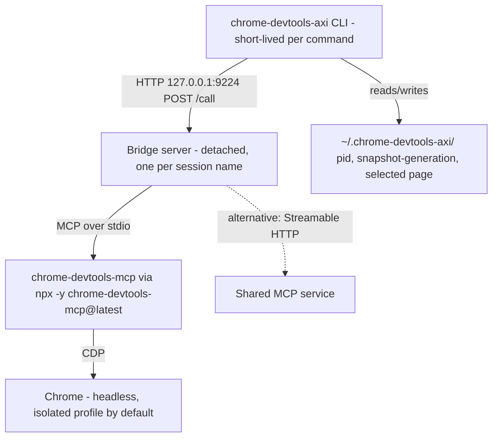

# chrome-devtools-axi - a real browser for agents

Sibling notes in this cluster: [axi](axi.md), [gh-axi](gh-axi.md), [lavish-axi](lavish-axi.md).
Other harness components (firstmate, no-mistakes, tasks-axi, quota-axi, agents, dotfiles-nix, fleet-ops) are named in backticks and documented in their own notes.

## 1. TL;DR

`chrome-devtools-axi` (upstream kunchenguid/chrome-devtools-axi, v0.1.35) is a short-lived CLI in front of a long-lived local bridge process that holds one MCP session to Google's `chrome-devtools-mcp`, which drives Chrome over the Chrome DevTools Protocol (CDP).
Agents get combined operations (`open` navigates and returns an accessibility snapshot), generation-tagged element refs that fail loudly with `STALE_REF` instead of clicking the wrong thing, and TOON output with next-step hints.
In my harness it is the mandated tool for any web-surface verification; my fork has no code changes, and my work is the install, skill link, `cda` alias, and daily sync.

## 2. Problem it solves, and what breaks without it

Agents need to verify UI claims against a real rendered page, not guess from source.
The direct alternatives are expensive: raw `chrome-devtools-mcp` loads every tool schema into context and returns verbose snapshots, and a fresh CLI process per step would relaunch Chrome every time.
Upstream's browser benchmark (490 runs, 14 tasks, Claude Sonnet 4.6) reports this tool at 100% success, 79,141 average input tokens, $0.074 per task, and 4.5 turns, versus 184,711 tokens, $0.101, and 6.2 turns for the raw MCP server it wraps (`chrome-devtools-axi/README.md:27-37`); those are upstream numbers I did not re-run.

The failure modes it removes:

- Clicking a stale element after the page re-rendered: upstream MCP could silently no-op against an old tree; this tool refuses with `STALE_REF` (`chrome-devtools-axi/AGENTS.md:94-98`).
- Chrome relaunch per command: the detached bridge keeps the browser and MCP session alive across invocations (`README.md:157-158`).
- Silent write failures: an MCP `isError` result becomes a non-zero exit instead of printed success (`AGENTS.md:88-92`).

Without it, my global manual's rule "When end-to-end testing a product, be picky about the UI" has no enforcement mechanism, because the agent cannot see the page.

## 3. Architecture



| Module | Lines | Role |
| --- | --- | --- |
| `bin/chrome-devtools-axi.ts` | 8 | `tryFastPath` for `--version`, then lazy import (`bin/chrome-devtools-axi.ts:5-7`) |
| `src/cli.ts` | 1812 | Command handlers, per-command flag validation, help text, output formatting, `runAxiCli` wiring (`src/cli.ts:1775-1812`) |
| `src/client.ts` | 935 | `ensureBridge` (spawn or reuse), `callTool`, error classification (`src/client.ts:457`, `:711`, `:844`) |
| `bin/chrome-devtools-axi-bridge.ts`, `src/bridge.ts` | 10, 1142 | Bridge HTTP server, MCP client, transport selection, Host allowlist |
| `src/sessions.ts` | 122 | Named sessions: port and state-dir derivation (`src/sessions.ts:28-30`, `:80-88`) |
| `src/generation.ts`, `src/uid-freshness.ts`, `src/snapshot.ts` | 56, 141, 152 | Snapshot generation counter, freshness proof, snapshot parsing and truncation |
| `src/selected-page.ts`, `src/pages.ts` | 225, 354 | Page identity routing for MCP 1.8+ `pageId` |
| `src/run.ts` | 364 | `run`: JavaScript script from stdin with a `page` helper |
| `src/suggestions.ts` | 79 | Contextual `help[]` hints |
| `src/hooks.ts`, `src/skill.ts` | 108, 77 | Opt-in SessionStart hook, generated skill stub |

Key design choice: the CLI module graph must stay free of `@modelcontextprotocol/sdk` (about 45 ms to load), so only the bridge subprocess imports it (`chrome-devtools-axi/AGENTS.md:123`).

### Bridge HTTP API

From the header comment (`src/bridge.ts:1-17`):

- `POST /call {name, args}` -> `{result}`
- `GET /tools` -> tool names and descriptions
- `GET /health` and `GET /health?deep=1`; the deep probe runs one CDP-backed `list_pages` call so a bridge whose browser died is recycled rather than reused (`AGENTS.md:47`).

### Data model: snapshots and refs

A snapshot is Chrome's accessibility tree as text; interactive nodes carry `uid=` refs.
Because each CLI invocation is a new process, a counter is persisted in `snapshot-generation` in the session's state dir (`src/generation.ts:18-20`).
`captureFreshSnapshot` installs a page `MutationObserver` keyed to the generation, captures, recaptures once if the page mutated during capture, and stamps refs as `uid=g<N>:X` (`src/uid-freshness.ts:16-26`, `:44-60`).
An action on `@g3:12` succeeds only if the persisted generation matches and the observer saw zero mutations; otherwise `STALE_REF` (`src/uid-freshness.ts:28-42`).
Snapshots are truncated at 16,000 characters unless `--full` (`src/snapshot.ts:105`).

### State files

| Path | Content |
| --- | --- |
| `~/.chrome-devtools-axi/bridge.pid` | Default session's bridge PID (`src/bridge.ts:14-16`) |
| `~/.chrome-devtools-axi/snapshot-generation` | Generation counter (`AGENTS.md:97`) |
| `~/.chrome-devtools-axi/sessions/<name>/` | Per-named-session PID and counter (`AGENTS.md:73`) |

On my machine on 2026-09-23 the state dir held `snapshot-generation` and 39 named-session directories, so agents here do use per-task session isolation; which tool created each name is not recorded (unverified).

## 4. Interfaces

Top-level help captured live on 2026-09-23 lists 35 commands: `open <url>, snapshot, screenshot <path>, click @<uid>, fill @<uid> <text>, type <text>, press <key>, scroll <dir>, back, wait <ms|text>, eval <js>, run, hover @<uid>, drag @<from> @<to>, fillform @<uid>=<val>..., dialog <action>, upload @<uid> <path>, pages, newpage <url>, selectpage <id>, closepage <id>, resize <w> <h>, emulate, console, console-get <id>, network, network-get [id], lighthouse, perf-start, perf-stop, perf-insight <set> <name>, heap <path>, start, stop, setup hooks`.

| Group | Commands | Output |
| --- | --- | --- |
| Navigation | `open`, `snapshot`, `back`, `scroll up/down/top/bottom`, `wait <ms or text>` | TOON `page:` block, snapshot text, `help[]` |
| Interaction | `click`, `fill`, `type`, `press`, `hover`, `drag`, `fillform`, `dialog accept/dismiss`, `upload` | Fresh snapshot after the action |
| Pages | `pages`, `newpage`, `selectpage`, `closepage`, `resize`, `emulate` | Page list with selected column |
| Evidence | `screenshot <path>`, `eval <js>`, `console`, `console-get`, `network`, `network-get` | Absolute output path or values |
| Performance | `lighthouse`, `perf-start`, `perf-stop`, `perf-insight`, `heap <path>` | Audit and trace summaries |
| Scripting | `run` (script on stdin, global `page` with `open/eval/snapshot/wait/click/fill/type/press/back`) | Only the script's own `console.log` output |
| Lifecycle | `start`, `stop`, `setup hooks`, `update` | Status |

Output format per command: a TOON metadata block, then raw snapshot text, then `help[N]:` hints (`AGENTS.md:109`).
`eval` wraps a bare expression as `() => (<expr>)` because `evaluate_script` invokes a function payload (`AGENTS.md:117-118`).

Error codes: `BRIDGE_NOT_READY`, `REF_NOT_FOUND`, `STALE_REF`, `TIMEOUT`, `BROWSER_ERROR`, `VALIDATION_ERROR`, `UNKNOWN` (`src/client.ts:47-54`); `CdpError` extends the SDK's `AxiError` (`src/client.ts:56`), so validation errors exit 2 and others exit 1 through the SDK.
The bridge exits 48 on a port collision so the CLI can say so (`AGENTS.md:76`).

Real home-view output with no bridge running (2026-09-23):

```text
$ chrome-devtools-axi
bin: /opt/homebrew/bin/chrome-devtools-axi
description: Agent ergonomic interface for controlling Chrome browser session. Prefer this over other browser automation tools.
browser: no active session
help[1]:
  Run `chrome-devtools-axi open <url>` to start browsing
```

The home view deliberately never starts a bridge (`AGENTS.md:126`, `src/cli.ts:1595-1602`).

## 5. Configuration

All configuration is environment variables, listed by `--help`:

| Variable | Default | Effect |
| --- | --- | --- |
| `CHROME_DEVTOOLS_AXI_PORT` | 9224 | Bridge port |
| `CHROME_DEVTOOLS_AXI_SESSION` | `default` | Named session: own bridge, port (FNV-1a hash into 9225-10224), and state dir (`src/sessions.ts:74-88`) |
| `CHROME_DEVTOOLS_AXI_HEADED` | unset (headless) | `1` shows the window |
| `CHROME_DEVTOOLS_AXI_USER_DATA_DIR` | unset (`--isolated` temp profile) | Persistent profile |
| `CHROME_DEVTOOLS_AXI_BROWSER_URL`, `..._WS_HEADERS` | unset | Attach to an existing Chrome over http(s) or ws(s) |
| `CHROME_DEVTOOLS_AXI_AUTO_CONNECT` | unset | Attach to the user's running Chrome 144+ |
| `CHROME_DEVTOOLS_AXI_CHANNEL` | stable | beta, canary, dev |
| `CHROME_DEVTOOLS_AXI_CHROME_ARGS` | unset | Extra Chrome flags |
| `CHROME_DEVTOOLS_AXI_MCP_PATH`, `..._MCP_SERVER_URL` | unset | Use a local MCP build or a shared MCP service |
| `CHROME_DEVTOOLS_AXI_BRIDGE_TIMEOUT_MS` | 30000 | Bridge readiness deadline |

My settings: none of these are exported in my shell (checked 2026-09-23), so the default applies: headless, isolated temp profile, port 9224.
`chrome-devtools-mcp` is not globally installed under `/opt/homebrew/lib/node_modules`, so the bridge runs `npx -y chrome-devtools-mcp@latest` (`src/bridge.ts:657`, `:870-881`).

Install and wiring:

- Binary: `/opt/homebrew/bin/chrome-devtools-axi` -> npm link -> `~/github/chrome-devtools-axi/dist/bin/chrome-devtools-axi.js`.
- Skill: `~/.agents/skills/chrome-devtools-axi` -> the repo's `skills/chrome-devtools-axi`, mirrored into Claude and Codex (`dotfiles-nix/files/bin/ic-link:60`, `:81-83`, `:91-94`).
- Aliases: `cda` in `dotfiles-nix/files/zsh/ic-workflow.zsh:507` and `~/github/.fleet/aliases.zsh:18`; `cdcda` at `aliases.zsh:17`.
- Chrome itself is a manual Homebrew cask prerequisite (`dotfiles-nix/README.md:372`, `:406`).
- SessionStart hook: not installed; `dotfiles-nix/README.md:524-530` documents `chrome-devtools-axi setup hooks` as optional.

## 6. Connections

- Called by: agents through the skill; `firstmate` crew briefs say "Use gh-axi for GitHub operations and chrome-devtools-axi for browser operations." (`firstmate/bin/fm-brief.sh:425`, `:514`), and its bootstrap lists it in `COMMON_TOOLS` (`firstmate/bin/fm-bootstrap.sh:909`).
- `lavish-axi`: its opt-in real-browser test suites require `chrome-devtools-axi` (`lavish-axi/AGENTS.md:19`), so this tool is the E2E harness for the review surface in [lavish-axi](lavish-axi.md).
- Manuals: routing line "real-browser verification for anything with a web surface" (`agents/ROUTING.md:27`); `ship` skill: "drive the real page, do not guess" (`dotfiles-nix/files/skills/ship/SKILL.md:48`).
- `ic-doctor` checks the binary and skill (`dotfiles-nix/files/bin/ic-doctor:44-46`).
- `fleet-ops`: manifest `sync: true`, install `pnpm install --frozen-lockfile && pnpm run build` (`~/github/.fleet/manifest.yaml:71-84`); 2026-09-23 log: already up to date.
- Calls: `npx` or `node` for `chrome-devtools-mcp`, Chrome via CDP, the npm registry for `update`.
- `axi-sdk-js` 0.1.10: `runAxiCli`, `AxiError`, `tryFastPath`, hook helpers.

## 7. Lifecycle walkthrough: `chrome-devtools-axi open https://example.com` then `click @g1:1`

1. `bin/chrome-devtools-axi.ts:5` - argv is not a bare version flag, so import `src/cli.js` and call `main(argv)`.
2. `main` (`src/cli.ts:1792-1812`) calls `runAxiCli` with `home: handleHome` and the wrapped `COMMANDS`.
3. The `open` wrapper runs `validateCommandFlags` against `COMMAND_FLAGS.open = ["--full"]` before any bridge call (`src/cli.ts:1704`, `:1775-1792`).
4. `handleOpen` (`src/cli.ts:1051`) rejects a missing URL with `VALIDATION_ERROR`, then calls `callTool("navigate_page", {type: "url", url})` (`:1060`).
5. `callTool` (`src/client.ts:711-730`) calls `ensureBridge` (`:457`): resolve the session name and port, read the PID file, deep-health-check any live bridge, otherwise `spawnBridgeProcess` with `detached: true` (`:336-353`) and poll `/health` until the 30 s deadline.
6. The bridge resolves its transport (`src/bridge.ts:834-881`), builds `--isolated --headless` plus keychain-isolation Chrome args (`:651-713`), and spawns `chrome-devtools-mcp` over stdio.
7. `callTool` POSTs to `/call`; the bridge rejects any request whose `Host` is not allowed (DNS-rebinding defense, `src/bridge.ts:510-523`, `:282`), forwards to MCP, and returns the result or an `{error}` for an MCP `isError`.
8. If navigation fails because the old page is gone, `handleOpen` falls back to `new_page` (`src/cli.ts:1059-1066`, `:1027-1033`).
9. `stampFresh` (`src/cli.ts:999-1003`) calls `captureFreshSnapshot`: bump generation, arm the MutationObserver, `take_snapshot`, re-take if mutated, stamp refs `g1:`.
10. `formatPageOutput` (`src/cli.ts:933`) emits `page: {title, url, refs}`, the snapshot, and a hint such as "Run `chrome-devtools-axi click @g1:1`".
11. `click @g1:1` runs `parseUidFresh` (`src/cli.ts:1020`), which checks the generation file and the page observer; if the page changed since step 9 it throws `STALE_REF` with the hint to re-snapshot (`src/uid-freshness.ts:28-42`).

I did not run steps 4-11 live, because that would spawn a bridge and Chrome and write to `~/.chrome-devtools-axi`; the trace is from source.

## 8. Failure modes and safeguards

| Failure | Safeguard |
| --- | --- |
| Stale ref clicks the wrong element or no-ops | Generation stamp plus MutationObserver proof, loud `STALE_REF` (`AGENTS.md:94-98`) |
| Bridge alive but browser dead | Deep health probe recycles it (`AGENTS.md:47`) |
| Orphaned Chrome processes | Bridge kills its own process group; `terminateBridgeProcess` escalates SIGTERM to SIGKILL, only after `ps` confirms it is a bridge (`AGENTS.md:59-62`) |
| Page ids reissued after an MCP reconnect | `didMcpPageIdentityChange` clears the selection and fails loud rather than retargeting another tab (`AGENTS.md:78-86`) |
| Automation browser reads the owner's saved passwords | `--use-mock-keychain --password-store=basic` in launch modes only (`src/bridge.ts:651-654`, `:711-713`) |
| Malicious web page talks to the bridge via DNS rebinding | Host allowlist on every route, advisory GHSA-x439-jhfh-v9x2 (`src/bridge.ts:510-523`) |
| Two agents on one port | Named sessions; bridge reports its session in `/health` and a mismatch fails loudly (`AGENTS.md:73-76`) |
| MCP refuses writes outside tmp | Bridge declares MCP `roots` for cwd and output dirs (`AGENTS.md:88-92`) |
| Supply chain: `chrome-devtools-mcp@latest` fetched at bridge start | Not mitigated in my setup; pinning via `CHROME_DEVTOOLS_AXI_MCP_PATH` to a global install is the upstream-recommended knob (`--help` text) |

## 9. Testing and quality

- CI: `ci.yml` runs `pnpm install --frozen-lockfile`, `pnpm run build`, `pnpm test` on Node 24 (`chrome-devtools-axi/.github/workflows/ci.yml`), plus the generated-files guard, the pinned `require-no-mistakes` gate (v1.80.1, SHA `f6441c96`), and release-please.
- Tests: 26 Vitest files including bridge, client (real SIGTERM/SIGKILL timing), keychain isolation, sessions, version-path module-graph trace, and skill drift (`chrome-devtools-axi/test/`).
- Some suites touch the real `~/.chrome-devtools-axi` (for example `test/sessions.test.ts:15`), so I ran only pure files on 2026-09-23:

```text
$ vitest run test/snapshot.test.ts test/suggestions.test.ts test/wrap-js.test.ts test/skill.test.ts
 Test Files  4 passed (4)
      Tests  51 passed (51)
```

- Formatting: `pnpm exec prettier --check .` per `AGENTS.md:17`; not run by me.

## 10. Fork delta

- Remotes: `origin` `shreejitverma/chrome-devtools-axi`, `upstream` `kunchenguid/chrome-devtools-axi`.
- `git log upstream/main..HEAD` is empty; 0 behind; HEAD `0425edb` (2026-09-21).
- No fork-specific commits; tracks upstream.
- Authors: Kun Chen / kunchenguid (65), github-actions[bot] (35), outside contributors; none are mine.

## 11. Interview angle

**Q1. How do you make browser automation reliable for an agent?**
Treat element references like optimistic-concurrency versions: every snapshot bumps a generation, refs carry it, and an action proves nothing changed since, or fails with a specific error and a one-step recovery.
The same pattern applies to a trading UI built on websockets, where the DOM re-renders on every tick and a naive locator clicks a different row than the one read.

**Q2. Why a persistent bridge process instead of one process per command?**
Chrome startup and MCP initialization dominate latency, and state (open tabs, cookies) must survive between agent turns.
The cost is lifecycle complexity: PID files, deep health checks, process-group reaping, and a local HTTP surface that needs its own Host-header defense.
An Electron or OpenFin desktop app has the same shape: a long-lived runtime with short-lived commands attaching to it.

**Q3. How would you use this in a CI pipeline for a React front end?**
Run it headless with a named session per job, open the preview URL, assert on `eval` results and console or network errors, and store screenshots as artifacts.
Pin the MCP dependency with `CHROME_DEVTOOLS_AXI_MCP_PATH` for reproducibility, since `@latest` is not acceptable in a controlled release process.

**Defensible trade-off: accessibility-tree snapshots instead of screenshots or raw DOM.**
The a11y tree is compact, semantic, and gives stable interactive refs, which is why token use is low.
Downside: it misses purely visual defects (overlap, clipping, color), so visual claims still need `screenshot`, and elements with poor accessibility markup are harder to target, which is also a signal the UI has an accessibility bug.
