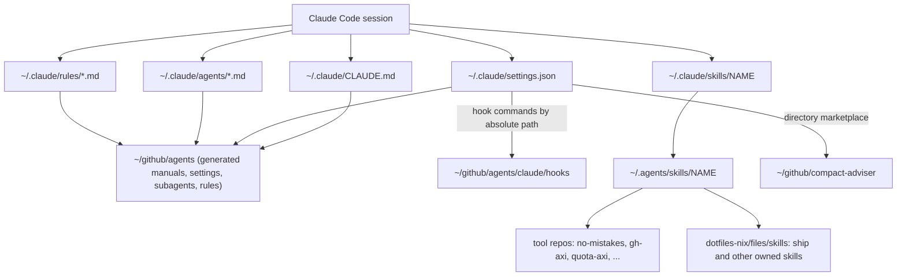

# Claude Code configuration - the live ~/.claude wiring

Evidence was gathered read-only on 2026-09-23 with `ls -la`, `readlink`, and key-only reads of JSON files; no values from auth, credential, or history files were read or recorded.
Claude Code version: `2.1.281 (Claude Code)` from `~/.local/bin/claude --version`.
Citations use `repo/path:line` for repos and `~/.claude/...` for home files.

## 1. TL;DR

`~/.claude` is mostly runtime state owned by Claude Code, with a thin, deliberate layer of symlinks into the user's `agents` repo: the global manual, the settings file, six subagents, and two path-scoped rules.
Hooks are not installed into `~/.claude/hooks` at all; `settings.json` runs them by absolute path from the `agents` clone, and skills are relative symlinks into `~/.agents/skills`, which in turn point into the tool repos.
The upstream product is Anthropic's Claude Code; everything described here as wiring (which links exist, what the settings say, which hooks run) is the user's configuration, created by `ic-link` from dotfiles-nix.

## 2. Problem it solves, and what breaks without it

Claude Code reads its global behavior from `~/.claude/CLAUDE.md`, `~/.claude/settings.json`, `~/.claude/agents/`, `~/.claude/rules/`, and `~/.claude/skills/`.
If those were plain files they would drift per machine, be edited by the tool itself without review, and diverge from what Grok, Gemini, and Codex are told.
Symlinking them into version-controlled repos makes the configuration reviewable, testable (the hooks have CI), and reproducible with one `ic-link` run.
Without the wiring, Claude would run with no guard hook, no lint feedback, no subagents, no routing policy, and the `medium` default effort for Opus 5.5 (`agents/tools/claude.md:20`).

## 3. Architecture

### Link map (verified with `ls -la`)

| Live path | Type | Target |
|---|---|---|
| `~/.claude/CLAUDE.md` | symlink | `~/github/agents/CLAUDE.md` (generated manual) |
| `~/.claude/settings.json` | symlink | `~/github/agents/claude/settings.json` |
| `~/.claude/agents/<6 files>.md` | one symlink per file | `~/github/agents/claude/agents/*.md` |
| `~/.claude/rules/cpp.md`, `python.md` | symlinks | `~/github/agents/claude/rules/*.md` |
| `~/.claude/skills/<name>` (31 entries) | relative symlinks | `../../.agents/skills/<name>` |
| `~/.claude/skills/synced/` | directory | claude.ai-synced Anthropic skills (docx, pdf, deep-research, ...) |
| `~/.claude/settings.local.json` | real file | local permission allowlist (not versioned) |
| `~/.claude/hooks/` | does not exist | hooks run from `~/github/agents/claude/hooks/` |
| `~/AGENTS.md` | symlink | `~/github/agents/AGENTS.md` (tool-neutral manual) |
| `~/OPINIONS.md`, `~/VOICE.md` | symlinks | `~/github/agents/OPINIONS.md`, `VOICE.md` |

All the links above were created at the same timestamp (`Sep 23 01:12`), consistent with one `ic-link` run (`dotfiles-nix/files/bin/ic-link:113` to `:135`).
`~/.agents/skills/<name>` then points into each tool's repo, for example `~/.agents/skills/no-mistakes -> ~/github/no-mistakes/skills/no-mistakes` and `~/.agents/skills/ship -> ~/github/dotfiles-nix/files/skills/ship` (`dotfiles-nix/files/bin/ic-link:80` to `:95`).

### Runtime state (Claude-owned, not versioned)

`sessions/`, `session-env/`, `history.jsonl`, `file-history/`, `paste-cache/`, `shell-snapshots/`, `telemetry/`, `backups/`, `cache/`, `plugins/cache/`, and `projects/` (184 project directories).
Auto-memory lives under `~/.claude/projects/<cwd-slug>/memory/`; for `~/github` it holds `MEMORY.md` plus seven topic files (for example `ai-tool-manuals-and-quotas.md`, `ecc-integration.md`, `fleet-setup.md`).
Auth and credential files exist in `~/.claude` and `~/.claude.json` and were deliberately not read.

## 4. Interfaces

Claude Code consumes this configuration; the user-facing interfaces are:

| Surface | Contract |
|---|---|
| Global manual | Markdown loaded into every session; in any session whose cwd is under `~`, `~/AGENTS.md` also loads as a project file, so the shared rules appear twice (observed in this session's own context) |
| `settings.json` hooks | Command hooks get tool-call JSON on stdin; PreToolUse returns a JSON `permissionDecision`; PostToolUse exit 2 sends stderr to the model |
| Subagents | Markdown with YAML frontmatter `name`, `description`, `tools`, `model`, `effort`, `skills` |
| Rules | Markdown with `paths:` globs; loaded only when a matching file is read |
| Skills | Directories with `SKILL.md`; invoked by name (`/no-mistakes`, `/ship`, ...) |
| Plugins | `enabledPlugins` plus marketplaces; plugin skills and MCP tools appear namespaced (for example `vercel:*`) |

The `claude` command in an interactive zsh is a wrapper function from `dotfiles-nix/files/zsh/ic-workflow.zsh:548` that injects the compact-adviser API key from the macOS login Keychain per invocation (`dotfiles-nix/README.md:311` to `:314`); a non-interactive shell without that file reports `command not found: _ic_with_typesafe_key`, so scripts should call `~/.local/bin/claude` directly.

## 5. Configuration

### `settings.json` (live file = `agents/claude/settings.json` working tree)

| Key | Live value | Purpose |
|---|---|---|
| `env.CLAUDE_CODE_ENABLE_FUNCTION_HOOKS` | `"1"` | Enables the compact-adviser plugin's function-hook mod |
| `hooks.PreToolUse` | `Bash` -> `guard.py bash`; `Write\|Edit\|MultiEdit` -> `guard.py edit`; timeout 10 s each | Destructive-command and protected-config guard |
| `hooks.PostToolUse` | `Write\|Edit\|MultiEdit` -> `post_edit.py`; timeout 20 s | ruff and clang-format feedback |
| `enabledPlugins` | vercel on, compact-adviser on, telegram off | Plugin set |
| `extraKnownMarketplaces.compact-adviser` | `{"source": "directory", "path": "~/github/compact-adviser"}` | Local plugin marketplace |
| `modelSettings.claude-opus-5-5.effortLevel` | `"high"` | Effort floor for Opus 5.5 |
| `skipDangerousModePermissionPrompt` | `true` | No prompt when entering bypass mode |
| `theme` | `"dark"` | UI |
| `model` | absent in the live file; `"claude-opus-5-5[1m]"` in the committed file | See drift note below |
| `permissions` | not set in this file | Allow rules live only in `settings.local.json` |

Every hook command has the shape `f="$HOME/github/agents/claude/hooks/<script>"; [ ! -f "$f" ] || exec python3 "$f" [...]`, so a machine without the clone runs no hook and raises no error (`agents/claude/settings.json:12`, `:22`, `:34` in the working tree).

Drift note: `git diff` in `~/github/agents` shows the live file reordered, with `telegram@claude-plugins-official: false` added and the top-level `model` pin removed.
This session still ran on `claude-opus-5-5[1m]`, so the model reached it some other way (launch flag, `/model`, or default; unverified which).
Recommended action: decide whether the pin belongs in the file, restore or drop it deliberately, and ship through no-mistakes.

### `settings.local.json`

A real file holding only `permissions.allow`: 15 exact-match Bash rules accreted from approved prompts in one earlier project session (`tasks-axi` invocations, a venv pytest command, `git add *`, `git commit *`).
It is machine-local, unversioned, and applies on top of `settings.json`.
Its entries are ad hoc and project-specific, so it is a candidate for cleanup (for example with the `fewer-permission-prompts` skill writing project-scoped rules instead).

### Plugins (`~/.claude/plugins/installed_plugins.json`, keys only)

| Plugin | Version | Scope | Enabled |
|---|---|---|---|
| `vercel@claude-plugins-official` | 0.50.0 | user | yes |
| `compact-adviser@compact-adviser` | 0.1.5 | user | yes |
| `telegram@claude-plugins-official` | 0.0.7 | user and local | no |

Marketplaces (`known_marketplaces.json`): `claude-plugins-official` (github source) and `compact-adviser` (directory source).
`plugins/cache/` also holds nine `temp_git_*` directories left from marketplace fetches (harmless leftovers, candidates for cleanup).

### MCP servers

`~/.claude.json` defines zero `mcpServers` at the top level and zero in any project entry (counted by key, values not read).
MCP tools visible in a session come from elsewhere: claude.ai connectors (Claude Docs, Gmail, Google Drive), the Claude in Chrome extension, and plugins (the `vercel` plugin exposes an MCP authenticate tool).
Some session tools are namespaced `plugin_engineering_*` although no `engineering` plugin appears in `installed_plugins.json`; they are presumably account-synced (unverified).

### Subagents and rules

Six subagents (`cpp-reviewer`, `python-reviewer`, `pr-test-analyzer`, `silent-failure-hunter`, `type-design-analyzer`, `cpp-build-resolver`), all pinned to `claude-opus-5-5` at `high` effort, and two rules (`cpp.md`, `python.md`); full tables are in [agents](../components/agents.md).

## 6. Connections

- [agents](../components/agents.md) owns every versioned file the links point at, and its CI tests the hooks.
- [dotfiles-nix](../components/dotfiles-nix.md) owns `ic-link` (creates links), `ic-doctor` (verifies them, every hook script, and `build-manuals --check`), the `claude` shell wrapper, and the owned skills like `ship`.
- [no-mistakes](../components/no-mistakes.md) runs Claude as `claude -p ... --dangerously-skip-permissions` (`no-mistakes/internal/agent/claude.go:178` to `:203`); user settings still load, so the guard runs in unattended mode inside every pipeline agent turn, and `no-mistakes init` refreshes `~/.claude/skills/no-mistakes` by following the existing symlink (`no-mistakes/docs/src/content/docs/concepts/gate-model.md:40`).
- [firstmate](../components/firstmate.md) exports `FM_TASK_ID` in crewmate panes (`firstmate/bin/fm-spawn.sh:4737`), which the guard treats as "no human present".
- [compact-adviser](../components/compact-adviser.md) is loaded live from its clone through the directory marketplace.
- Skills from [gh-axi](../components/gh-axi.md), [quota-axi](../components/quota-axi.md), [tasks-axi](../components/tasks-axi.md), [chrome-devtools-axi](../components/chrome-devtools-axi.md), [lavish-axi](../components/lavish-axi.md), [gnhf](../components/gnhf.md), and [axi](../components/axi.md) reach Claude only through the `~/.claude/skills` mirror.
- Grok and Gemini have parallel wiring (`~/.grok/AGENTS.md -> GROK.md`, `~/.gemini/AGENTS.md -> GEMINI.md`), never pointing at Claude's manual.

## 7. Lifecycle walkthrough

Session start to first edit, traced through files:

1. `claude` (the zsh wrapper) execs `~/.local/bin/claude` with the plugin key in its environment only.
2. Claude Code reads `~/.claude/settings.json` (symlink into `agents`), applies `env`, registers the three hook entries, and enables vercel and compact-adviser; compact-adviser's hooks are read from `~/github/compact-adviser`.
3. It loads `~/.claude/CLAUDE.md` (generated from `CORE.md` + `ROUTING.md` + `tools/claude.md`) and, when cwd is under `~`, `~/AGENTS.md` as project instructions, then project `CLAUDE.md` files and the auto-memory `MEMORY.md` for the cwd.
4. It indexes `~/.claude/skills/*` (following symlinks into `~/.agents/skills` and on into the tool repos), `~/.claude/agents/*`, and `~/.claude/rules/*`.
5. The model runs a Bash command: the PreToolUse hook executes `guard.py bash`, which prints nothing (allow), `ask`, or `deny` (`agents/claude/hooks/guard.py:1136` to `:1155`).
6. The model edits `foo.py`: `guard.py edit` checks whether the target is an existing protected config (`guard.py:1158`); after the edit, `post_edit.py` runs ruff if the project configures it and returns exit 2 with findings, which the model sees in the same turn (`agents/claude/hooks/post_edit.py:86` to `:101`, `:150` to `:161`).
7. Opening a `.cpp` file triggers `~/.claude/rules/cpp.md`, which tells the model to load `cpp-coding-standards` and delegate review to `cpp-reviewer`.
8. Shipping goes through the `ship` or `no-mistakes` skill, never a bare push.

## 8. Failure modes and safeguards

| Failure | Safeguard or status |
|---|---|
| Claude rewrites `settings.json` through the symlink | Appears as a dirty tree in `agents`; currently dirty (model pin dropped) |
| A user-created subagent file in `~/.claude/agents` | `ic-link` leaves real files untouched with a warning instead of overwriting (`dotfiles-nix/files/bin/ic-link:127` to `:129`) |
| `agents` clone missing | Hook commands no-op; `ic-link` skips the personal layer; `ic-doctor` reports it |
| Dangling skill link after a repo move | `ic-doctor` checks every skill symlink in both directories (`dotfiles-nix/README.md:546`) |
| Secret saved into tracked settings | Key injected per process by the wrapper, never stored in `settings.json` (`agents/README.md:73`) |
| Permission allowlist sprawl | `settings.local.json` is unversioned and ad hoc; no safeguard beyond review |
| Duplicate rule loading | Known and accepted: shared rules load twice under `~` (`agents/README.md:43` to `:47`) |

## 9. Testing and quality

- The versioned half is tested in [agents](../components/agents.md) CI: 51 unittest cases for the hooks, ruff, shellcheck, and `build-manuals --check`; all passed when run locally on 2026-09-23.
- `SettingsHookTest` executes the exact hook command strings from `settings.json` with a temp `HOME`, so a broken command line in settings fails CI (`agents/claude/hooks/test_post_edit.py:204`).
- The live half is verified by `ic-doctor`, which was not run for this note (it is read-only per its README, but the task limited runs to the two repos in scope).
- Manual verification used here: `ls -la ~/.claude ~/.claude/agents ~/.claude/rules ~/.claude/skills`, `readlink` on the home links, key-only JSON reads, and guard decisions reproduced by piping JSON to `guard.py`.

## 10. Fork delta

Claude Code itself is Anthropic's product and is not forked.
The wiring is entirely the user's: the `agents` repo (all commits by the user) and the `ic-link` / `ic-doctor` / zsh wrapper code in the user's dotfiles-nix fork.
The guard and post-edit hooks adapt ideas and classifier logic from `affaan-m/ecc` (MIT), attributed in their docstrings.

## 11. Interview angle

**Q: How do you manage developer-tool configuration across machines without drift?**
Treat it like infrastructure as code: versioned sources, a generator, symlinks created by an idempotent script, and a read-only doctor that verifies the live state matches.
The same discipline as CDK plus drift detection in CloudFormation, applied to a workstation.

**Q: What is the risk of letting the tool write its own config?**
The tool can silently change behavior (here it dropped a pinned model ID); the symlink turns that into a visible Git diff that must be reviewed and shipped through the gate, instead of an invisible local change.

**Q: Why run hooks from the repo path instead of copying them into `~/.claude/hooks`?**
One copy, tested in CI, updated by `git pull`; the trade-off is a hard dependency on the clone location, mitigated by the `[ ! -f ] ||` guard that turns a missing clone into a no-op.

**Defensible trade-off:** the guard allows ask-level destructive commands silently when no human is present.
That accepts some risk in unattended runs (for example `git reset --hard` in a crewmate worktree) in exchange for pipelines that never deadlock on a prompt nobody will answer; the irreversible, shared-state operations stay denied in every mode.
