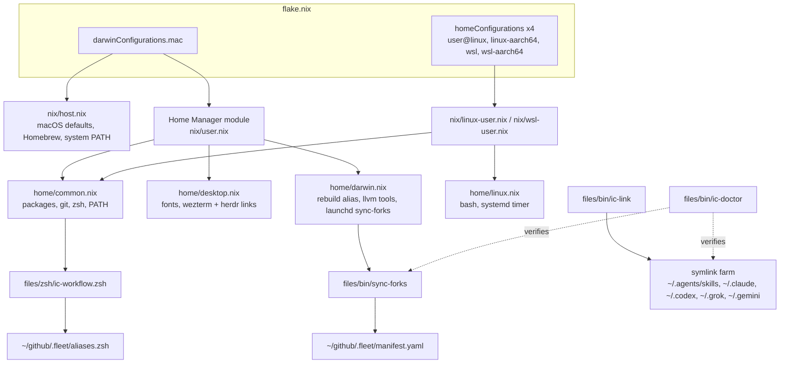

# dotfiles-nix: the machine layer of the harness

Evidence cites use `dotfiles-nix/<path>:<line>` relative to `~/github`.
The sibling control repo is cited as `.fleet/<path>:<line>` (see [fleet-ops](../components/fleet-ops.md)).
Everything below was read from disk, from `git log`, or from read-only commands run on 2026-09-23.

## 1. TL;DR

dotfiles-nix is a Nix flake that declares the whole Mac (nix-darwin system settings, Homebrew, launchd) and the user environment (Home Manager, on macOS, Linux, and WSL), forked from kunchenguid/dotfiles-mac-nix.
On top of that small upstream base, the user's fork adds the agent-harness plumbing: `ic-link` (the symlink farm that gives every AI tool its skills and its own operating manual), `ic-doctor` (a read-only seven-section health check), `sync-forks` (a daily fast-forward-only fork sync driven by the fleet manifest), and the zsh workflow layer that exposes the toolchain.
It is the "infrastructure as code" of the harness: every other component is installed, wired, scheduled, or verified from here.

## 2. Problem it solves, and what breaks without it

An agent harness is a lot of moving parts on one laptop: about twenty forked CLIs, four AI tools that each read a different instruction file, skills that must appear in four skill directories, git identity and signing, and a daily job that keeps it all current.
Doing that by hand produces configuration drift, which in agent tooling is silent: a tool that reads the wrong manual, or a missing skill link, does not crash, it just behaves worse.

What breaks without it:

- A fresh machine cannot be rebuilt reproducibly; the flake plus `setup/install.sh` is the one-command bootstrap (`dotfiles-nix/README.md:101-115`).
- Codex, Grok, or Gemini would silently read Claude's manual, which is the exact fault `ic-link` and `ic-doctor` guard against (`dotfiles-nix/files/bin/ic-link:97-111`, `dotfiles-nix/files/bin/ic-doctor:244-277`).
- Skills and subagents would exist only as loose files in `$HOME` rather than versioned in git (`dotfiles-nix/README.md:344-356`).
- Forks would fall behind upstream, or worse be clobbered by a naive merge; `sync-forks` is fast-forward-only and never publishes local-only commits (`dotfiles-nix/files/bin/sync-forks:195-224`).
- Scripts run under launchd would not find `node`, `pnpm`, or Go binaries, because launchd hands jobs a minimal `PATH` (`dotfiles-nix/setup/lib/platform.sh:217-235`).

## 3. Architecture

### Layers and ownership

The README states the rule: each layer is owned by exactly one mechanism (`dotfiles-nix/README.md:255`), and it keeps a complete software inventory table saying which layer owns each installed package (`dotfiles-nix/README.md:358-381`).



### Nix modules

| Module | What it declares | Cite |
|---|---|---|
| `flake.nix` | Inputs `nixpkgs` (unstable), `nix-darwin`, `home-manager`, both following nixpkgs; `username = "shreejitverma"`; one `darwinConfigurations.mac` and four `homeConfigurations` built by `mkHome` | `dotfiles-nix/flake.nix:4-14`, `:18`, `:27-42`, `:45-67` |
| `nix/host.nix` | nix-darwin system: `nix.enable = false` (Determinate Nix manages Nix), declarative Homebrew, macOS defaults, system `PATH`, `system.primaryUser` | `dotfiles-nix/nix/host.nix:5`, `:9-34`, `:46-86`, `:88-93` |
| `nix/user.nix` | macOS Home Manager entry: imports `common`, `desktop`, `darwin`; carries the `dotfilesDir` literal and two assertions | `dotfiles-nix/nix/user.nix:13-33` |
| `nix/linux-user.nix`, `nix/wsl-user.nix` | Linux and WSL entries; WSL omits the desktop layer; each sets its own `rebuild` alias from `profileName` | `dotfiles-nix/nix/linux-user.nix:15-25`, `dotfiles-nix/nix/wsl-user.nix:15-25` |
| `nix/home/dotfiles.nix` | The single option `ic.dotfilesDir` (read-only, defaults to `$HOME/github/dotfiles-nix`) that every layer derives paths from | `dotfiles-nix/nix/home/dotfiles.nix:25-33` |
| `nix/home/common.nix` | Cross-platform packages, `sessionPath`, git, delta, starship, bat, fzf, zoxide, atuin, direnv, zsh aliases, and the ordered source of `ic-workflow.zsh` | `dotfiles-nix/nix/home/common.nix:20-63`, `:65-111`, `:224-261` |
| `nix/home/darwin.nix` | `rebuild` alias with `sudo`, Homebrew LLVM lint tools on `PATH`, signing on by default, log dir activation step, the `sync-forks` launchd agent | `dotfiles-nix/nix/home/darwin.nix:28-29`, `:42-54`, `:60`, `:75-96` |
| `nix/home/desktop.nix` | Fonts and out-of-store symlinks for WezTerm and herdr configs | `dotfiles-nix/nix/home/desktop.nix:14-30` |
| `nix/home/linux.nix` | `programs.home-manager`, bash with the zsh alias set, systemd user service and timer for `sync-forks` | `dotfiles-nix/nix/home/linux.nix:27`, `:41-61` |
| `nix/home/wsl.nix` | Timer forced off (`lib.mkForce [ ]`), Windows interop aliases | `dotfiles-nix/nix/home/wsl.nix:15-22` |

A Nix detail worth being able to explain: app configs are linked with `mkOutOfStoreSymlink`, so they point at the git checkout rather than an immutable store copy and can be edited without a rebuild (`dotfiles-nix/AGENTS.md:8`).
The cost is that the link target is an absolute path, which is why the checkout location is an enforced invariant: each entry module asserts its literal equals `ic.dotfilesDir` and that `files/bin` is on `sessionPath` (`dotfiles-nix/nix/user.nix:23-32`), and the shell scripts parse the same literal with pure-shell string matching (`dotfiles-nix/setup/lib/platform.sh:63-78`).

### Homebrew and how the IC toolchain gets installed

Homebrew is declarative for a subset only: brews `autoconf`, `herdr`, `cmake`, `ninja`, `ccache`, `llvm` and casks `wezterm`, `amethyst`, `opensuperwhisper` (`dotfiles-nix/nix/host.nix:17-33`), with `onActivation.cleanup = "none"` so hand-installed formulas survive (`dotfiles-nix/nix/host.nix:14`, `dotfiles-nix/AGENTS.md:7`).
The README admits the gap: `node`, `go`, `gh`, `gemini-cli`, `google-chrome`, and `codex` are still manual `brew` installs (`dotfiles-nix/README.md:372`, `:380-381`).

The harness tools are not Nix packages at all.
They are forks cloned under `~/github` and built from source (`dotfiles-nix/README.md:257-282`):

| Tool family | Build | Lands on PATH via |
|---|---|---|
| Go: no-mistakes, treehouse | `make build` plus explicit `install` into `~/go/bin` (manifest install strings) | `$HOME/go/bin` in `home.sessionPath` (`dotfiles-nix/nix/home/common.nix:59-63`) |
| Node: chrome-devtools-axi, gh-axi, gnhf, lavish-axi, quota-axi, tasks-axi | `pnpm install --frozen-lockfile && pnpm run build`, then `npm link` | `/opt/homebrew/bin` symlinks into the clone, so a rebuild is live immediately |
| firstmate | nothing; the clone is the product | the `firstmate` / `fm` shell function (`dotfiles-nix/files/zsh/ic-workflow.zsh:518-526`) |
| axi | nothing to run; contributes a skill and an SDK | skill link only |
| wheelhouse | runs on GitHub Actions inside the fork | nothing local |
| Claude Code, Grok Build | vendor install scripts into `~/.local/bin` | `$HOME/.local/bin` first in `sessionPath` |

Fresh-machine order is spelled out as Steps 0 to 9 (`dotfiles-nix/README.md:383-555`): bootstrap Nix, install runtimes, fork and clone every tool with an `upstream` remote, build Go tools, build and link Node tools, clone the private agents repo, run `ic-link`, `rebuild` to enable the sync, one-time per-tool setup, then `ic-doctor`.
The fleet repo automates the clone-and-install part idempotently (`.fleet/bootstrap.sh:1-11`).

### Scripts in `files/bin`

| Script | Purpose | Cite |
|---|---|---|
| `ic-link` | Create or repair every harness symlink, idempotently | `dotfiles-nix/files/bin/ic-link:1-14` |
| `ic-doctor` | Read-only seven-section health check | `dotfiles-nix/files/bin/ic-doctor:1-25` |
| `sync-forks` | Daily manifest-driven ff-only fork sync | `dotfiles-nix/files/bin/sync-forks:1-24` |
| `up` | `nix flake update`, platform activation, then `brew`, `rustup`, `tldr` updates | `dotfiles-nix/files/bin/up:31-77` |
| `gprune` | Delete local branches merged into base, asking first | `dotfiles-nix/files/bin/gprune:1-5` |
| `note`, `scratch`, `sysinfo` | Inbox note, dated scratch file, machine snapshot | `dotfiles-nix/files/bin/note:1-5`, `dotfiles-nix/files/bin/scratch:1-3`, `dotfiles-nix/files/bin/sysinfo:1-2` |

`setup/lib/platform.sh` is the shared library every script sources: platform detection (`ic_detect_target`, WSL probes), the literal parsers, profile mapping, desktop notifications, the nvm-aware minimal `PATH` (`dotfiles-nix/setup/lib/platform.sh:24-235`).
`setup/lib/skills.sh` discovers owned skills as every `files/skills/*/SKILL.md`, so adding a skill needs no list edit (`dotfiles-nix/setup/lib/skills.sh:15-22`).

### ic-link: what it links where

`ic-link` resolves the durable target checkout from the entry module's `dotfilesDir` literal, not from where it was invoked, so running it from a git worktree still writes links that survive the worktree's deletion (`dotfiles-nix/files/bin/ic-link:27-57`).

| Step | Link | Target | Cite |
|---|---|---|---|
| 1 | `~/.agents/skills/{chrome-devtools-axi,gh-axi,gnhf,no-mistakes,quota-axi,tasks-axi}` | `~/github/<repo>/skills/<repo>` | `:60`, `:81-83` |
| 1 | `~/.agents/skills/lavish`, `stow`, `axi` | `lavish-axi/skills/lavish`, `firstmate/skills/stow`, `axi/.agents/skills/axi` | `:84-86` |
| 1 | `~/.agents/skills/<owned>` for the 12 owned skills | `<dotfilesDir>/files/skills/<name>` | `:62`, `:87-89` |
| 2 | `~/.claude/skills/<name>`, `~/.codex/skills/<name>` | relative `../../.agents/skills/<name>` | `:92-95` |
| 3 | `~/AGENTS.md` | `~/github/agents/AGENTS.md` (tool-neutral); Claude's manual only when the agents repo is absent | `:103-110` |
| 3 | `~/.codex/AGENTS.md` | `~/AGENTS.md` | `:111` |
| 4 | `~/.claude/CLAUDE.md`, `~/OPINIONS.md`, `~/VOICE.md`, `~/.claude/settings.json` | files in `~/github/agents` | `:114-118` |
| 4 | `~/.claude/agents/*.md`, `~/.claude/rules/*.md` | `~/github/agents/claude/{agents,rules}/*.md`, one file at a time | `:121-133` |
| 5 | `~/.grok/skills/<name>`, `~/.grok/AGENTS.md`, `~/.grok/agents/*.md` | mirrors, `GROK.md`, `grok/agents/*.md`; only when `~/.grok` already exists | `:143-161` |
| 6 | `~/.gemini/AGENTS.md` | `GEMINI.md`; never touches Gemini's own `GEMINI.md` memory file | `:169-175` |

Its refusal rules are the interesting part: `link_skill` refuses to write into a real directory, because `ln -sfn` onto a directory creates the link inside it (`:66-76`); it never creates `~/.grok` or `~/.gemini` (their installers own them), never touches `~/.grok/hooks` (firstmate owns the turn-end hook) or `~/.grok/config.toml` (Grok rewrites it in place) (`:139-142`).
Live state on 2026-09-23: 21 skill links in `~/.grok/skills`, 21 plus Codex's own `.system` in `~/.codex/skills`, 6 subagents and 2 rules linked into `~/.claude`.

### ic-doctor: every check

Read-only, `set -uo pipefail`, fixed `PATH` from `ic_default_path`; `ok` and `warn` do not change the exit code, any `FAIL` sets it to 1 (`dotfiles-nix/files/bin/ic-doctor:20-25`, `:48-51`, `:503-508`).

1. Dotfiles checkout (`:57-107`): the entry module for the detected platform can be read; its `dotfilesDir` exists and resolves to this checkout; `~/.config/wezterm/wezterm.lua` and `~/.config/herdr/config.toml` resolve (skipped as ok on WSL); `~/.zshrc` sources this checkout's `ic-workflow.zsh`.
2. Forks (`:109-140`): for each of `no-mistakes treehouse firstmate gnhf lavish-axi axi chrome-devtools-axi gh-axi tasks-axi wheelhouse quota-axi` (`:43`), the clone exists (FAIL), has an `upstream` remote (FAIL), is clean (warn), and is on the manifest's `default_branch` (warn).
3. Binaries (`:142-170`): each of `no-mistakes treehouse gnhf lavish-axi chrome-devtools-axi gh-axi tasks-axi quota-axi` (`:44`) is on `PATH` and answers `--version` (FAIL); on macOS, `clang-format`, `clang-tidy`, `run-clang-tidy` are executable in `~/.local/share/ic/llvm-tools` (warn).
4. Skills (`:172-179`): every skill in the list (9 external plus every owned skill) has a resolvable `SKILL.md` in both `~/.agents/skills` and `~/.claude/skills` (FAIL).
5. Daily sync (`:181-222`): launchd agent loaded on macOS (FAIL), systemd timer enabled on Linux (FAIL) or WSL (warn); newest `~/github/.fleet/logs/sync-*.log` exists and its last line is printed (warn if absent).
6. Auth (`:224-242`): `gh auth status` (FAIL); `quota-axi --provider claude` prints a numeric quota row matching `^  claude,[^,]+,[0-9]+,` (warn otherwise).
7. Cross-tool defaults (`:244-500`): `~/AGENTS.md` points at the neutral manual and it contains "Default development system"; `~/.claude/CLAUDE.md` contains the same section; Codex `AGENTS.md` and all skills; Grok binary resolves to `~/.local/bin/grok` with no second copy, all skills, `GROK.md` link and section, agent definitions linked and none dangling; Gemini `GEMINI.md` is not a symlink, `~/.gemini/AGENTS.md` links `GEMINI.md`, `context.fileName` lists `AGENTS.md`, section present; personal layer links point into `~/github/agents`; every Claude subagent and rule linked, none dangling; every `claude/hooks/*.py` referenced by `settings.json` exists and `python3` is on `PATH` (`:471-485`); `bin/build-manuals --check` passes (`:488-494`); agents repo uncommitted changes (warn).

Real run on 2026-09-23: exit 0, 67 `ok` lines, one `warn` (the agents repo had uncommitted changes), and `ic-doctor: all checks passed`.
Notable values it printed: `no-mistakes version v1.81.0-4-g7051487`, `quota-axi 0.1.53`, `tasks-axi 0.2.6`, `gnhf 0.1.49`, `grok 1.0.41 [stable]`, hooks `guard.py post_edit.py`, and "agents manuals match their sources".

### sync-forks: the daily engine

Per manifest entry with `sync: true` (`dotfiles-nix/files/bin/sync-forks:141-250`):

1. Skip if not cloned, mid-rebase or mid-merge, dirty, or not on the manifest branch (`:143-165`).
2. Strip local `user.email` / `user.name` overrides and verify the resolved author identity; a mismatch fails the repo (`:97-119`, `:167`).
3. `git fetch --all --prune`, one retry after 30 s (`:172-176`).
4. Fail if `refs/remotes/upstream/<branch>` does not exist, so a missing remote cannot read as "up to date" (`:181-185`).
5. Count `behind` and `ahead` with `git rev-list --count` (`:187-188`); dry run logs them and stops (`:190-193`).
6. Only when `ahead == 0`, ask GitHub to fast-forward the fork server-side with `gh repo sync -b <branch>` (non-fatal) (`:200-204`).
7. Behind and ahead is DIVERGED, ahead-only is never published, behind 0 is up to date (`:210-224`).
8. `git merge --ff-only upstream/<branch>`, then `eval` the manifest install command with stdin from `/dev/null` (`:227-242`).
9. `git push -q origin <branch>` (normal push, never force) (`:244-249`).
10. One summary line, and a desktop notification only on failures or divergence (`:252-262`).

Scheduling is platform-specific: a Home Manager launchd agent at 10:00 with `RunAtLoad` and `ProcessType = "Standard"` on macOS (`dotfiles-nix/nix/home/darwin.nix:79-96`), a systemd user timer with `Persistent = true` on Linux (`dotfiles-nix/nix/home/linux.nix:54-61`), disabled on WSL.
The generated plist wraps the script as `/bin/sh -c "/bin/wait4path /nix/store && exec .../files/bin/sync-forks"` under label `org.nix-community.home.sync-forks` (read with `plutil -p ~/Library/LaunchAgents/org.nix-community.home.sync-forks.plist`).

### State files

| State | Where | Owner |
|---|---|---|
| Active system generation | `/run/current-system` symlink into `/nix/store/...-darwin-system-26.11...` | nix-darwin |
| Home Manager files | `~/.zshrc` and friends are symlinks into `/nix/store/...-home-manager-files` | Home Manager |
| Replaced pre-existing dotfiles | `<file>.backup` (`home-manager.backupFileExtension = "backup"`) | `dotfiles-nix/flake.nix:53` |
| Pinned inputs | `flake.lock` (nixpkgs `70ce234312`, nix-darwin `15abb8c98f`, home-manager `367f7ef808`) | `nix flake update` via `up` / `nup` |
| launchd plist | `~/Library/LaunchAgents/org.nix-community.home.sync-forks.plist` | Home Manager |
| LLVM tool links | `~/.local/share/ic/llvm-tools/*` | `dotfiles-nix/nix/home/darwin.nix:42-54` |
| Symlink farm | `~/.agents/skills`, `~/.claude/{skills,agents,rules,CLAUDE.md,settings.json}`, `~/.codex`, `~/.grok`, `~/.gemini`, `~/AGENTS.md`, `~/OPINIONS.md`, `~/VOICE.md` | `ic-link` |
| Sync logs | `~/github/.fleet/logs/sync-YYYYMMDD.log`, 30-day rotation, plus launchd streams | `sync-forks:41-47` |
| Task backlog | `backlog.md` at the repo root, untracked (the "1 dirty file"), records PRs #21 and #22 as done | tasks-axi |
| Local build artifact | `result` symlink, untracked since `c083e31` | `nix build` |

## 4. Interfaces

All interfaces print plain text; none emits TOON or JSON.

| Command | Inputs and flags | Output | Exit code |
|---|---|---|---|
| `bash setup/install.sh` | `--target <darwin\|linux\|wsl>`, `--yes`/`-y`, `--dry-run`, `--help`/`-h` (real `--help` output) | detected target, arch, profile, command; then `exec` into `mac.sh` or `linux.sh` | non-zero on unknown platform or unsupported arch before anything installs (`dotfiles-nix/setup/install.sh:91`, `:136`) |
| `setup/mac.sh` | env overrides `NIX_DAEMON_PROFILE`, `DARWIN_REBUILD_BIN` for tests only | installer and activation output | 1 if the checkout is not at `dotfilesDir` (`dotfiles-nix/setup/mac.sh:33-48`) |
| `setup/linux.sh` | same, plus `WSL_OSRELEASE_FILE`, `WSL_VERSION_FILE` | Home Manager build and activation | non-zero on wrong checkout, `/mnt/c`, or a symlinked startup file |
| `setup/windows.ps1` | none | enables WSL2 and runs the Linux bootstrap inside it | (untested by design) |
| `rebuild` (alias) | none | `sudo /run/current-system/sw/bin/darwin-rebuild switch --flake '<dir>#mac'` on macOS, `home-manager switch --flake '<dir>#<profile>'` elsewhere | tool's code |
| `up` | none | flake update, activation, brew, rustup, tldr | `set -euo pipefail`; 1 on unsupported platform or arch (`dotfiles-nix/files/bin/up:23-29`, `:50-54`) |
| `ic-link` | none | `ic-link: linked skills, cross-tool chain, and personal layer` plus warnings on stderr | 0; `set -euo pipefail` |
| `ic-doctor` / `icdoctor` | none | `[n/7]` sections of `ok`/`warn`/`FAIL` lines | 0 or 1 |
| `sync-forks` / `syncforks` | `--dry-run` only (`dotfiles-nix/files/bin/sync-forks:49-50`) | timestamped lines tee'd to the daily log | 0 when no manifest; 1 when the manifest parses to zero entries; otherwise 0 even when repos failed, because failure is signalled by notification and the summary line (`:252-262`) |
| `nbuild`, `ngen`, `ncheck`, `nup`, `ngc` | aliases | build without activating, list generations, `nix flake check`, input update, GC | (`dotfiles-nix/files/zsh/ic-workflow.zsh:291-319`) |
| Tool aliases `th nm gn cda ta qa` | guarded by `command -v` | treehouse, no-mistakes, gnhf, chrome-devtools-axi, tasks-axi, quota-axi | (`dotfiles-nix/files/zsh/ic-workflow.zsh:504-509`) |
| `fm` / `firstmate [cmd...]` | `FM_DEFAULT_HARNESS` (default `claude`) | `cd ~/github/firstmate` and launch the harness | (`dotfiles-nix/files/zsh/ic-workflow.zsh:518-526`) |

The dry-run plan on this Mac, from `bash setup/install.sh --dry-run --yes`: `target: darwin`, `arch: aarch64`, `profile: darwinConfigurations.mac`, `command: bash ~/github/dotfiles-nix/setup/mac.sh`, `dry-run: nothing was installed.`

The `sync-forks` exit-code behavior is worth knowing in an interview: the job's success signal is the log's `===== done ... failed:[ ]` line, which `fleet-doctor` parses (`.fleet/doctor.sh:138-148`), not the process exit status; `launchctl list` showed last exit status 0 for the agent.

## 5. Configuration

| File / key | Default or upstream value | User's actual setting | Why |
|---|---|---|---|
| `flake.nix` `username` | placeholder `yourname` upstream | `shreejitverma` (`:18`) | names the Home Manager profiles; scripts derive profile names from this literal (`dotfiles-nix/setup/lib/platform.sh:86-105`) |
| `flake.nix` `system` | `aarch64-darwin` | `aarch64-darwin` (`:46`) | Apple Silicon |
| `host.nix` `nix.enable` | | `false` (`:5`) | Determinate Nix manages the daemon |
| `host.nix` `homebrew.onActivation.cleanup` | | `"none"` (`:14`) | do not uninstall hand-installed brews until the declared list is complete |
| `host.nix` `homebrew.onActivation.autoUpdate` | | `true` (`:15`) | |
| `host.nix` `system.defaults` | | dark mode, fast key repeat, autocorrect off, dock and menu bar auto-hide, Finder list view and path bar (`:46-73`) | personal taste |
| `host.nix` OpenSuperWhisper hotkey | | `Cmd+backtick` via `CustomUserPreferences` (`:82-84`) | voice dictation hotkey; overlaps a macOS shortcut on purpose |
| `common.nix` `home.sessionPath` | | `~/.local/bin`, `<dotfiles>/files/bin`, `~/go/bin` (`:59-63`) | vendor CLIs, repo scripts, Go tool installs |
| `common.nix` `programs.git.signing` | | `format = "ssh"`, key `~/.ssh/id_ed25519_signing.pub` (`:74-77`) | SSH commit signing |
| `darwin.nix` `programs.git.signing.signByDefault` | | `true` on macOS only (`:60`) | key exists only on this Mac |
| `common.nix` `programs.git.includes` | | `gitdir:~/github/` includes `~/github/.fleet/gitconfig-identity` (`:86-91`) | defense-in-depth identity for fleet repos |
| `common.nix` `user.name`, `user.email` | placeholders upstream | real values, <redacted> (`:93-96`) | |
| `common.nix` git settings | | `pull.rebase`, `rebase.updateRefs`, `merge.conflictStyle = zdiff3`, `diff.algorithm = histogram`, `rerere.enabled`, `fetch.prune`, `gpg.ssh.allowedSignersFile` (`:92-110`) | modern git defaults |
| `common.nix` `programs.eza.enableZshIntegration` | HM default adds `ls=eza` aliases | `false` (`:173-177`) | a bare `eza` off a terminal reads stdin, which hung agents |
| `common.nix` `programs.fzf.historyWidget.command` | | `""` (`:203`) | atuin owns `Ctrl-R` |
| `common.nix` `programs.zsh.initContent` order | | `lib.mkOrder 1050` (`:254`) | after tool integrations (1000), before HM aliases (1100) and syntax highlighting (1200) |
| `common.nix` aliases `cc`, `co` | | `claude --dangerously-skip-permissions`, `codex --full-auto` (`:240-241`) | adapted from kunchenguid/dotfiles in `84451df` |
| `darwin.nix` `launchd.agents.sync-forks.config.ProcessType` | launchd treats unset agents as Background-eligible | `"Standard"` (`:94`) | Background QoS stretched the first run to 3.5 hours (`b790d5f`) |
| `darwin.nix` `StartCalendarInterval`, `RunAtLoad` | | 10:00 daily, `true` (`:83-88`) | catch up after sleep |
| `sync-forks` `IDENT_NAME`, `IDENT_EMAIL` | hardcoded | <redacted> (`:42-43`) | identity assertion target |
| Keychain service `typesafe-api-key` | none | value <redacted>, injected into `claude` and `grok` only (`dotfiles-nix/files/zsh/ic-workflow.zsh:538-550`) | compact-adviser key must not reach firstmate or the git-tracked settings file |
| `FM_DEFAULT_HARNESS` | `claude` | unset | which harness a bare `fm` launches |
| `IC_FLAKE_USER`, `NVM_DIR`, `DEBUG_KEEP_SANDBOX` | unset | unset | escape hatch, nvm location, keep test sandboxes |

The repo also carries `dotfiles-nix/CLAUDE.md`, which is only `@AGENTS.md` (Claude imports the agent notes), and `dotfiles-nix/AGENTS.md`, whose "Deliberate decisions - do NOT silently revert them" list records every non-obvious choice above with its reason (`dotfiles-nix/AGENTS.md:5-26`).

## 6. Connections

| Component | Relationship | Contract and cite |
|---|---|---|
| [fleet-ops](../components/fleet-ops.md) | data source and log sink | `sync-forks` reads `~/github/.fleet/manifest.yaml` (`sync-forks:37-40`); `ic-doctor` reads `default_branch` (`ic-doctor:114-124`); git includes `.fleet/gitconfig-identity` and `.fleet/allowed_signers` (`common.nix:86-98`); `ic-workflow.zsh` sources `.fleet/aliases.zsh` (`:556-558`) |
| [agents](../components/agents.md) (private manual generator) | link targets and a checked contract | `ic-link` links `AGENTS.md`, `CLAUDE.md`, `GROK.md`, `GEMINI.md`, `OPINIONS.md`, `VOICE.md`, `claude/settings.json`, `claude/agents`, `claude/rules`, `grok/agents`; `ic-doctor` runs `bin/build-manuals --check` and checks "Default development system" in every manual |
| `~/.claude` hooks | verified | `ic-doctor` extracts `claude/hooks/*.py` from `settings.json` and fails when `guard.py` or `post_edit.py` is missing (`ic-doctor:471-485`); `darwin.nix` puts `clang-format` on `PATH` because the post-edit hook calls it (`darwin.nix:31-37`) |
| [firstmate](../components/firstmate.md) | launched and linked | `fm` function; `stow` skill linked from `firstmate/skills/stow`; `ic-link` never touches `~/.grok/hooks` because firstmate owns it; the Keychain wrapper exists because `firstmate/bin/fm-dispatch-resolve.sh:8` opts into typed dispatch whenever `TYPESAFE_API_KEY` is set |
| [no-mistakes](../components/no-mistakes.md) | gate and managed binary | this repo has a `no-mistakes` git remote (`~/.no-mistakes/repos/<hash>.git`); commits `7077fc5`, `57fb1ab`, `e5f0df5` are pipeline document-step commits; `ic-doctor` checks its binary and skill; `sync-forks` rebuilds it |
| [treehouse](../components/treehouse.md), [gnhf](../components/gnhf.md), [tasks-axi](../components/tasks-axi.md), [quota-axi](../components/quota-axi.md), [gh-axi](../components/gh-axi.md), [chrome-devtools-axi](../components/chrome-devtools-axi.md), [lavish-axi](../components/lavish-axi.md) | aliased, checked, linked, synced | aliases (`ic-workflow.zsh:504-509`), `ic-doctor` binary and skill lists (`ic-doctor:43-46`), skill links (`ic-link:60-86`) |
| [quota-axi](../components/quota-axi.md) | health probe | `ic-doctor` section 6 parses its row format |
| [axi](../components/axi.md) | skill source | `axi/.agents/skills/axi` |
| [compact-adviser](../components/compact-adviser.md) | key injection | Keychain wrapper around `claude` and `grok` |
| [wheelhouse](../components/wheelhouse.md) | documented fork | README Step 2 forks it from `ImZoomBoy/wheelhouse` (`README.md:437-450`) |
| Skills | owner of 12 | `files/skills/*` plus `THIRD_PARTY_NOTICES.md`; see [skills catalog](../components/skills-catalog.md) |
| gh, osascript, notify-send | called | `gh repo sync`, `gh auth status`; `ic_notify` (`platform.sh:134-146`) |

## 7. Lifecycle walkthrough: the 2026-09-23 10:00 sync run

This traces one real scheduled run using the code and the log `~/github/.fleet/logs/sync-20260923.log`.

1. launchd fires `org.nix-community.home.sync-forks` at 10:00 from the `StartCalendarInterval` in `dotfiles-nix/nix/home/darwin.nix:83-85`; the plist runs `/bin/wait4path /nix/store && exec <dotfiles>/files/bin/sync-forks`, so the job waits for the Nix store volume to mount.
2. The script sources `setup/lib/platform.sh` from its own resolved location and replaces `PATH` with `ic_default_path` (`sync-forks:31-35`), which on macOS is `~/.local/bin:/opt/homebrew/bin[:nvm bin]:/run/current-system/sw/bin:...:~/go/bin:/usr/bin:/bin:...` (`platform.sh:228`), so `pnpm`, `node`, `go`, and `gh` resolve under launchd.
3. It creates the log dir, deletes logs older than 30 days, and parses the manifest with the awk state machine (`sync-forks:45-47`, `:64-80`); the log records `manifest: 20 sync-eligible entries` at 10:00:05 (`:129-134`).
4. First entry `lavish-axi`: it is cloned, not mid-rebase, clean, and on `main` (`:143-165`), so `assert_identity` runs and passes (`:167`).
5. `git fetch --all --prune` succeeds on the first attempt (`:172`), `upstream/main` exists (`:181`), and the counts come out `behind=4`, `ahead=0` (`:187-188`).
6. Because `ahead` is 0, `gh repo sync shreejitverma/lavish-axi -b main` runs and the log shows `[lavish-axi] server-side fork sync ok` at 10:00:08 (`:200-204`).
7. Behind > 0 and ahead = 0 skips the diverged and ahead-only branches (`:210-224`), and `git merge --ff-only upstream/main` logs `fast-forwarded 4 commit(s)` (`:227-228`).
8. The manifest install `pnpm install --frozen-lockfile && pnpm run build` is `eval`ed inside the clone with stdin from `/dev/null` and logs `reinstalled (...)` at 10:00:12 (`:229-231`); because the binary is an `npm link`, the new build is live immediately.
9. `git push -q origin main` succeeds and the repo joins `synced` (`:244-245`).
10. The same path ran for no-mistakes (4 commits, rebuilt into `~/go/bin`), tasks-axi (2), quota-axi (16), treehouse (1), and compact-adviser (1); 12 others were `already up to date`.
11. `org-bench` hit `working tree dirty -> skipped` (`:154-157`), and `wheelhouse` hit `ahead-only: 117 unpushed local commit(s), not publishing` (`:215-218`).
12. The run ended at 10:01:00 with `===== done. synced:[ ...18 repos... ] diverged:[ ] skipped:[ org-bench wheelhouse ] failed:[ ] =====` (`:252`); since `failed` and `diverged` were empty, no notification fired (`:256-262`).
13. The `ic-doctor` run later that day printed that same line under `[5/7] daily sync` as `ok last log (sync-20260923.log)` (`ic-doctor:213-217`).

A `rebuild` follows a shorter path: the alias runs `sudo darwin-rebuild switch --flake '<dir>#mac'` (`darwin.nix:28-29`), nix-darwin evaluates `darwinConfigurations.mac` (`flake.nix:45-57`), the entry-module assertions run at evaluation time (`user.nix:23-32`), Homebrew is reconciled, and Home Manager activates as the user, running the `fleetLogDir` step after `writeBoundary` (`darwin.nix:75-77`) and loading the launchd agent; the module's own comment notes that `RunAtLoad` fires at activation, which is why the log directory must exist first (`darwin.nix:70-74`).

## 8. Failure modes and safeguards

| Failure mode | Safeguard | Evidence |
|---|---|---|
| Checkout not at the declared path, so every out-of-store link dangles while activation exits 0 | Nix assertions plus a fail-fast guard in `mac.sh` and `linux.sh`; `ic-doctor` section 1 | `user.nix:23-32`, `mac.sh:33-48`, `ic-doctor:57-107` |
| Unquoted `#` in the flake reference under zsh `EXTENDED_GLOB` makes `rebuild` fail with "no matches found" | Flake refs quoted in every alias | `darwin.nix:18-29`, `ic-workflow.zsh:304-319`, commit `96997dd` |
| nix-darwin refuses `switch` as non-root | `sudo` only on the activation, flake update and brew stay as the user | `darwin.nix:25-29`, `up:42-47`, commit `28c6d31` |
| Root-owned `flake.lock` after the first `sudo` activation | `mac.sh` generates the lock as the invoking user first | `mac.sh:82-86` |
| launchd Background QoS throttles builds (3.5 h first run) | `ProcessType = "Standard"` | `darwin.nix:89-94`, `b790d5f` |
| Transient network failure fails a repo for a day | One retry after 30 s | `sync-forks:169-176` |
| Manifest drift parses to 0 entries and the fleet silently stops syncing | Log the count, exit 1 and notify on zero | `sync-forks:125-139` |
| Missing `upstream` ref reads as up to date | Explicit ref check | `sync-forks:178-185` |
| `gh repo sync` moves the fork while local commits are unpushed | Server-side sync only when `ahead == 0` | `sync-forks:195-204` |
| Wrong author identity from a stray `~/.gitconfig` | `assert_identity` fails the repo; dry run judges identity as if the override were stripped | `sync-forks:82-119` |
| Install command slurps the loop's stdin | `</dev/null` on `eval` and `gh` | `sync-forks:201`, `:230` |
| One tool loads another tool's manual | `ic-link` refuses fallbacks, `ic-doctor` FAILs and names the real target | `ic-link:103-110`, `ic-doctor:244-277`, `:326-334`, `:390-393` |
| Linking into a real directory an installer created | `link_skill` warns and skips | `ic-link:66-76` |
| Agents or scripts get empty output or a hang from `ls` | eza integration off; `_ic_eza` adds `.` off a terminal | `common.nix:167-177`, `ic-workflow.zsh:85-137`, `15184e3` |
| Hook script missing so Claude runs without its guard | `ic-doctor` fails per missing hook | `ic-doctor:468-485` |
| Nix installer on WSL without systemd | `--init none` | `README.md:149` |

Known gaps and discrepancies:

- `sync-forks` exits 0 even when repos failed; alerting relies on notifications and the summary line (`sync-forks:252-262`).
- The README's layer 1 text says a fork with its own commits "like wheelhouse's" is "reported as diverged" (`README.md:268`), but with the parent unchanged the engine reports wheelhouse as ahead-only (`sync-forks:215-218`, live log); it becomes DIVERGED only once the parent moves.
- Six Homebrew entries are still manual (`README.md:380-381`).
- The Determinate installer branch of `linux.sh` and all of `windows.ps1` are untested by design (`README.md:194`).
- `setup/mac.sh` and `linux.sh` must never be run for real by agents (`AGENTS.md:47-49`).

## 9. Testing and quality

Seven bash suites, documented scenario by scenario in `dotfiles-nix/tests/README.md`; all but the Docker one run the real script against sandboxed `HOME` directories, stub executables, or local bare git remotes, so nothing installs or pushes.

| Suite | Target | Result on 2026-09-23 (run locally for this note) |
|---|---|---|
| `tests/ic_link_test.sh` | `ic-link` link state via `readlink` | pass, 75 checks, 3 s |
| `tests/ic_doctor_test.sh` | `ic-doctor` sections 3, 6, 7 | pass, 105 checks, 61 s |
| `tests/ic_workflow_listing_test.sh` | listing commands off a terminal, stub `eza`, FIFO hang check | pass, 15 checks, under 1 s |
| `tests/install_dispatch_test.sh` | platform detection, arch mapping, profile naming, guards | pass, 66 checks, 3 s |
| `tests/sync_forks_test.sh` | ff, diverged, ahead-only, dirty, wrong branch, retry, zero-entry, rotation, dry run, identity | pass, 84 checks, 7 s |
| `tests/mac_setup_test.sh` | `setup/mac.sh` with stub `curl`, `nix`, `sudo`, `darwin-rebuild` | pass, 35 checks, 5 s |
| `tests/linux_e2e_docker.sh` | real Linux and WSL install in a container | not run (needs Docker; excluded from CI) |

Check counts are the number of `ok:` or `PASS:` lines each suite printed, with zero failure lines.
ShellCheck 0.11.0 at `--severity=warning` over every bash script in `files/bin`, `tests`, `setup`, and `setup/lib` also passed locally, matching the CI job.

CI (`dotfiles-nix/.github/workflows/ci.yml`, added in `ba94692`): on every PR and push to `main`, a `shellcheck` job on ubuntu and a `sandboxed suites` job on `macos-latest` that runs the six non-Docker suites (`:17-68`); both runs on 2026-09-23 for PRs #21 and #22 were green (`gh run list -R shreejitverma/dotfiles-nix`).
A second workflow auto-closes PRs from anyone but the owner (`dotfiles-nix/.github/workflows/close-prs.yml:13`), adopted from kunchenguid/dotfiles in `84451df`.
The suites follow the no-mistakes test-quality rule: they execute the real interface and assert resulting state, not grep the source.

```bash
cd ~/github/dotfiles-nix
for t in ic_link_test ic_doctor_test ic_workflow_listing_test install_dispatch_test sync_forks_test mac_setup_test; do bash tests/$t.sh; done
~/github/dotfiles-nix/files/bin/ic-doctor
```

## 10. Fork delta

Upstream kunchenguid/dotfiles-mac-nix has 8 commits by Kun Chen, and at the merge base `ac7b8f7` its tree was a small macOS-only base: `flake.nix`, `nix/host.nix`, `nix/user.nix`, `setup/mac.sh`, `tests/mac_setup_test.sh`, the WezTerm config, `AGENTS.md`, `CLAUDE.md`, README, and the blog post (`git ls-tree upstream/main`).
Upstream built the core idea: nix-darwin plus Home Manager plus declarative Homebrew, the single-pass fresh-Mac bootstrap, and its stubbed test harness.

The fork is 45 commits ahead and 2 behind (`git rev-list --left-right --count upstream/main...HEAD` = `2 45`); all 45 are authored under the user's identity.
The 2 "behind" commits (`cc40843` `@AGENTS.md` import, `ed4dd5c` Discord badge) were re-applied by content in `a1c5f94` (PR #13), and `CLAUDE.md` is byte-identical to upstream's, so the gap is ancestry only.
Upstream ancestry was restored once with a `-s ours` merge (`5aa74e4`), and sync PRs must use merge commits because squash discards the parent (`dotfiles-nix/AGENTS.md:37-45`).

| Theme | Commits |
|---|---|
| Personalize the base | `c266fc8` placeholders to real values, `256e15f` system settings, `d5b52e5` fix `files/bin` |
| IC toolchain integration (June to July) | `13bfe82` ic-workflow.zsh, helper scripts, first `sync-forks`; `c083e31` untrack `result`; `f3075dd`, `5eec46b`, `a535817`, `eae11d6` add gh-axi, tasks-axi, wheelhouse, quota-axi to the sync; `1214ff4` README; `7a8e242` ic-doctor and stow; `c51c338` cross-tool default chain and `ship` skill; `a31643f` ic-link and the private agents layer; `066c822` software inventory; `10ac80a` merge PR #1 |
| Adopted from kunchenguid/dotfiles | `84451df` herdr config, dock and Finder defaults, `cc`/`co` aliases, repo meta and the PR auto-close workflow (upstream authorship of that content is kunchenguid's) |
| macOS app | `f07c747`, `e5f0df5`, `57fb1ab`, `af39a55`, `496d06a` OpenSuperWhisper and its hotkey |
| Checkout-path invariant | `2b1fade` (#3) |
| Cross-platform install | `8c500c8` (#4) flake update, `23d0fe4` (#5) Linux and WSL, `c93d96b` (#6) guard hardening |
| zsh quoting fix | `96997dd`, `7077fc5` |
| Upstream ancestry | `5aa74e4`, `68a5e66`, `afd0f5f` (#8), `51c1339` |
| Fleet sync | `756e324` (#9) manifest-driven daily ff-only sync, `b790d5f` (#11) Standard QoS and fetch retry |
| Signing and PATH | `71c84bc` (#10) SSH signing, `go/bin` on PATH |
| firstmate as entry point | `e299933` (#12), `a1c5f94` (#13) |
| Per-tool manuals | `6daa1f5` (#14) Grok, `ba94692` (#15) Gemini, neutral `~/AGENTS.md`, CI; `33e4323` (#16) wheelhouse parent |
| compact-adviser key scoping | `27abab0` (#17) |
| herdr keymap | `b257565` (#18) |
| Engineering skills | `0b5637a` (#19) eleven ECC-derived skills (MIT, affaan-m/ecc at `bf70150`) plus owned-skill discovery |
| Agent ergonomics and lint | `15184e3` (#20) eza stdin fix, `470dc09` (#21) LLVM lint tools and hook checks, `28c6d31` (#22) sudo rebuild |

Honest attribution: the Nix base and the mac bootstrap harness are upstream's; the herdr config and PR auto-close workflow were adapted from another kunchenguid repo; the eleven engineering skills are adaptations of ECC; the harness wiring (`ic-link`, `ic-doctor`, `sync-forks`, `platform.sh`, Linux and WSL support, the zsh layer, the tests for all of these, and CI) is the fork's own work.

## 11. Interview angle

**Q1. How do you make environment changes reproducible and reviewable?**
Everything is declared in a flake with pinned inputs, each package has one owning layer, and changes go through PRs gated by no-mistakes and CI.
Invariants that Nix cannot check itself, like the checkout path, are enforced twice: as evaluation-time assertions and as shell guards that run before anything installs.

**Q2. How do you test scripts whose whole job is to install things or push to GitHub?**
Run the real script against a sandbox: fake `HOME`, stub executables first on `PATH` that record their calls, and local bare git remotes so every fetch, fast-forward, and push is genuine but offline.
Assert resulting state (`readlink`, ref positions, recorded stub calls), not source text, and keep the one real-install test inside Docker.

**Q3. What happens when a scheduled job fails at 10:00 while nobody is watching?**
It logs every decision with a timestamp to a dated file, retries a fetch once, isolates failures per repo, and sends a desktop notification only for failures or divergence; `ic-doctor` and `fleet-doctor` surface the last run's summary.
The honest caveat is that the process exit code stays 0, so anything consuming exit status alone (launchd, a future CI wrapper) would miss failures; I would add a non-zero exit when `failed` is non-empty.

**Defensible trade-off: `mkOutOfStoreSymlink` for app configs and skills.**
Linking into the working tree means edits are live without a rebuild and a `git pull` updates behavior immediately.
The downside is losing Nix's immutability guarantee, so a moved checkout breaks links while activation still exits 0; the fork pays for that with assertions, pre-flight guards, and a doctor check rather than giving up the edit loop.
