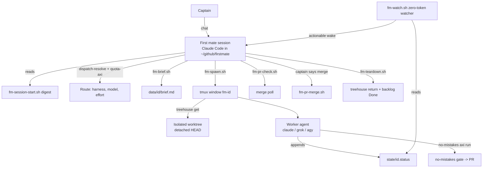
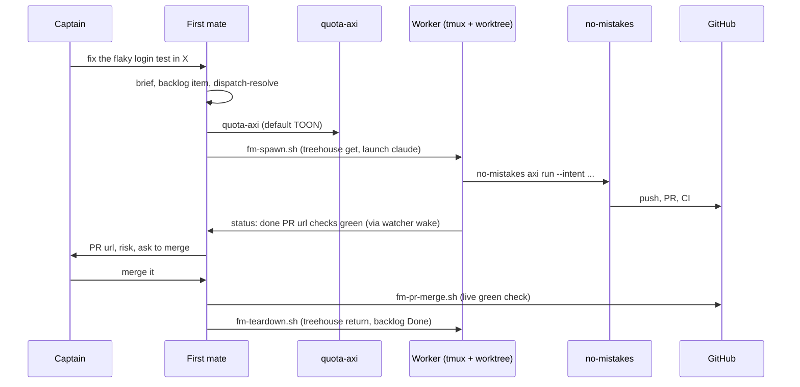

# firstmate - the supervisor layer of the harness

Evidence was measured on 2026-09-23 against the local clone at `~/github/firstmate` (branch `main`, HEAD `d30c08d9`).
Citations use `repo/path:line`, with the repo name relative to `~/github`; home files use `~/...`.
Scripts print their own header comment as `--help` (`firstmate/bin/fm-spawn.sh:403-414`), so "help" below means that header, which was read or executed read-only.

## 1. TL;DR

firstmate is an "agent distro": a cloned directory of instructions (`AGENTS.md`), agent-loaded skills, and about 190 helper scripts (mostly bash) that turns one ordinary coding-agent session (Claude Code here) into a supervisor, the "first mate", which never edits projects itself and instead spawns, steers, and tears down worker agents ("crewmates") in isolated git worktrees.
Deterministic mechanics (locks, spawn, worktree isolation, watcher, merge guards, backlog transitions) live in scripts, while judgment (routing, scoping, escalation) lives in the agent, and every durable fact lives on disk so a killed session loses nothing.
Upstream (Kun Chen, `kunchenguid/firstmate`) built the whole system; the user's fork adds six small commits (a Gemini dispatch-validation fix, a SIGPIPE race fix, and two test-hermeticity fixes), plus the private routing configuration `config/crew-dispatch.json` that encodes the user's model-tier and quota policy.

## 2. Problem it solves, and what breaks without it

Running one coding agent is easy; running five in parallel turns the human into a "tab-juggler" who relearns each session's context and forgets which terminal had the failing test (`firstmate/README.md:29-30`, `firstmate/VISION.md:10-14`).
firstmate replaces that with one conversational interface: the human ("captain") talks only to the first mate, and workers never address the captain (`firstmate/AGENTS.md:38-40`).

What breaks without it:

- Parallel agents collide in one checkout; firstmate forces each task into a disposable treehouse worktree and refuses to launch in the primary checkout (`firstmate/AGENTS.md:330`, `firstmate/docs/architecture.md:259-274`).
- Nobody notices a stalled or finished agent; firstmate runs a zero-token bash watcher that wakes the supervisor only on actionable events (`firstmate/docs/architecture.md:11`).
- Authority leaks: agents merge, discard, or push on their own; firstmate hard-codes "never merge without the captain's explicit word" and "never tear down unlanded work" (`firstmate/AGENTS.md:25-42`).
- Model and quota choice is ad hoc; firstmate routes each task through dispatch rules plus live quota evidence (`firstmate/AGENTS.md:216-237`).
- A crashed or compacted session forgets promises; firstmate keeps backlog, status events, briefs, and wake queues on disk (`firstmate/VISION.md:41-46`).

## 3. Architecture

### Mental model

| Role | What it is | Where it runs |
| --- | --- | --- |
| Captain | The human | Chat with the primary session |
| First mate | The primary agent session launched inside the firstmate checkout; reads `AGENTS.md` as its job description | `~/github/firstmate`, launched by `fm` |
| Crewmate (ship) | A worker that changes a project and delivers through its delivery mode (PR or local branch) | One tmux window plus one treehouse worktree per task |
| Crewmate (scout) | A worker that produces `data/<id>/report.md` and never pushes | Same, but the worktree is scratch |
| Secondmate | A persistent crewmate with its own isolated `FM_HOME` and charter; optional | Local or SSH-remote home |

The first mate "reads projects but does not change them" (`firstmate/AGENTS.md:27-31`), and `GROK_BOT.md`, a separate persona prompt for a chat-bot deployment where crewmates are persistent role bots, states the same rule: "Software and code go through a crewmate, never through you directly" (`firstmate/GROK_BOT.md:11`).
The design rule is "Logic that can be exact lives in deterministic scripts; work that requires understanding lives in an agent; the two never mix" (`firstmate/VISION.md:34`).

### Code root versus operational home

The tracked repo is a shared template; private state is gitignored: `.env`, `data/`, `state/`, `config/`, `projects/`, `.no-mistakes/` (`firstmate/AGENTS.md:47`, `firstmate/.gitignore`).
`FM_HOME` selects which home's `data/`, `state/`, `config/`, and `projects/` a script uses, while scripts always come from the code root (`firstmate/docs/configuration.md:306-313`).
`bin/fm-send.sh` refuses to resolve a target unless `FM_HOME` is explicit, so a steer cannot land in the wrong home (`firstmate/AGENTS.md:56`).

### Persistent state (what and where)

| Path | Content | Owner |
| --- | --- | --- |
| `data/backlog.md` | Task queue (`## In flight`, `## Queued`, `## Done`), via tasks-axi markdown backend | `.tasks.toml`, `bin/fm-tasks-axi.sh` |
| `data/projects.md` | Thin project registry with delivery posture, for example `- name [no-mistakes +yolo] - desc` | `bin/fm-project-mode.sh:13-17` |
| `data/<id>/brief.md`, `data/<id>/report.md` | Task brief; scout deliverable (survives teardown) | `bin/fm-brief.sh`, worker |
| `data/captain.md`, `data/learnings.md` | Curated captain preferences and fleet-local gotchas | `/stow` skill |
| `state/<id>.meta` | Task metadata: backend, window, worktree, mode, pr, pr_head | `bin/fm-spawn.sh`, `bin/fm-pr-check.sh` |
| `state/<id>.status` | Append-only wake events (`working:`, `done:`, `blocked:`, `paused:`); not current-state truth | `bin/fm-classify-lib.sh` |
| `state/<id>.inbox/` | Durable steering messages the worker acknowledges | `bin/fm-task-inbox-lib.sh` |
| `state/.wake-queue` | Durable queued wakes, acknowledged only after handling | `bin/fm-wake-drain.sh` |
| `state/.lock-session` | Per-home session lock | `bin/fm-lock.sh` |

The full tree with every internal marker is at `firstmate/AGENTS.md:60-161`.
The user's primary home currently has only `data/captain.md` and `data/learnings.md`, no `data/projects.md`, `data/secondmates.md`, or `data/backlog.md`, and no `projects/` directory, so the fleet is empty and `state/home-summary.json` reports `"reason": "missing structured backlog"` (observed with `ls` and `cat` on 2026-09-23).

### Module map (bin/)

There are 187 `fm-*` entries in `bin/` plus five runtime-backend adapters in `bin/backends/` (tmux, herdr, zellij, orca, cmux).

| Concern | Scripts |
| --- | --- |
| Session start | `fm-session-start.sh` composes `fm-lock.sh`, `fm-bootstrap.sh`, `fm-wake-drain.sh`, `fm-startup-network.sh` (`firstmate/bin/fm-session-start.sh:14-55`) |
| Routing | `fm-dispatch-resolve.sh`, `fm-quota-choose.sh`, `fm-quota-axi-lib.sh`, `fm-harness.sh` |
| Brief and spawn | `fm-brief.sh`, `fm-dod-lib.sh`, `fm-spawn.sh`, `fm-backend.sh` |
| Supervision | `fm-watch.sh`, `fm-watch-arm.sh`, `fm-claude-stop-autoarm.sh`, `fm-turnend-guard.sh`, `fm-crew-state.sh`, `fm-classify-lib.sh` |
| Steering and control | `fm-send.sh` (data plane), `fm-control.sh` (interrupt, exit, relaunch) |
| Delivery | `fm-pr-check.sh`, `fm-pr-poll.sh`, `fm-pr-merge.sh`, `fm-merge-local.sh`, `fm-promote.sh` |
| Cleanup and backlog | `fm-teardown.sh`, `fm-tasks-axi.sh`, `fm-backlog-transition-lib.sh`, `fm-captain-hold.sh` |
| Fleet hygiene | `fm-fleet-sync.sh`, `fm-home-seed.sh`, `fm-config-push.sh`, `fm-guard.sh` |

### Skills and hooks

Agent-loaded skills live in `.agents/skills/` (21 of them, including `quota-array-dispatch`, `harness-adapters`, `project-management`, `stuck-crewmate-recovery`, `secondmate-provisioning`, `afk`, `stow`), each flagged `metadata.internal: true`, and `.claude/skills` is a symlink to them (`firstmate/README.md:203-211`).
The one public installer-facing skill is `skills/stow`, which the user links globally: `~/.agents/skills/stow -> ~/github/firstmate/skills/stow` (observed with `ls -la`).
Project hooks for a Claude primary are in `firstmate/.claude/settings.json`: `SessionStart` runs `bin/fm-sessionstart-run.sh`; `PreToolUse` runs `fm-arm-pretool-check.sh`, `fm-cd-pretool-check.sh`, and `fm-subagent-pretool-check.sh`; `Stop` runs `fm-turnend-guard.sh --claude` and the `asyncRewake` watcher arm `fm-claude-stop-autoarm.sh` with a 28800-second timeout.

## 4. Interfaces

### Captain-facing

The captain types natural language; slash skills are `/afk`, `/quiet`, `/ahoy`, `/bearings`, `/updatefirstmate`, `/stow` (`firstmate/README.md:184-191`).
Captain-facing replies must translate internals into outcomes and must address the user as "captain" (`firstmate/AGENTS.md:11-13`, `firstmate/AGENTS.md:482-503`).

### Script CLI (from real help output or headers)

| Command | Inputs | Output and exit |
| --- | --- | --- |
| `fm-session-start.sh` | none | One ordered text digest (lock, bootstrap, wake queue, supervision block, fleet digest, network checks, context digest) (`firstmate/bin/fm-session-start.sh:26-55`) |
| `fm-brief.sh <id> <repo> --mode <no-mistakes\|direct-PR\|local-only>` or `--scout` or `--secondmate` | task id, repo, mode | Writes `data/<id>/brief.md`; `--help` exit 0 (executed) |
| `fm-dispatch-resolve.sh <brief> [--project <name>]` | brief file | TOON-style block `dispatch-resolve: status: clear\|ambiguous\|escalate\|error ... profile: --harness ...`; exit 0 on every outcome, 2 only on usage or config error (`firstmate/bin/fm-dispatch-resolve.sh:34-48`) |
| `fm-quota-choose.sh [--snapshot <path>] --candidate <harness:model>...` | captured quota snapshot | Prints `<harness> <model>` exit 0, or `none` exit 1; usage error exit 2 (`firstmate/bin/fm-quota-choose.sh:4-16`) |
| `fm-spawn.sh <id> <project-dir> --mode <m> --yolo <on\|off> [--harness h] [--model m] [--effort e] [--backend b]` | brief plus resolved profile | Text line `spawned <id> harness=... kind=... mode=... yolo=... window=... worktree=...` (`firstmate/bin/fm-spawn.sh:4`, `firstmate/bin/fm-spawn.sh:4982`) |
| `fm-send.sh <target> [--resolve-key k] <text>` | task id, text | Durable inbox record plus doorbell; exit 0 means durably recorded (`firstmate/bin/fm-send.sh:3-30`) |
| `fm-control.sh <id> interrupt\|exit\|relaunch` | task id | Verified lifecycle action; never tears down (executed `--help`) |
| `fm-pr-check.sh <id> <pr-url>` | PR URL from worker | Records `pr=`/`pr_head=`, arms merge poll; refuses drafts (`firstmate/bin/fm-pr-check.sh:1-15`) |
| `fm-pr-merge.sh` | canonical PR URL | Merges only after one live read proves open, not draft, mergeable, all unwaived checks green, then `gh pr merge --match-head-commit` (`firstmate/docs/architecture.md:355-359`) |
| `fm-teardown.sh <id>` | task id | Proves landed work, closes endpoint, returns worktree, moves backlog item to Done (`firstmate/bin/fm-teardown.sh:1-30`) |
| `fm-tasks-axi.sh <cmd>` | tasks-axi verbs | Runs tasks-axi against this home's backlog from any directory; exit 2 on refusals (`firstmate/bin/fm-tasks-axi.sh:1-40`) |
| `fm-project-mode.sh [--raw] <name>` | project name | Two words `<mode> <yolo>`; unknown falls back to `no-mistakes off` with a warning (`firstmate/bin/fm-project-mode.sh:1-35`) |

Four lifecycle scripts (`fm-spawn.sh`, `fm-send.sh`, `fm-control.sh`, `fm-teardown.sh`) source `bin/fm-gate-refuse-lib.sh` and exit 3 when they detect they are running inside a no-mistakes gate (`firstmate/docs/architecture.md:280`).

### Worker status protocol

Workers append sparse, supervisor-actionable lines to `state/<id>.status`.
A no-mistakes ship ends with `done [at=<epoch>]: PR {url} checks green`, a direct-PR ship with `done [at=<epoch>]: PR {url}`, and a deliberate draft with `paused [at=<epoch>]: ...` (`firstmate/bin/fm-dod-lib.sh:259`, `firstmate/bin/fm-dod-lib.sh:309-311`).

## 5. Configuration

| File or key | Default when absent | User's actual setting | Why |
| --- | --- | --- | --- |
| `config/crew-dispatch.json` | Absent means use `config/crew-harness` or the primary's own harness | Present; 6 rules plus a default array (below) | Encodes the user's tiered routing policy (`firstmate/docs/configuration.md:451-513`) |
| `.env` `TYPESAFE_API_KEY` | Absent means typed resolver prints `dispatch-resolve: off` | A non-empty line is present (value not read, `<redacted>`) | Opts the home into typed rule matching (`firstmate/docs/configuration.md:515-547`) |
| `config/startup-memory-budget` | Materialized as 7500 estimated tokens | `7500` | Caps startup memory files (`firstmate/docs/configuration.md:255-267`) |
| `config/crew-harness` | Mirror the first mate's harness | Absent | Dispatch file makes it irrelevant for crews |
| `config/claude-permission-mode` | `bypass` (`--dangerously-skip-permissions`) | Absent, so bypass | Unattended workers cannot answer prompts (`firstmate/docs/configuration.md:370-379`) |
| `config/backend` | Auto-detect `$TMUX`, `HERDR_ENV`, cmux, else tmux | Absent | tmux is the verified reference backend |
| `config/backlog-backend` | tasks-axi | Absent | `.tasks.toml` pins markdown backlog, `done_keep = 10` |
| `.no-mistakes.yaml` | n/a (tracked) | `disable_project_settings: true`, `commands.lint: bin/fm-lint.sh`, `test.evidence.store_in_repo: true` | Keeps gate agents from adopting the fleet-captain identity (`firstmate/docs/architecture.md:276-282`) |

The user's `config/crew-dispatch.json` (gitignored, local only) has these rules, each with a `why` field:

| Rule | Candidates (harness:model:effort) |
| --- | --- |
| Tier 1 frontier reasoning while Claude has runway | `claude:fable:high` |
| Tier 1 when quota-axi shows Claude cannot carry it | `claude:claude-opus-5-5[1m]:high`, `grok:grok-4.7:high`, `agy:gemini-3.1-pro-high` (ordered fallback) |
| Tier 2 standard coding with a clear spec | same three as peers, balanced by `spendPriority` |
| Tier 3 mechanical work | `claude:haiku:low`, `grok:grok-4.5:low`, `agy:gemini-3.8-flash-medium` |
| Live or post-cutoff information | `grok:grok-4.7:high`, `agy:gemini-3.1-pro-high` |
| Multimodal, huge-corpus ingestion, Google platforms | `agy:gemini-3.1-pro-high`, `claude:claude-opus-5-5[1m]:high` |
| `default` | Opus 5.5, Grok 4.7, Gemini 3.1 Pro |

Every model name was checked against the live catalogs on 2026-09-23: `grok models` lists `grok-4.7` and `grok-4.5`, and `agy models` lists `gemini-3.1-pro-high` and `gemini-3.8-flash-medium`.
The same policy is written in prose in `agents/ROUTING.md:22`, which says "inside firstmate `config/crew-dispatch.json` encodes the same rules and `quota-array-dispatch` resolves each peer array".
`data/captain.md` records that this file is "authoritative for worker routing" and must change "only on the captain's word"; it also records "Forked tools ship to the fork, never the parent" (observed 2026-09-23).

## 6. Connections

| Component | Relationship | Evidence |
| --- | --- | --- |
| [dotfiles-nix](dotfiles-nix.md) | `fm` is `alias fm='firstmate'`; `firstmate()` does `cd ~/github/firstmate` then runs `${FM_DEFAULT_HARNESS:-claude}` via `command`, bypassing the `claude()` wrapper that injects the TypeSafe key | `dotfiles-nix/files/zsh/ic-workflow.zsh:518-550` |
| [fleet-ops](fleet-ops.md) | Manifest marks firstmate `sync: false` because the fork carries its own commits; parent updates come by a deliberate sync-upstream PR | `.fleet/manifest.yaml:26-39` |
| [agents](agents.md) | The generated manuals name firstmate as the default supervisor and say `crew-dispatch.json` encodes the routing rules; the Opus pin must be bumped in `claude/settings.json` and `crew-dispatch.json` together | `agents/ROUTING.md:22`, `agents/CLAUDE.md:210`, `agents/GROK.md:242` |
| [treehouse](treehouse.md) | Worktree provider: `fm-spawn.sh` types `treehouse get` into the new window; secondmate homes use `treehouse get --lease --lease-holder <id>`; teardown uses `treehouse return --force` only after its own landed-work proof; bootstrap requires `--lease` support | `firstmate/bin/fm-spawn.sh:3843`, `firstmate/bin/fm-home-seed.sh:396`, `firstmate/bin/fm-teardown.sh:1702-1710`, `firstmate/bin/fm-bootstrap.sh:928-929` |
| [no-mistakes](no-mistakes.md) | Delivery gate for `no-mistakes` ship tasks; the worker owns every `no-mistakes axi run` and `respond`; firstmate never responds for a crew-owned run; bootstrap requires v1.46.0 or newer | `firstmate/AGENTS.md:368-370`, `firstmate/docs/configuration.md:555` |
| [tasks-axi](tasks-axi.md) | Backlog backend; `fm-spawn.sh` refuses a task with no backlog item and moves it to In flight; teardown moves it to Done | `firstmate/bin/fm-spawn.sh:3106-3112`, `firstmate/docs/configuration.md:99-130` |
| [quota-axi](quota-axi.md) | Sole quota evidence for dispatch; the `quota-array-dispatch` skill reads its default TOON and ranks by `spendPriority` after three gates | `firstmate/.agents/skills/quota-array-dispatch/SKILL.md:39-134` |
| [gh-axi](gh-axi.md), [chrome-devtools-axi](chrome-devtools-axi.md), [lavish-axi](lavish-axi.md) | Required universal toolchain; lavish is presentation-only and optional for nonvisual work | `firstmate/docs/configuration.md:555-559`, `firstmate/AGENTS.md:211` |
| [compact-adviser](compact-adviser.md) | Every crewmate, scout, and secondmate launch exports `COMPACT_ADVISER_DISABLE=1` | `firstmate/docs/configuration.md:443-447`, `firstmate/bin/fm-spawn.sh:4727` |
| [gnhf](gnhf.md) | No code connection; grep of `firstmate/bin` finds no `gnhf` reference | grep on 2026-09-23 |
| [wheelhouse](wheelhouse.md) | Wheelhouse lists the firstmate fork in its scanned fleet; its upstream AGOS bridge can parse `firstmate-state` issue blocks but is documented as inert in this fork | `wheelhouse/wheelhouse.config.yml:63`, `wheelhouse/docs/AGOS_STATE.md:3-5` |
| [skills-catalog](skills-catalog.md), [claude-code-config](claude-code-config.md) | `~/.agents/skills/stow` links to `firstmate/skills/stow`; global `~/.claude/settings.json` PreToolUse runs `agents/claude/hooks/guard.py` for Bash and edits | `ls -la ~/.agents/skills`, `jq .hooks ~/.claude/settings.json` |

## 7. Lifecycle walkthrough: "fix the flaky login test in project X"

1. Session start: the Claude `SessionStart` hook runs `bin/fm-sessionstart-run.sh`, which runs `fm-session-start.sh`: lock first, then bootstrap (full on a normal locked start with network checks deferred; detect-only only for a read-only session or a digest re-emit, `firstmate/bin/fm-session-start.sh:684-697`), wake-queue drain, the harness supervision block, fleet digest, deferred network checks, and the context digest (`firstmate/.claude/settings.json`, `firstmate/bin/fm-session-start.sh:26-55`).
   If the lock cannot be acquired, the session stays read-only and may not spawn, steer, or merge (`firstmate/AGENTS.md:179-180`).
2. Intake: the first mate resolves the project from the registry (`firstmate/AGENTS.md:293-296`); if X is not registered it loads `project-management`, clones into `projects/X`, records posture (default `no-mistakes-prod-only` for a remote-backed project) and runs `no-mistakes init && no-mistakes doctor` (`firstmate/.agents/skills/project-management/SKILL.md:46`, `firstmate/.agents/skills/project-management/SKILL.md:75-79`).
3. Classification: this is a ship (a code change), not a scout; mode and `yolo` are resolved now and passed explicitly (`firstmate/AGENTS.md:305-320`).
4. Backlog and brief: file the item with `bin/fm-tasks-axi.sh add`, then `fm-brief.sh <id> X --mode no-mistakes`, filling `## Captain's intent` with the captain's words and `## Firstmate spec` with build instructions only (`firstmate/AGENTS.md:552-558`).
5. Routing: run `bin/fm-dispatch-resolve.sh data/<id>/brief.md --project X` in the same turn (`firstmate/AGENTS.md:235`).
   With the key present, it sends the brief and the list of rule `when` strings to TypeSafe's Jev model as one Choice question, then does all quota math in `jq` from one `quota-axi --json` snapshot (`firstmate/bin/fm-dispatch-resolve.sh:16-31`).
   Any non-`clear` result falls back to the `quota-array-dispatch` procedure: read default TOON, apply eligibility, reasoning-class, and runway-feasibility gates, then take the highest known `spendPriority` (`firstmate/.agents/skills/quota-array-dispatch/SKILL.md:58-122`).
   A real snapshot at 2026-09-23T22:48Z shows why the gates matter: Claude `all_models` had 52 percent and `spendPriority` 0.2494 but `projected_exhaustion` with 6860 usable seconds on the five-hour window, Grok was `exhausted_now` (limited by credits), and Gemini via agy had 74 percent but `unknown` spendPriority and runway, so a multi-hour Tier 2 task has no candidate that is both ranked and provably feasible, and the skill says to escalate rather than pick arbitrarily (`firstmate/.agents/skills/quota-array-dispatch/SKILL.md:120-121`).
6. Spawn: `fm-spawn.sh <id> projects/X --mode no-mistakes --yolo off --harness claude --model 'claude-opus-5-5[1m]' --effort high`.
   It refuses without an explicit harness because the dispatch file exists (`firstmate/bin/fm-spawn.sh:2088-2089`), refuses if no backlog row exists (`firstmate/bin/fm-spawn.sh:3106-3112`), types `treehouse get` into the new window and waits until the pane's cwd is a distinct isolated worktree (`firstmate/bin/fm-spawn.sh:3843-3902`), stages the launch command in a private `/tmp/fm-<id>+<home>` directory (`firstmate/bin/fm-spawn.sh:4815-4837`), and exports `COMPACT_ADVISER_DISABLE=1` and `FM_TASK_ID` (`firstmate/bin/fm-spawn.sh:4727-4737`).
   The Claude launch uses the permission flag from `config/claude-permission-mode`, inline settings that blank commit and PR attribution, and an appended system prompt that marks the brief and inbox as first-party instructions while keeping project content untrusted (`firstmate/bin/fm-spawn.sh:1854-1861`).
   Only after launch succeeds does it move the backlog row to In flight under the task's meta lock and print `spawned ...` (`firstmate/bin/fm-spawn.sh:4937-4982`).
7. Supervision: each first-mate turn end triggers the `Stop` hook's async watcher arm; `fm-watch.sh` classifies wakes in bash and only an actionable one (`signal:`, `stale:`, `check:`, `heartbeat:`) rewakes the model (`firstmate/docs/supervision-protocols/claude.md:1-9`, `firstmate/bin/fm-watch.sh:1-20`).
8. Validation: the worker runs no-mistakes with `--intent` set to only the Captain's-intent subsection, never passes `--yes`, and routes ask-user findings back to the first mate (`firstmate/bin/fm-dod-lib.sh:285-304`).
9. Ready: on `done ...: PR <url> checks green`, the first mate runs `fm-pr-check.sh <id> <url>` to record the PR and arm the merge poll, then gives the captain the full URL (`firstmate/AGENTS.md:394-396`).
10. Merge and cleanup: only on the captain's word (or project `+yolo`) does `fm-pr-merge.sh` merge after a live green re-check; `fm-teardown.sh` then proves the work landed, returns the worktree, and closes the backlog item (`firstmate/AGENTS.md:357-364`, `firstmate/AGENTS.md:401-404`).

## 8. Failure modes and safeguards

| Failure | Safeguard |
| --- | --- |
| Two first-mate sessions on one home | Session lock; the loser is read-only (`firstmate/AGENTS.md:179-180`) |
| Worker launched in the primary checkout | Spawn isolation assertion, ship brief `pwd -P` check, `FM_TASK_ID` makes `fm-test-run.sh` refuse (`firstmate/docs/architecture.md:273-274`) |
| Primary checkout on a feature branch | `TANGLE:` bootstrap line and `fm-guard.sh` repair hint (`firstmate/docs/architecture.md:265-272`) |
| Gate agent adopting the captain persona | `disable_project_settings: true` honored only from the default branch, plus exit-3 gate refusal (`firstmate/docs/architecture.md:276-282`) |
| Silent model downgrade to save quota | Reasoning-class gate; stop and report if the strongest class cannot proceed (`firstmate/.agents/skills/quota-array-dispatch/SKILL.md:97-101`) |
| Malformed dispatch config | Reported as `CREW_DISPATCH: invalid`; never selected around (`firstmate/docs/configuration.md:509-512`) |
| Backend missing or too old | Terminal refusal, no silent retry on another backend (`firstmate/AGENTS.md:241`) |
| Unlanded work destroyed | Teardown refuses dirty or unlanded worktrees; `--force` only with explicit discard authority (`firstmate/AGENTS.md:34-37`) |
| Merging red or stale | Live read, `--match-head-commit`, `--auto`/`--admin` refused without attended override (`firstmate/docs/architecture.md:357-359`) |
| Killing sibling homes' watchers | Never `pkill -f bin/fm-watch.sh`; home-scoped repair only (`firstmate/AGENTS.md:452-453`) |
| Crash mid-spawn or mid-teardown | Paired record and backlog transitions under one lock, `state/<id>.backlog-close` replayed at next start (`firstmate/bin/fm-teardown.sh:15-23`) |

Known accepted limit: the away-mode merge path is "confused-agent-grade" rather than atomic, so a queue-rule change after preflight can still enqueue a merge (`firstmate/docs/architecture.md:364-366`).

## 9. Testing and quality

- 220 test files under `tests/`, plain bash plus a few Python; `bin/fm-test-run.sh` owns selection, lanes, and bounded concurrency (`firstmate/CONTRIBUTING.md:95-125`).
- Lint is `bin/fm-lint.sh`, which pins exact shellcheck and actionlint versions (`firstmate/CONTRIBUTING.md:67-75`).
- CI (`.github/workflows/ci.yml`) runs lint partitions, a coverage guard, two portable parallel shards, nine portable serial shards, a real-Herdr lane, and stock macOS Bash compatibility; the required-check list is at `firstmate/CONTRIBUTING.md:43`.
- `no-mistakes-required.yml` requires a no-mistakes signature and attestation, pinned to `kunchenguid/no-mistakes` action v1.80.1.

Real runs on 2026-09-23 (hermetic: fake `curl`, fake `tmux`, temp homes):

| Command | Result |
| --- | --- |
| `bash tests/fm-quota-choose.test.sh` | 55 `ok`, "all fm-quota-choose tests passed", about 5 s |
| `bash tests/fm-dispatch-resolve.test.sh` | 21 `ok`, "all fm-dispatch-resolve tests passed", about 15 s |
| `bash tests/fm-control.test.sh` | 36 `ok`, exit 0 (this suite includes the fork's SIGPIPE regression test) |

The full suite, lint, and Herdr lane were not run.
`VISION.md` states a 9,000-word ceiling for the always-loaded contract (`firstmate/VISION.md:39`); `wc -w AGENTS.md` reports 11,589, but the project's counting method was not found, so whether the ceiling is currently met is unverified.

## 10. Fork delta

`origin` is `shreejitverma/firstmate` and `upstream` is `kunchenguid/firstmate`; after `git fetch upstream` on 2026-09-23, `main` has 6 non-merge commits the parent lacks and the parent has 31 commits `main` lacks.
All fork commits are authored by the user and shipped through no-mistakes as PRs #1 to #3 on the fork.

| Commit | Change |
| --- | --- |
| `9c19c22b` | `fm-bootstrap.sh` accepts `gemini` as a verified crew-dispatch harness without the typed-resolution key |
| `979a8576` | Derive the verified harness list from `fm_control_harnesses` instead of a copy (no-mistakes review fix) |
| `16235cec` | Correct stale docs wording in `docs/configuration.md` and `docs/verification/dispatch-resolve.md` |
| `157d3d82` | Fix an intermittent "printf: write error: Broken pipe": `fm_control_harness_supported` returned from inside a process-substitution read loop, closing the pipe early; now it drains the producer; adds `test_harness_lookup_drains_its_producer` |
| `e21c354c` | Make key and Pi watcher-order tests independent of the operator's shell (`tests/lib.sh`, `tests/fm-pi-watch-extension.test.sh`) |
| `ce99d183` | Reword a comment whose apostrophe inside a heredoc within `$(...)` broke macOS Bash 3.2 parsing |

Net diff versus the merge base: 8 files, 73 insertions, 19 deletions.
Merges `2d30a0d9` and `4f4ecbef` pulled 22 and 1 upstream commits respectively.
The user's other contributions are configuration and operations: `config/crew-dispatch.json`, `data/captain.md`, `data/learnings.md`, the `fm` launcher, and the fleet manifest entry.

## 11. Interview angle

**Q1. Why put orchestration logic in bash scripts instead of letting the LLM do it?**
Because exactness and repeatability are cheaper and safer in code: locks, worktree isolation, merge guards, and backlog transitions must behave identically every time, cost zero tokens, and fail closed with a precise message, while the agent keeps only judgment calls such as which project, which tier, and when to escalate (`firstmate/VISION.md:32-39`).
The parallel in a bank is a release pipeline where approvals and controls are enforced by the pipeline, not by the engineer remembering them.

**Q2. How do you keep parallel agents from stepping on each other and on your repo?**
Each task gets its own treehouse worktree at detached HEAD, a spawn assertion refuses the primary checkout, and the first mate itself is read-only over projects; concurrency is uncapped for independent work and serialized only on true semantic dependencies (`firstmate/AGENTS.md:322-323`, `firstmate/AGENTS.md:330`).

**Q3. How is model and quota routing decided, and how do you avoid silent quality loss?**
Rules in `crew-dispatch.json` pick a tier; within a tier, quota-axi's `spendPriority` ranks only candidates that pass eligibility, reasoning-class, and runway gates, and Tier 1 never trades down by quota; if nothing is provably viable, the system escalates instead of guessing (`firstmate/.agents/skills/quota-array-dispatch/SKILL.md:58-134`).

**Defensible trade-off.**
firstmate chose a filesystem-and-terminal design (status files, a bash watcher, tmux windows) over a daemon with a database or message queue.
The upside is that every piece is introspectable, restart-proof, and editable by the agent that runs it; the downside is a very large surface of shell edge cases (the fork's own SIGPIPE and Bash 3.2 heredoc fixes are examples) and a heavy test burden, which the project pays with 220 test files and sharded CI.
