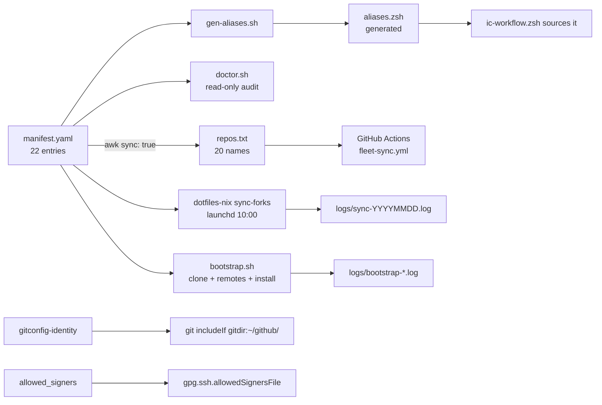

# fleet-ops: the fork-fleet control plane

Evidence cites use `.fleet/<path>:<line>` because this repo is checked out at `~/github/.fleet`, not `~/github/fleet-ops`.
Cites into the sibling repo use `dotfiles-nix/<path>:<line>`.
Everything below was read from disk or from read-only commands run on 2026-09-23.

## 1. TL;DR

fleet-ops is the user's own repo (no upstream) that declares the 22 GitHub forks under `~/github` in one YAML manifest and ships the scripts that bootstrap, audit, and alias them.
It is the single source of truth that the daily fast-forward-only sync engine in [dotfiles-nix](../components/dotfiles-nix.md) reads, plus a server-side GitHub Actions layer that syncs the same forks while the laptop is off.
Its design goal is "forks stay pristine mirrors": sync is ff-only, diverged forks are reported and never merged, and the two repos that carry their own commits are marked `sync: false`.

## 2. Problem it solves, and what breaks without it

The harness is built from roughly twenty forked repos (the axi CLIs, no-mistakes, treehouse, gnhf, firstmate, benchmarks, apps), each with its own toolchain and install step.
Without a declared inventory, every script that touches the fleet keeps its own hardcoded repo list, and those lists drift.
That drift happened: `dotfiles-nix/files/bin/sync-forks` originally had its own weekly list (`dotfiles-nix` commits `f3075dd`, `5eec46b`, `a535817`, `eae11d6` each "Add X to the weekly sync-forks rotation"), and the manifest records the decision to absorb it: "one list to rule them all" (`.fleet/manifest.yaml:296`).

What breaks without it:

- A new machine cannot be brought to the same state; there is no idempotent clone-plus-install recipe (`.fleet/bootstrap.sh:1-11`).
- Stale binaries silently shadow fresh ones on `PATH`; the doctor was written after finding `~/.local/bin/no-mistakes v1.45` shadowing `go/bin v1.49` (`.fleet/doctor.sh:84-85`).
- Wrong commit identities leak into forks through local `user.email` overrides; the doctor checks every repo for them (`.fleet/doctor.sh:67-75`).
- A fork that carries local commits would be clobbered or permanently diverged by a naive sync; the manifest's `sync` flag and notes are where that policy is recorded per repo (`.fleet/manifest.yaml:38-39`, `.fleet/manifest.yaml:293-294`).

## 3. Architecture



### Modules and entry points

| File | Role | Entry point |
|---|---|---|
| `manifest.yaml` | Declarative inventory, one `- name:` item per repo, flat two-space keys | Read by 5 scripts |
| `bootstrap.sh` | Converge the machine: clone, set `upstream`, install missing bins, npm link, regenerate aliases | Run by hand |
| `doctor.sh` | Read-only fleet audit, exit non-zero on any FAIL | `fleet-doctor` alias |
| `gen-aliases.sh` | Regenerate `aliases.zsh` from the manifest | Run by hand or by `bootstrap.sh` |
| `aliases.zsh` | Generated jump/run aliases plus `fleet-*` commands | Sourced by `dotfiles-nix/files/zsh/ic-workflow.zsh:556-558` |
| `repos.txt` | Server-side mirror of the `sync: true` names | Read by the workflow |
| `.github/workflows/fleet-sync.yml` | Server-side daily `gh repo sync` loop | GitHub schedule |
| `gitconfig-identity` | Identity-only git config fragment | Included by `dotfiles-nix/nix/home/common.nix:86-91` |
| `allowed_signers` | SSH signing public key list for local signature verification | Referenced by `dotfiles-nix/nix/home/common.nix:98` |
| `README.md` | Runbook: per-repo purpose, sync layers, add/disable/undo | Docs |

### Data model: the manifest schema

The header documents the conventions (`.fleet/manifest.yaml:5-9`).
Every entry uses the same keys; the table says which scripts actually parse each key, checked by reading every awk block.

| Key | Meaning | Parsed by |
|---|---|---|
| `name` | Repo directory under `~/github` and the fork name under `shreejitverma` | all five consumers |
| `owner` | Fork owner | documentation only; `sync-forks` hardcodes the owner in `gh repo sync "shreejitverma/$r"` (`dotfiles-nix/files/bin/sync-forks:201`) |
| `is_fork` | Always `true` today | documentation only |
| `upstream` | `owner/repo` of the parent | `bootstrap.sh:36`, `doctor.sh:39` |
| `default_branch` | Branch sync operates on | `sync-forks:71`, `doctor.sh:38`, `ic-doctor:117-121` |
| `path` | Clone path | `gen-aliases.sh:21` (jump alias target) |
| `kind` | `cli`, `config`, `library`, `app`, `benchmark`, `plugin` | `doctor.sh:40` (only `cli` gets smoke-tested) |
| `toolchain` | Runtime pins such as `node@>=22`, `pnpm@11.5.2` | documentation only |
| `install` | Verbatim shell command run from the repo root, or `none` | `sync-forks:73-77`, `bootstrap.sh:37` |
| `install_mechanism` | How the binary reaches `PATH` and why | documentation only |
| `provides_bin` | Executables expected on `PATH` | `bootstrap.sh:38-40`, `doctor.sh:41-43`, `gen-aliases.sh:22-25` (first one is the run target) |
| `aliases` | `{jump: cdX, run: Y}` | `gen-aliases.sh:26-29` |
| `sync` | Include in daily ff-only sync | `sync-forks:72`, `doctor.sh:121` |
| `notes` | Human rationale, including why a repo is `sync: false` | documentation only |

The parsers are line-oriented awk over this exact shape on purpose: no `yq` dependency under launchd's minimal `PATH` (`dotfiles-nix/files/bin/sync-forks:60-63`).
The format contract has one sharp edge recorded in the manifest itself: `bootstrap.sh` splits its awk output on `|`, and `install` is the third of four fields there, so an install string must never contain `|` (`.fleet/manifest.yaml:337`, fixed in `b0b990a` by the no-mistakes review step).

### Every manifest entry

| Repo | Upstream | Branch | Kind | Install | Bins | Sync | Cite |
|---|---|---|---|---|---|---|---|
| lavish-axi | kunchenguid/lavish-axi | main | cli | pnpm install --frozen-lockfile, build | lavish-axi | true | `.fleet/manifest.yaml:11-24` |
| firstmate | kunchenguid/firstmate | main | config | none | none | false | `.fleet/manifest.yaml:26-39` |
| no-mistakes | kunchenguid/no-mistakes | main | cli | make build, install to `$HOME/go/bin` | no-mistakes | true | `.fleet/manifest.yaml:41-54` |
| axi | kunchenguid/axi | main | library | pnpm install | none | true | `.fleet/manifest.yaml:56-69` |
| chrome-devtools-axi | kunchenguid/chrome-devtools-axi | main | cli | pnpm frozen install, build | chrome-devtools-axi | true | `.fleet/manifest.yaml:71-84` |
| gh-axi | kunchenguid/gh-axi | main | cli | pnpm frozen install, build | gh-axi | true | `.fleet/manifest.yaml:86-99` |
| autopreso | kunchenguid/autopreso | main | cli | npm install | autopreso | true | `.fleet/manifest.yaml:101-114` |
| baby-menu | kunchenguid/baby-menu | main | app | pnpm install | none | true | `.fleet/manifest.yaml:116-129` |
| tasks-axi | kunchenguid/tasks-axi | main | cli | pnpm frozen install, build | tasks-axi | true | `.fleet/manifest.yaml:131-144` |
| quota-axi | kunchenguid/quota-axi | main | cli | pnpm frozen install, build | quota-axi | true | `.fleet/manifest.yaml:146-159` |
| treehouse | kunchenguid/treehouse | main | cli | make build, install to `$HOME/go/bin` | treehouse | true | `.fleet/manifest.yaml:161-174` |
| short-pipe | kunchenguid/short-pipe | main | app | pnpm install | none | true | `.fleet/manifest.yaml:176-189` |
| trial-by-combat | kunchenguid/trial-by-combat | main | benchmark | npm install | none | true | `.fleet/manifest.yaml:191-204` |
| justroll | kunchenguid/justroll | main | cli | pnpm install | justroll | true | `.fleet/manifest.yaml:206-219` |
| presize | kunchenguid/presize | main | app | pnpm install (pins pnpm 8.6.2) | none | true | `.fleet/manifest.yaml:221-234` |
| org-bench | kunchenguid/org-bench | main | benchmark | npm install | none | true | `.fleet/manifest.yaml:236-249` |
| superpowers-bench | kunchenguid/superpowers-bench | master | benchmark | npm install | none | true | `.fleet/manifest.yaml:251-264` |
| programbench-bench | kunchenguid/programbench-bench | main | benchmark | none | none | true | `.fleet/manifest.yaml:266-279` |
| dotfiles-nix | kunchenguid/dotfiles-mac-nix | main | config | sudo darwin-rebuild switch | 8 scripts in files/bin | false | `.fleet/manifest.yaml:281-294` |
| gnhf | kunchenguid/gnhf | main | cli | pnpm frozen install, build | gnhf | true | `.fleet/manifest.yaml:298-311` |
| wheelhouse | ImZoomBoy/wheelhouse | main | config | none | none | true | `.fleet/manifest.yaml:313-326` |
| compact-adviser | kunchenguid/compact-adviser | main | plugin | claude plugin marketplace update, grok plugin reinstall | none | true | `.fleet/manifest.yaml:328-341` |

Notable per-entry decisions recorded in `install_mechanism` and `notes`:

- no-mistakes installs with `make build` plus an explicit `install`, not upstream's `make install`, because the daemon refuses to stop while a pipeline run is active, which failed the 2026-08-12 13:55 sync; launchd `KeepAlive` restarts the daemon onto the new binary instead (`.fleet/manifest.yaml:49-50`).
- treehouse installs explicitly into `$HOME/go/bin` because upstream's `make install` reads the make-level `$(GOPATH)`, unset under launchd (`.fleet/manifest.yaml:169-170`).
- presize must not be forced onto global pnpm 11; its `packageManager` pin is honored by corepack (`.fleet/manifest.yaml:230`).
- superpowers-bench is the only `master` branch (`.fleet/manifest.yaml:255`), which is why every parser defaults `branch` to `main` but reads the key.
- compact-adviser is a plugin, not a binary: Claude Code reads hooks straight from the clone, and Grok gets a reinstalled copy because Grok copies rather than symlinks local plugins (`.fleet/manifest.yaml:336-337`).
- compact-adviser's TypeSafe key lives in the macOS login Keychain and is injected only into `claude` and `grok` invocations; a global export would opt firstmate into typed dispatch (`.fleet/manifest.yaml:341`, `dotfiles-nix/files/zsh/ic-workflow.zsh:528-550`, `firstmate/bin/fm-dispatch-resolve.sh:8`).

### Why exactly two repos are `sync: false`

- dotfiles-nix carries 45 fork-specific commits and takes upstream through deliberate merge-commit PRs, so it can never fast-forward and would be misreported as diverged every day (`.fleet/manifest.yaml:293-294`, `.fleet/README.md:54`).
- firstmate has been `sync: false` since 2026-09-19 (`db9a398`) because the fork carries commits the owner does not upstream; parent updates arrive through a sync-upstream merge PR gated by no-mistakes, then `/updatefirstmate` in the running home (`.fleet/manifest.yaml:38-39`, `.fleet/README.md:55`).
- wheelhouse is deliberately still `sync: true` even though it is 117 commits ahead of its parent: the ff-only engine reports it `ahead-only` and leaves it alone, and keeping it in the list means both layers keep watching the parent (`.fleet/manifest.yaml:326`, live log line `[wheelhouse] ahead-only: 117 unpushed local commit(s), not publishing` in `.fleet/logs/sync-20260923.log`).

### State files

| Path | Written by | Tracked |
|---|---|---|
| `logs/sync-YYYYMMDD.log` | `dotfiles-nix/files/bin/sync-forks:41`, 30-day rotation at `:47` | no (`.fleet/.gitignore`) |
| `logs/launchd.out.log`, `logs/launchd.err.log` | launchd `StandardOutPath` and `StandardErrorPath` (`dotfiles-nix/nix/home/darwin.nix:86-87`) | no |
| `logs/bootstrap-YYYYMMDD-HHMMSS.log` | `.fleet/bootstrap.sh:18` | no |
| `aliases.zsh` | `.fleet/gen-aliases.sh:91` | yes (generated, never hand-edited) |
| `repos.txt` | awk one-liner in `.fleet/README.md:67` | yes |
| `*.bak.*` | backups | no (`.fleet/.gitignore`) |

On 2026-09-23 the logs directory held 35 files: 32 daily sync logs, one bootstrap log, and the two launchd streams; `launchd.err.log` was empty.

## 4. Interfaces

None of these scripts take flags; they are designed to be run bare and to be idempotent.
All output is plain text in an `ok` / `warn` / `FAIL` line format, not TOON or JSON.

| Command | Input | Output | Exit code |
|---|---|---|---|
| `bootstrap.sh` | manifest, `gh` auth | timestamped log lines, tee'd to `logs/bootstrap-*.log` | 0 only when `failures` is empty (`.fleet/bootstrap.sh:110`); 1 early if manifest, git, gh, or gh auth is missing (`:23-26`) |
| `doctor.sh` (alias `fleet-doctor`) | manifest, PATH, launchd, latest sync log | seven sections, `DOCTOR: all checks passed` or `DOCTOR: FAILURES above` | `exit "$fail"` (`.fleet/doctor.sh:215`) |
| `gen-aliases.sh` | manifest | rewrites `aliases.zsh`, prints `wrote <path> (N alias lines)` | non-zero on missing manifest (`:11`), `set -euo pipefail` otherwise |
| `fleet-sync` | alias for `sync-forks` | see [dotfiles-nix](../components/dotfiles-nix.md) | `sync-forks` exits 0 after any completed loop |
| `fleet-sync-dry` | alias for `sync-forks --dry-run` | per-repo `behind=N ahead=M` | 0 |
| `fleet-status` | manifest names | one line per repo: name, branch, `clean` or `dirty(N)` or `MISSING` | shell function (`.fleet/aliases.zsh:50-60`) |
| `fleet-cd` | fzf pick, or `select` menu fallback | `cd` into the repo | 1 on empty pick (`.fleet/aliases.zsh:63-72`) |
| `cd<x>` jump aliases | none | `cd` | 22 aliases, one per entry (`.fleet/aliases.zsh:11-42`) |
| run aliases `lav nm cda gha ap ta qa th jr gn` | guarded by `command -v` | alias to the binary | defined only when the binary exists |
| `fleet-sync.yml` | `repos.txt`, `FLEET_SYNC_TOKEN` secret | `ok` / `diverged` / `FAILED` lines per repo | `exit $fail` (`.fleet/.github/workflows/fleet-sync.yml:40`) |

`doctor.sh` sections, all read-only (`.fleet/doctor.sh:48-211`):

1. Repos, remotes, identity: each clone exists, sits on its default branch (warn otherwise), `origin` matches `shreejitverma/<name>`, `upstream` matches the manifest, resolved author and committer identity equal the fleet identity (value <redacted>), and no local `user.email` or `user.name` override exists (`:48-76`).
2. Binaries: every `provides_bin` resolves; more than one copy on `PATH` is a warning; an npm global link under `/opt/homebrew/lib/node_modules/<name>` must point back at the clone (`:78-100`).
3. Alias collisions: any generated alias that shadows a real executable is a FAIL, except `nm`, which deliberately shadows `/usr/bin/nm` (`:102-117`).
4. Server-side drift: `repos.txt` must equal the manifest's `sync: true` list (`:119-130`).
5. Sync agent: launchd label `org.nix-community.home.sync-forks` is loaded, and the newest sync log's `===== done` line has an empty `failed:[ ]` (`:132-151`).
6. Grok: `grok --version` must look like xAI Grok Build (`[stable]`, `[beta]`, `[nightly]`), must live at `~/.local/bin/grok`, must have exactly one copy, and `~/.grok/AGENTS.md` must link to `~/github/agents/GROK.md` rather than Claude's manual (`:153-186`).
7. Smoke: every `kind: cli` binary must answer `--version` or `--help` with exit 0 within 10 s, with `</dev/null` so a CLI cannot slurp the loop's manifest pipe (`:188-211`); non-CLI scripts are never smoke-tested because running them "EXECUTES them" (`:196-198`).

Real run on 2026-09-23: 130 `ok` lines, one `warn` (the deliberate `nm` shadow), and `DOCTOR: all checks passed`.

## 5. Configuration

| File and key | Default | Actual setting | Why |
|---|---|---|---|
| `manifest.yaml` `sync` | parsers default to `false` when absent (`dotfiles-nix/files/bin/sync-forks:68`) | 20 true, 2 false | ff-only sync cannot apply to repos carrying their own commits |
| `manifest.yaml` `default_branch` | `main` in every parser | `master` only for superpowers-bench | matches the parent |
| `manifest.yaml` `install` | `none` | per entry, see table | re-run by `sync-forks` after a fast-forward and by `bootstrap.sh` when a bin is missing |
| `repos.txt` | none | 20 names | mirrors `sync: true`; verified identical to the awk derivation on 2026-09-23 |
| `fleet-sync.yml` `cron` | none | `0 14 * * *` (`:13`) | daily; on EDT this equals 10:00 local, the same wall-clock time as the launchd run |
| `fleet-sync.yml` `GH_TOKEN` | none | `secrets.FLEET_SYNC_TOKEN`, a fine-grained PAT with Contents read-write (`:7-9`, `:22`); value <redacted> | `github.token` only reaches the host repo |
| `gitconfig-identity` | none | `[user] name`, `email`, `[github] user`; values <redacted> | identity-only fragment included for `gitdir:~/github/` |
| `allowed_signers` | none | one `ssh-ed25519` principal line; value <redacted> | lets `git log --show-signature` verify the SSH signing key locally |
| `doctor.sh` `IDENT`, `AGENT_LABEL` | hardcoded | identity <redacted>, `org.nix-community.home.sync-forks` (`:21-22`) | the label is Home Manager's launchd naming for `launchd.agents.sync-forks` |
| `.gitignore` | none | `logs/`, `*.bak.*`, `fleet-sync.yml` | logs and backups stay local |

The workflow file carries a comment calling itself the "Deployed copy" of the server-side workflow (`.fleet/.github/workflows/fleet-sync.yml:1-2`), and the root-level `fleet-sync.yml` name is gitignored; only the `.github/workflows/` copy is tracked.

## 6. Connections

| Component | Direction | Contract |
|---|---|---|
| [dotfiles-nix](../components/dotfiles-nix.md) `sync-forks` | reads the manifest | `name`, `default_branch`, `sync`, `install` keys; writes `logs/` (`dotfiles-nix/files/bin/sync-forks:37-41`) |
| dotfiles-nix `ic-doctor` | reads the manifest | `default_branch` per fork (`dotfiles-nix/files/bin/ic-doctor:114-124`), newest `logs/sync-*.log` (`:213-222`) |
| dotfiles-nix `ic-workflow.zsh` | sources `aliases.zsh` | `dotfiles-nix/files/zsh/ic-workflow.zsh:556-558`; the generated file no-ops in non-interactive shells (`.fleet/aliases.zsh:5`) |
| dotfiles-nix `common.nix` | includes identity, points at signers | `dotfiles-nix/nix/home/common.nix:86-91`, `:98` |
| dotfiles-nix `darwin.nix` | creates `logs/` at activation | `dotfiles-nix/nix/home/darwin.nix:75-77`, so launchd can open its log paths before the fleet is bootstrapped |
| [no-mistakes](../components/no-mistakes.md) | gates every change to this repo | the clone has a `no-mistakes` remote at `~/.no-mistakes/repos/<hash>.git`; commits prefixed `no-mistakes(review)`, `no-mistakes(document)`, `no-mistakes(test)` were written by the pipeline's own steps (for example `b0b990a`, `ba061fb`) |
| no-mistakes daemon | installed by the manifest | label `com.kunchenguid.no-mistakes.daemon` (`.fleet/manifest.yaml:54`); the install deliberately does not restart it |
| [firstmate](../components/firstmate.md) | `sync: false` entry, `cdfm` | parent updates via sync-upstream PR plus `/updatefirstmate` (`.fleet/manifest.yaml:39`); `stow` skill is linked from this clone by `ic-link` |
| [compact-adviser](../components/compact-adviser.md) | plugin install command | Claude directory marketplace declared in `~/github/agents/claude/settings.json`; Grok plugin reinstall (`.fleet/manifest.yaml:336-337`) |
| [agents](../components/agents.md) | doctor checks Grok manual | `~/.grok/AGENTS.md` must link `~/github/agents/GROK.md` (`.fleet/doctor.sh:175-180`) |
| [wheelhouse](../components/wheelhouse.md) | `sync: true`, reported ahead-only | parent `ImZoomBoy/wheelhouse` recorded 2026-09-21 (`bbf386a`) |
| gh CLI | called | `gh auth status`, `gh repo clone` (`.fleet/bootstrap.sh:26`, `:54`); `gh repo sync` on the server (`fleet-sync.yml:29`) |
| [treehouse](../components/treehouse.md), [gnhf](../components/gnhf.md), [tasks-axi](../components/tasks-axi.md), [quota-axi](../components/quota-axi.md), [gh-axi](../components/gh-axi.md), [chrome-devtools-axi](../components/chrome-devtools-axi.md), [lavish-axi](../components/lavish-axi.md), [axi](../components/axi.md) | declared entries | install command, binary, and aliases for each |

firstmate uses the word "fleet" for its own crewmate state (for example `firstmate/bin/fm-herdr-lab.sh:58` writes `<id>.fleet-state.json`); a grep of firstmate's `AGENTS.md` and `bin/` found no reference to `~/github/.fleet`, so the two "fleet" concepts are unrelated.

## 7. Lifecycle walkthrough: adding compact-adviser to the fleet (2026-09-21 to 2026-09-23)

This traces one real change end to end through the files and logs.

1. The manifest gained the entry in `2fe710e` "feat(manifest): add compact-adviser to the fleet" on 2026-09-21, with `kind: plugin`, `sync: true`, and an install command (`.fleet/manifest.yaml:328-341`).
2. The no-mistakes review step rewrote the install string in `b0b990a` "Remove pipe from compact-adviser install command for bootstrap parsing", because `bootstrap.sh` reads `name|upstream|install|bins` with `IFS='|'` (`.fleet/bootstrap.sh:32`, `:48`), and a `|` inside `install` would shift `bins`.
3. The document step added the `plugin` kind to the conventions header in `3b3c025` (`.fleet/manifest.yaml:8`), and PR #7 merged (`6eb8368`).
4. `repos.txt` was regenerated with the README awk one-liner (`.fleet/README.md:67`); git records `repos.txt` last changing in `2fe710e` at 2026-09-21 22:07 EDT, and `compact-adviser` is now its line 20.
5. `gen-aliases.sh` emitted `alias cdca='cd $HOME/github/compact-adviser'` (`.fleet/aliases.zsh:42`); no run alias exists because `provides_bin` is empty (`.fleet/gen-aliases.sh:54`).
6. The next local sync at 2026-09-21 23:22 logged `manifest: 20 sync-eligible entries`, up from 19 in the 10:00 run that morning, and listed `compact-adviser` under `synced`.
7. On 2026-09-23 at 10:00 the launchd run fast-forwarded compact-adviser by one commit and re-ran its install: `[compact-adviser] reinstalled (claude plugin marketplace update compact-adviser && { grok plugin uninstall ... })` (`.fleet/logs/sync-20260923.log`).
8. The server-side layer ran the same day at 18:00 UTC, printed `ok` for the first 19 repos, and then the job ended with `Process completed with exit code 1` without printing any line for compact-adviser (read-only `gh run view 35899508093 --log`).
9. `fleet-doctor` on 2026-09-23 still passed, because it inspects the local sync log, not the server-side run.

Step 8 is a real defect, analyzed in the next section.

## 8. Failure modes and safeguards

| Failure mode | Safeguard | Evidence |
|---|---|---|
| Manifest format drift makes the awk parsers see zero entries | `sync-forks` logs the parsed count and treats zero from an existing manifest as a failure with a notification | `dotfiles-nix/files/bin/sync-forks:125-139` |
| Pipe character in `install` corrupts bootstrap field splitting | Convention documented in the entry; fixed in review | `.fleet/manifest.yaml:337`, `b0b990a` |
| A tool reads the loop's manifest pipe from stdin | `</dev/null` on every install, clone, npm link, and smoke call | `.fleet/bootstrap.sh:54`, `:77`, `:84`; `.fleet/doctor.sh:202-205` |
| Hanging CLI stalls the doctor | 10 s `timeout`, with a warned fallback when coreutils `timeout` is missing | `.fleet/doctor.sh:189-194` |
| Doctor executes a destructive utility by smoke-testing it | Only `kind: cli` is smoke-tested | `.fleet/doctor.sh:196-199` |
| Stale binary shadows a fresh one | Duplicate-on-PATH warning, npm-link target check | `.fleet/doctor.sh:84-98` |
| Wrong git identity in a fork | Identity-only include, sync strips local overrides, doctor verifies author and committer | `dotfiles-nix/files/bin/sync-forks:97-119`, `.fleet/doctor.sh:67-75` |
| `repos.txt` drifts from the manifest | Doctor compares them | `.fleet/doctor.sh:119-130` |
| Per-fork workflow files diverge forks | Rejected design; one central repo loops all forks instead | `.fleet/.github/workflows/fleet-sync.yml:3-5` |
| Bootstrap on a dirty or wrong-branch repo | Bootstrap never switches branches, never deletes, and only installs when a bin is missing | `.fleet/bootstrap.sh:11`, `:71-87` |

Open issues found while writing this note:

- Server-side loop aborts on the first failure.
  GitHub runs `run:` steps with `bash -e` (the 2026-09-21 log shows `shell: /usr/bin/bash -e {0}`), so `out=$(gh repo sync ...)` returning non-zero exits the step before `status=$?` runs (`.fleet/.github/workflows/fleet-sync.yml:29-30`).
  The `diverged` and `FAILED` branches are therefore unreachable, the error text in `$out` is never printed, and every repo after the failing one is skipped.
  Observed: the 2026-09-22 run stopped after `quota-axi` (the next name is `treehouse`), and the 2026-09-23 run stopped after `wheelhouse` (the next name is `compact-adviser`); runs from 2026-09-16 to 2026-09-21 succeeded.
  The root cause of each individual `gh repo sync` failure is (unverified); the fix for the loop is `out=$(...) && status=0 || status=$?` or `set +e` inside the step.
- Scheduled time drift.
  The cron says 14:00 UTC, but observed scheduled starts on 2026-09-16 to 2026-09-23 ranged from 16:50 to 18:56 UTC, which is normal GitHub schedule delay rather than a config error.
- Both layers can race.
  During EDT the cron and the launchd job share 10:00 local; if the server moves `origin` forward after the local fetch, the local `git push origin <branch>` of an older fast-forward would be rejected and counted as a failure (inferred from `dotfiles-nix/files/bin/sync-forks:244-248`; not observed in logs).
- Doctor's sync check only reads the local log.
  A red server-side run does not fail `fleet-doctor`; it is visible only in Actions (`gh run list -R shreejitverma/fleet-ops`).
- The README says the repo is private (`.fleet/README.md:52`, `:70`), but `gh repo view shreejitverma/fleet-ops --json visibility` returned `PUBLIC` on 2026-09-23.
  The tracked `gitconfig-identity` and `allowed_signers` therefore publish the commit identity and signing public key; neither is a secret, but the README statement is stale.
- The local sync can be slow under network trouble: the 2026-09-22 run took from 10:03 to 12:45 with three fetch retries logged (`.fleet/logs/sync-20260922.log`).

## 9. Testing and quality

- There is no test suite in this repo.
  Behavior is covered from the consumer side: `dotfiles-nix/tests/sync_forks_test.sh` runs the real `sync-forks` against sandboxed manifests and local bare remotes, and asserts that `ic-workflow.zsh` sources a generated `aliases.zsh` and that `fleet-status` is available (see [dotfiles-nix](../components/dotfiles-nix.md)).
- There is no CI lint workflow; the only workflow is the sync job.
- `gen-aliases.sh` emits `# shellcheck shell=bash` so the generated `.zsh` file stays checkable (`.fleet/gen-aliases.sh:34-39`, `f51ea77`).
- Every change ships through no-mistakes, which is where review, documentation, and test commits in the history came from.

Commands run for this note, all read-only:

```bash
~/github/.fleet/doctor.sh                                   # 130 ok, 1 warn, "DOCTOR: all checks passed"
shellcheck -x --severity=warning bootstrap.sh doctor.sh gen-aliases.sh aliases.zsh   # all clean (ShellCheck 0.11.0)
bash <scratch copy>/gen-aliases.sh && diff <scratch>/aliases.zsh ~/github/.fleet/aliases.zsh   # no diff
awk '/^- name:/ {name=$3} /^  sync: true/ {print name}' manifest.yaml | diff - repos.txt           # no diff
gh run list -R shreejitverma/fleet-ops --limit 8            # 6 success, then 2 failure (2026-09-22, 2026-09-23)
```

## 10. Fork delta

This is the user's own repository with no upstream: `git remote -v` shows only `origin` (`shreejitverma/fleet-ops`) and the local `no-mistakes` gate remote.
All 29 commits are authored under the user's identity, from `5daf0dc` (2026-08-12) to `6eb8368` (2026-09-21), across seven merged PRs.

| PR | Theme | Commits |
|---|---|---|
| #1 | Version the control plane: server-side sync doc, `repos.txt`, daily ff workflow, manifest plus scripts | `5daf0dc`, `0e6d8e6`, `a7cf994`, `506c91a`, review fixes `9393bfc`, `88bb182`, doc `157257f`, merge `a7e4047` |
| #2 | no-mistakes reinstall must not restart the daemon | `a12d58d`, `cc4748c`, merge `1feee47` |
| #3 | Grok Build health check in the doctor | `c137a1a`, `c3c4831`, `ba061fb`, `1ccd64c`, merge `bbf32f3` |
| #4 | Stop auto-syncing firstmate | `db9a398`, `fc6eb1e`, merge `b7d702b` |
| #5 | ShellCheck-clean generated aliases | `f51ea77`, `c85e235`, merge `3bf23d8` |
| #6 | Record ImZoomBoy/wheelhouse as parent | `bbf386a`, `fff0079`, merge `99c95bc` |
| #7 | Add compact-adviser | `2fe710e`, `b0b990a`, `3b3c025`, merge `6eb8368` |

Every tool the manifest describes was built upstream by its own authors (mostly kunchenguid); what this repo contributes is the inventory, the policy, and the operations around them.

## 11. Interview angle

**Q1. How do you keep twenty forks current without clobbering your own changes?**
Declare them once, sync fast-forward-only, and treat anything else as a signal rather than something to fix automatically.
`sync-forks` computes ahead and behind against `upstream/<branch>`, fast-forwards only when ahead is 0, reports ahead-only and diverged repos, and never merges or force-pushes; repos that intentionally carry commits are `sync: false` with the reason in `notes`.

**Q2. How would you make this pipeline reliable enough for a regulated release process?**
Single source of truth (manifest), idempotent convergence (`bootstrap.sh` installs only when a declared binary is missing), a separate read-only verifier (`doctor.sh`), per-run logs with retention, and alerting only on failure.
The gap I would close first is the server-side job: its `bash -e` early exit hides which repo failed and skips the rest, so I would make each iteration independent, print the captured error, and publish a summary.

**Q3. Why awk instead of a YAML library?**
The sync runs under launchd with a minimal `PATH`, so a zero-dependency parser over a format we control removes a failure mode; the cost is a brittle grammar, which is mitigated by logging the parsed entry count and failing on zero.

**Defensible trade-off: two sync layers.**
The server-side layer keeps GitHub forks current while the laptop is off, and the local layer rebuilds and reinstalls tools.
The downside is two writers to the same `origin` branch at the same wall-clock time during daylight saving, plus two places to look for failures; it is acceptable because both are fast-forward-only and idempotent, so the worst case is a rejected push that the next run heals.
