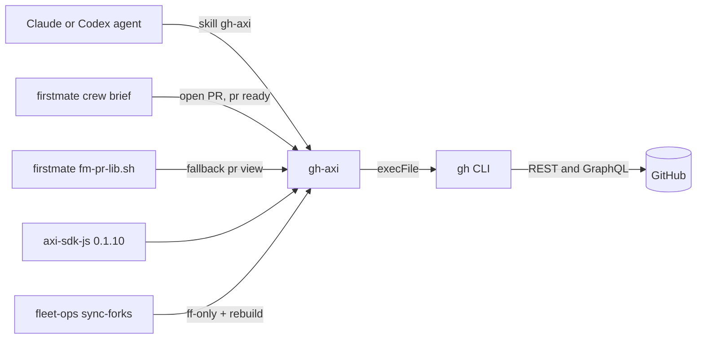

# gh-axi - GitHub for agents

Sibling notes in this cluster: [axi](axi.md), [chrome-devtools-axi](chrome-devtools-axi.md), [lavish-axi](lavish-axi.md).
Other harness components (firstmate, no-mistakes, tasks-axi, quota-axi, agents, dotfiles-nix, fleet-ops) are named in backticks and documented in their own notes.

## 1. TL;DR

`gh-axi` is an upstream Node CLI (kunchenguid/gh-axi, v0.1.35) that wraps the official `gh` CLI and re-shapes every answer into compact TOON with counts, truncation, structured errors, and next-step hints.
It is the harness's single door to GitHub: the routing manual tells every agent to use it for issues, PRs, CI runs, and releases, and `firstmate` briefs every crewmate to open and ready PRs with it.
My fork has no code changes; I install it as an npm link from my checkout, symlink its skill for Claude and Codex, alias it as `gha`, and keep it fast-forwarded daily.

## 2. Problem it solves, and what breaks without it

Raw `gh` is built for humans: `gh pr view` prints a pager-friendly block, `gh pr list` omits totals, errors are free text on stderr, some commands prompt interactively, and `--json` forces the agent to know field names up front.
An agent using raw `gh` pays for this in extra turns: a second call to count, a retry after an unparsed error, or a hung shell on a prompt.
Upstream's GitHub benchmark measured `gh-axi` at 100% task success and $0.050 per task versus 86% and $0.054 for plain `gh` and 87% and $0.148 for the GitHub MCP server (`axi/README.md:37-45`, upstream numbers, not re-run by me).

What breaks without it in this harness specifically:

- `firstmate` crew briefs instruct "open a PR with `gh-axi`" and "mark it ready with `gh-axi pr ready`" (`firstmate/bin/fm-dod-lib.sh:256-257`, `:308`).
- `firstmate`'s PR-state reader falls back to `gh-axi pr view` when the plain `gh` JSON read fails (`firstmate/bin/fm-pr-lib.sh:949-955`), and its merge path uses it as the post-merge degradation read (`firstmate/bin/fm-pr-merge.sh:725`).

## 3. Architecture

It is a thin adapter: argv -> validated `gh` argv -> `execFile("gh", ...)` -> JSON -> schema projection -> TOON.

| Module | Responsibility |
| --- | --- |
| `bin/gh-axi.ts` | Fast-path `--version`, then lazy-import the CLI (`gh-axi/bin/gh-axi.ts:1-8`) |
| `src/cli.ts` | `TOP_HELP`, command table, `runAxiCli` wiring, repo and host context stripping, error formatter (`gh-axi/src/cli.ts:31-311`) |
| `src/context.ts` | Resolve target repo: `--repo` flag > `GH_REPO` env > `git remote get-url origin` (`gh-axi/src/context.ts:14-37`) |
| `src/host.ts` | GitHub Enterprise host: `--hostname` > `GH_HOST` > `github.com` |
| `src/gh.ts` | Child-process wrapper: `ghJson`, `ghExec`, `ghRaw`, `ghExecWithStdin`, 10 MB buffer, `GH_BIN` override (`gh-axi/src/gh.ts:26-191`) |
| `src/errors.ts` | Ordered regex table mapping `gh` stderr to codes (`gh-axi/src/errors.ts:311-332`) |
| `src/toon.ts` | `FieldDef` extractors (`field`, `pluck`, `lower`, `boolYesNo`, `mapEnum`, `custom`...) and `renderList`/`renderDetail`/`renderHelp` (`gh-axi/src/toon.ts:6-45`, `:110-139`) |
| `src/totals.ts`, `src/format.ts` | Pre-computed totals via a search or GraphQL count only when a page is full (`gh-axi/src/format.ts:5-8`) |
| `src/suggestions.ts` | Contextual `help[]` lines per domain and action |
| `src/args.ts` | Flag parsing and `rejectUnknownFlags` (`gh-axi/src/args.ts:190`) |
| `src/commands/*.ts` | 15 command families; `issue.ts` (1724 lines) and `pr.ts` (1313 lines) are the largest |
| `src/skill.ts`, `scripts/build-skill.ts` | Generate the minimal skill stub with a `--check` mode |

Data model: there is none of its own.
Each command declares a projection schema over `gh --json` output; for example `pr view` fetches `number,title,state,author,isDraft,mergedAt,statusCheckRollup,body,comments,reviews` (`gh-axi/src/commands/pr.ts:261-262`) and renders `checks` as a derived "N passed, M failed, T total" string (`pr.ts:232-249`) and `body` truncated to 500 characters (`pr.ts:250`).

State files: none.
Auth is whatever `gh auth` holds; `gh-axi` never touches tokens directly.
The only disk writes are opt-in: `gh-axi setup hooks` calls the SDK's `installSessionStartHooks()` (`gh-axi/src/commands/setup.ts:11-26`).

## 4. Interfaces

Top-level help, captured live on 2026-09-23 (`gh-axi --help`, v0.1.35):

```text
usage: gh-axi [command] [args] [flags]
commands[16]:
  (none)=dashboard, issue, pr, stack, run, workflow, release, repo, label, gist, project, secret, variable, search, api, setup
flags[4]:
  -R/--repo <OWNER/NAME> (after command), --hostname <host> (after command) or GH_HOST env, ...
requires:
  gh >= 2.99.0 for --attach on issue/pr create, edit, and comment (set GH_BIN to override the gh binary)
```

Per-command surface, summarized from each `<command> --help`:

| Command | Subcommands | Notable flags and behavior |
| --- | --- | --- |
| (none) | dashboard | Repo, 3 newest issues, 3 newest PRs, hints |
| `issue` | list, view, create, edit, close, reopen, comment, delete, lock, unlock, pin, unpin, transfer, subissue | `list --limit` default 30, `--fields`; `view --comments --full`; repeatable `--label`, `--assignee`, `--attach <path[#alt]>` |
| `pr` | list, view, create, edit, close, merge, review, checks, diff, checkout, ready, reopen, comment, update-branch, revert | `view --reviews` joins inline review comments to reviews over REST; `merge --match-head-commit <SHA>`; `diff --full` (default truncation 4000 chars, `pr.ts:962`) |
| `stack` | view, init, add, checkout, push, submit, sync, rebase, link, unstack, merge, up, down, top, bottom, trunk | Strict adapter over the `github/gh-stack` extension; cwd-bound, rejects `-R` |
| `run` | list, view, watch, rerun, cancel, delete, download | `list --limit` default 10; `view --log-failed` keeps the log tail |
| `workflow` | list, view, run, enable, disable | `run --ref --field k=v` dispatches |
| `release` | list, view, create, edit, delete, download, upload | `view --full` |
| `repo` | view, create, edit, clone, fork, list | `create --source . --push` |
| `label` | list, create, edit, delete | `list --limit` default 500 |
| `gist` | list, view, edit, rename, create, delete, clone | User-scoped, never forwards `--repo` |
| `project` | list, view, item-list, field-list, item-add, item-create, item-edit, item-archive, item-delete, create, edit, close, copy | Owner-scoped; needs `project` OAuth scope |
| `secret` | list, set, delete | Value from piped stdin only; values never printed |
| `variable` | list, set, delete | `--body` or stdin |
| `search` | issues, prs, repos, commits, code | `--limit` default 1000 |
| `api` | GET/POST/PUT/PATCH/DELETE/HEAD | `--field`, `--header`, `--input`, `--paginate`, `--jq`, `--full` |
| `setup` | hooks | Installs SessionStart hooks for Claude Code, Codex, OpenCode |
| `update` | (SDK built-in) | `--check` reports current vs latest |

Output format: TOON on stdout for data, errors, and hints.
Exit codes: 0 success; 2 for `VALIDATION_ERROR` (unknown command, unknown flag, flag before command); 1 for other mapped errors; `stack` preserves the extension's own exit codes 2-10 through `StackError` (`gh-axi/src/cli.ts:130-131`, `gh-axi/AGENTS.md:113`).

Real error output captured on 2026-09-23:

```text
$ gh-axi issue list --stat closed -R kunchenguid/gh-axi
error: "unknown flag for gh-axi issue list: --stat"
code: VALIDATION_ERROR
help[2]: "gh-axi issue list [flags]",gh-axi issue list --help
# exit 2
```

Mapped error codes in `src/errors.ts`: `AUTH_REQUIRED`, `FORBIDDEN`, `NOT_FOUND`, `RATE_LIMITED`, `REPO_NOT_FOUND`, `VALIDATION_ERROR`, plus `GH_NOT_INSTALLED` (`gh-axi/src/errors.ts:334-339`) and the `UNKNOWN` fallback (`:328-331`).

## 5. Configuration

| Setting | Default | My value | Why |
| --- | --- | --- | --- |
| `GH_BIN` | `gh` on PATH (`gh-axi/src/gh.ts:29-32`) | unset | Homebrew `gh` is fine |
| `GH_HOST` / `--hostname` | `github.com` | unset | No GHE host at home; at a bank this is the knob for an internal GitHub Enterprise |
| `GH_REPO` / `-R` | git `origin` remote | unset | See the fork gotcha below |
| SessionStart hook | not installed | not installed | `~/.claude/settings.json` has no AXI hooks (checked 2026-09-23); I prefer on-demand skills over per-session token cost |
| Skill | none | `~/.agents/skills/gh-axi` -> `~/github/gh-axi/skills/gh-axi` | `dotfiles-nix/files/bin/ic-link:60`, `:81-83` |
| Binary | none | `/opt/homebrew/bin/gh-axi` -> `/opt/homebrew/lib/node_modules/gh-axi` -> `~/github/gh-axi` (npm link) | Build is live immediately after `pnpm run build` (`~/github/.fleet/manifest.yaml:95`) |
| Aliases | none | `gha`, `cdgha` | `~/github/.fleet/aliases.zsh:19-20`, sourced by `dotfiles-nix/files/zsh/ic-workflow.zsh:556-557` |

The fork gotcha: in any of my fork checkouts, `origin` is my fork, so a bare `gh-axi pr list` targets `shreejitverma/<repo>`, not upstream (`gh-axi/src/context.ts:28-33`).
Anything that means upstream must pass `-R owner/name`, which is why `firstmate` always passes `--repo "$owner/$repo"` explicitly (`firstmate/bin/fm-pr-lib.sh:908`).

## 6. Connections



- Calls: `gh` via `execFile` (`gh-axi/src/gh.ts:64-73`), `git remote get-url origin` for context (`context.ts:29-32`), the npm registry for `update`.
- Called by: agents through the skill; `firstmate` (`fm-dod-lib.sh:256-257`, `fm-brief.sh:425`, `fm-brief.sh:514`, `fm-pr-lib.sh:908`, `fm-pr-merge.sh:725`); `firstmate` bootstrap lists it in `COMMON_TOOLS` and suggests `npm install -g gh-axi && gh-axi setup hooks` when missing (`firstmate/bin/fm-bootstrap.sh:881`, `:909`).
- Contract with `firstmate`: its fallback parser requires exactly one `state:` line and accepts lowercase values (`fm-pr-lib.sh:912-945`); `gh-axi` emits `lower("state")` (`gh-axi/src/commands/pr.ts:224`), so the two agree today, but the contract is implicit.
- Manuals: `agents/ROUTING.md:26` routes GitHub work to it; the `ship` skill repeats it (`dotfiles-nix/files/skills/ship/SKILL.md:47`).
- `dotfiles-nix`: `ic-doctor` checks the binary and skill (`dotfiles-nix/files/bin/ic-doctor:44-46`).
- `no-mistakes`: no runtime link; upstream PRs must pass the pinned `require-no-mistakes` action (`gh-axi/.github/workflows/no-mistakes-required.yml`), and upstream's AGENTS.md says human PRs go through `git push no-mistakes` (`gh-axi/AGENTS.md:120-125`).
- `axi-sdk-js`: `runAxiCli`, `AxiError`, `installSessionStartHooks`, `tryFastPath` (`gh-axi/src/cli.ts:2`, `gh-axi/src/commands/setup.ts:1`).

## 7. Lifecycle walkthrough: `gh-axi pr list -R kunchenguid/gh-axi --limit 3`

1. `bin/gh-axi.ts:5` - not a bare version flag, so import `src/cli.js` and call `main()`.
2. `src/cli.ts:136` - `runAxiCli` with `commands: COMMANDS`, `formatError: formatCliError`, and a `resolveContext` hook.
3. SDK (`axi-sdk-js/src/cli.ts:154-163`) picks the `pr` handler, which is `withRepoContext("pr", prCommand)` (`gh-axi/src/cli.ts:85`).
4. `resolveContext` calls `parseRepoContextArgs` (`gh-axi/src/cli.ts:215-311`): `-R kunchenguid/gh-axi` is consumed into `repoFlag`, and `resolveRepo` returns `{nwo, source: "flag"}` (`context.ts:18-21`, `:39-46`).
5. `withRepoContext` passes the stripped args `["list","--limit","3"]` to `prCommand` (`cli.ts:172-183`).
6. `prCommand` switches on `list`, runs `rejectUnknownFlags(rest, PR_FLAGS.list, "pr", "list")` before any network call (`pr.ts:1253-1255`).
7. `prList` builds `gh pr list --json number,title,state,author,isDraft,reviewDecision --limit 3` and calls `ghJson` (`pr.ts:204`, `:422`); `buildArgs` appends `--repo kunchenguid/gh-axi` because the source is a flag, not git (`gh.ts:17-24`).
8. The page is full (3 of limit 3), so it spends one extra query for the true total (`pr.ts:439`, `totals.ts:175`).
9. It renders `count: 3 of 6 total`, the `pull_requests[3]{...}` TOON table (`pr.ts:451`), and `help[]` suggestions that carry the `-R` flag forward (`pr.ts:453`).
10. The SDK writes the string plus newline; exit code stays 0.

Real output from that run is in [axi](axi.md) section 3.

## 8. Failure modes and safeguards

| Failure | Safeguard or status |
| --- | --- |
| `gh` missing | `ENOENT` -> `GH_NOT_INSTALLED` with install URL (`gh.ts:49-51`, `errors.ts:334-339`) |
| Silently dropped repeated flag (`--label a --label b`) | `getAllFlags`/`takeAllFlags` collect all; dangling values rejected (`gh-axi/AGENTS.md:75-81`); the bug recurred as upstream issues 55, 57, 75 |
| Secret leaks via argv or `ps` | `secret set` is stdin-only and pipes to the child with `ghExecWithStdin` (`gh.ts:178-191`, `AGENTS.md:42-46`) |
| Hang on interactive prompt | `resolveValue` throws when stdin is a TTY with no value (`AGENTS.md:46`); `stack` forces `--auto`, `--yes`, `--json` (`AGENTS.md:114`) |
| Merging a PR whose head moved after review | `pr merge --match-head-commit <SHA>` with guards so context stripping cannot swallow it (`cli.ts:292-308`) |
| Wrong error classification | `mapGhError` is first-match over an ordered pattern list, so order is the contract (`AGENTS.md:95-99`) |
| Home view masks a `gh` failure | Open issue in upstream behavior: `homeCommand` swallows both queries with `.catch(() => [])` (`gh-axi/src/commands/home.ts:47-62`); I reproduced it with `GH_BIN=/usr/bin/false gh-axi`, which printed `issues: 0 open` and `prs: 0 open` and exited 0, while `gh-axi issue list -R a/b` under the same override correctly exited 1 |
| Unknown-flag error lists no valid flags | Spec asks to inline valid flags (`axi/.agents/skills/axi/SKILL.md:133-137`); `gh-axi` instead suggests `--help` (observed above), which costs one extra turn |

The home-view behavior violates principle 5 (definitive empty states) in the auth-expired case; an agent would read "0 open PRs" as fact.

## 9. Testing and quality

- CI (`gh-axi/.github/workflows/ci.yml`): `pnpm install --frozen-lockfile`, `pnpm run build`, `pnpm test` on Node 24; plus `guard-generated-files.yml`, `no-mistakes-required.yml`, `release-please.yml`.
- The suite is roughly 16k lines across `test/` including integration tests with a stateful fake `gh` (`test/fixtures/stateful-gh.mjs`) and a help-as-contract test (`test/help-examples.test.ts`).
- The full suite's `globalSetup` runs `npm run build` into `dist/` (`gh-axi/test/global-setup.ts:4-13`); because my global `gh-axi` is an npm link to this checkout, the full suite would rebuild my live binary, so I did not run it.
- I ran the pure unit files with a scratch Vitest config that omits the build step, on 2026-09-23:

```text
$ vitest run --config <scratch> test/toon.test.ts test/args.test.ts test/errors.test.ts test/suggestions.test.ts
 Test Files  4 passed (4)
      Tests  135 passed (135)
```

- Lint: no `lint` script in `gh-axi/package.json`; an `eslint.config.mjs` exists at the root but CI does not call it (unverified whether it is run elsewhere).

## 10. Fork delta

- Remotes: `origin` `shreejitverma/gh-axi`, `upstream` `kunchenguid/gh-axi`.
- `git log upstream/main..HEAD` is empty; 0 behind; HEAD `4ce029f` (2026-09-21).
- No fork-specific commits; tracks upstream.
- Authors: Kun Chen / kunchenguid (54), github-actions[bot] (32), and outside contributors; none are mine.
- My additions live elsewhere: `f3075dd Add gh-axi to the weekly sync-forks rotation` in `dotfiles-nix` (2026-07-15), the `ic-link` skill link, the fleet manifest entry and aliases, and routing text in `agents/ROUTING.md:26`.

## 11. Interview angle

**Q1. Why wrap `gh` rather than call the GitHub API directly?**
`gh` already owns auth, GHE hosts, pagination, retries, and upload semantics, so the wrapper only owns presentation and validation.
The cost is a process spawn per call and coupling to `gh`'s stderr wording, which is why the error table is ordered and tested.
For a bank this matters: reusing the vetted, centrally configured client means no new token handling to get through security review.

**Q2. How do you stop an agent merging the wrong commit?**
Require the head SHA the agent reviewed: `gh-axi pr merge <n> --match-head-commit <SHA>`, validated before any call (`gh-axi/src/cli.ts:292-308`).
It is the same idea as optimistic concurrency on an order amend: act only if the version you saw is still current.

**Q3. What would you fix first in this tool?**
The home view that reports "0 open" when `gh` fails (`home.ts:47-62`).
I would surface a structured `error` block per failed query and a non-zero exit when every query fails, and add a test with `GH_BIN` pointed at a failing stub, since the fixture infrastructure already exists.

**Defensible trade-off: default to the git `origin` remote for repo context.**
It makes the common case zero-flag, but in a fork workflow it silently targets the fork.
I keep the default and make automation pass `--repo` explicitly, as `firstmate` does, because interactive agent use is mostly on the current repo and scripts should never rely on ambient context anyway.
