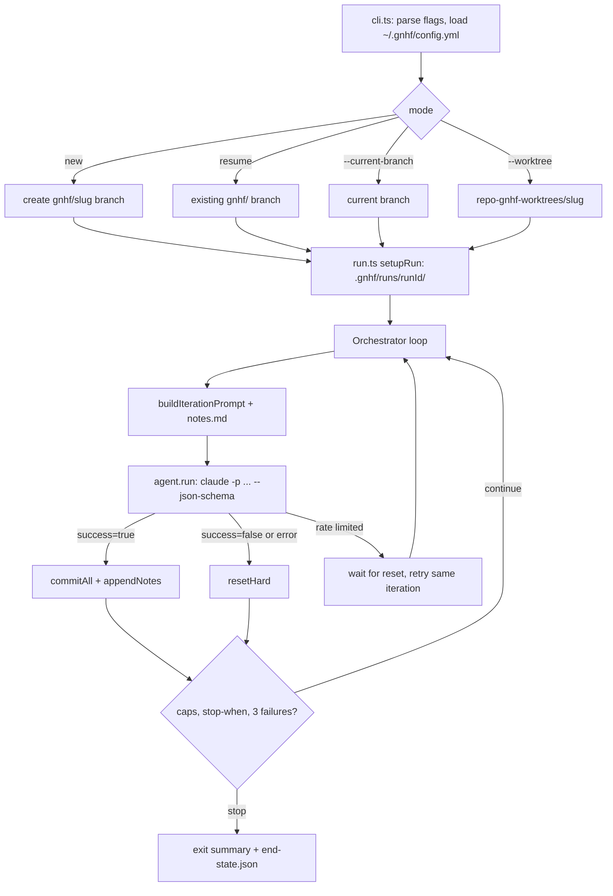

# gnhf - the unattended overnight agent loop

Evidence was measured on 2026-09-23 against the local clone at `~/github/gnhf` (branch `main`, HEAD `8cc8ee2`, package version 0.1.49) and the installed `gnhf` binary, which is an npm link to that clone's `dist/cli.mjs` (`readlink -f /opt/homebrew/bin/gnhf`).
Citations use `repo/path:line`, with the repo name relative to `~/github`.

## 1. TL;DR

gnhf ("good night, have fun") is a Node CLI that repeatedly invokes a coding agent (Claude Code by default) in non-interactive mode against one objective, commits every successful iteration as its own git commit, rolls back failed ones, and stops on iteration, token, rate-limit-wait, or natural-language stop-condition limits.
It turns unattended hours into a reviewable branch of small commits, with a shared `notes.md` as the only memory between otherwise stateless agent calls.
Upstream (Kun Chen) wrote all of it; the user's fork has no fork-specific commits, and the user's contribution is wiring: the npm-linked install, the `gn` alias, the global `gnhf` skill link, the fleet manifest entry, and a `loop-design-check` skill that reviews gnhf-style loops before they run.

## 2. Problem it solves, and what breaks without it

A single agent session ends when the model decides it is done, runs out of context, or hits a usage window, which wastes the hours when nobody is watching.
gnhf "owns exactly one thing: the unattended loop that turns agent iterations into small, safe, documented git commits" (`gnhf/VISION.md:5`).

Without it:

- One long agent session accumulates context until it degrades; gnhf instead starts each iteration fresh and feeds only `notes.md` forward (`gnhf/src/templates/iteration-prompt.ts:43-61`).
- A bad iteration contaminates the tree; gnhf resets it with `git reset --hard HEAD` and `git clean -fd` (`gnhf/src/core/git.ts:293-296`).
- A five-hour usage window ends the night; gnhf reads the reset time from the rate-limit event, waits, and retries the same iteration without counting a failure (`gnhf/README.md:156`).
- A runaway loop burns tokens; caps (`--max-iterations`, `--max-tokens`, `--max-rate-limit-wait`) and 3 consecutive failures abort it (`gnhf/src/core/orchestrator.ts:445-452`).

## 3. Architecture

| Module | Responsibility | Evidence |
| --- | --- | --- |
| `src/cli.ts` | commander flags, mode selection, stdin prompt, sleep-prevention re-exec, renderer, exit summary | `gnhf/AGENTS.md:20-24` |
| `src/core/orchestrator.ts` | `EventEmitter` loop, limits, commit or reset per iteration, usage-window waits | `gnhf/src/core/orchestrator.ts:285-460` |
| `src/core/agents/*.ts` | Adapters: claude, codex, copilot, pi, cursor (spawn per iteration); rovodev, opencode (long-lived local servers); acp (bundled `acpx`) | `gnhf/AGENTS.md:29-39` |
| `src/templates/iteration-prompt.ts` | The per-iteration prompt and required JSON output fields | `gnhf/src/templates/iteration-prompt.ts:6-61` |
| `src/core/run.ts` | Run directory, metadata files, `.git/info/exclude` entry | `gnhf/src/core/run.ts:175-260` |
| `src/core/git.ts` | All git calls through `execFileSync` with explicit argv | `gnhf/AGENTS.md:45-47` |
| `src/core/sleep.ts` | `caffeinate` on macOS, `systemd-inhibit` on Linux, PowerShell helper on Windows | `gnhf/README.md:330-333` |
| `src/renderer.ts` | Alt-screen TUI with star field and live terminal title | `gnhf/AGENTS.md:26` |

### Data model and state files

Each iteration's agent must return JSON with `success`, `summary`, `key_changes_made`, `key_learnings`, plus `should_fully_stop` when `--stop-when` is set (`gnhf/src/templates/iteration-prompt.ts:13-36`).
The prompt tells the agent to read `notes.md`, pick the next smallest verifiable unit, validate, stop background processes, and "Do NOT make any git commits" (`gnhf/src/templates/iteration-prompt.ts:48-53`).

Per-run state under `<repo>/.gnhf/runs/<runId>/` (`gnhf/src/core/run.ts:47-50`, `gnhf/src/core/run.ts:199-260`):

| File | Purpose |
| --- | --- |
| `prompt.md` | The objective |
| `notes.md` | Append-only iteration log; the only cross-iteration memory |
| `output-schema.json` | JSON schema passed to the agent |
| `base-commit` | Commit the run started from, for branch commit counts and diff stats |
| `stop-when`, `commit-message` | Persisted stop condition and commit convention, so resume keeps them |
| `gnhf.log` | JSONL debug log with full `error.cause` chains |
| `iteration-<n>.jsonl` | Raw agent stream per iteration (`gnhf/README.md:337`) |
| `end-state.json` | Exit status, stop condition, agent error, counters |

`.gnhf/runs/` is added to `.git/info/exclude`, so metadata never lands in commits (`gnhf/src/core/run.ts:175-190`).
Global config is `~/.gnhf/config.yml`, created on first run (`gnhf/README.md:224-226`).

## 4. Interfaces

Real `gnhf --help` (0.1.49, run 2026-09-23): `gnhf [options] [prompt]` with `--agent <agent>` (claude, codex, rovodev, opencode, copilot, pi, cursor, or `acp:<target-or-command>`), `--model`, `--max-iterations <n>`, `--max-tokens <n>`, `--max-rate-limit-wait <duration>`, `--fallback-model <model>`, `--stop-when <condition>`, `--prevent-sleep <on|off>`, `--worktree`, `--current-branch`, `--push`, `--meteor-frequency <0-5>`, `--mock`, `-V/--version`.

| Invocation | Behavior |
| --- | --- |
| `gnhf "<prompt>"` | New run on a new `gnhf/<slug>` branch |
| `gnhf` on a `gnhf/` branch | Resume; a different prompt asks update, new branch, or quit |
| `cat prd.md \| gnhf` | Prompt from stdin |
| `gnhf --worktree "<prompt>"` | Isolated sibling worktree `<repo>-gnhf-worktrees/<slug>/`; preserved only if it has commits |

Outputs: an interactive alt-screen TUI, then a permanent plain-text stdout exit summary (branch, elapsed time, iterations, tokens, diff stats, log paths, review commands) (`gnhf/README.md:160`).
Exit codes from `src/cli.ts`: `die()` exits 1 (`gnhf/src/cli.ts:1356-1363`); signal shutdowns exit 130 for SIGINT and 143 for SIGTERM (`gnhf/src/cli.ts:530-532`); the Linux sleep re-exec wrapper propagates the child's code (`gnhf/src/cli.ts:1014`); a normal end, including "stop condition met" or a cap, falls through without an explicit exit, which implies status 0 (inferred from code, not executed).

The agent contract for Claude (`gnhf/src/core/agents/claude.ts:180-191`): `claude [user args] [--model m] -p <prompt> --verbose --output-format stream-json --json-schema <schema> --dangerously-skip-permissions`, where the last flag is omitted if the user supplied any permission flag.

The host-agent interface is the skill `skills/gnhf/SKILL.md`, linked globally as `~/.agents/skills/gnhf` and `~/.claude/skills/gnhf`.
It defines two modes: Hands-Off (bounded task, clear verification) and Companion (the host polls, steers with bounded follow-up prompts, and independently verifies), and states "GNHF completion is not user acceptance" (`gnhf/skills/gnhf/SKILL.md:14-44`).

## 5. Configuration

| Key (`~/.gnhf/config.yml`) | Default | User's setting | Why |
| --- | --- | --- | --- |
| `agent` | `claude` | No config file exists yet (`ls ~/.gnhf` found nothing on 2026-09-23), so defaults apply on first run | Claude is the user's default tool |
| `agentPathOverride.<agent>` | none | none | Custom wrapper binaries |
| `agentArgsOverride.<agent>` | none | none | Extra CLI flags; gnhf-managed flags are rejected (`gnhf/README.md:307`, `gnhf/src/core/config.ts:128`) |
| `agentModel.<agent>` | none | none | Per-agent model; `--model` wins |
| `acpRegistryOverrides` | none | none | Name custom ACP servers |
| `commitMessage.preset` | unset, subject `gnhf <iteration>: 
` | unset | `conventional` switches to `type(scope): summary` |
| `maxConsecutiveFailures` | 3 | 3 (default) | Abort a spinning loop |
| `preventSleep` | true | true (default) | Keep the Mac awake overnight |

Defaults are pinned by `gnhf/src/core/bootstrap-config.golden.yml:1-63`.
Runtime caps are flags only and never persisted to config (`gnhf/README.md:298`).
Environment: `GNHF_TELEMETRY=0|false|off` disables anonymous telemetry (`gnhf/src/core/telemetry.ts:9-10`, `gnhf/README.md:346`); a grep of `dotfiles-nix`, `agents`, and `.fleet` found no `GNHF_TELEMETRY` setting, so telemetry is on by default for this user.

## 6. Connections

| Component | Relationship | Evidence |
| --- | --- | --- |
| [dotfiles-nix](dotfiles-nix.md) | `alias gn='gnhf'` when installed; README describes the "before bed, hand the backlog to `gn`" routine | `dotfiles-nix/files/zsh/ic-workflow.zsh:506`, `dotfiles-nix/README.md:637` |
| [fleet-ops](fleet-ops.md) | Manifest: `kind: cli`, install `pnpm install --frozen-lockfile && pnpm run build`, npm-linked, `sync: true` | `.fleet/manifest.yaml:298-311` |
| [skills-catalog](skills-catalog.md) | `~/.agents/skills/gnhf -> ~/github/gnhf/skills/gnhf`; `loop-design-check` names "overnight gnhf runs" as its target | `ls -la ~/.agents/skills`, `~/.agents/skills/loop-design-check/SKILL.md:3` |
| [compact-adviser](compact-adviser.md) | gnhf drives `claude -p`, which the adviser detects as non-interactive, so it stays inert | `.fleet/manifest.yaml:341` |
| [firstmate](firstmate.md) | No code path: firstmate never invokes gnhf (grep of `firstmate/bin` found none); both are separate supervisors of agent work | grep on 2026-09-23 |
| [no-mistakes](no-mistakes.md) | gnhf itself never opens PRs ("opening PRs belongs to outer automation", `gnhf/VISION.md:57`); in this harness, a finished gnhf branch reaches the remote only through the no-mistakes pipeline, because the user's global rule forbids a bare `git push` and `--push` performs exactly that (`gnhf/src/core/git.ts:273-291`) | `~/.claude/CLAUDE.md` "Git and change hygiene" |
| [treehouse](treehouse.md) | Overlapping idea, separate code: gnhf `--worktree` creates its own sibling worktrees with plain `git worktree`, not treehouse pools | `gnhf/src/core/git.ts:302-340` |
| Git signing (dotfiles-nix) | The user's global git config signs commits and tags; gnhf deliberately commits with `-c commit.gpgsign=false -c tag.gpgsign=false`, so gnhf iteration commits are unsigned | `gnhf/src/core/git.ts:238-252`, `dotfiles-nix/nix/home/common.nix:68-76` |
| [wheelhouse](wheelhouse.md) | The user's wheelhouse fleet scans the gnhf fork for contributor PRs and issues | `wheelhouse/wheelhouse.config.yml` (fleet entry `gnhf`) |

## 7. Lifecycle walkthrough: `gnhf --max-iterations 10 --stop-when "all tests pass" "fix the flaky suite"`

1. `cli.ts` parses flags, loads or bootstraps `~/.gnhf/config.yml`, requires a clean working tree, and creates `gnhf/fix-the-flaky-suite` (`gnhf/AGENTS.md:24`, `gnhf/src/core/git.ts:110-121`).
2. `setupRun` creates `.gnhf/runs/<runId>/`, writes `prompt.md`, a starter `notes.md`, `output-schema.json`, `base-commit`, and `stop-when`, and adds `.gnhf/runs/` to `.git/info/exclude` (`gnhf/src/core/run.ts:199-260`).
3. With `preventSleep` true on macOS, a `caffeinate` helper holds the machine awake; failure to start it never aborts the run (`gnhf/AGENTS.md:49-54`).
4. `Orchestrator.start()` loops: it checks pre-iteration limits, increments the iteration, and builds the prompt with the stop-condition section (`gnhf/src/core/orchestrator.ts:305-330`).
5. The Claude adapter spawns `claude -p ... --output-format stream-json --json-schema ... --dangerously-skip-permissions`, streams output, and extracts the final structured result and token usage (`gnhf/src/core/agents/claude.ts:180-191`).
6. On `success: true`, `recordSuccess` runs `git add -A`, skips if nothing is staged, then commits with signing disabled; it appends the summary, changes, and learnings to `notes.md` (`gnhf/src/core/orchestrator.ts:771-800`, `gnhf/src/core/git.ts:238-271`).
7. On `success: false` or a thrown error, the tree is reset with `resetHard` unless a commit failure is pending repair, and the failure counts toward `maxConsecutiveFailures` (`gnhf/src/core/orchestrator.ts:640-760`).
8. On a rate-limit rejection, the iteration number is reused, the wait is computed from the provider's reset time, and the loop sleeps until then, bounded by `--max-rate-limit-wait` (`gnhf/src/core/orchestrator.ts:363-405`).
9. When the agent reports `should_fully_stop: true`, the loop aborts with "stop condition met"; at 10 iterations or 3 consecutive failures it aborts with that reason (`gnhf/src/core/orchestrator.ts:435-452`).
10. Shutdown writes `end-state.json`, restores the terminal, and prints the exit summary; in the morning the host agent follows the skill's "Morning Review": inspect branch, diff, and logs, run independent verification, and decide Mergeable, follow-up run, or do not merge (`gnhf/skills/gnhf/SKILL.md:119-157`).

## 8. Failure modes and safeguards

| Failure | Safeguard |
| --- | --- |
| Dirty tree at start | Refuses to start ("never starts on a working tree it cannot protect", `gnhf/VISION.md:25`) |
| Agent breaks the build | Hard reset per failed iteration; 3 consecutive failures abort |
| `git commit` fails (hook, signing) | Work is preserved and the next iteration is told to repair it (`gnhf/README.md:154`) |
| Usage window exhausted | Wait and retry without consuming the failure budget; overage-billed iterations keep work then wait (`gnhf/README.md:156`) |
| Permanent error (low credit balance) | Abort immediately with the log path (`gnhf/README.md:155`) |
| No-op iterations spinning | A no-op must report `success=false`, which counts toward the failure limit (`gnhf/src/templates/iteration-prompt.ts:14`) |
| Machine sleeps | OS sleep inhibitor; reported, not fatal |
| Shell injection via branch or prompt | `execFileSync` with argv; `git.injection.test.ts` guards it (`gnhf/AGENTS.md:45-47`) |
| Secrets in logs | Raw ACP command specs redacted to `acp:custom` (`gnhf/README.md:338`) |
| Push failure | Aborts only after the local commit is safe; never force-pushes (`gnhf/VISION.md:13`, `gnhf/VISION.md:25`) |

The main residual risk is the agent itself: `--dangerously-skip-permissions` is the default, so gnhf's safety is git-level (reset and commit granularity), not a sandbox.
The skill's Companion mode and the `loop-design-check` skill exist to catch a loop that games its own stop condition.

## 9. Testing and quality

- Scripts: `pnpm run lint` (eslint), `format:check` (prettier), `typecheck` (tsc), `test` (build then vitest), `test:e2e` (`gnhf/package.json`).
- CI runs install, lint, format check, typecheck, and tests on `ubuntu-latest`, `macos-latest`, and `windows-latest` with Node 24 (`gnhf/.github/workflows/ci.yml:18-34`); `guard-generated-files.yml` blocks hand edits to the release-please `CHANGELOG.md`; `no-mistakes-required.yml` enforces the PR gate; `release-please.yml` publishes.
- The repo's own `.no-mistakes.yaml` stores gate test evidence in the repo (`test.evidence.store_in_repo: true`).

Real runs on 2026-09-23 with the checked-in `node_modules`, no build:

| Command | Result |
| --- | --- |
| `vitest run src/templates src/core/git.test.ts src/core/orchestrator.test.ts src/core/run.test.ts` | 4 files, 141 tests passed, 1.13 s |
| `vitest run --exclude "e2e/**"` | 41 files: 39 passed, 1 skipped, 1 failed; 763 tests passed, 2 skipped, 1 failed |

The single failure is environment-dependent, not a code regression: `src/core/agents/cursor.test.ts:119` expects the spawned binary to be `cursor-agent`, but this Mac has only the legacy `agent` name on `PATH` (`which cursor-agent` finds nothing, `~/.local/bin/agent` exists), and the adapter correctly falls back to `agent` (`gnhf/src/core/agents/cursor.ts:30`), so the test is not hermetic about PATH.
The e2e suite was not run.

## 10. Fork delta

No fork-specific commits; tracks upstream.
After `git fetch upstream` on 2026-09-23, `main` is 0 ahead and 0 behind `kunchenguid/gnhf`, and `git log --all --author=Shreejit` returns nothing.
The latest commits are upstream CI changes: `8cc8ee2` (exempt the maintainer from the no-mistakes required check) and `9c7af6c` (pin that check to no-mistakes v1.80.1).

## 11. Interview angle

**Q1. Why restart the agent every iteration instead of one long session?**
Fresh context per iteration avoids context-window degradation and makes each step independently revertible; continuity is carried by a small curated artifact (`notes.md`) rather than an ever-growing transcript, which is the same idea as a stateless worker reading a durable job log.

**Q2. How do you stop an unattended loop from burning money or lying about success?**
Hard caps (iterations, tokens, total rate-limit wait), a consecutive-failure breaker, no-op iterations counted as failures, a machine-checkable stop condition, and a separate reviewer step that treats "stop condition met" as a claim, not acceptance (`gnhf/skills/gnhf/SKILL.md:14`).

**Q3. What happens at a provider usage limit mid-night?**
The rejected iteration is rolled back without counting as a failure, gnhf sleeps until the provider-reported reset, and retries the same iteration; if the reset time is missing or too far away it aborts instead of probing (`gnhf/README.md:156`).

**Defensible trade-off.**
gnhf commits per iteration with `git reset --hard` on failure: this gives perfect revertibility and a clean audit trail, at the cost of discarding partial but useful work from a failed iteration and of producing many small unsigned commits that the user must squash or review before shipping through no-mistakes.
