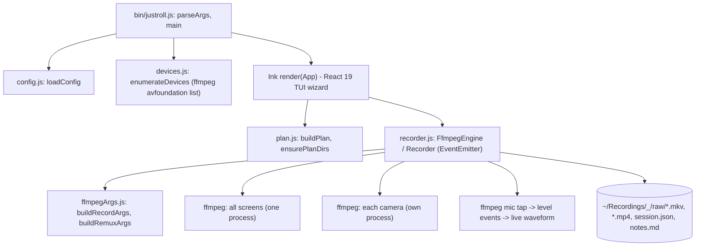

# justroll - a one-command multi-source recorder with a React terminal UI

Evidence was gathered read-only on 2026-09-23 from the local clone at `~/github/justroll` (HEAD `253e2e3`), real `--help` / `--version` output, and a real test run.
Citations use `repo/path:line`.

## 1. TL;DR

justroll is a macOS Node CLI that records every selected screen and camera to its own file, each carrying the same microphone track so any editor can sync the clips by audio (`justroll/README.md:41`).
Its terminal UI is React 19 rendered through Ink, and the recording engine orchestrates ffmpeg child processes with a crash-safe MKV-then-MP4 strategy (`justroll/package.json:55`, `justroll/package.json:56`, `justroll/README.md:106`).
Upstream (Kun Chen, `kunchenguid/justroll`) built it; the user's fork has no fork-specific commits, and the user npm-linked it onto `PATH` as `justroll` with a fleet alias `jr`.

## 2. Problem it solves, and what breaks without it

Recording a talking-head video across multiple displays usually means OBS scene wrangling, forgetting a display, then hand-aligning clips on a timeline (`justroll/README.md:37`).
justroll makes it one command and one wizard.

What breaks without its specific design choices:
- Two concurrent avfoundation screen captures deadlock on macOS, so justroll puts all screens in one ffmpeg process with one mapped output per screen (`justroll/README.md:105`, `justroll/src/recorder.js:116`).
- An abrupt kill corrupts an MP4 (its index is written at the end), so it records MKV and remuxes to MP4 only after a clean stop (`justroll/README.md:106`).
- Without per-file start offsets, clips that started late (device warmup) would drift; `stop()` end-aligns files by probed duration and records `startOffsetMs` per file in `session.json` (`justroll/src/recorder.js:297`, `justroll/src/recorder.js:334`).

## 3. Architecture



Modules (`justroll/src/`): `config.js`, `devices.js`, `plan.js`, `ffmpegArgs.js`, `recorder.js`, `session.js`, `health.js`, `audioMeter.js`, `telemetry.js`, and `ui/` (`App.js`, `Waveform.js`, `mockEngine.js`, `mockDevices.js`).
The UI uses `htm` tagged templates instead of JSX, so the package ships plain ESM with no build step (`justroll/bin/justroll.js:195`).

Data model:
- A `plan` holds sources (label, type, device index, output path) and settings; `buildPlan` is at `justroll/src/plan.js:10`.
- `buildJobs` groups avfoundation screens into one job and gives every other source its own job (`justroll/src/recorder.js:116`).
- `session.json` is the manifest with per-file bytes, seconds, mp4 path, and `startOffsetMs` (`justroll/src/session.js:4`); `notes.md` is a human summary (`justroll/src/session.js:45`).

State files: `~/.config/justroll/config.json` (optional; also stores `lastSelection` when `rememberLastSelection` is on, `justroll/src/config.js:19`), and recordings under `recordingsDir`.

## 4. Interfaces

Real `--help` output (2026-09-23, exit 0):

```text
  justroll - one-command multi-source screen + camera recorder

  Usage
    justroll "video title"        start the recording wizard
    justroll --selftest           headless 2s capture to verify the pipeline
    justroll --help

  Options
    --dir <path>    override recordings directory
    --no-mp4        keep MKV only (skip the mp4 remux)
    --fps <n>       capture frame rate (default from config)
    --version
```

`justroll --version` printed `0.1.2` (exit 0), matching `justroll/package.json:3`.
The parser also accepts `--demo` (synthetic engine, records nothing) and `--seconds <n>` for self-test length (`justroll/bin/justroll.js:31`, `justroll/bin/justroll.js:37`).

| Mode | Output | Exit codes |
| --- | --- | --- |
| wizard | interactive TUI, files on disk | 1 if ffmpeg missing, no TTY, or no title (`justroll/bin/justroll.js:182`, `justroll/bin/justroll.js:191`, `justroll/bin/justroll.js:213`) |
| `--selftest` | text lines `OK` / `BAD` per file then `SELFTEST PASS` or `SELFTEST FAIL` | 0 pass, 1 fail (`justroll/bin/justroll.js:161`, `justroll/bin/justroll.js:162`) |
| `--help`, `--version` | text | 0 |

Output format is human text, not TOON or JSON; it is a human-facing tool, not an agent-facing AXI.

## 5. Configuration

`~/.config/justroll/config.json`, merged over `DEFAULT_CONFIG` (`justroll/src/config.js:5`):

| Key | Default | Why |
| --- | --- | --- |
| `recordingsDir` | `~/Recordings` | |
| `video.fps` | 30 | wizard can change |
| `video.codec` | `h264_videotoolbox` | hardware encode keeps capture CPU low (`justroll/README.md:107`) |
| `video.container` | `mkv` | crash-safe |
| `video.pixelFormat` | `nv12` | |
| `remuxToMp4` | true | toggle per session |
| `captureCursor` | true | |
| `audioGain` | null | null follows the macOS input slider |
| `defaults.mic` / `embedMicInEveryFile` | `RODE NT-USB` / true | same mic muxed into every clip |
| `rememberLastSelection` | true | |

Environment: `JUSTROLL_TELEMETRY=0` opts out (`justroll/README.md:159`).
Telemetry resolves opt-out first, then env host / website id, then build-time defaults; with an empty website id it is disabled (`justroll/src/telemetry.js:24`, `justroll/src/telemetry.js:31`).
The committed `telemetry-defaults.js` has empty values that only the release workflow overwrites before `npm publish` (`justroll/src/telemetry-defaults.js:1`), so the user's npm-linked source checkout sends no telemetry unless env vars are set.
User's actual setting: no `~/.config/justroll/` directory exists, so defaults apply and the tool has likely never recorded on this machine (unverified beyond the missing directory).

## 6. Connections

- **fleet-ops**: `kind: cli`, `provides_bin: [justroll]`, installed by npm-link into `/opt/homebrew/lib/node_modules` (`.fleet/manifest.yaml:206`, `.fleet/manifest.yaml:215`); aliases `cdjr` and `jr` (`.fleet/aliases.zsh:32`, `.fleet/aliases.zsh:33`).
  Verified: `/opt/homebrew/lib/node_modules/justroll` is a symlink to `~/github/justroll`, so `git pull` via fleet sync updates the installed binary immediately.
  See [fleet-ops](fleet-ops.md).
- **no-mistakes**: upstream PRs must be raised through no-mistakes (`justroll/CONTRIBUTING.md:6`) and CI runs the shared `require-no-mistakes` action pinned at `f6441c9` (`justroll/.github/workflows/no-mistakes-required.yml:61`); see [no-mistakes](no-mistakes.md).
- **Other harness components**: no reference from `agents`, skills, hooks, `firstmate`, or `dotfiles-nix` (grep, 2026-09-23).
  justroll is a product built by the upstream author's agent-driven workflow, not part of the harness runtime.

## 7. Lifecycle walkthrough

Trace: `justroll "Tutorial Take 1"`.

1. `parseArgs` sets `title` (`justroll/bin/justroll.js:16`, `justroll/bin/justroll.js:38`).
2. `main` loads config and refuses to continue if ffmpeg is missing (`justroll/bin/justroll.js:176`, `justroll/bin/justroll.js:178`).
3. It requires an interactive TTY, pointing headless callers to `--selftest` (`justroll/bin/justroll.js:187`).
4. It lazily imports Ink, `htm`, and the `App` component, then enumerates devices (`justroll/bin/justroll.js:194`, `justroll/bin/justroll.js:215`).
5. It initializes telemetry (no-op without a website id) and renders the wizard with `exitOnCtrlC: false` so Ctrl+C means "stop and finalize", not "kill" (`justroll/bin/justroll.js:224`, `justroll/bin/justroll.js:242`).
6. On start, the engine builds jobs (screens grouped, cameras separate) and spawns ffmpeg processes plus a mic tap that feeds the live waveform (`justroll/src/recorder.js:116`, `justroll/src/recorder.js:62`, `justroll/src/recorder.js:145`).
7. On stop, each ffmpeg gets `q` on stdin, then `SIGINT` after `graceMs` (default 4000), then `SIGKILL` 1500 ms later (`justroll/src/recorder.js:247`, `justroll/src/recorder.js:260`, `justroll/src/recorder.js:268`, `justroll/src/recorder.js:273`).
8. It remuxes each video to MP4 if enabled, probes durations, and end-aligns offsets (`justroll/src/recorder.js:289`, `justroll/src/recorder.js:297`).
9. `session.json` and `notes.md` land next to the raw files.

## 8. Failure modes and safeguards

| Failure | Safeguard | Evidence |
| --- | --- | --- |
| macOS hangs with two screen-capture processes | one ffmpeg for all screens | `justroll/src/recorder.js:116` |
| A dead capture card stalls screens | cameras in separate processes | `justroll/README.md:105` |
| Abrupt kill loses the recording | MKV container, remux later | `justroll/README.md:106` |
| ffmpeg ignores `q` | escalation `q` -> `SIGINT` -> `SIGKILL` | `justroll/src/recorder.js:260` |
| Screen Recording permission missing | self-test falls back to a synthetic `lavfi` source to still validate the pipeline | `justroll/bin/justroll.js:86` |
| Silent mic or locked display | wizard readiness checks and per-source `no frames` / `dropped` flags | `justroll/README.md:108` |

## 9. Testing and quality

- Tests: `node --test` with `ink-testing-library` for UI tests (`justroll/package.json:17`).
- Lint and format: ESLint and Prettier (`justroll/package.json:21`, `justroll/package.json:22`).
- CI matrix `ubuntu-latest` and `macos-latest`, Node 24: lint, `format:check`, test (`justroll/.github/workflows/ci.yml:22`, `justroll/.github/workflows/ci.yml:36`).

Real run (2026-09-23, `JUSTROLL_TELEMETRY=0 node --test`): 72 tests, 72 pass, 0 fail, about 1.3 s.
The tests exercise pure modules (ffmpeg arg building, planning, naming, health, waveform) and the Ink wizard with a mock engine, so they need no real devices.

## 10. Fork delta

No fork-specific commits; tracks upstream.
`git log upstream/main..HEAD` is empty; all 14 commits are by upstream authors.
The user's contribution: fleet manifest entry, npm-link install, and the `jr` alias.

## 11. Interview angle

**Q1. How do you manage child processes reliably from Node?**
Model each as a job with an event emitter, parse progress from stderr, and stop with graceful escalation: application-level quit, then `SIGINT`, then `SIGKILL`, each with a timeout (`justroll/src/recorder.js:247`).
Always await exit before post-processing (remux, probe).

**Q2. How do you test a terminal UI?**
Render the React tree with `ink-testing-library`, drive keystrokes, and inject a mock engine and mock devices so tests are hermetic (`justroll/src/ui/mockEngine.js`, `justroll/src/ui/mockDevices.js`).
This is the same dependency-injection pattern you would use to unit-test a React trading widget against a fake price feed.

**Q3. Why record a crash-tolerant format and convert later?**
It separates durability from convenience: the hot path writes a format that survives kill -9, and the expensive transform runs once the capture is safe.
It is the write-ahead-log idea applied to media.

**Trade-off to defend.** Grouping all screens into one ffmpeg process avoids a real macOS deadlock but couples their failure domains, so one bad screen input can end all screen captures; cameras are kept separate precisely to limit that coupling (`justroll/README.md:105`).
