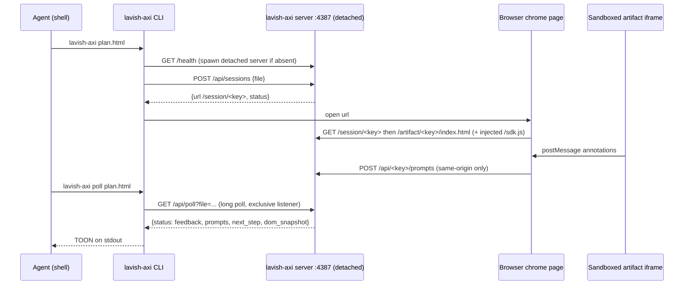

# lavish-axi - human review surfaces for agent-made HTML

Sibling notes in this cluster: [axi](axi.md), [gh-axi](gh-axi.md), [chrome-devtools-axi](chrome-devtools-axi.md).
Other harness components (firstmate, no-mistakes, tasks-axi, quota-axi, agents, dotfiles-nix, fleet-ops) are named in backticks and documented in their own notes.

## 1. TL;DR

`lavish-axi` (upstream kunchenguid/lavish-axi, v0.1.78, product name "Lavish Editor") turns an HTML file an agent wrote into a browser review surface where a human annotates elements or text, answers embedded questions, attaches images, and sends feedback that the agent receives through a blocking `lavish-axi poll`.
It is a CLI plus one detached local Express/WebSocket server per machine, with all state in `~/.lavish-axi/state.json` keyed by the artifact's canonical file path.
My fork has no code changes; I use it through the `lavish` skill for plans, comparisons, and reports, and `firstmate` wraps it in an adapter so crewmates can run review rounds with the captain (me) without blocking the supervisor.

## 2. Problem it solves, and what breaks without it

Terminal prose is a poor medium for reviewing a plan with five options, a table of 40 findings, or a diff.
The human needs to point at a specific row and say "not this", and the agent needs that pointer back in machine-readable form with the element's selector and text.

Without it:

- Feedback is free text in chat, detached from the exact element it refers to, so the agent re-reads and guesses.
- There is no durable queue: if the agent is busy when the human comments, the comment is lost or interleaved.
- A supervisor like `firstmate` cannot tell "captain is still reading" from "captain closed the board with nothing to say", which matters for whether to wake a crewmate.

## 3. Architecture



### Process model

- The CLI is short-lived; `bin/lavish-axi.js:4` calls `run(argv)` in `src/cli.js:174`.
- The server is spawned detached with stdout and stderr appended to `server.log` and `LAVISH_AXI_NO_OPEN=1` in its env (`src/cli.js:2114-2130`, `:2147-2157`).
- Later CLI calls reuse the running server only if its `/health` version matches; otherwise they ask it to `POST /shutdown` and replace it, passing along every address it was listening on so other agents' review links survive (`lavish-axi/AGENTS.md:52-54`).
- The server self-stops when the last session ends with nothing connected, or after 30 minutes with no browser or poll connection (`src/server.js:107`, `:262-268`).

### Modules (largest first, `src/`)

| File | Lines | Role |
| --- | --- | --- |
| `chrome-client.js` | 4392 | Browser-side review chrome: conversation panel, queue, annotation relay, attachments, reconnect banners |
| `export-bundle.js` | 3679 | `export`/`share`: inline local assets into one HTML file, confined to the artifact dir |
| `server.js` | 3130 | Express routes, live-event WebSocket, poll ownership, Host and Origin guards |
| `artifact-sdk.js` | 2636 | The script injected into the artifact: annotation cards, text-range capture, layout audit |
| `cli.js` | 2454 | Commands, server discovery and replacement, poll client, output shaping |
| `session-store.js` | 1087 | `SessionStore` over `state.json` behind one `AsyncMutex` |
| `attachment-store.js` | 769 | Content-addressed image attachments with quotas |
| `whiteboard-*.js`, `mermaid-*.js` | about 1500 | Mermaid diagrams as editable Excalidraw whiteboards |
| `layout-warnings.js` | 564 | Passive layout-issue inbox lifecycle as pure functions |
| `playbooks.js`, `design-reference.js` | 304, 647 | Agent-facing authoring guidance printed by `playbook` and `design` |

### Data model

- Session identity is derived, not issued: `sessionKey = sha256(canonical path)[0:16]` (`src/session-store.js:753-760`), so the CLI never handles opaque IDs, and the key is explicitly not a secret (`AGENTS.md:58-59`).
- A session stores status (`open`, `feedback`, `ended`), `ended_by` (`user` or `agent`), queued `prompts`, a `dom_snapshot`, `artifact_failures`, a bounded chat transcript (5,242,880 bytes of JSON max), layout warnings, and the current artifact revision (`AGENTS.md:63-80`, `:105-112`).
- A prompt is `{tag, text, target, attachments, prompt_id}`; text selections use `tag: "text"` with a `text-range` target holding the selected text and boundary anchors (`AGENTS.md:82`).

### State files (`LAVISH_AXI_STATE_DIR`, default `~/.lavish-axi`, `src/paths.js:140-145`)

| Path | Content |
| --- | --- |
| `state.json` | All sessions for all projects, rewritten wholesale under the store mutex |
| `server.log` | UTC-timestamped detached server output |
| `whiteboards/<key>/` | Per-diagram Excalidraw scene sidecars |
| `attachments/<key>/` | Content-addressed images `<sha256>.<ext>` plus `.meta`, mode 0600 in 0700 dirs (`AGENTS.md:165`) |

On my machine on 2026-09-23 the dir held `state.json` (593 bytes) and an empty `server.log`, with one open session listed by the home view.

## 4. Interfaces

Commands, from `README.md:259-273` and verified against `lavish-axi --help` and `lavish-axi poll --help` on 2026-09-23:

| Command | Purpose | Key flags |
| --- | --- | --- |
| `lavish-axi` | Home: `bin`, description, open `sessions[]{file,status,url,pending_prompts,listener}`, `playbooks[8]`, `help[]` | none |
| `lavish-axi <file.html>` | Open or resume a session (bare path is rewritten to `open`, `src/cli.js:243-252`) | `--no-open`, `--no-gate`, `--reopen` |
| `lavish-axi poll <file>` | Block until feedback, end, or disconnect | `--owner <label>`, `--takeover`, `--agent-reply "..."`, `--agent-reply-file <path or ->`, `--timeout-ms` (debug only) |
| `lavish-axi end <file>` | Agent-initiated end; plain reopen still allowed | none |
| `lavish-axi export <file>` | Self-contained HTML with local assets inlined | `--out <path>` |
| `lavish-axi share <file>` | Publish to ht-ml.app, a third-party host; public by default | `--private`, `--password`, `--site`, `--update-key`, `--unpublish`, `--token` |
| `lavish-axi playbook [id]` | Authoring guidance: diagram, table, comparison, plan, code, input, explanation, slides | none |
| `lavish-axi design` | Design-direction priority and optional Tailwind v4 + DaisyUI v5 CDN snippet | none |
| `lavish-axi setup hooks` | SessionStart hooks for Claude Code, Codex, OpenCode, and GitHub Copilot CLI (`src/cli.js:1253-1287`) | none |
| `lavish-axi setup plugin` | Register the package as an Agent Plugin in VS Code, Cursor, Copilot CLI | none |
| `lavish-axi stop` | Shut the server down | `--port` |
| `lavish-axi server` | Run the server in the foreground | `--verbose`, `--also-listen <host>` |
| `lavish-axi update` | SDK built-in self-update | `--check` |

Poll response shape (`src/cli.js:535-584`), rendered as TOON by the SDK:

- `status: feedback` -> `session{file,status,session_ended?,ended_by?}`, `prompts[]`, `artifact_failures?`, `next_step`, then `dom_snapshot` last.
  The key order is a contract so an agent that truncates still sees the human's words and the continue-the-loop instruction (`AGENTS.md:93`).
- `status: ended` -> `next_step` says stop polling and do not reopen uninvited.
- `status: browser_disconnected` -> session is still resumable; ask the human.
- `LISTENER_ACTIVE` when a second poll arrives without `--takeover`; the displaced one gets `LISTENER_REPLACED` (`src/server.js:867`, `:908`).

Exit codes: 0 for normal results; SDK mapping (2 for validation, 1 otherwise) for errors; 130 or 143 when SIGINT or SIGTERM interrupts a poll, after printing re-run guidance to stderr (`src/cli.js:438-439`).
stdout carries only the final response; the "still waiting" banner and ticks go to stderr (`AGENTS.md:91`).

## 5. Configuration

Environment variables (README), with defaults where the source states one:

| Variable | Default | My value |
| --- | --- | --- |
| `LAVISH_AXI_PORT` | 4387 (`src/paths.js:176`) | unset |
| `LAVISH_AXI_STATE_DIR` | `~/.lavish-axi` (`src/paths.js:141`) | unset |
| `LAVISH_AXI_HOST`, `LAVISH_AXI_LINK_HOST`, `LAVISH_AXI_ALLOWED_HOSTS` | loopback plus Tailscale address when Tailscale is up | unset |
| `LAVISH_AXI_IDLE_TIMEOUT_MS` | 30 minutes (`src/server.js:107`) | unset |
| `LAVISH_AXI_NO_OPEN` | unset | unset |
| `LAVISH_AXI_TELEMETRY` | telemetry on if a website ID was baked in at build | unset, but effectively off (below) |
| Attachment limits (`..._MAX_ATTACHMENT_BYTES`, `..._MAX_ATTACHMENTS_PER_PROMPT`, `..._MAX_ATTACHMENT_DISK_MB`, `..._ATTACHMENT_TTL_MS`) | see README | unset |
| Export limits, `LAVISH_AXI_HTML_APP_API_URL`, `LAVISH_AXI_HTML_APP_TOKEN` | ht-ml.app | unset |
| `LAVISH_AXI_DIAGNOSTIC_VIEWPORTS` | mobile, compact, desktop | unset |
| `LAVISH_AXI_HERDR_CHIME`, `LAVISH_AXI_DEBUG` | off | unset |

Telemetry detail: `src/telemetry.js:7-23` sends anonymous Umami events only when a website ID is present; my binary is built locally by `fleet-ops` without `LAVISH_AXI_UMAMI_WEBSITE_ID`, and the built bundle's `getBuildTimeUmamiWebsiteID()` returns `""` (`dist/cli.mjs:12053-12055`), so no telemetry is sent from this install.

Wiring:

- Binary: `/opt/homebrew/bin/lavish-axi` -> npm link -> `~/github/lavish-axi/dist/cli.mjs`; manifest says "build is live immediately" (`~/github/.fleet/manifest.yaml:20`).
- Skill: named `lavish`, not `lavish-axi`; `ic-link` special-cases it (`dotfiles-nix/files/bin/ic-link:84`, `dotfiles-nix/README.md:292`).
- Aliases: `lav`, `cdlav` (`~/github/.fleet/aliases.zsh:11-12`).
- SessionStart hooks: not installed.
- `firstmate` per-machine server address file `config/lavish-axi-host`: not present on my machine (only `crew-dispatch.json` and `startup-memory-budget` exist in `firstmate/config/`), so crewmates use the default loopback.

## 6. Connections

`firstmate` is the heaviest consumer, and the integration is instructive because it turns a blocking human-in-the-loop call into an event source.

- Version floor: `LAVISH_AXI_MIN=0.1.46` (`firstmate/bin/fm-bootstrap.sh:926`); `fm-bootstrap.sh lavish-compatible` exits 0 only above it (`:1380-1381`), and a missing or old install reports `PRESENTATION_UNAVAILABLE` so work proceeds with text reports (`:9`, `:63`).
- Brief text: when compatible, crew briefs tell a crewmate to arm its board with `bin/fm-procevent-lavish.sh arm <artifact.html> --for <task-id>` and never to run `lavish-axi poll` itself (`firstmate/bin/fm-brief.sh:404-407`).
- Adapter: `fm-procevent-lavish.sh` owns source identity, the poll argv, and result classification (`feedback`, `ended`, `waiting`, `disconnected`, `missing`, `unknown`), while the generic `fm-procevent.sh` owns durable capture and wake-ups (`firstmate/bin/fm-procevent-lavish.sh:1-80`).
  It runs exactly `lavish-axi poll "$artifact" [--agent-reply "$reply_text"]` (`fm-procevent-lavish.sh:398-400`) and reads `config/lavish-axi-host` before every call (`:147-182`).
  Its `silent` verdict suppresses the most common non-event, a board closed with nothing said, so it never wakes the supervisor (`fm-procevent-lavish.sh:54-72`).
- Fleet board: `/bearings lavish` builds `$FM_HOME/.lavish/bearings-board.html` (`firstmate/bin/fm-bearings-board.sh:112`) and proves liveness from the home listing, because `lavish-axi <file>` exits 0 even for a user-ended session (`fm-bearings-board.sh:208-213`, `:225-238`).
  That parser reads the row as `<path>,<status>,...` and checks the field after the path; the live listing now has five columns including `listener`, and the parser still works because it reads only the first field after the path.
- Contract: `firstmate/AGENTS.md:84` documents `config/lavish-axi-host`; `:528` says use plain chat for yes-or-no decisions and Lavish only for multi-option or structured reports.
- `chrome-devtools-axi`: Lavish's opt-in browser E2E suites drive the review UI with it (`lavish-axi/AGENTS.md:19-20`).
- Manuals and skills: `agents/ROUTING.md:28`; `dotfiles-nix/files/skills/ship/SKILL.md:49`.
- `fleet-ops`: the 2026-09-23 sync fast-forwarded 4 commits and reinstalled with `pnpm install --frozen-lockfile && pnpm run build` (`~/github/.fleet/logs/sync-20260923.log`).
- `axi-sdk-js` 0.1.8: `runAxiCli`, `AxiError`, `installSessionStartHooks` (`src/cli.js:195`, `:1264`).

## 7. Lifecycle walkthrough: one review round

1. Agent writes `.lavish/plan.html` in the working directory, as the home help instructs, and runs `lavish-axi .lavish/plan.html`.
2. `run` (`src/cli.js:174`): not a version-only argv (`:178-181`), so ensure the state dir, `normalizeArgv` rewrites to `["open", ".lavish/plan.html"]` (`:243-252`), and call `runAxiCli` (`:195`).
3. `openCommand` (`src/cli.js:354`): validate the path is HTML, canonicalize with `realpath` (`session-store.js:753-756`), run the self-paint check, then `ensureServer` (`cli.js:1835`), which probes loopback, the configured host, and local interfaces (`findRunningServer`, `:1709`) and starts a detached server if none is owned (`startServer`, `:2114`).
4. `POST /api/sessions` (`src/server.js:750`) upserts the session; if the human previously ended it from the browser and `--reopen` is absent, it returns `status: user-ended` without reviving (`server.js:763`, `cli.js:367-373`).
5. The CLI opens the URL and prints `createOpenOutput` (`cli.js:318`).
6. The browser loads `/session/<key>`; the chrome page frames the artifact in an iframe sandboxed without `allow-same-origin` (`src/server.js:3005`), and the artifact route appends one `<script src="/sdk.js?key=...">` before `</body>` and changes nothing else (`src/html-transform.js:1-9`).
7. The human clicks an element and types a note; the SDK posts it to the chrome by `postMessage`; the chrome assigns a `prompt_id` and `POST`s to `/api/<key>/prompts`, which is same-origin guarded (`server.js:1069`, `AGENTS.md:79`).
8. `SessionStore.queuePrompts` (`session-store.js:159`) re-derives attachment paths from disk (the trust boundary) and persists under the mutex.
9. Agent runs `lavish-axi poll .lavish/plan.html` (`cli.js:408`); the server's `handlePoll` (`server.js:808`) claims exclusive ownership and calls `takeFeedback` (`session-store.js:594-651`), which returns and clears the batch in one critical section.
10. `createPollOutput` (`cli.js:535`) emits `prompts`, `next_step`, then `dom_snapshot`.
11. The agent edits the HTML; `chokidar` sees the write and the chrome reloads the iframe, restoring scroll and any unsent draft.
12. The agent runs `lavish-axi poll <file> --agent-reply "Moved option B first."` to post a chat reply and wait again; the human clicks **Send & End**, and the final batch arrives with `session_ended: true, ended_by: user`, telling the agent to stop.

I observed step 1-5 behavior only indirectly (the home view listed an open session); I did not open or poll a session for this note, because that would change `state.json`.

## 8. Failure modes and safeguards

| Failure | Safeguard |
| --- | --- |
| Poll killed or client disconnects mid-delivery | `takeFeedback` result is restored to the queue (prepended, newer snapshots win) and `feedback` is re-emitted so no poll waits forever (`AGENTS.md:95-96`) |
| Two agents poll one session | Exclusive listener with typed `LISTENER_ACTIVE` / `LISTENER_REPLACED` (`server.js:867`, `:908`) |
| Agent reopens a board the human closed | `ended_by: user` blocks plain reopen; `--reopen` required (`AGENTS.md:65-67`) |
| Malicious page posts fake feedback | Host allowlist (DNS rebinding), Origin/Referer guard on mutating routes, `X-Frame-Options: DENY` on the chrome page (`AGENTS.md:55`, `:79-81`) |
| Artifact reads files outside its directory | Asset route resolves real paths and rejects symlink escapes (`AGENTS.md:71`); export uses the same guard so a symlink cannot inline `~/.ssh/id_rsa` (`AGENTS.md:171`) |
| Crafted attachment ids wedge the server | Pre-resolve bounds on ref counts before any `stat` under the mutex (`AGENTS.md:156`) |
| Disk fill via tiny uploads | Quota charges allocated 4096-byte blocks, admission refuses with 507 (`AGENTS.md:163-164`) |
| Lost-update between queue and take | One `AsyncMutex` guards every `state.json` read-modify-write (`AGENTS.md:157`) |
| Layout noise wakes the agent | Layout issues are passive; only fatal `artifact_failures` return a poll unasked (`AGENTS.md:72-75`) |
| Accidental public share of sensitive content | Not prevented: `share` publishes to a third-party host and is public by default; the only guard is that it is an explicit command |

## 9. Testing and quality

- `pnpm run check` = build, lint, format check, `tsc --noEmit` in checkJs mode, `node --test`, and skill and plugin drift checks (`lavish-axi/package.json` scripts, `AGENTS.md:8-15`).
- CI runs lint, format, typecheck, test, and build on Ubuntu, macOS, and Windows (`lavish-axi/.github/workflows/ci.yml`), plus the pinned `require-no-mistakes` gate (v1.80.1) and release-please.
- Browser E2E suites are opt-in with `LAVISH_AXI_BROWSER_E2E=1` and need `chrome-devtools-axi` (`AGENTS.md:19-20`).
- I ran pure unit files only (the CLI output tests spawn child CLIs and a fake share server), on 2026-09-23:

```text
$ LAVISH_AXI_TELEMETRY=0 node --test test/session-store.test.js test/layout-warnings.test.js \
    test/html-transform.test.js test/chat-messages.test.js test/skill.test.js test/async-mutex.test.js
tests 144, pass 144, fail 0
```

## 10. Fork delta

- Remotes: `origin` `shreejitverma/lavish-axi`, `upstream` `kunchenguid/lavish-axi`.
- `git log upstream/main..HEAD` is empty; 0 behind; HEAD `69574a8` (release 0.1.78, 2026-09-22).
- No fork-specific commits; tracks upstream.
- Authors: Kun Chen / kunchenguid (118), github-actions[bot] (78), outside contributors; none are mine.
- My integration work is in `dotfiles-nix` (skill link, install loop in `README.md:464-470`) and the fleet manifest; the `firstmate` adapter is upstream `firstmate` code, not mine (see the `firstmate` note for its fork delta).

## 11. Interview angle

**Q1. How do you design a human-in-the-loop step for an autonomous agent?**
Make the human's input a durable queue, not a chat message: the server persists prompts, the agent's blocking poll consumes them atomically, and a crashed poll puts them back.
Distinguish "nothing said" from "ended" from "disconnected", because each implies a different next action; `firstmate` encodes exactly that in `classify` and `silent`.
It maps to trade approval workflows: a four-eyes check needs an explicit, auditable outcome, not an inferred one.

**Q2. What are the security boundaries in a local review server?**
The artifact is untrusted HTML, so it runs in a sandboxed iframe without same-origin, can only talk to the chrome by `postMessage`, and the chrome is the only origin allowed to queue prompts.
The server defends against DNS rebinding with a Host allowlist, because a same-origin check alone passes when a rebound page sends its hostile domain in both headers.
File access is confined by real-path resolution, not just string checks, so symlinks cannot escape.

**Q3. Why derive the session key from the file path instead of issuing a token?**
It makes the CLI stateless and idempotent: `lavish-axi plan.html` always resumes the same session, and no ID has to be passed between agent turns.
The cost is that the key is guessable, so no route may treat key possession as authorization, which is why every mutating route has an Origin guard.

**Defensible trade-off: long-poll CLI instead of a webhook or callback.**
A blocking `poll` works in any shell-capable agent with no inbound networking and keeps feedback ordered and exactly-once-delivered by the server.
The downside is that a foreground poll occupies the agent's turn; Lavish refuses to recommend fire-and-forget background polls, and a supervisor must wrap it in a tracked event source, as `firstmate` does with `fm-procevent-lavish.sh`.
