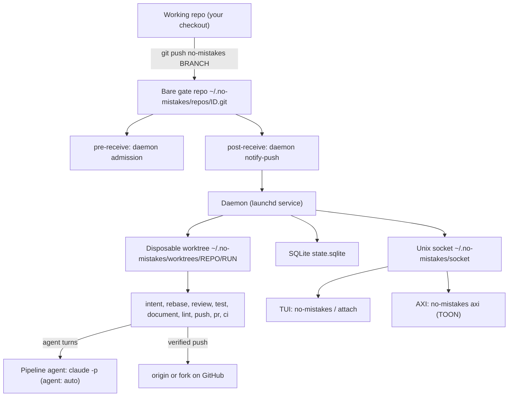
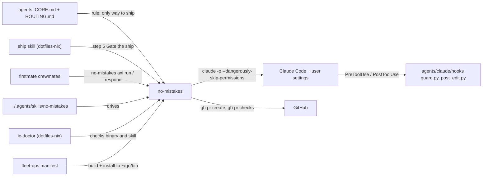

# no-mistakes - the ship gate

Evidence was gathered read-only on 2026-09-23 from the local clone at `~/github/no-mistakes` (binary `v1.81.0-4-g7051487`), the live `~/.no-mistakes/` state directory, and real `--help` output.
Citations use `repo/path:line`, with `no-mistakes/docs/...` meaning `no-mistakes/docs/src/content/docs/...`.

## 1. TL;DR

no-mistakes is a local Git proxy: you push to a remote named `no-mistakes` instead of `origin`, a daemon validates the branch in a disposable worktree, and only a fully green branch is forwarded to the real remote and turned into a PR.
The pipeline is a fixed nine-step sequence `intent -> rebase -> review -> test -> document -> lint -> push -> pr -> ci`, where agent-driven steps can auto-fix findings or park for a human approve / fix / skip decision.
Upstream (Kun Chen, `kunchenguid/no-mistakes`) built the entire tool; the user's contribution is adopting it as the only ship path for every repo in the harness, configuring it, and wiring it into the manuals, skills, firstmate, and the guard hook.

## 2. Problem it solves, and what breaks without it

Coding agents produce plausible diffs fast, and the failure mode is shipping unreviewed, untested, undocumented slop straight to `origin`.
no-mistakes puts one deliberate checkpoint between "committed locally" and "visible to others" without hijacking normal Git: `origin` is untouched and you opt in by pushing to a named remote (`no-mistakes/docs/concepts/gate-model.md:72`).
It also standardizes what "passed" means across repos, because the step order is fixed and a repo can only add gates, never remove or reorder core steps (`no-mistakes/docs/concepts/gate-model.md:75`, `no-mistakes/docs/concepts/pipeline.md:93`).

Without it, in this harness:
- The standing rule "never run a bare `git push`" (`agents/CORE.md`, compiled into every manual) has no mechanism behind it.
- Agent PRs would have hand-written bodies with no step attestation, so the `require-no-mistakes` required check that some forks run (for example `gnhf/.github/workflows/no-mistakes-required.yml:1`) could not be satisfied.
- Force-pushes from agents could silently discard commits already on the remote; the Push step refuses that by patch-id and a SHA-anchored lease (`no-mistakes/docs/reference/pipeline-steps.md:219`).
- CI failures after PR creation would need a human to notice and babysit; the CI step polls, auto-fixes up to the configured limit, and reports `checks-passed`.

## 3. Architecture

### Components

| Module (Go package) | Role | Evidence |
|---|---|---|
| `cmd/no-mistakes` | CLI entry point (cobra) | `no-mistakes/go.mod` requires `github.com/spf13/cobra` |
| `internal/gate` | Creates the bare gate repo, remote wiring, eject | `no-mistakes/internal/gate/gate.go:50`, `:190`, `:289` |
| `internal/git` | Hook scripts, bare-repo Git calls | `no-mistakes/internal/git/hook.go:31` (pre-receive), `:133` (post-receive) |
| `internal/daemon` | Run manager, branch locks, crash recovery, launchd/systemd/schtasks service | `no-mistakes/internal/daemon/manager.go:771`, `service_launchd.go` |
| `internal/pipeline` | Executor: sequential steps, approval and auto-fix loop | `no-mistakes/internal/pipeline/executor.go:209` |
| `internal/pipeline/steps` | One file per step (`rebase.go`, `review.go`, `test.go`, `document.go`, `lint.go`, `push.go`, `pr.go`, `ci.go`) | `no-mistakes/internal/pipeline/steps/common.go:361` |
| `internal/agent` | Adapters for claude, codex, grok, opencode, pi, copilot, antigravity, ACP | `no-mistakes/internal/agent/claude.go:174` |
| `internal/ipc` | JSON-RPC 2.0 over the Unix socket | `no-mistakes/docs/concepts/gate-model.md:217` |
| `internal/db` | SQLite (pure Go `modernc.org/sqlite`) | `no-mistakes/go.mod` |
| `internal/tui`, `internal/wizard` | Bubble Tea TUI and setup wizard | `no-mistakes/go.mod` requires `bubbletea` |
| `internal/skill`, `cmd/genskill` | Source of truth for the `/no-mistakes` agent skill | `no-mistakes/Makefile:80` |

### Data model

- Step names are a closed enum in `no-mistakes/internal/types/types.go:52` through `:60`, and `AllSteps()` returns them in order at `no-mistakes/internal/types/types.go:131`.
- Only `rebase`, `review`, `test`, `document`, `lint` can anchor a repository gate (`no-mistakes/internal/types/types.go:137`).
- A run has step results; each step result has rounds (initial, auto-fix, user fix) with findings, selected finding IDs, and fix summaries (`no-mistakes/docs/concepts/gate-model.md:221`).
- A finding carries a severity (`error`, `warning`, `info`) and an action (`auto-fix`, `ask-user`, `no-op`) (`no-mistakes/docs/concepts/pipeline.md:65`).
- Step statuses: `pending`, `running`, `fixing`, `awaiting_approval`, `fix_review`, `completed`, `skipped`, `failed` (`no-mistakes/docs/reference/pipeline-steps.md:375`).
- Repo IDs are the first 6 bytes of `sha256(absolute_working_path)`, i.e. 12 hex chars (`no-mistakes/internal/gate/gate.go:32`).

### State files (what persists, where)

All under `~/.no-mistakes/` (relocatable with `NM_HOME`), per `no-mistakes/docs/concepts/gate-model.md:237`; verified by `ls -la ~/.no-mistakes`:

| Path | Contents | Seen on this Mac |
|---|---|---|
| `config.yaml` | Global config | yes |
| `state.sqlite` (+ `-wal`, `-shm`) | Repos, runs, step results, rounds, intent summaries, agent telemetry | yes, about 11 MB plus WAL |
| `socket` | IPC Unix socket | yes |
| `daemon.pid`, `daemon.lock` | Singleton identity and OS lock | yes |
| `repos/<id>.git` | Bare gate repos, one per initialized working repo | 18 entries |
| `worktrees/<repoID>/<runID>/` | Run worktrees | yes |
| `logs/<runID>/<step>.log`, `logs/daemon.log` | Per-step and daemon logs | yes |
| `evidence/<run-id>` | Test-step evidence, outside the worktree | yes |
| `servers/`, `update-check.json`, `telemetry-gate.json`, `eval/` | Managed agent servers, update cache, telemetry consent, eval cases | yes |

The daemon runs as the launchd job `com.kunchenguid.no-mistakes.daemon.<suffix>` (seen in `launchctl list`), which matches the fleet note in `.fleet/manifest.yaml:54`.

## 4. Interfaces

All commands below come from real `no-mistakes <cmd> --help` output on v1.81.0-4.
Global flags on the root command: `--skip <steps>` (skip steps for a new run), `-y/--yes` (run the setup wizard with defaults), `-v/--version`.

| Command | What it does | Output |
|---|---|---|
| `no-mistakes` | Attach to the active run for the branch, or run the wizard (branch, commit, push through the gate) | TUI |
| `init [--fork-url URL] [--worktree-root DIR]` | Create or refresh the bare gate, hooks, `no-mistakes` remote, DB record, and user-level skill | text |
| `attach [--run ID]` | Open the TUI on a run | TUI |
| `axi` | Agent interface; bare `axi` prints current state | TOON |
| `axi run --intent "..." [--yes] [--skip ...] [--wait 8m] [--base-branch B] [--no-publish-intent] [--model M --effort E]` | Start or reattach and block until the first gate, CI-ready point, or outcome | TOON |
| `axi respond --action approve\|fix\|skip [--findings IDs] [--instructions T] [--add-finding JSON] [--reason R] [--yes] [--wait]` | Answer the parked gate and continue | TOON |
| `axi status [--run ID]` | Detailed run view | TOON |
| `axi logs --step S [--full] [--run ID]` | One step's log (tail by default) | TOON/text |
| `axi abort [--run ID]` | Cancel a run; help text warns never to abort to go fix a finding yourself | TOON |
| `axi sync [--check] [--recover [--keep-local]] [--adopt-published] [--bind-archive-ref R]` | Guarded branch sync to the pipeline-pushed head | TOON |
| `rerun [--intent] [--base-branch] [--model/--effort] [--no-publish-intent]` | New run for the current branch | text |
| `runs [--limit N]`, `status`, `stats [--agents] [--run ID]` | History and usage | text |
| `sync [--check] [--recover] [-y] ...` | Human counterpart of `axi sync` | text |
| `ci-workflow [-f]` | Emit `.github/workflows/ci.yml` mirroring `.no-mistakes.yaml` commands | file |
| `daemon start\|stop\|restart\|status` | Manage the daemon service | text |
| `doctor` | Check git, gh, data dir, DB, daemon, and each agent binary; ends with "gate validation" | text |
| `eject` | Remove the remote, bare repo, worktrees, and DB record | text |
| `eval capture\|miss\|relabel\|report\|run\|sets` | Local review-quality evaluation; never uses the shared daemon | text |
| `update [--beta] [--force] [-y]` | Self-update and reset the daemon | text |
| `daemon notify-push` (hidden) | Called by the post-receive hook with `--gate --ref --old --new --push-option` | internal |

Exit codes: AXI prints TOON to stdout, progress to stderr, and uses structured errors with exit `1` for operational failures and `2` for bad usage (`no-mistakes/docs/reference/cli.md:94`).
Successful AXI outcomes are `checks-passed`, `passed`, `passed-with-override`, `passed-with-skips`; `passed-with-skips` keeps exit 0 even though PR or CI verification was skipped (`no-mistakes/docs/reference/cli.md:170` to `:178`).
The `--wait` default of 8m exists so an agent harness with a 10-minute tool cap gets a structured return instead of hanging (from `axi run --help`).

Real `no-mistakes axi` output in `~/github/agents` (trimmed): `repo`, `current_branch: main`, `daemon: running`, `count: 10 of 14 total`, then a TOON table `runs[10]{id,branch,status,head,pr}` and a `help[4]` array of next steps - a concrete example of AXI principles 1, 4, and 9.

Three trigger paths exist: `git push no-mistakes`, the bare `no-mistakes` TUI/wizard, and the `/no-mistakes` agent skill that drives `no-mistakes axi` (`no-mistakes/README.md:112` to `:120`).

## 5. Configuration

### Global: `~/.no-mistakes/config.yaml`

| Key | Default | User's setting | Why |
|---|---|---|---|
| `agent` | `auto` (first available of claude, codex, grok, opencode, rovodev, pi, copilot, antigravity, cursor, devin) | `auto` (`~/.no-mistakes/config.yaml:8`) | Resolves to `claude`; a comment at `:7` says switch to `grok` only while Claude has no runway, then restore `auto` |
| `agent_path_override.grok` | unset | `~/.local/bin/grok` (`:10` to `:11`) | Pins the native Grok binary, matching `agents/tools/grok.md:39` |
| `agent_config.grok.model` / `.effort` | unset | `grok-4.7` / `high` (`:13` to `:16`) | Same pin as firstmate `config/crew-dispatch.json:12` |
| `ci_timeout` | see docs | `"168h"` (`:31`) | Babysit an idle open PR for a week; each base-branch advance re-arms the timer |
| `log_level` | `info` | `info` (`:35`) | Default |
| `auto_fix.rebase/lint/test/document/ci` | 3 | 3 each (`:50` to `:56`) | Product default |
| `auto_fix.review` | 0 | 0 (`:54`) | Review findings always park for a human |
| `intent.enabled/threshold/slack_days` | see docs | `true` / `0.2` / `3` (`:63` to `:66`) | Infer intent from local agent transcripts when not supplied |
| `test.evidence.store_in_repo` | false | commented out (`:74` to `:77`) | Evidence stays outside the repo |

Other documented global keys, not set here: `acpx_path`, `acp_registry_overrides`, `agent_args_override`, `review_agents`, `forge_profiles`, `step_quiet_warning`, `agent_timeout`, `review_agent_timeout`, `test_agent_timeout`, `session_reuse`, `worktree_roots`, `ci.rerun_transient`, `ci.revalidate_repairs`, `rebase.strategy`, `commit.fix_message` (default `no-mistakes({{.Step}}): {{.Summary}}`), `commit.branch_pattern`, `providers.*.draft_pull_requests` (headings in `no-mistakes/docs/reference/global-config.md:123` to `:1007`).
The config file holds no credentials; `gh` auth lives in `gh` itself.

### Per-repo: `.no-mistakes.yaml`

Seven repos under `~/github` carry one: `career-ops`, `firstmate`, `gnhf`, `no-mistakes`, `quota-axi`, `SDE-Interview-Prep`, `ZeroToGodhood`.
`agents` has none, so its gate runs with agent-driven lint and test only.

This vault's own config (`SDE-Interview-Prep/.no-mistakes.yaml:4` to `:6`):
- `commands.lint`: the vault's link check, style check (no emojis or em dashes), and PII check.
- `commands.test`: `python3 -m unittest discover tools/tests`.
Its `.github/workflows/ci.yml` header says it was generated by `no-mistakes ci-workflow` and then switched to setup-python (`SDE-Interview-Prep/.github/workflows/ci.yml:1`).

Upstream's dogfood config shows the other keys in use: `commands.lint: "make lint"`, `commands.format: "gofmt -w ."`, `auto_fix.review: 0`, and a `document.instructions` ownership map (`no-mistakes/.no-mistakes.yaml:10` to `:37`).
Other repo keys: `agent`, `allow_repo_commands`, `disable_project_settings`, `no_ci`, `pr.base_branch`, `pr.template`, `pr.publish_intent`, `pr.title_format`, `commands.prepare`, `review.path_instructions`, `gates`, `ignore_patterns`, `protected_paths`, `test.instructions`, `test.allow_approve_over_failure` (`no-mistakes/docs/reference/repo-config.md:122` to `:838`).
Security-relevant keys such as `pr.base_branch`, `no_ci`, `review.path_instructions`, and `ci.revalidate_repairs` are read only from the trusted default branch, so a feature branch cannot weaken its own gate (`no-mistakes/docs/reference/repo-config.md:37` to `:83`).

## 6. Connections

- Manuals: `agents/ROUTING.md:29` names `no-mistakes` "the ship gate and the only way to ship"; `agents/tools/claude.md:3` to `:4` says Claude is the default pipeline agent whenever `agent: auto`. See [agents](../components/agents.md).
- Skill: `~/.agents/skills/no-mistakes` is a symlink to `~/github/no-mistakes/skills/no-mistakes`, created by `dotfiles-nix/files/bin/ic-link:81` to `:82`, and mirrored into `~/.claude/skills` (`ic-link:93`). See [dotfiles-nix](../components/dotfiles-nix.md).
- `ship` skill: step 5 "Gate the ship" runs `no-mistakes` (`dotfiles-nix/files/skills/ship/SKILL.md:66` to `:73`), then `tasks-axi done <id> --pr <url>` records the PR. See [tasks-axi](../components/tasks-axi.md).
- firstmate: its `AGENTS.md:369` makes the task worker that starts a run own every `axi run` / `axi respond` call; `project-management` skill runs `no-mistakes init && no-mistakes doctor` when registering a project (`firstmate/.agents/skills/project-management/SKILL.md:78`). See [firstmate](../components/firstmate.md).
- Guard hook interaction: no-mistakes invokes Claude as `claude -p --verbose --output-format stream-json [--json-schema ...] --dangerously-skip-permissions` (`no-mistakes/internal/agent/claude.go:178` to `:203`).
  User-level settings still load, so `agents/claude/hooks/guard.py` runs inside pipeline agent turns in unattended mode (`claude -p` sets `CLAUDE_CODE_SESSION_ATTENDED=0`, per `agents/claude/hooks/guard.py:21`).
  Consequence: a pipeline agent cannot edit an existing `.no-mistakes.yaml`, `ruff.toml`, or other protected config (`agents/claude/hooks/guard.py:1081`, `:1168`).
  Whether a hook `deny` is honored under `--dangerously-skip-permissions` was not tested here (unverified).
- The daemon's own correction commits use `--no-verify` plus an empty `core.hooksPath` (`no-mistakes/docs/reference/pipeline-steps.md` intro), but those are Go `exec` calls, not Claude Bash tool calls, so the guard's `--no-verify` block never sees them.
- quota-axi: the fallback rule "switch to `grok` while Claude has no runway" (`~/.no-mistakes/config.yaml:7`) is decided by reading [quota-axi](../components/quota-axi.md); Grok was credit-exhausted on 2026-09-23, so `agent: auto` (Claude) is the only viable gate agent.
- Gemini: `agents/tools/gemini.md:32` to `:33` says the gate can run Gemini only via `agent: acp:gemini`, which needs `acpx`; `no-mistakes doctor` reports `acpx not found`, so that fallback is not currently runnable.
  `doctor` does detect `antigravity` at `~/.local/bin/agy`, a native agent option the Gemini manual does not mention (possible staleness in the manual; unverified whether it serves Gemini models).
- fleet-ops: `.fleet/manifest.yaml:41` to `:54` tracks the fork with `sync: true` and installs with `make build` plus `install -m 755 bin/no-mistakes $HOME/go/bin/no-mistakes`, deliberately skipping upstream's daemon restart because the daemon refuses to stop during an active run. See [fleet-ops](../components/fleet-ops.md).
- ic-doctor: lists `no-mistakes` in `FORKS`, `BINARIES`, and `SKILLS` (`dotfiles-nix/files/bin/ic-doctor:43` to `:46`).
- gh-axi and GitHub: the PR and CI steps shell out to `gh` (requires >= 2.50 for `gh pr checks --json`), not to [gh-axi](../components/gh-axi.md) (`no-mistakes/docs/reference/pipeline-steps.md:317`).
- treehouse and gnhf: both are gated repos themselves (gnhf has a `.no-mistakes.yaml`); worktrees made by [treehouse](../components/treehouse.md) are ordinary checkouts that push to the `no-mistakes` remote. [gnhf](../components/gnhf.md) runs its own `require-no-mistakes` workflow.

## 7. Lifecycle walkthrough

A real run: PR #9 on `shreejitverma/agents`, run `01M36CTRNE1VYHW2B0WPZGVHKT`, branch `feat/post-edit-lint-hook`, head `1a5853fe`.
`no-mistakes axi status --run` reported: intent 73 ms, rebase 6.1 s, review 226.7 s, test 128.3 s, document 61.2 s (document and lint shared one housekeeping pass because `agents` has no `commands.lint`), lint 26 ms, push 2.7 s, pr 11.8 s, ci 166.5 s, `outcome: passed`.
The commit `1a5853f` has subject `no-mistakes(review): Silence clang-format config errors; run settings hook end-to-end`, which is the default `commit.fix_message` template, so the Review step's fix loop produced it.

Step by step through the code:

1. One-time setup: `no-mistakes init` runs `InitWithFork` (`no-mistakes/internal/gate/gate.go:57`), whose `provisionGate` creates the bare repo, enables `receive.advertisePushOptions`, installs managed hooks, isolates `core.hooksPath`, and sets the gate's `origin` (`gate.go:190` to `:227`).
   `ensureWorkingRemote` adds the `no-mistakes` remote and refuses to clobber a user-managed remote of that name (`gate.go:229` to `:249`).
   Live evidence: `git -C ~/github/agents remote -v` shows `no-mistakes -> ~/.no-mistakes/repos/f546ab8353ce.git`.
2. The agent (or human) runs `no-mistakes axi run --intent "..."` (`no-mistakes/internal/cli/axi_drive.go:128`), which pushes to the gate; intent and options travel as Git push options.
3. The gate's pre-receive hook asks the daemon to admit the update, refusing pushes from inside an active validation step (recursive-run containment) (`no-mistakes/docs/concepts/gate-model.md:56`, `:73`).
4. The post-receive hook resolves the absolute gate dir, then for each ref calls `no-mistakes daemon notify-push --gate --ref --old --new --push-option ...`; it never rejects the push and logs failures to `notify-push.log` (`no-mistakes/internal/git/hook.go:133` to `:209`; the installed copy in `~/.no-mistakes/repos/f546ab8353ce.git/hooks/post-receive` is byte-identical in its header).
5. `notify-push` parses skip, intent, launch-nonce, base-branch, and profile push options (`no-mistakes/internal/cli/daemon_cmd.go:98` to `:130`) and hands off to `RunManager.HandlePushReceived` (`no-mistakes/internal/daemon/manager.go:771`).
6. The manager serializes per `repoID/branch` with a mutex (`manager.go:1274` to `:1281`); a new push to the same branch cancels the in-progress run (`no-mistakes/docs/concepts/gate-model.md:178`).
   It creates a detached worktree and builds the step list from `steps.AllSteps()` (`manager.go:85`, `no-mistakes/internal/pipeline/steps/common.go:361` to `:376`).
7. `Executor.Execute` marks the run running, inserts one step-result row per step, then loops `for i := 0; i < len(e.steps); i++` (`no-mistakes/internal/pipeline/executor.go:209` to `:242`).
   Pre-skipped steps are recorded as `skipped` (`:249`); `skipRemaining` (empty diff after rebase) marks the rest skipped (`:268`); a `restartFrom` value jumps back to Review for revalidation (`:279`).
8. Review (probabilistic, schema-validated, up to three attempts on invalid output) returned findings; with `auto_fix.review: 0` it parked at `awaiting_approval` and the driving agent answered with `axi respond --action fix`, producing the `no-mistakes(review): ...` commit.
9. Test ran the evidence agent (no `commands.test` in `agents`), Document ran the combined document+lint housekeeping pass, Lint consumed that result (hence 26 ms).
10. Push (`no-mistakes/internal/pipeline/steps/push.go:26`): runs `commands.format` if set (`:38`), commits leftovers as `no-mistakes: apply agent fixes` (`:64`), decides new-branch / fast-forward / lease using the last known branch tip (`:170` to `:172`), rewrites the PR attestation before pushing (`:180`), pushes plainly or with `--force-with-lease` anchored to the verified remote SHA (`:185` to `:201`), then re-reads the remote with `ls-remote` and fails if it does not equal the pushed head (`:205`).
11. PR: `gh pr create` or update, with an agent-drafted title and a body containing Intent, What Changed, Risk Assessment, Testing, Pipeline, and the `<!-- no-mistakes-pipeline-attestation:v1 {...} -->` comment (`no-mistakes/docs/reference/pipeline-steps.md:286`).
12. CI: polls every 30 s for 5 min, 60 s until 15 min, then 120 s; when checks pass and the PR is mergeable it reports `checks-passed` so the agent stops and asks the human to merge (`no-mistakes/docs/reference/pipeline-steps.md:317`).

## 8. Failure modes and safeguards

| Failure | Safeguard | Evidence |
|---|---|---|
| Agent force-push discards someone else's commit | Patch-id check plus `--force-with-lease=<ref>:<sha>` with explicit anchor; fail closed if unverifiable | `no-mistakes/internal/pipeline/steps/push.go:164` to `:201` |
| Pushed head differs from what Review approved | Push requires the proposed head to equal or descend from the durable review-approved commit | `push.go:346` (`assertReviewApprovedPushHead`) |
| Agent inside a pipeline starts another pipeline | pre-receive admission plus authenticated daemon peer ancestry | `no-mistakes/docs/concepts/gate-model.md:73` |
| Husky or `pnpm install` rewrites `core.hooksPath` and disables the gate hook | Hooks path pinned in the bare repo's per-worktree config | `no-mistakes/internal/gate/gate.go:202` to `:211` |
| Daemon crash mid-run | Crash-recovery on startup; parked gates reconciled; auto-fix attempt counts are durable | `no-mistakes/docs/concepts/daemon.md:115` |
| Invalid structured output from the reviewer | Never treated as clean; fresh retry up to three attempts, then the step fails | `no-mistakes/docs/reference/pipeline-steps.md` (Review) |
| Empty CI check list read as green | Only green with trusted `no_ci: true` | `pipeline-steps.md` (CI) |
| CI repair publishes unreviewed history | Published only when it provably descends from the reviewed head, else back through Review | `no-mistakes/README.md:67` |
| No runnable agent | Gate fails before its first step instead of a partial pass | `no-mistakes/docs/reference/global-config.md:138` to `:139` |
| Driving agent aborts to "fix it myself" | Help text forbids abort or rerun during an active run, and requires follow-up commits on top | `no-mistakes axi abort --help` |
| Operator account name leaks into PR body | Unconditional home-directory redaction to `~` | `pipeline-steps.md` (PR) |

Honest limits: Review is explicitly "probabilistic evidence, not a security or compliance certification" (`pipeline-steps.md:92`), and the worktree write boundary is prompt-steered, not an OS sandbox.

## 9. Testing and quality

- Upstream suite: `make test` = `go test -race ./...`; `make e2e` runs a tagged end-to-end suite driving the real binary against a fake agent; `make lint` = generated-skill drift check plus `go vet` (`no-mistakes/Makefile:51`, `:64` to `:89`).
- Root-level `*_test.go` files test the CI workflows and release pipeline themselves (for example `workflow_guard_generated_files_test.go`, `require_no_mistakes_action_test.go`).
- CI workflows in `.github/workflows`: `ci.yml` (format check, `go vet`, a test matrix over ubuntu, macos, and three windows legs), `docs.yml`, `guard-generated-files.yml`, `no-mistakes-required.yml`, `publish-channels.yml`, `release.yml`.
- Dogfooding: upstream gates itself with its own `.no-mistakes.yaml`.
- Run here (read-only, temp dirs only): `go test ./internal/types/ ./internal/config/` on go1.27.1 -> both `ok` (0.110 s and 0.278 s).
  The full race suite was not run.
- `no-mistakes doctor` run here: git 2.55.0, gh ok, database ok, daemon running, agents found: claude, codex, grok, opencode, pi, copilot, antigravity; not found: rovodev, acpx, cursor, devin; `gate validation: claude is runnable`.
- Production track record in `agents`: 14 runs total, PRs #3 to #9 all opened by the gate; two runs failed and two were cancelled before later runs passed (`no-mistakes axi` in `~/github/agents`).

## 10. Fork delta

- Remotes: `origin = github.com/shreejitverma/no-mistakes` (a GitHub fork, parent `kunchenguid/no-mistakes` per `gh repo view`), `upstream = github.com/kunchenguid/no-mistakes`.
- After `git fetch upstream` on 2026-09-23: 0 commits ahead of `upstream/main`, 1 behind (`8ba4b64 chore(main): release 1.82.0 (#1166)`); local `HEAD` equals `origin/main` at `7051487`.
- Authorship: top authors are Kun Chen (323), `github-actions[bot]` (163), `kunchenguid` (88), and community contributors; no commits by the user.
- Verdict: no fork-specific commits; tracks upstream via the fleet's daily fast-forward sync.
  Every line of Go, the docs, and the skill are upstream's work.
- What the user owns around it: `~/.no-mistakes/config.yaml` choices, the per-repo `.no-mistakes.yaml` files in their own repos, the fleet install recipe that avoids the daemon-restart failure, and the policy that makes it the only ship path.

## 11. Interview angle

**Q: How do you enforce code quality and release compliance when AI agents write most of the code?**
A single, non-bypassable publication path: agents never push to `origin`; they push to a local gate that runs review, targeted tests with evidence, docs, lint, a guarded push, PR creation, and CI babysitting.
Each PR carries a machine-readable attestation bound to the head SHA, which a required GitHub check can verify, which maps directly to regulated release controls ("every change was reviewed and tested before release, with evidence").

**Q: Why a local Git proxy instead of just a CI pipeline?**
CI runs after the branch is already public and costs a round trip per fix; the gate runs before publication in a disposable worktree, fixes mechanical problems itself, and only publishes a green branch.
CI still owns broad regression; the local Test step is deliberately targeted (`pipeline-steps.md:152`).

**Q: What stops the automation from destroying data on the remote?**
The Push step never pushes mutable `HEAD`; it pushes an exact verified SHA, uses a lease anchored to an explicit remote SHA, refuses if remote commits are not represented by patch-id, and re-reads the remote afterwards.
Writes to the DB happen only after the remote and gate mirror settle, so a partial failure is re-entrant.

**Defensible trade-off:** `auto_fix.review: 0` means every Review finding waits for a decision, which costs latency (Review was the longest step at 227 s in PR #9) and requires a driving agent or human.
The upside is that intent-changing edits are never made silently; mechanical steps (lint, test, CI) still auto-fix up to 3 times.
