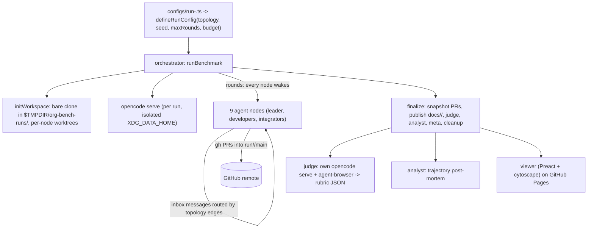

# org-bench - benchmarking multi-agent team topologies on one build task

Evidence was gathered read-only on 2026-09-23 from the local clone at `~/github/org-bench` (HEAD `dde9d4b`), the published results under `docs/`, a real typecheck, and the fleet sync logs.
Citations use `repo/path:line`.

## 1. TL;DR

org-bench measures how the organization of a team of nine coding agents (its communication graph, merge authority, and "culture" prompt) affects what they build, by having six company-inspired topologies (`apple`, `amazon`, `microsoft`, `google`, `facebook`, `oracle`) each build the same in-browser spreadsheet through real Git branches and GitHub PRs (`org-bench/AGENTS.md:3`).
Each run ends with an agent judge driving the deployed artifact in a real browser and scoring an 8-dimension rubric (1 to 5 each), plus an analyst post-mortem of the trajectory (`org-bench/AGENTS.md:64`, `org-bench/packages/schemas/src/index.ts:135`).
Upstream (Kun Chen, `kunchenguid/org-bench`) built it and ran 12 published runs; the user's fork has no fork-specific commits, and a dirty `package-lock.json` in the user's checkout has made the fleet sync skip this repo every day since at least 2026-08-23.

## 2. Problem it solves, and what breaks without it

Multi-agent frameworks assert that hierarchy, review gates, or peer meshes help, usually without measurement.
org-bench turns "how should agents be organized" into a controlled comparison: same brief, same model per suite, same node count, and only topology and culture vary (`org-bench/configs/apple.ts:6`, `org-bench/configs/apple.ts:10`, `org-bench/configs/run-apple.ts:3`).

Without its isolation rules, runs contaminate each other or the host:
- Agents that can reach the host repo commit into it; per-run scratch lives under `os.tmpdir()` and `initWorkspace` refuses a scratch root inside the repo (`org-bench/AGENTS.md:50`, `org-bench/packages/orchestrator/src/index.ts:406`).
- Without a branch ruleset, agents force-push to trunk and the PR culture collapses; the harness requires a ruleset on `run/**/main` (`org-bench/AGENTS.md:29`).
- A model override that reused default paths would overwrite baseline artifacts; `ORG_BENCH_MODEL` without `ORG_BENCH_SUITE` throws (`org-bench/packages/orchestrator/src/bench-cli.ts:106`).

## 3. Architecture



Packages (`org-bench/AGENTS.md:10`):
- `packages/orchestrator`: run loop, workspace setup, round scheduling, finalize pipeline; `index.ts` is 6,188 lines with exported stages such as `initWorkspace`, `runTopologyNodeRound`, `routeInboxMessage`, `publishRunArtifact`, `judgePublishedArtifact`, `aggregateRunMeta`, `cleanupRunBranches` (`org-bench/packages/orchestrator/src/index.ts:1770`, `org-bench/packages/orchestrator/src/index.ts:2549`, `org-bench/packages/orchestrator/src/index.ts:2174`, `org-bench/packages/orchestrator/src/index.ts:3223`, `org-bench/packages/orchestrator/src/index.ts:3285`, `org-bench/packages/orchestrator/src/index.ts:3471`, `org-bench/packages/orchestrator/src/index.ts:3889`).
- `packages/judge`: spawns its own `opencode serve` with an `AGENT_BROWSER_SESSION` and prompts for rubric JSON (`org-bench/packages/judge/src/index.ts:211`).
- `packages/analyst`: trajectory post-mortem.
- `packages/schemas`: shared zod types, including `RubricScore = z.number().int().min(1).max(5)` (`org-bench/packages/schemas/src/index.ts:135`).
- `packages/viewer`: public comparison site built with Preact, Vite, and cytoscape for topology graphs (`org-bench/packages/viewer/package.json:6`, `org-bench/packages/viewer/package.json:7`).

The orchestrator consumes opencode's server-sent event stream (`accept: text/event-stream` on `/global/event`) to follow agent sessions (`org-bench/packages/orchestrator/src/opencode-serve.ts:719`).

State and outputs (`org-bench/AGENTS.md:62`):
- Ephemeral: `$TMPDIR/org-bench-runs/<run-id>/` (bare `.git`, `main/` worktree, `worktrees/<agent>/`, `.xdg/opencode/`), deleted at teardown.
- Durable: `docs/<topo>/` or `docs/<suite>/<topo>/` with the artifact, `meta.json`, and `trajectory/` (`judge.json`, `analysis.json`, `events.jsonl`, `messages.jsonl`, `nodes/*.jsonl`, `prs/`), plus `run/<run-id>/main` on the remote with `.org-bench-artifacts/`.

## 4. Interfaces

Root scripts (`org-bench/package.json:21` onward): `npm run bench -- configs/run-<topo>.ts`, `npm run analyze`, `npm run aggregate -- <run-dir>`, `npm run build`, `npm run typecheck`, `npm run lint`, `npm run format`.
`bench` with no config throws `Usage: npm run bench -- <run-config>` (`org-bench/packages/orchestrator/src/bench-cli.ts:154`).

Model-variant runs use environment variables, not new config files (`org-bench/AGENTS.md:79`):

```bash
ORG_BENCH_SUITE=gpt-5-5 ORG_BENCH_MODEL=openai/gpt-5.5 npm run bench -- configs/run-apple.ts
```

Output formats: JSONL logs and trajectories, JSON `meta.json` / `judge.json`, and the static viewer site.
Monitoring guidance is written for agents: prefer event streaming (`tail -f` with a selective `grep`) over timed polling, and watch `turn_error`, `stage_failed`, and opencode RSS (`org-bench/AGENTS.md:110`, `org-bench/AGENTS.md:118`).

## 5. Configuration

| File | Key | Value (upstream) |
| --- | --- | --- |
| `configs/models.ts` | `node`, `judge`, `analyst`, `player` models | all `openai/gpt-5.4` by default (`org-bench/configs/models.ts:19`) |
| `configs/<topo>.ts` | `maxRounds` | 28 (`org-bench/configs/apple.ts:10`) |
| | `perNodeTurnTimeoutMs` | 3,600,000 (`org-bench/configs/apple.ts:11`) |
| | `runBudget` | 175,000,000 tokens, 28 h wall clock (`org-bench/configs/apple.ts:14`) |
| `configs/topologies/<topo>.ts` | nodes, edges, leader, integrators, culture | see table below |
| env | `ORG_BENCH_SUITE`, `ORG_BENCH_MODEL` | suite namespaces run id, docs path, branches, PR labels |

Topologies (from `configs/topologies/*.ts`):

| Topology | Leader | Integrators | Edge entries | Culture kind |
| --- | --- | --- | --- | --- |
| apple | Steve | 1 | 8 (star) | `apple-taste` |
| amazon | Jeff | 4 | 8 | `amazon-writing` |
| microsoft | Bill | 3 | 9 | `microsoft-competition` |
| google | Eric | 5 | 20 | `google-design-docs` |
| facebook | Mark | 9 (all) | 36 | `facebook-velocity` |
| oracle | Larry | 2 | 8 | `oracle-process` |

User's actual setting: none changed; the working tree differs from HEAD only in `package-lock.json` and the tracked `node_modules/.package-lock.json` (18 deleted lines), which looks like the residue of a local `npm install` (the repo tracks 2,661 files under `node_modules/`).

## 6. Connections

- **fleet-ops**: manifest `kind: benchmark`, `sync: true`, alias `cdob` (`.fleet/manifest.yaml:236`, `.fleet/aliases.zsh:35`).
  Every sync log on disk, from 2026-08-23 through 2026-09-23, records `[org-bench] working tree dirty -> skipped` (for example `.fleet/logs/sync-20260923.log:276`), because `sync-forks` refuses dirty trees (`dotfiles-nix/files/bin/sync-forks:155`).
  In practice nothing is stale yet: a read-only `git ls-remote upstream refs/heads/main` returned `dde9d4b`, equal to local HEAD (2026-09-23).
  See [fleet-ops](fleet-ops.md).
- **no-mistakes**: none; org-bench's CI is only typecheck and lint and has no `require-no-mistakes` gate (`org-bench/.github/workflows/ci.yml:1`).
- **gh / GitHub**: agents and the orchestrator use real `gh pr create` / `gh pr merge` against a protected branch (`org-bench/AGENTS.md:38`); the harness's own GitHub CLI is [gh-axi](gh-axi.md), but org-bench calls `gh` directly.
- **Browser verification**: the judge drives the artifact with `agent-browser` (`org-bench/AGENTS.md:64`), the same idea as the harness's `chrome-devtools-axi` real-browser verification rule, but a different tool.
- **Monitoring pattern**: its "stream, do not poll" guidance matches the Monitor-tool practice in Claude Code (`org-bench/AGENTS.md:110`).
- **Other harness components**: no reference from `agents`, skills, hooks, `firstmate`, or `dotfiles-nix` (grep, 2026-09-23).

## 7. Lifecycle walkthrough

Trace: `npm run bench -- configs/run-apple.ts`.

1. `bench-cli.ts` loads the run config and enforces the suite/model rule (`org-bench/packages/orchestrator/src/bench-cli.ts:42`, `org-bench/packages/orchestrator/src/bench-cli.ts:106`).
2. Preflight closes stale `run:<run-id>` PRs and `initWorkspace` wipes and recreates `$TMPDIR/org-bench-runs/apple/`, after checking the scratch root is outside the repo (`org-bench/AGENTS.md:73`, `org-bench/packages/orchestrator/src/index.ts:1770`, `org-bench/packages/orchestrator/src/index.ts:400`).
3. It bare-clones the remote, pushes an orphan `run/apple/main`, and adds a worktree per node (`org-bench/AGENTS.md:60`, `org-bench/packages/orchestrator/src/index.ts:1881`).
4. It starts `opencode serve` with an isolated `XDG_DATA_HOME` (`org-bench/packages/orchestrator/src/index.ts:1037`).
5. Each round, every node wakes, including nodes with empty inboxes, which get a stub offering stand down, continue, or reach out (`org-bench/AGENTS.md:56`); rounds run in parallel with per-node timeouts (`org-bench/packages/orchestrator/src/index.ts:2925`, `org-bench/packages/orchestrator/src/index.ts:2769`).
6. Outbound messages are routed only along topology edges; in `apple`, workers can talk only to Steve (`org-bench/packages/orchestrator/src/index.ts:2174`, `org-bench/configs/topologies/apple.ts:10`).
7. Developers open PRs against `run/apple/main`; only integrators merge, and merge authority is verified (`org-bench/packages/orchestrator/src/index.ts:3037`).
8. Between rounds, token and wall-clock budgets are checked (`org-bench/packages/orchestrator/src/index.ts:3115`); the run ends on leader submission or `maxRounds` (`org-bench/packages/orchestrator/src/index.ts:2961`).
9. Finalize: snapshot PRs, publish to `docs/apple/`, judge, analyst, aggregate `meta.json`, close PRs, delete agent branches, persist artifacts via a PR, and remove scratch (`org-bench/AGENTS.md:62`).

## 8. Failure modes and safeguards

| Failure | Safeguard | Evidence |
| --- | --- | --- |
| Agents commit into the host repo | scratch outside repo, enforced | `org-bench/packages/orchestrator/src/index.ts:406` |
| Agents bypass PR review | repo ruleset on `run/**/main` | `org-bench/AGENTS.md:29` |
| Runs share opencode state | per-run `XDG_DATA_HOME` | `org-bench/packages/orchestrator/src/index.ts:1037` |
| Model rerun overwrites baseline | env guard | `org-bench/packages/orchestrator/src/bench-cli.ts:106` |
| Runaway cost | token and wall-clock caps | `org-bench/packages/orchestrator/src/index.ts:3071` |
| Judge or analyst flake | `stage_failed` is non-fatal; finalize continues | `org-bench/AGENTS.md:118` |
| Memory blow-up | kill if opencode RSS passes about 40 GB | `org-bench/AGENTS.md:118` |
| Silent nodes forgotten | every node wakes every round | `org-bench/AGENTS.md:56` |

## 9. Testing and quality

- No automated test files in `packages/` (0 files matching `*.test.*`); quality gates are TypeScript and ESLint only.
- CI: Node 20, `npm ci`, `npm run typecheck`, `npm run lint` (`org-bench/.github/workflows/ci.yml:19`, `org-bench/.github/workflows/ci.yml:26`, `org-bench/.github/workflows/ci.yml:29`).

Real run (2026-09-23, `npm run typecheck`, all tsconfigs have `noEmit: true` via `org-bench/tsconfig.base.json:8`): all five workspaces (analyst, judge, orchestrator, schemas, viewer) passed with exit 0, and `git status` was unchanged.

### Results on disk

Recomputed from `docs/<topo>/meta.json` and `docs/<topo>/trajectory/judge.json` (rubric sum is over 8 dimensions, max 40):

| Run | Node model | Total tokens | Wall clock (min) | Messages | Rubric sum / 40 | Functional completeness / 5 |
| --- | --- | --- | --- | --- | --- | --- |
| apple | gpt-5.4 | 7,801,077 | 214 | 215 | 24 | 2 |
| amazon | gpt-5.4 | 4,260,234 | 181 | 164 | 25 | 2 |
| microsoft | gpt-5.4 | 7,218,920 | 256 | 208 | 24 | 2 |
| google | gpt-5.4 | 6,619,622 | 212 | 287 | 29 | 3 |
| facebook | gpt-5.4 | 6,716,424 | 250 | 213 | 27 | 2 |
| oracle | gpt-5.4 | 4,361,240 | 136 | 264 | 26 | 2 |
| gpt-5-5/apple | gpt-5.5 | 4,606,482 | 181 | 136 | 28 | 3 |
| gpt-5-5/amazon | gpt-5.5 | 3,626,943 | 148 | 64 | 21 | 2 |
| gpt-5-5/microsoft | gpt-5.5 | 1,936,316 | 98 | 31 | 27 | 3 |
| gpt-5-5/google | gpt-5.5 | 3,208,841 | 140 | 88 | 30 | 4 |
| gpt-5-5/facebook | gpt-5.5 | 3,026,390 | 136 | 101 | 24 | 2 |
| gpt-5-5/oracle | gpt-5.5 | 3,585,966 | 93 | 154 | 24 | 2 |

All 12 runs report `deploy_success: true`, and `cost_usd` is 0 in `meta.json` (subscription-billed, so dollar cost is not measured).
Honest reading: `google` is highest in both suites, but n = 1 per topology per suite, so these are observations, not statistically supported rankings.
The judge rationale for `apple` (gpt-5.4) notes the formula engine was not wired into rendering, which is why functional completeness is 2 despite a visual polish score of 4 (`docs/apple/trajectory/judge.json`).

## 10. Fork delta

No fork-specific commits; tracks upstream.
`git log upstream/main..HEAD` is empty; all 5 commits in this clone are by upstream authors.
The only local divergence is the uncommitted lockfile change described above.

## 11. Interview angle

**Q1. How would you evaluate whether a multi-agent architecture actually helps?**
Hold the task, model, and team size fixed; vary one organizational variable; score the shipped artifact with a behavior-based judge that uses a real browser; and log full trajectories so you can explain the score (`org-bench/AGENTS.md:64`).
Then be honest about sample size: one run per cell is anecdote.

**Q2. How do you sandbox autonomous agents that push to GitHub?**
Disposable bare clones outside the host repo, branch rulesets that require PRs and block force-push, per-run tool state, and an orchestrator that is the only actor allowed to land artifacts (`org-bench/AGENTS.md:29`, `org-bench/AGENTS.md:50`).
The same controls map to an enterprise release pipeline: protected branches, required reviews, and service identities with narrow rights.

**Q3. What does Conway's law predict here?**
Star topologies (apple) funnel all integration through one leader, which becomes the bottleneck; meshes (facebook, 36 edge entries) spend more on coordination.
The data here is too small to confirm either effect, and saying so is the right answer.

**Trade-off to defend.** Waking every node every round costs tokens (idle nodes still get a prompt) but guarantees no agent is silently starved of attention (`org-bench/AGENTS.md:56`); the downside is inflated token totals that partially measure the scheduler, not the topology.
