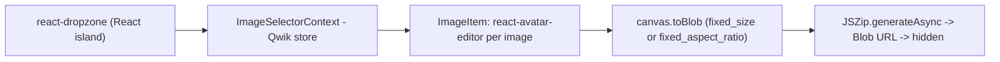

# presize - a client-side bulk image cropper (Qwik + React islands + Tailwind)

Evidence was gathered read-only on 2026-09-23 from the local clone at `~/github/presize` (HEAD `5478e18`).
Citations use `repo/path:line`.

## 1. TL;DR

Presize.io is a small open-source web app for bulk preprocessing, resizing, and cropping images entirely in the browser, then downloading a ZIP (`presize/README.md:13`, `presize/apps/web/src/routes/index.tsx:155`).
It is a pnpm monorepo whose `apps/web` is a Qwik City app that embeds React 18 components as islands through `qwikify$`, styled with Tailwind 3 and daisyUI, and built for Cloudflare Pages (`presize/apps/web/package.json:18`, `presize/apps/web/package.json:20`, `presize/apps/web/package.json:30`, `presize/apps/web/package.json:8`).
It is upstream work (first commit 2023-07-12) and the oldest, least harness-related repo in this cluster; the user's fork has no fork-specific commits.

## 2. Problem it solves, and what breaks without it

Preparing an image set (for example an ML training set) at one size or aspect ratio usually means a desktop editor or a server upload.
Presize does it client-side: drop images, adjust each crop, pick output size mode and format, add optional per-image captions, and download one ZIP with matching `.txt` caption files (`presize/apps/web/src/routes/index.tsx:155`).
Without it, users upload private images to a server or crop one by one.

## 3. Architecture

- Monorepo: `apps/web`, `packages/eslint-config-custom`, `packages/tsconfig` (`presize/README.md:35`, `presize/pnpm-workspace.yaml:1`).
- `apps/web/src/components/ImageSelector.tsx`: React component using `useDropzone`, exported to Qwik via `qwikify$` (`presize/apps/web/src/components/ImageSelector.tsx:59`, `presize/apps/web/src/components/ImageSelector.tsx:204`).
- `apps/web/src/lib/utils.ts`: converts the editor canvas to a Blob, scaled or unscaled depending on `OutputSizingMode` (`presize/apps/web/src/lib/utils.ts:5`, `presize/apps/web/src/lib/utils.ts:7`).
- `apps/web/src/lib/types.ts`: `ProcessedImage { id, file, blob, caption? }`, `OutputFormat 'png' | 'jpeg'`, `OutputSizingMode 'fixed_size' | 'fixed_aspect_ratio'` (`presize/apps/web/src/lib/types.ts:6`, `presize/apps/web/src/lib/types.ts:20`).
- `apps/web/src/routes/index.tsx`: the page and the download handler.
- Adapter: `adapters/cloudflare-pages/vite.config.ts` for the SSR server build (`presize/apps/web/package.json:8`).

State: none server-side; everything lives in browser memory.
Analytics uses Mixpanel with `localStorage` persistence initialized in `root.tsx` (`presize/apps/web/src/root.tsx:12`; the project token is intentionally not reproduced here).
`firebase` is declared as a dependency but has zero references under `apps/web/src` (grep, 2026-09-23).

## 4. Interfaces

No CLI and no API; the fleet manifest records `kind: app`, `provides_bin: []` (`.fleet/manifest.yaml:221`).

| Command (from repo root) | Effect |
| --- | --- |
| `pnpm install` | install workspace deps (pnpm 8.6.2 pinned) |
| `pnpm -r dev` | `vite --mode ssr` dev server (`presize/README.md:52`, `presize/apps/web/package.json:10`) |
| `pnpm -r build` | `qwik build` |
| `pnpm -r lint` | ESLint with `--max-warnings 0` (`presize/apps/web/package.json:14`) |

## 5. Configuration

| File | Key | Value |
| --- | --- | --- |
| `package.json` (root) | `packageManager` | `pnpm@8.6.2` |
| `apps/web/tailwind.config.js` | `plugins`, `daisyui.themes` | daisyUI, `['retro']` (`presize/apps/web/tailwind.config.js:7`, `presize/apps/web/tailwind.config.js:9`) |
| `.github/workflows/build.yml` | Node matrix | `16.x` (`presize/.github/workflows/build.yml:18`) |

User's setting: the fleet manifest warns to keep pnpm 8.6.2 for this repo via corepack or `pnpm dlx` and not force the global pnpm 11 (`.fleet/manifest.yaml:230`).
That note is the user's operational knowledge, recorded because every other Node repo in the fleet uses pnpm 11.

## 6. Connections

- **fleet-ops**: `sync: true`, alias `cdpz` (`.fleet/manifest.yaml:221`, `.fleet/aliases.zsh:34`); synced "already up to date" on 2026-09-23 (`.fleet/logs/sync-20260923.log:275`).
  See [fleet-ops](fleet-ops.md).
- **no-mistakes**: none; presize has only a `build.yml` workflow and no `require-no-mistakes` gate or CONTRIBUTING rule, unlike the newer kunchenguid apps.
- **Agent provenance (upstream)**: several 2025 upstream PRs came from branches named `codex/...`, for example `codex/add-image-tagging-and-export-to-.txt` (commit `458657b`), which indicates the upstream author used a Codex agent for those features.
  This is upstream history, not the user's work.
- **Other harness components**: no reference from `agents`, skills, hooks, `firstmate`, or `dotfiles-nix` (grep, 2026-09-23).

## 7. Lifecycle walkthrough

Trace: drop 20 photos, crop, download.

1. `useDropzone` accepts image files and pushes them into the selector context (`presize/apps/web/src/components/ImageSelector.tsx:59`, `presize/apps/web/src/components/ImageSelector.tsx:66`).
2. Each image renders an `AvatarEditor` so the user can pan and zoom its crop (`presize/apps/web/src/components/ImageItem.tsx:137`).
3. Clicking Download sets `processing = true`, asks the image provider for Blobs in the chosen format, and alerts if none are selected (`presize/apps/web/src/routes/index.tsx:146`, `presize/apps/web/src/routes/index.tsx:148`, `presize/apps/web/src/routes/index.tsx:150`).
4. For each result it de-duplicates file names with a `typeid` prefix, adds the image to a `JSZip`, and adds a normalized `.txt` caption when present (`presize/apps/web/src/routes/index.tsx:155`).
5. `zip.generateAsync({ type: 'blob' })` builds the archive, a hidden `<a download>` is clicked, and the object URL is revoked after 1 s (`presize/apps/web/src/routes/index.tsx:176`).

## 8. Failure modes and safeguards

| Failure | Safeguard | Evidence |
| --- | --- | --- |
| Double-click starts two exports | `processing` flag disables the button | `presize/apps/web/src/routes/index.tsx:140` |
| Duplicate file names overwrite in ZIP | `typeid` prefix on collision | `presize/apps/web/src/routes/index.tsx:159` |
| Memory leak from object URLs | `URL.revokeObjectURL` after download | `presize/apps/web/src/routes/index.tsx:197` |
| Large batches exhaust browser memory | none; all Blobs held in memory until zipped (unverified limit) | |

## 9. Testing and quality

- No unit tests in the repo.
- CI builds and lints on `ubuntu-latest` with Node 16 and pnpm 8.6.2 (`presize/.github/workflows/build.yml:18`, `presize/.github/workflows/build.yml:35`, `presize/.github/workflows/build.yml:37`).
- I did not run a build: it needs a pnpm 8 toolchain and would write build output into the repo.

## 10. Fork delta

No fork-specific commits; tracks upstream.
`git log upstream/main..HEAD` is empty; all 27 commits are by upstream authors.
The user's contribution: fleet manifest entry with the pnpm 8 pin warning.

## 11. Interview angle

**Q1. How would you embed an existing React component library in another framework?**
Use an interop layer that mounts React as an island (here Qwik's `qwikify$`), keep shared state in the host framework's store, and pass plain data across the boundary (`presize/apps/web/src/components/ImageSelector.tsx:204`).
This is the same problem as hosting a React widget inside an OpenFin or legacy container app.

**Q2. Why process images client-side?**
Privacy and cost: no upload, no server compute, and the static site can be served from a CDN edge (Cloudflare Pages adapter).
The downside is device-bound performance and memory.

**Q3. What would you fix first in this codebase?**
Add tests around the export path, remove the unused `firebase` dependency, and upgrade CI from Node 16 (end-of-life) to a supported LTS.

**Trade-off to defend.** Generating the whole ZIP in memory with `generateAsync` is simple and works for tens of images, but it holds every Blob plus the archive in RAM at once; for hundreds of large images a streaming ZIP writer would be the safer design.
