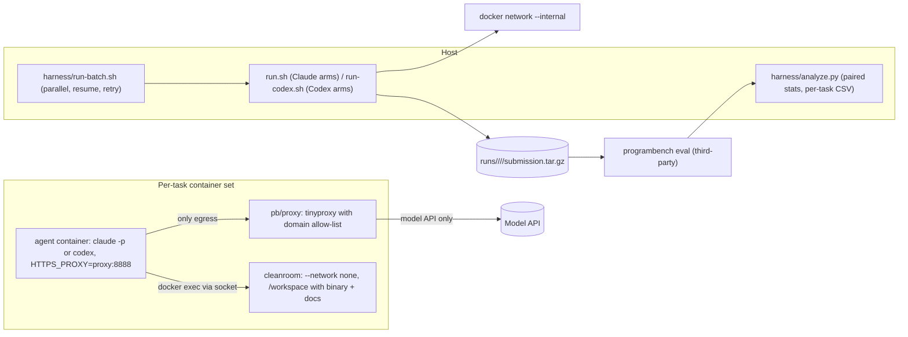

# programbench-bench - holding the model fixed to measure the harness

Evidence was gathered read-only on 2026-09-23 from the local clone at `~/github/programbench-bench` (HEAD `0bf99e6`), the committed study data under `blog/`, a syntax check of the harness scripts, and my own recomputation of the headline statistics from the per-task CSVs.
Citations use `repo/path:line`.

## 1. TL;DR

programbench-bench inverts the ProgramBench paper: instead of running many models through one minimal agent, it holds the model constant and changes exactly one harness variable per study (mandated language, a TDD workflow skill, a coding-guidelines file, skills, MCP, orchestration prompt), then compares arms paired per task (`programbench-bench/README.md:25`).
Each task asks the agent to reimplement a real CLI tool from its binary and docs inside network-isolated Docker containers, scored by a hidden test suite, and results are reported as mean pass rate with paired Wilcoxon tests, Holm correction, and difficulty terciles (`programbench-bench/README.md:41`, `programbench-bench/README.md:121`).
Upstream (Kun Chen, `kunchenguid/programbench-bench`) built it and ran three published studies on gpt-5.5 with n = 192 tasks; the user's fork has no fork-specific commits, and I independently recomputed the three headline results from the committed CSVs and they match.

## 2. Problem it solves, and what breaks without it

Harness choices (TDD skills, "be simple" guidelines, curated skill packs, MCP servers) are usually adopted by anecdote.
This repo makes each one a controlled A/B: same model, same tasks, same sandbox, one variable (`programbench-bench/README.md:31`).

What breaks without its rigor:
- A binarized "resolved" metric is degenerate at this difficulty (few tasks fully pass), so it reports a continuous per-task pass rate (`programbench-bench/README.md:120`).
- Ranking arms by means invites noise-chasing; claims need a paired, threshold-free test (`programbench-bench/README.md:121`).
- Agents can "reimplement" a tool by secretly calling the original engine; the harness strips reference tools, forbids delegation in the prompt, audits code, and blocklists tasks where the engine ships inside the language runtime (`programbench-bench/README.md:128`).
- Without network isolation, the agent could download the original source; the cleanroom is `--network none` and the agent's only egress is a whitelisting proxy (`programbench-bench/harness/run.sh:5`, `programbench-bench/harness/run.sh:7`).

## 3. Architecture

Components:
- `harness/run.sh`: one (arm, task) end to end for Claude arms; builds the internal network, starts cleanroom and proxy, runs the agent with budget, timeout, idle-kill, and auto-compact limits (`programbench-bench/harness/run.sh:21`, `programbench-bench/harness/run.sh:25`, `programbench-bench/harness/run.sh:26`, `programbench-bench/harness/run.sh:28`, `programbench-bench/harness/run.sh:104`, `programbench-bench/harness/run.sh:145`, `programbench-bench/harness/run.sh:187`).
- `harness/run-codex.sh`: the same topology for Codex arms.
- `harness/run-batch.sh`: parallel batches with resume and retry; routes `codex-*` arms automatically (`programbench-bench/README.md:72`).
- `harness/hooks/bash-network-deny.py`: a Claude Code PreToolUse hook that exits 2 to deny any Bash command containing an internet-touching token (`programbench-bench/harness/hooks/bash-network-deny.py:2`).
- `harness/disallowed-default`: the always-applied `--disallowed-tools` list, including `WebFetch`, `WebSearch`, `Bash(curl*)`, `Bash(git push*)`, and `Bash(pip install*)` (`programbench-bench/harness/disallowed-default:1`).
- `harness/strip-ref/`: per-task scripts that remove the reference engine from the cleanroom (12 scripts, for example `sqlite__sqlite.839433d.sh`).
- Operational watchdogs: `disk-watchdog.sh`, `mem-watchdog.sh`, `hang-killer.sh`, `net-reaper.sh`, `claude-supervisor.sh`.
- `harness/analyze.py`: deterministic report (per-arm summary, threshold ladder, paired stats, per-task CSV); it imports the third-party `programbench` package (`programbench-bench/harness/analyze.py:38`).
- `arms/<name>/`: an arm is a directory; `orchestration.md` is required, and optional `settings.json`, `mcp.json`, `skills/`, `setting-sources`, `disallowed-extra` are applied by convention (`programbench-bench/arms/README.md:8`).

Data model: `blog/<study>/data/per-task.csv` with one row per (arm, task) and columns `arm, task, pct, pct_ran, compile_ok, n_total_tests, n_ran_tests, n_passed_tests, language, wraps_tool, cost_usd, turns, duration_min, n_skills_invoked, skills_invoked` (`programbench-bench/blog/does-tdd-help-coding-agents/data/per-task.csv:1`), plus `data/submissions/<arm>/<task>.tar.gz` with the code each arm wrote.

State files: `runs/<run>/<arm>/<task>/submission.tar.gz` (resume key: at least 200 bytes means done, the 29-byte empty tar means retry, `programbench-bench/AGENTS.md:42`, `programbench-bench/AGENTS.md:43`), `logs/<run>/<arm>/.../transcript.jsonl`, and `/tmp/<run>-full.log` / `.pid` for detached batches.

## 4. Interfaces

From the README CLI reference (`programbench-bench/README.md:134` onward):

| Command | Effect |
| --- | --- |
| `harness/run.sh --arm <a> --task <t>` | one Claude arm and task |
| `harness/run-codex.sh --arm <a> --task <t>` | one Codex arm and task |
| `harness/run-batch.sh --arms <a,b> --slice <i:j> --run-name <n> --parallel 
` | batch with resume and retry |
| `harness/reeval.sh <arm> [timeout]` | re-score existing submissions, skipping blocklisted tasks |
| `harness/analyze.py --run <name> --arms <a,b>` | paired report |
| `programbench eval runs/<run>/<arm>` | score submissions (third-party package) |

Tunables in `run.sh`, all env-overridable (`programbench-bench/AGENTS.md:74`):

| Var | Default | Meaning |
| --- | --- | --- |
| `PB_BUDGET_USD` | 50 | API budget per task |
| `PB_TIMEOUT_SEC` | 7200 | hard kill at 120 min |
| `PB_IDLE_KILL_SEC` | 180 | kill if idle 3 min after a result |
| `PB_PRERESULT_IDLE_SEC` | 900 | kill if idle 15 min with no result |
| `PB_AUTO_COMPACT_WINDOW` | 400000 | `claude -p` auto-compacts at this token count |

Real checks run on 2026-09-23:
- `bash -n` over all 27 `harness/*.sh` scripts: no syntax errors.
- `python3 harness/analyze.py --help` failed with `ModuleNotFoundError: No module named 'programbench'` because the `cache/pb-venv` venv from the Quick Start is not installed locally; I did not install it.

## 5. Configuration

- Arms present: `vanilla`, `gstack-curated`, `claude-free`, `codex-free`, `codex-free-tdd`, `codex-free-karpathy`, `codex-free-rtk`, `codex-vanilla`, `codex-vanilla-clean`, and eight `codex-lang-*` arms (c, go, java, js, python, ruby, rust, ts).
- Held constant across arms: model (`PB_MODEL`, default `claude-opus-4-7` for Claude arms) and budget cap (`programbench-bench/arms/README.md:35`).
- Operational default `--parallel 2`, lowered from 4 on 2026-06-22 after parallel 4 exhausted the Codex gpt-5.5 rolling usage quota mid-run and later tasks false-failed (`programbench-bench/AGENTS.md:40`).
- User's actual setting: none; there is no `runs/`, `logs/`, `cache/`, or `.claude-oauth-token` in the user's clone (listing, 2026-09-23), so the user has not run the harness.

Documentation drift in upstream: `AGENTS.md` describes the study as holding Claude Opus 4.7 fixed across `vanilla` and `gstack-curated` (`programbench-bench/AGENTS.md:8`) and points at `plans/codex-pilot-2.md` (`programbench-bench/AGENTS.md:12`), but no `plans/` directory exists and the three published studies use gpt-5.5 Codex arms.

## 6. Connections

- **Claude Code hooks (`agents` repo)**: `bash-network-deny.py` uses the same PreToolUse hook point as the user's `guard.py`, which `~/.claude/settings.json` registers on Bash and on Write/Edit (`agents/claude/hooks/guard.py:2`).
  The mechanisms differ: the benchmark hook denies with exit code 2, while `guard.py` prints a PreToolUse JSON decision and always exits 0 (`agents/claude/hooks/guard.py:9`).
  See [agents](agents.md).
- **quota-axi and routing policy (conceptual)**: the benchmark's quota incident, where parallel 4 drained a rolling window and caused silent false failures (`programbench-bench/AGENTS.md:40`), is the failure the user's manual guards against with "size it against the limiting window, not the headline percentage" (`~/.claude/CLAUDE.md:180`) and the `quota-axi` check before long runs (`~/.claude/CLAUDE.md:183`).
- **Skills and TDD policy (conceptual)**: the TDD study measured a mandated test-first skill as strictly worse on hidden-spec reimplementation; the user's `python-testing` skill mandates a RED gate specifically for bug fixes (`~/.agents/skills/python-testing/SKILL.md:13`), which is a narrower rule than blanket TDD and is not what this study tested.
- **loop-design-check skill (conceptual)**: the benchmark's supervision rules (health cron, do not auto-restart, idle kills) are examples of the loop-damping concerns the user's `loop-design-check` skill covers (`~/.agents/skills/loop-design-check/SKILL.md:3`, `programbench-bench/AGENTS.md:45`).
- **fleet-ops**: `kind: benchmark`, toolchain bash, python, docker, `install: "none"`, alias `cdpb` (`.fleet/manifest.yaml:266`, `.fleet/aliases.zsh:37`); synced on 2026-09-23 (`.fleet/logs/sync-20260923.log:280`).
  See [fleet-ops](fleet-ops.md).
- **no-mistakes**: none; no `.github/workflows/` in this repo.
- No code references from `agents`, `firstmate`, `dotfiles-nix`, or skills (grep, 2026-09-23).

## 7. Lifecycle walkthrough

Trace: one TDD-study task, as documented and scripted.

1. The operator launches `nohup ./harness/run-batch.sh --arms codex-free,codex-free-tdd --slice 0:201 --run-name <n> --parallel 2 &` and arms a periodic health check (`programbench-bench/AGENTS.md:31`, `programbench-bench/AGENTS.md:45`).
2. `run-batch.sh` skips tasks whose `submission.tar.gz` is at least 200 bytes and routes `codex-*` arms to `run-codex.sh` (`programbench-bench/AGENTS.md:42`, `programbench-bench/README.md:72`).
3. For each task, the runner creates an `--internal` Docker network, starts the cleanroom with `--network none` (the reference engine stripped when `PB_STRIP_REF=1`), and the proxy with its allow-list (`programbench-bench/harness/run.sh:104`, `programbench-bench/harness/run.sh:145`, `programbench-bench/README.md:128`).
4. The agent container starts with `HTTPS_PROXY=http://proxy:8888`, the arm's `orchestration.md` appended to `harness/system.md`, and the arm's skills planted (for the TDD arm, `arms/codex-free-tdd/skills/test-driven-development`) (`programbench-bench/harness/run.sh:187`, `programbench-bench/arms/README.md:16`).
5. The agent probes the binary via `docker exec` into the cleanroom and writes its reimplementation; idle and total timeouts bound the run (`programbench-bench/harness/run.sh:26`, `programbench-bench/harness/run.sh:27`).
6. The submission is tarred to `runs/<run>/<arm>/<task>/submission.tar.gz`.
7. `programbench eval` scores each arm; `analyze.py` produces paired statistics and the per-task CSV, from which the blog's numbers are derived (`programbench-bench/blog/does-tdd-help-coding-agents/DATA.md:46`).

## 8. Failure modes and safeguards

| Failure | Safeguard | Evidence |
| --- | --- | --- |
| Agent reaches the internet | `--internal` net, proxy allow-list, `--network none` cleanroom, disallowed tools, deny hook | `programbench-bench/harness/run.sh:5`, `programbench-bench/harness/hooks/bash-network-deny.py:2` |
| Agent wraps the reference tool | strip-ref scripts, prompt rule, code audit, blocklist | `programbench-bench/README.md:128` |
| Quota exhaustion silently fails tasks | default parallel 2; grep transcripts for `usage limit` | `programbench-bench/AGENTS.md:40`, `programbench-bench/AGENTS.md:58` |
| Docker Hub rate limit (429) cascades | require `docker login` for parallel above 1 | `programbench-bench/AGENTS.md:40` |
| Agent hangs mid-tool | idle kills at 180 s after a result and 900 s before one | `programbench-bench/harness/run.sh:26`, `programbench-bench/harness/run.sh:27` |
| Batch dies unattended | health check cron; surface loudly, never auto-restart | `programbench-bench/AGENTS.md:53` |
| Broken tasks distort results | 8-task blocklist, n = 192 | `programbench-bench/blog/does-tdd-help-coding-agents/DATA.md:31` |
| Post-hoc cherry-picking | confirmatory vs exploratory labels; methods fixed a priori | `programbench-bench/README.md:123` |

## 9. Testing and quality

- No unit test suite and no CI workflows; quality control is methodological (paired statistics, audits, blocklists) and the README suggests `bash -n` and `analyze.py --help` as sanity checks.
- My `bash -n` run passed on all 27 scripts; `analyze.py --help` needs the `programbench` venv (not installed).

### Results on disk, independently recomputed

I recomputed per-arm means and paired Wilcoxon signed-rank p-values (scipy 1.18.0, two-sided, no Holm correction) from the committed CSVs on 2026-09-23:

| Study | Comparison (n = 192 paired tasks) | Mean pass rate | Cost per task | Turns | Wins / losses | Wilcoxon p (mine) | Blog claim |
| --- | --- | --- | --- | --- | --- | --- | --- |
| TDD | `codex-free` vs `codex-free-tdd` | 52.4 vs 48.8 | $1.12 vs $1.73 | 40 vs 67 | 136 / 53 (3 ties) | 3.1e-08 | "52.4 / 48.8, p < 0.0001, 53 / 136 / 3, +55% cost, +69% turns" (`programbench-bench/blog/does-tdd-help-coding-agents/index.md:30`) |
| Guidelines | `codex-free` vs `codex-free-karpathy` | 53.7 vs 51.5 | $1.12 vs $1.18 | 40 vs 42 | 111 / 79 | 0.0052 | "53.7 to 51.5, p = 0.005, lost 111 won 79" (`programbench-bench/blog/do-coding-guidelines-help-agents/index.md:15`) |
| Languages | `codex-lang-ts` vs `codex-lang-js` | 51.4 vs 50.2 | $1.37 vs $1.22 | 42 vs 42 | 98 / 92 | 0.65 | "51.4 to 50.2, p = 0.65" (`programbench-bench/blog/best-programming-languages-for-agents/index.md:100`) |

Other language-study means from the same CSV: free choice 52.4 ($1.12), python 51.8, rust 51.1 ($1.40, the most expensive), ruby 50.6, go 50.1, java 48.0, c 47.4 (lowest).
The blog's headline is that free choice is statistically ahead only of c and java, and that the rest form a tight cluster (`programbench-bench/blog/best-programming-languages-for-agents/index.md:64`).

One data subtlety I found: the `codex-free` arm has a mean of 52.4 in the TDD CSV but 53.7 in the guidelines CSV, and 12 of its 192 task scores differ between the two files.
This is consistent with each study's own de-pollution pass (re-running tasks where either compared arm wrapped the reference engine, `programbench-bench/blog/does-tdd-help-coding-agents/DATA.md:37`), but that explanation is my inference (unverified).

## 10. Fork delta

No fork-specific commits; tracks upstream.
`git log upstream/main..HEAD` is empty; all 15 commits are by upstream authors (`kunchenguid`, Kun Chen), and `git ls-remote` confirmed upstream `main` is `0bf99e6`, equal to local HEAD (2026-09-23).

## 11. Interview angle

**Q1. How do you A/B test a change to an AI coding workflow?**
Hold the model, tasks, and sandbox fixed, change one variable, pair results per task, use a continuous metric, and test with a paired non-parametric test with multiple-comparison correction (`programbench-bench/README.md:120`, `programbench-bench/README.md:121`).
Report difficulty strata and label exploratory analyses.

**Q2. Does TDD help coding agents?**
In this setting (black-box reimplementation with a hidden spec, gpt-5.5, one strict TDD skill), no: pass rate fell 3.6 points and cost rose 55 percent, which I verified from the CSV.
The mechanism the author describes is that self-written tests cannot see the hidden spec, so "minimal code to pass" ships an incomplete product (`programbench-bench/blog/does-tdd-help-coding-agents/index.md:47`).
The honest caveat is scope: TDD's usual payoff is a known spec and long-lived regression safety, which these tasks remove.

**Q3. How do you make an agent evaluation hermetic?**
Layer defenses: network namespaces (`--internal`, `--network none`), an egress allow-list proxy, tool deny lists, a PreToolUse hook that sees the full command string, and removal of reference artifacts, plus audits because each layer leaks (`programbench-bench/harness/hooks/bash-network-deny.py:12`).
The same defense-in-depth thinking applies to regulated CI: build agents with no general internet, pinned mirrors, and audit logs.

**Trade-off to defend.** Paired Wilcoxon on per-task pass rates is robust and assumption-light, but it tests whether one arm tends to beat the other on tasks, not the size of the mean difference, and with one run per task it cannot separate task-level noise from arm effects; the author mitigates this by leaning on aggregate direction and mechanism rather than individual task deltas (`programbench-bench/blog/does-tdd-help-coding-agents/index.md:70`).
