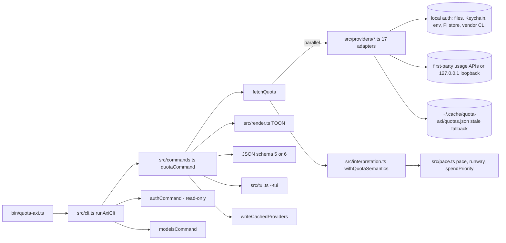
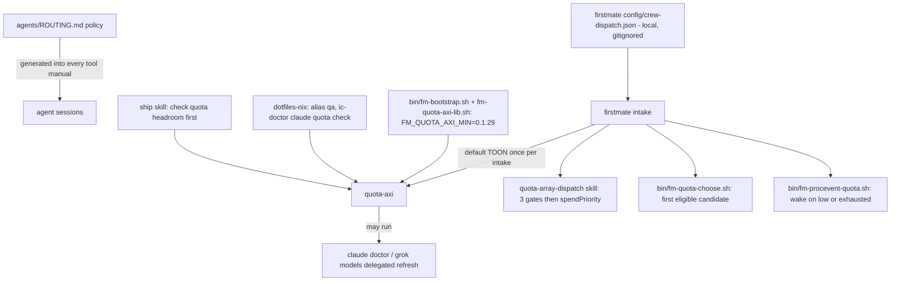
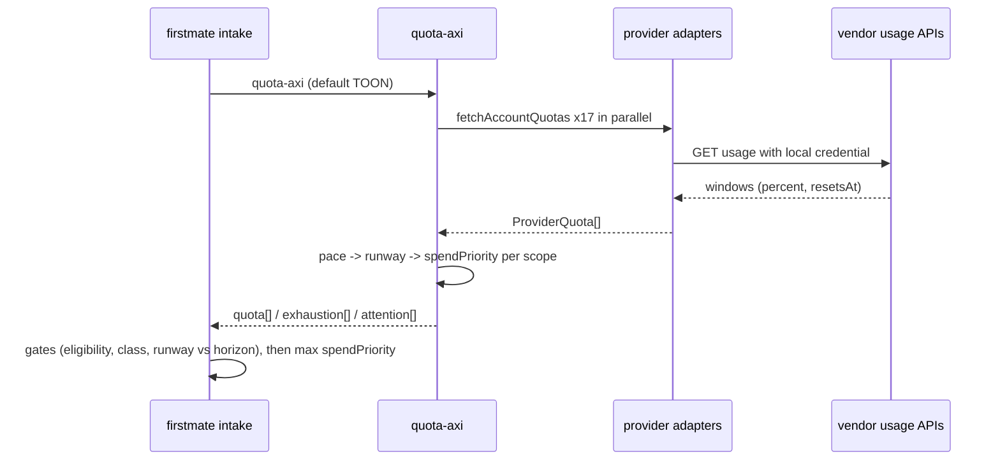

# quota-axi - subscription quota evidence for routing agents

Evidence was measured on 2026-09-23 against the local clone at `~/github/quota-axi` (HEAD `abe09a0`, release 0.1.53) and the installed binary of the same version.
Citations use `repo/path:line`, with the repo name relative to `~/github`.

## 1. TL;DR

quota-axi reads the quota windows of 17 AI coding subscriptions from local auth sources and first-party usage endpoints, normalizes them into one model, and reports per-scope effective remaining percentage, projected runway, and a `spendPriority` scalar.
It is deliberately data-only: it never routes, ranks, mints credentials, or proxies, and the consumer (firstmate plus the user's routing policy) makes every routing decision from its output.
Upstream (Kun Chen, `kunchenguid/quota-axi`) wrote all of the code; the user's fork has no fork-specific commits, and the user's work is the routing policy in `agents/ROUTING.md` and firstmate's local `config/crew-dispatch.json` that turns these signals into model choices.

## 2. Problem it solves, and what breaks without it

The user runs three paid subscriptions (Claude Code Max, Grok Build, Gemini through Antigravity) and routes each task to one of them (`agents/ROUTING.md:9-22`).
Each subscription has several overlapping limits with different reset clocks: Claude has a five-hour session window inside a seven-day window, plus a separate weekly window for the Fable model (`quota-axi/src/providers/claude.ts:1056-1089`).
The headline percentage lies: a scope is only as available as its tightest bounding window, and a window can be 89% full of headroom yet exhaust in under three hours at the current burn.

Without quota-axi:

- An agent dispatched to a nearly exhausted window stalls mid-task, which is the most expensive failure in an autonomous run.
- Use-it-or-lose-it allowance expires unused at reset because nothing measures forfeiture.
- Every consumer would re-implement fragile, per-vendor credential discovery and window arithmetic, and some would do unsafe things like performing refresh-token exchanges that sign the user out of the vendor CLI (`quota-axi/README.md:955`).

## 3. Architecture



### Modules

| Module | Role | Evidence |
| --- | --- | --- |
| `src/cli.ts` | Help text, command table (`quota`, `auth`, `models`), `quota` as implicit default | `quota-axi/src/cli.ts:14-76` |
| `src/commands.ts` | Flag parsing, provider fetch fan-out, output selection, cache write | `quota-axi/src/commands.ts:44-90`, `quota-axi/src/commands.ts:337-360` |
| `src/providers/index.ts` | Registry of 17 adapters | `quota-axi/src/providers/index.ts` (`PROVIDERS`) |
| `src/providers/<name>.ts` | Per-vendor credential discovery and quota fetch (Claude alone is 1,909 lines) | `quota-axi/src/providers/claude.ts:53-54` |
| `src/interpretation.ts` | Per-provider "semantics": which windows bound which scope | `quota-axi/src/interpretation.ts:461-496`, `quota-axi/src/interpretation.ts:789-858` |
| `src/pace.ts` | Window pace, effective runway, selection scalar | `quota-axi/src/pace.ts:48-403` |
| `src/render.ts` | TOON blocks `quota[]`, `exhaustion[]`, `attention[]` | `quota-axi/src/render.ts:169-205` |
| `src/cache.ts` + `src/lib/fs.ts` | Stale-fallback cache with account-context stamping | `quota-axi/src/cache.ts:50-102`, `quota-axi/src/lib/fs.ts:52-54` |
| `src/lib/user-config.ts` | Human-only TUI preference | `quota-axi/src/lib/user-config.ts:12-32` |

### Data model

The core unit is a `QuotaWindow`: `id`, `label`, `kind` (`session`, `weekly`, `monthly`, `model`, `credits`, `unknown`), `percentUsed`, `percentRemaining`, `resetsAt`, and optionally `startsAt` or `windowSeconds` (`quota-axi/src/types.ts:194-214`).
Each provider result carries `windows`, a `state` (`fresh`, `stale`, `unavailable`, `auth_required`, `rate_limited`, `error`), and `quotaSemantics.effectiveAvailability[]`, one entry per scope (`quota-axi/src/cache.ts:34-41`).

### The windows model

A scope is a set of windows that jointly bound some usable capacity.

| Provider | Scopes and their bounding windows | Evidence |
| --- | --- | --- |
| Claude | `all_models` = {`five_hour`, `seven_day`}; `model:<id>` = account windows plus that model's own weekly window | `quota-axi/src/interpretation.ts:461-496` |
| Grok | `all_products` = {`credits`}; `product:<id>` = `credits` plus the product window | `quota-axi/src/interpretation.ts:553-584` |
| Antigravity (`agy`) | `gemini` = {`gemini_5h`, `gemini_weekly`}; `claude_gpt` = {`claude_gpt_5h`, `claude_gpt_weekly`} | `quota-axi/src/interpretation.ts:895-930` |
| Codex | `all_models` from base account windows; model scopes add their own windows; a base zero contradicted by live model windows becomes a `boundConflict` | `quota-axi/src/interpretation.ts:498-531` |

Claude's windows come from `https://api.anthropic.com/api/oauth/usage`, where a `session` group maps to `five_hour` with `windowSeconds` 5 hours, a `weekly` group maps to `seven_day`, and a model-scoped entry maps to `model:<id>` with a 7-day cycle (`quota-axi/src/providers/claude.ts:53`, `quota-axi/src/providers/claude.ts:1047-1089`).
Unfamiliar windows make semantics `partial`, which suppresses both runway and selection rather than guessing (`quota-axi/src/interpretation.ts:469-479`, `quota-axi/src/interpretation.ts:730-752`).

### effectivePercentRemaining

For a scope whose bounding windows all report a percentage, `effectivePercentRemaining = min(percentRemaining over boundedBy)`, and `limitingWindowIds` names the windows at that minimum (`quota-axi/src/interpretation.ts:840-856`).
If any bound lacks a percentage, the scope's status is `unknown` and no effective percentage is published (`quota-axi/src/interpretation.ts:827-838`).

### Pace per window

`computeWindowPace` resolves the cycle from `startsAt` and `resetsAt`, or from `resetsAt - windowSeconds` (`quota-axi/src/pace.ts:458-512`), then computes (`quota-axi/src/pace.ts:67-102`):

```text
timeRemainingPercent = 100 * (resetsAt - now) / cycle
elapsedPercent       = 100 * (now - startsAt) / cycle
reservePercentPoints = percentRemaining - timeRemainingPercent
burnMultiple         = percentUsed / elapsedPercent
projectedExhaustedAt = now + percentRemaining / (percentUsed / elapsedMs)
projectionConfidence = early if elapsedPercent < 10 else established
```

Pace status is `on_pace` within 1 point of zero reserve, `ahead` when reserve is negative (spending faster than the clock), and `behind` when positive (`quota-axi/src/pace.ts:11-18`, `quota-axi/src/pace.ts:514-521`).
A window with no resolvable cycle gets `pace.status: unknown` with a reason such as `missing_cycle`, `expired_reset`, or `future_cycle_start` (`quota-axi/src/pace.ts:458-512`).

### Runway

`computeEffectiveRunway` aggregates the bounding windows (`quota-axi/src/pace.ts:107-246`):

1. Any bound at exactly 0% remaining returns `exhausted_now` with `usableRunwaySeconds: 0` (`quota-axi/src/pace.ts:111-125`).
2. Any unmeasurable bound returns `unknown` with `unmeasurableWindowIds`, except a never-triggered window that reports zero use (`quota-axi/src/pace.ts:149-162`, `quota-axi/src/pace.ts:222-224`).
3. Windows whose projected exhaustion falls before their own reset are candidates; the earliest one wins and supplies `usableRunwaySeconds`, `projectedExhaustedAt`, `limitingWindowId`, and `projectionConfidence` (`quota-axi/src/pace.ts:217-245`).
4. If no window exhausts before its reset, the result is `through_reset`, with no synthetic deadline (`quota-axi/src/pace.ts:226-231`).

The TOON `confidence` column is exactly `runway.projectionConfidence`, or `unknown` (`quota-axi/src/render.ts:177-182`).

### spendPriority - the formula, from code

The selection scalar is computed in `summarizeEffectiveSelection` (`quota-axi/src/pace.ts:308-360`) and the per-window term in `windowSelectionGap` (`quota-axi/src/pace.ts:363-382`):

```text
gap_w         = percentRemaining_w / timeRemainingPercent_w - burnMultiple_w
spendPriority = clamp( SUM(gap_w * cycleSeconds_w) / SUM(cycleSeconds_w), -100, +100 )
```

Reading it:

- `percentRemaining_w - burnMultiple_w * timeRemainingPercent_w` is the allowance projected to reach reset unused at the current burn; dividing by `timeRemainingPercent_w` makes windows on different clocks comparable (`quota-axi/README.md:666-673`).
- Weighting by `cycleSeconds` stops a five-hour window from dominating a weekly one.
- Positive means allowance is on track to be forfeited, so spending there recovers paid capacity; `0` is exact utilization; negative means overdrawn against the reset clock (`quota-axi/src/types.ts:150-164`).
- Any bounding window without usable pace makes the whole scope `unknown`, and the TOON prints the literal `unknown`, never `0` (`quota-axi/src/pace.ts:321-346`, `quota-axi/src/render.ts:176`).
- Windows with less than 0.01% of cycle time left are unmeasurable to avoid a divide-by-near-zero blow-up (`quota-axi/src/pace.ts:29-35`).
- The one exception to "missing burnMultiple is a gap" is zero elapsed and zero used, which counts as burn 0 (`quota-axi/src/pace.ts:384-403`).
- It is not cached; it is recomputed per report from the same `generatedAt` clock (`quota-axi/README.md:683`).

**Worked example from a real run** (snapshot 2026-09-23T22:40:08Z, `quota-axi --provider claude,grok,agy --json --no-credential-refresh`):

| Window | percentRemaining | reserve | burnMultiple | timeRemaining% (= remaining - reserve) | gap | cycleSeconds |
| --- | --- | --- | --- | --- | --- | --- |
| `five_hour` | 89 | -4.2864 | 1.6385 | 93.2864 | 89/93.2864 - 1.6385 = -0.6845 | 18,000 |
| `seven_day` | 54 | 9.1601 | 0.8339 | 44.8399 | 54/44.8399 - 0.8339 = 0.3704 | 604,800 |
| `model:fable` | 94 | 49.1601 | 0.1088 | 44.8399 | 94/44.8399 - 0.1088 = 1.9876 | 604,800 |

- `all_models` = (-0.6845 x 18,000 + 0.3704 x 604,800) / 622,800 = 0.3399, matching the tool's `spendPriority: 0.3399`.
- `model:fable` adds the Fable window: (-12,321 + 224,018 + 1,202,099) / 1,227,600 = 1.1516, matching the tool's `1.1516`.
- Grok `credits` at 0% with burn 6.2834 gives gap = 0 - 6.2834 = -6.2834, matching `spendPriority: -6.2834`, and runway `exhausted_now`.
- Fable scores higher than `all_models` because its separate weekly window is barely used and will forfeit allowance, which is exactly the "spend the scarce Fable week only on Tier 1" signal the routing policy consumes.

Runway for the same snapshot: the five-hour window was 6.7% elapsed (so confidence `early`) with 11% used, so 89% remaining lasts about 89 / (11 / 1,208 s) = 9,774 s, which is before its reset, giving `projected_exhaustion` with `usableRunwaySeconds: 9777` and `limitingWindowId: five_hour`.
Note the lesson: `effectivePercentRemaining` was limited by `seven_day` (54%), but runway was limited by `five_hour`; percentage and runway answer different questions.

### State files

| Path | Content | Evidence |
| --- | --- | --- |
| `~/.cache/quota-axi/quotas.json` (or `$XDG_CACHE_HOME/quota-axi/`) | Normalized non-secret snapshots, cache schema 3, mode 0600, one slot per provider plus account key | `quota-axi/src/lib/fs.ts:52-54`, `quota-axi/src/lib/fs.ts:131-132`, `quota-axi/src/cache.ts:50`, `quota-axi/README.md:1004-1010` |
| `~/.cache/quota-axi/claude-keychain-access-granted-<hash>-account-<hash>` | Non-secret marker that a Keychain grant already happened | `quota-axi/README.md:1011` |
| `~/.config/quota-axi/config.json` | Only `{"tui":{"show":"used"}}`; never affects TOON or JSON | `quota-axi/src/lib/user-config.ts:6-32` |

On this machine the cache directory exists with `quotas.json` and Claude Keychain markers, and `~/.config/quota-axi/` does not exist, so the TUI default applies.
Only fresh snapshots with windows are cached; failures, stale reads, account identity, and source attempts never are (`quota-axi/README.md:1013-1015`).

## 4. Interfaces

The help text is identical for the top level and for `quota`, `auth`, and `models` (`quota-axi/src/cli.ts:71-74`).

| Command | What it does | Refresh behavior |
| --- | --- | --- |
| `quota-axi` or `quota-axi quota` | Default TOON report of all providers | May delegate an expired session's renewal to the vendor CLI |
| `quota-axi auth` | Lists each credential source, path, and status without secret values | Always read-only (`quota-axi/src/commands.ts:292-296`) |
| `quota-axi models` | Joins a curated model catalog (observed `catalogVersion: 2026-09-15`) with quota evidence; `--intelligence high/medium/low`, `--sort runway` | Same as quota |
| `quota-axi update` / `update --check` | Built-in self-upgrade from `axi-sdk-js` | Not a quota read |

| Flag | Meaning |
| --- | --- |
| `--provider <list>` | Any of 17 ids; repeated flags accumulate in first-seen order |
| `--json` | Full machine schema; keeps every provider and marks absent ones `notSetUp: true` |
| `--full` | Windows, pace, reserve, account evidence; lists providers that are not set up |
| `--tui`, `--refresh <30s-24h>`, `--once`, `--all` | Live human terminal report |
| `--allow-keychain-prompt` | One-time permission for macOS Keychain reads |
| `--allow-claude-inference` | Spends a tiny native Claude request to read quota; requires `--provider claude` |
| `--no-credential-refresh` | Disable delegated refresh |
| `--profile-only` | Read exactly one credential file selected by `CLAUDE_CONFIG_DIR` or `CODEX_HOME` |

Default TOON has three blocks (observed on this machine, 2026-09-23T22:39:44Z):

```text
quota[6]{provider,scope,effectivePercentRemaining,spendPriority,runway,confidence,limitedBy,resetsAt}:
  claude,all_models,54,0.3434,projected_exhaustion,early,seven_day,"2026-09-27T02:00:00.055349+00:00"
  claude,"model:fable",54,1.1533,projected_exhaustion,early,seven_day,...
  grok,all_products,0,-6.285,exhausted_now,unknown,credits,...
  agy,gemini,74,unknown,unknown,unknown,gemini_weekly,...
exhaustion[4]{provider,scope,usableRunwaySeconds,projectedExhaustedAt,limitingWindowId}:
  claude,all_models,10660,"2026-09-24T01:37:24.735Z",five_hour
attention[4]{provider,scope,kind,detail,remedy}:
  codex,all,error,Codex quota unavailable,none
  agy,gemini,unmeasurable,gemini_5h + gemini_weekly blocks runway + spendPriority,none
help[2]:
  12 providers not set up are omitted; run `quota-axi --full` to list them
```

- `quota[]` rows stay in provider-declaration order on purpose so `spendPriority` never reads as a ranking (`quota-axi/src/render.ts:30-34`).
- `exhaustion[]` is sparse: only finite-runway scopes appear (`quota-axi/src/render.ts:47-52`, `quota-axi/src/render.ts:186-205`).
- `attention[]` names every provider without a measured row plus unmeasurable signals, so a provider can never be silently absent (`quota-axi/src/render.ts:207-218`).
- `--json` observed `schemaVersion: 5`; firstmate accepts schema 5 and 6, where 6 adds `accountKey` rows for multi-account providers (`firstmate/bin/fm-quota-axi-lib.sh:12-18`).

Exit codes: validation errors exit 2 (observed for an unknown command), a read where every requested provider failed sets exit 1 (`quota-axi/src/commands.ts:227-228`), and otherwise 0 even when some providers are in `attention[]`.

## 5. Configuration

quota-axi is configured almost entirely by where credentials already live, which is the point: it has no API keys of its own.

| Provider | Where it looks (summary) | Evidence |
| --- | --- | --- |
| Claude | `CLAUDE_CODE_OAUTH_TOKEN`, `.credentials.json`, macOS Keychain (after one `--allow-keychain-prompt`) | `quota-axi/README.md:761` |
| Codex | `$CODEX_HOME/auth.json`, Pi's `openai-codex` entry, then read-only `codex app-server` probe | `quota-axi/README.md:762` |
| Cursor | Cursor state DB, `cursor-agent` config plus Keychain | `quota-axi/README.md:763` |
| GitHub Copilot | Copilot apps file, Copilot CLI secure store, `gh` `hosts.yml` | `quota-axi/README.md:764` |
| Grok | `$GROK_AUTH_JSON`, `$GROK_AUTH`, `$GROK_AUTH_PATH`, `~/.grok/auth.json`, Pi `xai` entry | `quota-axi/README.md:765` |
| Kimi, Z.AI, OpenCode Go, Command Code, MiniMax, DeepSeek, OpenRouter | Pi's `auth.json` entries, vendor CLI files, or `*_API_KEY` env | `quota-axi/README.md:766-775` |
| Antigravity (`agy`) | No credential files; `agy -p "/quota"` or loopback of a running process | `quota-axi/README.md:768` |
| Alibaba | `bl usage token-plan --output json` | `quota-axi/README.md:769` |
| MiMo, ElevenLabs, Devin | Env keys or Devin's `credentials.toml` | `quota-axi/README.md:774-778` |

Other knobs: `QUOTA_AXI_CODEX_BINARY`, `QUOTA_AXI_OPENCODE_GO_PI_AUTH`, `XDG_CACHE_HOME`, `XDG_CONFIG_HOME`, and standard `HTTP(S)_PROXY`/`NO_PROXY` (`quota-axi/README.md:762`, `quota-axi/README.md:770`, `quota-axi/README.md:307`).

The user's actual setup (from `quota-axi auth`, secret values never printed):

- Claude: Keychain source `available`, `.credentials.json` missing, so reads go through the Keychain grant; the one-time step is `quota-axi --allow-keychain-prompt auth` (`dotfiles-nix/README.md:502-505`).
- Grok: `~/.grok/auth.json` available.
- Codex: CLI RPC available but quota reported as `error` ("Codex quota unavailable").
- 12 of 17 providers are not set up and are folded into one help line.
- No `~/.config/quota-axi/config.json`.
- Install: npm link, `/opt/homebrew/bin/quota-axi` resolves to `~/github/quota-axi/dist/bin/quota-axi.js`; fleet manifest `sync: true`, aliases `cdqa` and `qa` (`.fleet/manifest.yaml:146-159`).

## 6. Connections



- **Routing policy (the user's own work)**: "Step 2, read `quota-axi` and pick within the class: drop any candidate whose runway is `exhausted_now` or projected to exhaust before the task would finish, then among the surviving peers take the highest `spendPriority`" (`agents/ROUTING.md:17`).
Unknown runway or `spendPriority` keeps a candidate eligible but never ranks it above a peer with known viable evidence (`agents/ROUTING.md:18`).
- **firstmate dispatch config (the user's own, local and gitignored)**: `config/crew-dispatch.json` encodes Tier 1 as Claude Fable only while quota-axi does not show Claude short of runway, a Tier 1 fallback array when the `all_models` or `model:fable` row is `exhausted_now` or `projected_exhaustion` shorter than the task horizon, and Tier 2 and Tier 3 peer arrays resolved by `spendPriority` (`firstmate/config/crew-dispatch.json:4-33`, `firstmate/.gitignore:13`).
- **firstmate contract (upstream)**: begin with quota-axi's default TOON at intake, fall back to one `--json` call only for genuine ambiguity, and choose with `spendPriority` after eligibility, reasoning-class, and runway-feasibility gates (`firstmate/AGENTS.md:225`, `firstmate/.agents/skills/quota-array-dispatch/SKILL.md:39-61`, `firstmate/.agents/skills/quota-array-dispatch/SKILL.md:103-118`).
"`quota-axi` owns how model or product windows relate to bounding account windows and remains data-only" (`firstmate/AGENTS.md:233`).
- **Row join**: `FM_QUOTA_ROW_JQ` binds a candidate to its provider row, with account-key lanes under schema 6 (`firstmate/bin/fm-quota-axi-lib.sh:22-43`).
- **Eligibility helper**: `fm-quota-choose.sh` picks the first candidate with no applicable `exhausted_now` runway and effective percent above zero (`firstmate/bin/fm-quota-choose.sh:1-20`).
- **Mid-task watch**: `fm-procevent-quota.sh arm` polls `quota-axi --json` and wakes firstmate when effective remaining drops below a threshold (default 10%) or runway becomes `exhausted_now` (`firstmate/bin/fm-procevent-quota.sh:11-17`).
- **Version floor**: `FM_QUOTA_AXI_MIN=0.1.29` (`firstmate/bin/fm-quota-axi-lib.sh:20`).
- **Why agy for Gemini**: the dispatch config says Gemini runs through `agy` "because that is the only surface quota-axi can measure Gemini on" (`firstmate/config/crew-dispatch.json:49`).
Caveat measured here: the `agy` adapter publishes windows without `windowSeconds` or `startsAt`, so every agy window has `pace.reason: missing_cycle`, and both runway and `spendPriority` are `unknown` for `gemini` and `claude_gpt`.
Under the routing rule, Gemini therefore stays eligible but can never outrank a peer with a known `spendPriority`.
- **dotfiles-nix**: alias `qa` (`dotfiles-nix/files/zsh/ic-workflow.zsh:509`); `ic-doctor` warns when quota-axi cannot read Claude quota (`dotfiles-nix/tests/ic_doctor_test.sh:605-620`).
- **no-mistakes**: upstream carries `.no-mistakes.yaml` whose test runbook forbids live quota or credential paths during gate runs (`quota-axi/.no-mistakes.yaml`).
- **Siblings**: [tasks-axi](tasks-axi.md) (same AXI house style and SDK), [compact-adviser](compact-adviser.md), and [firstmate](firstmate.md).

## 7. Lifecycle walkthrough

Trace of `quota-axi --no-credential-refresh` as run on 2026-09-23:

1. `main` normalizes the flag-first argv onto the `quota` command and calls `runAxiCli` (`quota-axi/src/cli.ts:52-76`).
2. `quotaCommand` parses flags and builds `ProviderOptions` with `refreshCredentials: false` because of `--no-credential-refresh` (`quota-axi/src/commands.ts:44-57`).
3. `loadQuota` calls `fetchQuota`, which runs all 17 adapters concurrently with `Promise.all` (`quota-axi/src/commands.ts:221-233`, `quota-axi/src/commands.ts:337-350`).
4. The Claude adapter reads the Keychain credential (granted earlier) and calls the OAuth usage endpoint, normalizing entries into `five_hour`, `seven_day`, and `model:fable` windows (`quota-axi/src/providers/claude.ts:53`, `quota-axi/src/providers/claude.ts:1047-1089`).
5. `generatedAt` is stamped after all fetches return, so a vendor that computes resets at response time is not misread as a future cycle (`quota-axi/src/commands.ts:347-352`).
6. `withQuotaSemantics` attaches `pace` to every window and calls `claudeSemantics`, which emits `all_models` and `model:fable` scopes (`quota-axi/src/interpretation.ts:41-63`, `quota-axi/src/interpretation.ts:461-496`).
7. `availability` computes `effectivePercentRemaining = 54`, runway via `computeEffectiveRunway`, and selection via `summarizeEffectiveSelection` (`quota-axi/src/interpretation.ts:789-858`).
8. `loadQuota` sets exit 1 only if every provider failed, then writes fresh snapshots to the cache best-effort (`quota-axi/src/commands.ts:227-233`, `quota-axi/src/commands.ts:419-425`).
9. `renderQuotaToon` emits the three blocks, moving finite runway into `exhaustion[]` and unmeasurable scopes into `attention[]` (`quota-axi/src/render.ts:169-205`).



## 8. Failure modes and safeguards

| Failure | Safeguard | Evidence |
| --- | --- | --- |
| Unknown window assumed healthy | Any unmeasurable bound makes runway and selection `unknown`; TOON prints `unknown`, never `0` | `quota-axi/src/pace.ts:321-346`, `quota-axi/src/render.ts:176` |
| Unfamiliar vendor window | Semantics become `partial`; scalar suppressed | `quota-axi/src/interpretation.ts:730-752` |
| Inherited zero contradicted by own meter | Published as `boundConflict`, status `unknown`, not exhaustion | `quota-axi/src/interpretation.ts:755-787`, `quota-axi/src/interpretation.ts:807-822` |
| Stale cached windows served after reset | Shared stale bound drops windows whose reset passed or whose cycle must have rolled | `quota-axi/README.md:1016` |
| Refresh-token race signs the user out | Never performs a refresh exchange; delegates to `claude doctor` or `grok models` only when the token is expired, refreshable, and definitively rejected; skips if Claude Code is running | `quota-axi/README.md:955-977` |
| Hung vendor CLI | Wall-clock budget bounds the wait; the vendor is never killed mid-exchange | `quota-axi/README.md:970` |
| Secret leakage | Credentials sent only to the first-party endpoint they authenticate; never printed, logged, or cached | `quota-axi/README.md:992-1000` |
| Early-cycle noise | `early` confidence under 10% elapsed; tiny remaining time is unmeasurable | `quota-axi/src/pace.ts:14-35` |
| Tests leak into the real cache | Test setup redirects `XDG_CACHE_HOME`, `XDG_CONFIG_HOME`, `GH_CONFIG_DIR`, and more to temp dirs | `quota-axi/test/setup.ts` |

A side effect to know: a normal quota read writes the cache file, and a quota read without `--no-credential-refresh` may run a vendor refresh command; `auth` never does (`quota-axi/src/cli.ts:21`).

## 9. Testing and quality

- 71 vitest files under `test/`, roughly 1,410 `it`/`test` call sites by grep (count is approximate).
- `pnpm test` is `pnpm run build && vitest run`, and `lint` is `eslint bin src test scripts` (`quota-axi/package.json`).
- Real result (2026-09-23, `HOME` redirected, targeted pure suites only): `test/pace.test.ts` 40 passed, `test/interpretation.test.ts` 43 passed, `test/public-contract.test.ts` 1 passed; 3 files, 84 tests, 0 failures.
- The full suite was not run, because some suites drive the built CLI and credential boundaries, and the build step would rewrite `dist/`, which the global npm link executes.
- CI (`.github/workflows`): `ci` runs install, build, test, lint, and `build:skill -- --check`; plus `Guard generated files`, `Require no-mistakes`, and `release-please` with `npm publish --provenance`.

```sh
cd ~/github/quota-axi
./node_modules/.bin/vitest run test/pace.test.ts test/interpretation.test.ts
pnpm test    # full: build + vitest
pnpm lint
```

## 10. Fork delta

- Remotes: `origin` is `shreejitverma/quota-axi`, `upstream` is `kunchenguid/quota-axi`.
- `HEAD`, `origin/main`, and `upstream/main` are all `abe09a0` (`chore(main): release quota-axi 0.1.53`).
- `git log upstream/main..HEAD` is empty: no fork-specific commits; the fork tracks upstream.
- History authors: Kun Chen and `kunchenguid` (71), release bot (53), and external contributors; no commits by the user on any branch.
- The `origin/fm/*` branches mirror upstream feature branch names; none contain user-authored commits.
- The user's own contribution sits outside this repo: the routing rules (`agents/ROUTING.md:9-22`), firstmate's local `config/crew-dispatch.json`, the dotfiles alias and `ic-doctor` check, and fleet sync.

## 11. Interview angle

**Q1. Why is percentage remaining not enough to route work?**
Percentage answers "how much is left" while runway answers "how long until it runs out at this burn"; in the real snapshot Claude showed 54% remaining (weekly bound) but only about 2.7 hours of runway (five-hour bound).
A long task must be gated on runway versus its completion horizon, which is why the routing rule drops candidates on runway before ranking.

**Q2. Explain spendPriority in one sentence and why it is cycle-weighted.**
It is the cycle-weighted average, over a scope's bounding windows, of allowance projected to be forfeited at reset per point of remaining time, so positive means "spend here or lose it".
Weighting by cycle length stops a short session window from swamping a weekly or monthly one, and dividing by time remaining makes different reset clocks comparable.

**Q3. Why keep the tool data-only instead of letting it pick the model?**
Routing depends on task class, reasoning needs, and completion horizon, which only the caller knows, so the tool publishes evidence and the consumer decides; the README states it never routes or ranks a winner (`quota-axi/README.md:685`).
This mirrors separating a market-data or risk-limit service from the order router: the limit service must be neutral and auditable, and policy lives in one place.

**Defensible trade-off.**
Treating any unmeasurable window as poisoning the whole scope (for example every `agy` window today) throws away partially good data and leaves Gemini permanently unranked.
The alternative, assuming healthy or zero, would silently route work into a window that might be exhausted; failing closed with an explicit `attention[]` row is the safer default for autonomous dispatch, and the policy compensates by keeping unknown candidates eligible.
