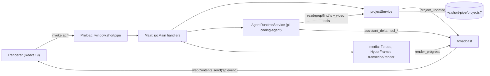

# short-pipe - a local-first Electron app where an agent edits video

Evidence was gathered read-only on 2026-09-23 from the local clone at `~/github/short-pipe` (HEAD `c6aa941`) and a real test run.
Citations use `repo/path:line`.

## 1. TL;DR

Short Pipe is a macOS Electron + React 19 desktop app that turns a long-form video into captioned 1080x1920 vertical shorts, with transcription and rendering on-device and an embedded agent proposing soundbites (`short-pipe/README.md:16`, `short-pipe/package.json:51`, `short-pipe/package.json:62`).
Its agent is scoped by construction: it gets only read-only file tools plus five typed video tools, so every mutation goes through the project store and streams to the UI (`short-pipe/src/main/pi/piResources.ts:70`, `short-pipe/src/main/pi/videoTools.ts:76`).
Upstream (Kun Chen, `kunchenguid/short-pipe`) built it; the user's fork has no fork-specific commits and the app has not been run locally (no `~/.short-pipe` directory exists).

## 2. Problem it solves, and what breaks without it

Cutting a one-hour talk into shorts means scrubbing for soundbites, trimming to word boundaries, reframing to vertical, and burning captions, which is hours of manual timeline work.
Short Pipe automates the pipeline pick, transcribe, propose, review, render, while keeping the human as the approver (`short-pipe/README.md:40`, `short-pipe/README.md:47`).

What breaks without its design:
- Without word-level timestamps, the agent could only guess cut points; local Whisper through HyperFrames produces word ids the tools reference (`short-pipe/README.md:41`).
- Without a store-first event model, agent edits and UI edits would diverge; the store emits `project_updated` after any mutation from either side (`short-pipe/src/shared/events.ts:45`).
- Without the review gate, the agent could render unwanted clips; the bundled skill forbids rendering before user approval (`short-pipe/skills/shorts-from-longform/SKILL.md:20`).

## 3. Architecture

Modules under `src/main/`:
- `index.ts`: window creation with `sandbox: true`, `contextIsolation: true`, `nodeIntegration: false`, and all `ipcMain.handle` routes (`short-pipe/src/main/index.ts:86`, `short-pipe/src/main/index.ts:88`).
- `pi/agentRuntimeService.ts`: one agent session per project using `@earendil-works/pi-coding-agent` (`short-pipe/package.json:49`, `short-pipe/src/main/pi/agentRuntimeService.ts:241`).
- `pi/videoTools.ts`: typed tools `probe`, `transcribe`, `propose_candidates`, `add_candidates`, `render_short` (`short-pipe/src/main/pi/videoTools.ts:76`, `short-pipe/src/main/pi/videoTools.ts:189`).
- `media/`: ffprobe, waveform peaks, silence detection, HyperFrames render with progress parsing.
- `storage/`: on-disk layout and atomic JSON writes.
- `auth/`: Codex OAuth.

Data model: `Project` with `candidates` (word-range, status approved or rejected, layout, theme, caption style) in `src/shared/project.ts`; the app config type is `ShortPipeConfig` (`short-pipe/src/shared/config.ts:4`).

State files (root `~/.short-pipe/`, `short-pipe/src/main/storage/layout.ts:7`):

| Path | Content |
| --- | --- |
| `config.json` | `ShortPipeConfig` defaults |
| `auth/codex.json` | Codex OAuth tokens, plaintext, mode `0600` (`short-pipe/src/main/auth/codexAuth.ts:211`, `short-pipe/README.md:63`) |
| `pi-agent/` | agent working dir |
| `projects/<id>/` | project JSON, `transcript.json`, `output/` |

JSON writes are atomic: write to a unique temp file then `rename` (`short-pipe/src/main/storage/json.ts:25`, `short-pipe/src/main/storage/json.ts:30`).

## 4. Interfaces

No CLI; the fleet manifest records `provides_bin: []` (`.fleet/manifest.yaml:186`).

Developer scripts (`short-pipe/README.md:70`): `pnpm dev`, `pnpm test`, `pnpm typecheck` (`tsc -b`), `pnpm lint` (Biome), `pnpm build`, `pnpm verify:asar`, `pnpm package:mac`, `pnpm dist:mac`.
Every script has a `pre*` hook running `scripts/ensure-pnpm.mjs` to refuse npm or yarn (`short-pipe/package.json:17`).

Renderer bridge `window.shortpipe` (`short-pipe/src/preload/index.ts:91`), typed as `ShortPipeApi` (`short-pipe/src/shared/ipc.ts:42`):
- Request/response namespaces `app`, `settings`, `auth`, `deps`, `projects`, transcript, candidates, agent, each an `ipcRenderer.invoke` on `sp:<ns>:<verb>`.
- One push channel `events.on(listener)` subscribed to `sp:event` (`short-pipe/src/shared/ipc.ts:107`, `short-pipe/src/preload/index.ts:85`).

Event stream (the server-push half, analogous to a websocket feed), from `short-pipe/src/shared/events.ts:27`:

| Event | Emitted by |
| --- | --- |
| `turn_start`, `assistant_delta`, `tool_start`, `tool_update`, `tool_end`, `turn_end` | agent session |
| `project_updated`, `projects_listed` | project store, after any mutation |
| `render_progress { percent }` | render job stdout parser |

Headless smoke: `SP_SMOKE=1 SHORT_PIPE_USER_DATA_DIR=/tmp/sp-smoke npx electron .` prints `SP_SMOKE_OK bridge=true authed=false` (`short-pipe/README.md:98`).

## 5. Configuration

`ShortPipeConfig` defaults (`short-pipe/src/shared/config.ts:24`):

| Key | Default | Why |
| --- | --- | --- |
| `defaultModel` | `openai-codex/gpt-5.5` | runs on the user's Codex subscription, no API billing |
| `defaultLayout` | `center-square` | applied to proposals that omit a layout |
| `defaultTheme` | `dark` | |
| `defaultCaptionStyle` | `clean` | |
| `defaultTargetDurationSec` | `60` | 0 means uncapped agent-chosen cuts |
| `defaultOutputDir` | unset | falls back to the project's own `output/` |

Environment: `SHORT_PIPE_TELEMETRY=0` opt-out (`short-pipe/README.md:111`), `SP_E2E=1` for on-device e2e tests (`short-pipe/README.md:92`).
User's actual setting: none; the app has not been launched on this machine (no `~/.short-pipe`, no `/Applications` bundle found on 2026-09-23).

## 6. Connections

- **no-mistakes**: upstream requires human PRs through no-mistakes (`short-pipe/CONTRIBUTING.md:6`), enforced by the shared `require-no-mistakes` action pinned at `f6441c9` (v1.80.1) (`short-pipe/.github/workflows/no-mistakes-required.yml:58`); see [no-mistakes](no-mistakes.md).
- **Skills format**: the agent's editorial logic is an Agent Skills `SKILL.md` with `name` and a "Use when" `description` (`short-pipe/skills/shorts-from-longform/SKILL.md:3`), the same frontmatter shape as the user's skills in `~/.agents/skills` (for example `~/.agents/skills/ship/SKILL.md:3`).
- **fleet-ops**: `kind: app`, `sync: true`, alias `cdsp` (`.fleet/manifest.yaml:176`, `.fleet/aliases.zsh:30`); synced "already up to date" on 2026-09-23 (`.fleet/logs/sync-20260923.log:269`); see [fleet-ops](fleet-ops.md).
- **Other harness components**: no reference from `agents`, `dotfiles-nix`, `firstmate`, skills, or hooks (grep, 2026-09-23).

## 7. Lifecycle walkthrough

Trace: the user asks the agent for shorts, approves one, and exports it.

1. Renderer calls `agent.send(projectId, text)` which reaches `ipcMain.handle("sp:agent:send")` (`short-pipe/src/main/index.ts:277`).
2. `AgentRuntimeService.sendPrompt` emits `turn_start` through the `broadcast` callback (`short-pipe/src/main/pi/agentRuntimeService.ts:85`, `short-pipe/src/main/pi/agentRuntimeService.ts:116`).
3. The session was created with tools `[...AGENT_FILE_TOOLS, ...videoToolNames()]`, where file tools are only `read`, `grep`, `find`, `ls` (`short-pipe/src/main/pi/agentRuntimeService.ts:251`, `short-pipe/src/main/pi/piResources.ts:70`).
4. Following the skill, the agent calls `probe`, then `transcribe` if needed, reads `transcript.json`, and calls `propose_candidates` once (`short-pipe/skills/shorts-from-longform/SKILL.md:16`).
5. `propose_candidates` is labeled DESTRUCTIVE in its tool description and calls `projects.replaceCandidates`, while `add_candidates` appends (`short-pipe/src/main/pi/videoTools.ts:136`, `short-pipe/src/main/pi/videoTools.ts:162`).
6. The store emits `project_updated`, which `broadcast` forwards to every window via `webContents.send("sp:event")` (`short-pipe/src/main/index.ts:380`, `short-pipe/src/main/index.ts:145`).
7. The agent ends with `turn_end { status }` (`short-pipe/src/main/pi/agentRuntimeService.ts:136`).
8. The user approves a candidate (`sp:candidates:approve`) and clicks Export, which calls `renderCandidate` and streams `render_progress` percentages parsed from HyperFrames output (`short-pipe/src/main/index.ts:264`).

## 8. Failure modes and safeguards

| Failure | Safeguard | Evidence |
| --- | --- | --- |
| Agent wipes the user's queue when asked for "one more" | separate `add_candidates` tool; description warns `propose_candidates` replaces | `short-pipe/src/main/pi/videoTools.ts:136` |
| Agent writes arbitrary files | no write or shell tool in the tool list | `short-pipe/src/main/pi/piResources.ts:70` |
| Concurrent writers corrupt project JSON | unique temp file plus atomic `rename` | `short-pipe/src/main/storage/json.ts:25` |
| Path traversal through project ids | `assertSafeId` allows only `[A-Za-z0-9_-]` | `short-pipe/src/main/storage/layout.ts:44` |
| Missing ffmpeg or HyperFrames | on-device tools checklist with re-check | `short-pipe/README.md:61` |
| Packaged app crashes on missing transitive deps | `verify-asar-deps.mjs` runs before signing | `short-pipe/README.md:82` |
| Renderer compromise | `sandbox: true`, context isolation, no Node integration | `short-pipe/src/main/index.ts:86` |

Known weakness stated upstream: builds are ad-hoc signed, not Developer ID signed or notarized (`short-pipe/README.md:117`), and OAuth tokens are stored in plaintext with `0600` rather than in the Keychain (`short-pipe/README.md:63`).

## 9. Testing and quality

- Vitest suite colocated as `*.test.ts(x)` under `src/`; e2e tests gated by `SP_E2E=1` (`short-pipe/src/main/media/render.e2e.test.ts:14`).
- CI (`short-pipe/.github/workflows/ci.yml:43`): Node 24, frozen install, `pnpm check` (Biome), typecheck, test, build.
- Guard workflow for generated files and the no-mistakes gate as in the other kunchenguid apps.

Real run (2026-09-23, `HOME` redirected to scratch, `SHORT_PIPE_TELEMETRY=0`, `./node_modules/.bin/vitest run`): 37 files passed, 2 skipped; 305 tests passed, 2 skipped (the two `SP_E2E`-gated suites).

## 10. Fork delta

No fork-specific commits; tracks upstream.
`git log upstream/main..HEAD` is empty; all 33 commits are by upstream authors (Kun Chen, `kunchenguid`, `github-actions[bot]`).
The user's contribution is fleet tracking only.

## 11. Interview angle

**Q1. How do you stream long-running job progress to a desktop UI?**
Main process owns the job, parses progress from the child process output, and pushes typed events over one channel; the renderer only subscribes (`short-pipe/src/main/index.ts:264`, `short-pipe/src/preload/index.ts:85`).
In a trading app the same shape carries order-status or market-data ticks: one typed discriminated-union stream, many subscribers, and state reconciled from `project_updated`-style snapshots rather than deltas alone.

**Q2. How do you constrain an LLM agent inside a product?**
Give it capability-scoped tools instead of a shell: read-only file tools plus domain verbs with schemas, and name destructive verbs explicitly (`short-pipe/src/main/pi/videoTools.ts:136`).
The product's store stays the single writer, so UI and agent converge.

**Q3. What makes Electron packaging fragile, and how is it tested?**
pnpm's symlinked `node_modules` can drop transitive deps from the asar; the repo verifies the packaged asar before signing and has a headless smoke boot (`short-pipe/README.md:82`, `short-pipe/README.md:98`).

**Trade-off to defend.** Plaintext `0600` token storage avoids repeated macOS Keychain prompts from Electron safe storage and matches the Codex CLI's own storage model (`short-pipe/README.md:63`).
The downside is that any process running as the user can read the token; in an enterprise bank desktop you would reverse this choice and use the OS credential vault or SSO-issued short-lived tokens.
