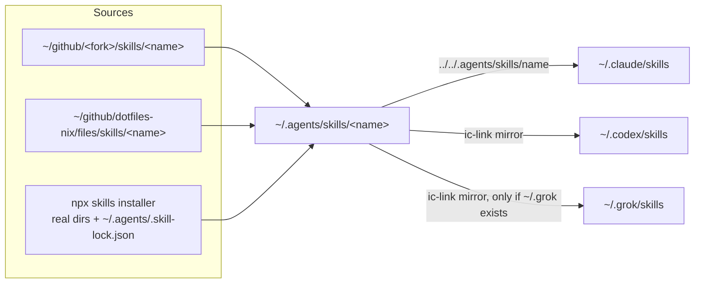

# Skills catalog

Every skill installed in `~/.agents/skills` and `~/.claude/skills` on 2026-09-23, where each one comes from, when it triggers, and what it enforces.
Evidence cites use `repo/path:line` relative to `~/github`, or `~/.agents/...` for home files.

## What a skill is, in one paragraph

A skill is a directory holding a `SKILL.md` file whose YAML frontmatter has a `name` and a `description`.
The agent runtime reads only the frontmatter up front and loads the body when the description matches the task, so the description is effectively the trigger condition.
`user-invocable: true` exposes the skill as a slash command such as `/ship`; the four tool skills from kunchenguid set it to `false`, so they load only by description match.
Several tool skills are deliberately thin and say "Current guidance lives in the CLI" (for example `~/.agents/skills/gh-axi/SKILL.md:18-24`): the skill tells the agent to run `npx -y <tool> --help` instead of trusting an installed copy that can go stale.

## How skills reach each agent

- `ic-link` creates the canonical links and the Claude, Codex, and Grok mirrors (`dotfiles-nix/files/bin/ic-link:60-95`, `:143-147`); see [dotfiles-nix](../components/dotfiles-nix.md).
- The owned skills are discovered as every `files/skills/*/SKILL.md`, so adding one needs no list edit (`dotfiles-nix/setup/lib/skills.sh:15-22`).
- The 10 third-party skills are real directories written by the `npx skills` installer and recorded in `~/.agents/.skill-lock.json` (sources `vercel-labs/agent-skills` and `vercel-labs/skills`); their `~/.claude/skills` links use the same relative form, and `ic-link` never touches them because `link_skill` refuses real directories (`dotfiles-nix/files/bin/ic-link:66-76`).
- `ic-doctor` verifies only the 21 harness skills (9 external plus 12 owned) in `~/.agents/skills`, `~/.claude/skills`, `~/.codex/skills`, and `~/.grok/skills` (`dotfiles-nix/files/bin/ic-doctor:46`, `:172-179`, `:289-297`, `:317-325`); the Vercel skills are not mirrored to Codex or Grok and are not checked.
- Live counts on 2026-09-23: 31 skill entries in `~/.agents/skills` (plus two hidden `.axi.upstream.bak.20260628223027` and `.no-mistakes.upstream.bak.20260628210115` backups of early `npx skills` copies), 31 links plus one real `synced` directory in `~/.claude/skills`, 21 in `~/.grok/skills`, 21 plus Codex's own `.system` in `~/.codex/skills`.
- The `~/.claude/skills/synced` directory holds opaque ID-named subdirectories; its producer is (unverified), and nothing in `ic-link` or `ic-doctor` references it.

## Catalog

Legend for Source: fork skills are upstream-authored content in a fork the user syncs; owned skills live in the user's dotfiles-nix fork; ECC-derived skills are the user's rewrites of MIT-licensed ECC material (`dotfiles-nix/files/skills/THIRD_PARTY_NOTICES.md:1-20`).

### Harness tool skills (from forks)

| Skill | Source repo and link target | Trigger (from the description) | What it enforces | Invocable |
|---|---|---|---|---|
| `axi` | kunchenguid/axi, `axi/.agents/skills/axi` | building, modifying, or reviewing any agent-facing CLI | the AXI principles: TOON output on stdout, minimal default schemas, truncation with a `--full` escape hatch, pre-computed aggregates, definitive empty states, structured errors and exit codes with idempotent mutations and no prompts, ambient context via session hooks (`~/.agents/skills/axi/SKILL.md:16-147`) | not set |
| `chrome-devtools-axi` | kunchenguid/chrome-devtools-axi, `chrome-devtools-axi/skills/chrome-devtools-axi` | any task that needs a real browser: open, click through, extract, debug a page | defer to the live CLI for commands; use a real browser rather than guessing (`~/.agents/skills/chrome-devtools-axi/SKILL.md:18`) | false |
| `gh-axi` | kunchenguid/gh-axi, `gh-axi/skills/gh-axi` | any GitHub operation: issues, PRs, stacked PRs, CI runs, releases, Projects, secrets, gists | prefer `gh-axi` over `gh`; take commands from `npx -y gh-axi --help`, not the file (`~/.agents/skills/gh-axi/SKILL.md:14-24`) | false |
| `gnhf` | kunchenguid/gnhf, `gnhf/skills/gnhf` | user is going to sleep or leaving and wants an agent-managed run, or wants to steer or review one | host orchestrates and GNHF executes; completion is not acceptance; concrete stop conditions; never destructive git cleanup; produce branches and a report rather than irreversible changes while the user is away (`~/.agents/skills/gnhf/SKILL.md:8-14`, `:168-174`) | not set |
| `lavish` | kunchenguid/lavish-axi, `lavish-axi/skills/lavish` | about to give a plan, comparison, diagram, table, diff, or report that reads better visually | build an HTML artifact and review loop via `npx -y lavish-axi`; fetch design guidance from the CLI (`~/.agents/skills/lavish/SKILL.md:12-33`) | not set (takes `$ARGUMENTS`) |
| `no-mistakes` | kunchenguid/no-mistakes, `no-mistakes/skills/no-mistakes` | user asks to run no-mistakes, gate, ship, validate, or push safely, or invokes `/no-mistakes` | the push gate (review, tests, lint, docs, push, PR, CI); a validation-step agent must never start or push a nested pipeline and must stop on `nested_gate_context`; the test-quality rule bans tests that only grep implementation source (`~/.agents/skills/no-mistakes/SKILL.md:15-35`, `:66-80`) | true |
| `quota-axi` | kunchenguid/quota-axi, `quota-axi/skills/quota-axi` | before spending a provider's quota, or when asked about usage, limits, pace | data only: never routes, ranks, recommends, or mints credentials; run the CLI for the current output shape (`~/.agents/skills/quota-axi/SKILL.md:34-49`) | false |
| `stow` | kunchenguid/firstmate, `firstmate/skills/stow` | `/stow`, "save what we learned", or before a context reset or long break | sweep the session for preferences, project facts, gotchas, decisions, next steps; file through explicit instructions, local conventions, or `.stow-notes.md`; tiered decaying entries; never files secrets, never commits, never writes to external systems uninstructed (`~/.agents/skills/stow/SKILL.md:9-30`, `:147-151`) | true |
| `tasks-axi` | kunchenguid/tasks-axi, `tasks-axi/skills/tasks-axi` | any change to backlog or task state, PR recording, ready queue, holds | prefer the CLI over hand-editing `backlog.md`; take commands from `npx -y tasks-axi --help` (`~/.agents/skills/tasks-axi/SKILL.md:12-26`) | false |

### Owned by dotfiles-nix

| Skill | Source | Trigger | What it enforces | Invocable |
|---|---|---|---|---|
| `ship` | written in the fork (`c51c338`) | asked to build, implement, fix, or ship, or `/ship` | the end-to-end loop: `quota-axi` headroom, `tasks-axi add/start`, `treehouse` worktree, implement with the specialist tools and engineering skills, verify end to end, `silent-failure-hunt` on data-moving diffs, `no-mistakes` gate, `tasks-axi done --pr`, then `stow`; outside firstmate it points at `fm` first (`~/.agents/skills/ship/SKILL.md:9-90`) | true |
| `cpp-coding-standards` | ECC-derived | writing or reviewing C++, ownership or error strategy, hot paths | C++ Core Guidelines with cited rule IDs, plus hot-path overrides: no steady-state heap allocation, no throw, no `std::function`/`shared_ptr`/virtual per message, SPSC rings allowed with TSan, reserved capacity, off-thread logging, layout-first design (`~/.agents/skills/cpp-coding-standards/SKILL.md:15-100`) | not set |
| `cpp-testing` | ECC-derived | adding or repairing C++ tests, flakes, sanitizers, coverage | RED gate before production code (test compiled, executed, failing for the intended reason); GoogleTest, CTest, ASan, UBSan, TSan with macOS limits, llvm-cov, RapidCheck, libFuzzer, Google Benchmark (`~/.agents/skills/cpp-testing/SKILL.md:13-24`) | not set |
| `python-testing` | ECC-derived | adding or repairing Python tests, numpy or pandas code | RED gate; fixtures and parametrization; hypothesis; float tolerances via `numpy.testing` and `pandas.testing`; golden files; determinism; flake triage (`~/.agents/skills/python-testing/SKILL.md:13-132`) | not set |
| `perf-loop` | ECC-derived | make it faster, compare implementations, latency regression | frame and baseline first, one hypothesis per variant, noise control, p50/p99/p99.9 without coordinated omission, promotion only on repeated measurement with rollback and stated conditions (`~/.agents/skills/perf-loop/SKILL.md:13-109`) | not set |
| `mle-workflow` | ECC-derived | building or hardening a model, signal, or feature pipeline | prediction and data contracts, point-in-time correctness, walk-forward splits with purging and embargo, reproducible training, promotion gates, serving parity (`~/.agents/skills/mle-workflow/SKILL.md:14-113`) | not set |
| `data-backfill` | ECC-derived | a large ingest or backfill that is slow, stuck, or must be proven complete | separate backlog from live tail, idempotent writes, and a mandatory accounting block read back from the target (`~/.agents/skills/data-backfill/SKILL.md:13-73`) | not set |
| `decision-ledger` | ECC-derived | many variants of an experiment, tuning, strategy research | append-only ledger with accept, watch, reject marks, variant counts against selection bias, paper or shadow before live, human approval for the live step (`~/.agents/skills/decision-ledger/SKILL.md:13-69`) | not set |
| `silent-failure-hunt` | ECC-derived | reviewing error handling, or a job that "succeeded" with wrong output | hunt swallowed errors, ignored results, hiding fallbacks, NaN and inf, empty frames, naive-timezone joins, overflow; structured findings and fix principles (`~/.agents/skills/silent-failure-hunt/SKILL.md:13-72`) | not set |
| `search-first` | ECC-derived | before writing a new utility, parser, or dependency | search repo, registries, then GitHub; decide Adopt, Extend, Compose, or Build and state the downside (`~/.agents/skills/search-first/SKILL.md:13-79`) | not set |
| `loop-design-check` | ECC-derived | before handing a repeating task to an autonomous loop (for example an overnight gnhf run) | machine-decidable goal plus boundaries, reconciliation over self-assertion, damping, staged landing; a five-failure-mode review; three red lines keeping merge, release, and money moves behind a human (`~/.agents/skills/loop-design-check/SKILL.md:13-111`) | not set |
| `learn-eval` | ECC-derived | `/learn-eval`, or turning a recurring lesson or stow note into a skill | quality gate with Save, Improve, Absorb, or Drop; one skill per pattern; nothing written without the user approving the exact path and content (`~/.agents/skills/learn-eval/SKILL.md:12-30`) | true |

The ECC mapping is in `dotfiles-nix/files/skills/THIRD_PARTY_NOTICES.md:1-20` (ECC commit `bf70150`); `cpp-coding-standards` records that its cache-line guidance was measured on this Mac (128-byte `hw.cachelinesize`) rather than hard-coded to 64, per the `0b5637a` commit message.

### Third-party (npx skills installer)

| Skill | Source (from `~/.agents/.skill-lock.json`) | Trigger | What it enforces | Invocable |
|---|---|---|---|---|
| `deploy-to-vercel` | vercel-labs/agent-skills | "deploy my app", preview deployment | Vercel deploy workflow | not set |
| `vercel-cli-with-tokens` | vercel-labs/agent-skills | Vercel CLI with access tokens | token-based Vercel CLI usage | not set |
| `vercel-composition-patterns` | vercel-labs/agent-skills | boolean-prop proliferation, compound components | React composition patterns including React 19 changes | not set |
| `vercel-optimize` | vercel-labs/agent-skills | Vercel cost or performance work | metrics first, investigate only metric-backed candidates, ranked recommendations | not set |
| `vercel-react-best-practices` | vercel-labs/agent-skills | writing or reviewing React or Next.js | Vercel's React and Next.js performance rules | not set |
| `vercel-react-native-skills` | vercel-labs/agent-skills | React Native or Expo work | mobile performance practices | not set |
| `vercel-react-view-transitions` | vercel-labs/agent-skills | page or shared-element transitions in React | View Transition API usage | not set |
| `web-design-guidelines` | vercel-labs/agent-skills | "review my UI", accessibility or UX audit | fetch the current Web Interface Guidelines, then report findings as `file:line` (`~/.agents/skills/web-design-guidelines/SKILL.md:8-39`) | not set |
| `writing-guidelines` | vercel-labs/agent-skills | "review my docs", voice and tone | same fetch-then-review pattern for prose | not set |
| `find-skills` | vercel-labs/skills | "is there a skill for X" | discover and install skills from the open ecosystem | not set |

Given the target role's React, Tailwind, and web front-end focus, the Vercel React skills and `web-design-guidelines` are the ones most relevant to the day job, and `chrome-devtools-axi` is how the harness verifies a web change in a real browser.

## Related harness pieces that are not skills

- Claude subagents, linked one file at a time from `~/github/agents/claude/agents` into `~/.claude/agents`: `cpp-build-resolver`, `cpp-reviewer`, `pr-test-analyzer`, `python-reviewer`, `silent-failure-hunter`, `type-design-analyzer` (`dotfiles-nix/files/bin/ic-link:121-133`); see [agents](../components/agents.md).
- Claude rules `cpp.md` and `python.md` in `~/.claude/rules`, loaded only when matching files are read.
- Hooks `guard.py` and `post_edit.py`, run from `~/github/agents/claude/hooks` via `~/.claude/settings.json`; `ic-doctor` fails if either is missing (`dotfiles-nix/files/bin/ic-doctor:468-485`).

## Interview angle

**Q. Why package agent behavior as skills rather than one big system prompt?**
Skills load on demand by description, so the base context stays small and each skill can be versioned, tested, and owned by the repo whose tool it documents.
The thin "guidance lives in the CLI" pattern avoids a second source of truth drifting from the tool's actual flags.

**Trade-off.**
One canonical directory with relative mirrors means every agent sees the same live copy, and a fork sync updates skills in place.
The downside is that a bad upstream skill change reaches every agent at once on the next 10:00 sync, with no review step for skill text specifically; the mitigation is that the sync is fast-forward-only from forks the user controls, and `ic-doctor` catches only structural breakage, not content regressions.
